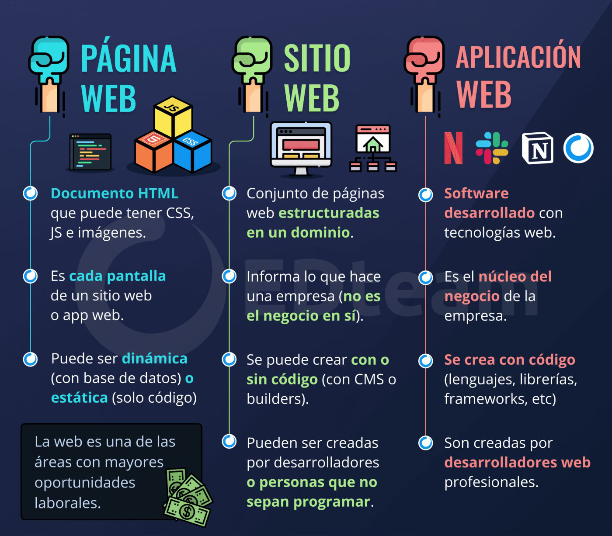

# Aplicaciones Web

  

## ¿Qué es la web?
  Según Wikipedia,

  _En informática, la World Wide Web (WWW) o red informática mundial es un sistema de distribución de documentos de hipertexto o hipermedios interconectados y accesibles vía Internet. Con un navegador web, un usuario visualiza sitios web compuestos de páginas web que pueden contener textos, imágenes, vídeos u otros contenidos multimedia, y navega a través de esas páginas usando hiperenlaces_.

## Página web

  

  Una página web es un documento electrónico escrito en HTML (HyperText Markup Language). Las páginas web están enlazadas a través de hiperenlaces (links). Mediante un navegador un usuario puede navegar a través de la web siguiendo los hiperenlaces.

  Las páginas web enlazan contenidos de naturaleza heterogénea:
  - Imágenes: JPG, GIF, PNG, …
  - Documentos: PDF, TXT, …
  - Audio: MP3, WAV, …
  - Vídeo: AVI, MPEG, …

## Sitio web

  

  Un sitio web (o portal) es una colección de páginas web relacionadas entre sí que suelen compartir la primera parte de la dirección web (el dominio). Ejemplos:
  - https://www.ieselcaminas.org: Sitio web del Instituto
  - https://es.wikipedia.org: Sitio web de la Wikipedia en español

## Aplicación web

  

  Según la Wikipedia,

  _En la ingeniería de software se denomina aplicación web a aquellas herramientas que los usuarios pueden utilizar accediendo a un servidor web a través de Internet o de una intranet mediante un navegador. En otras palabras, es una aplicación software que se codifica en un lenguaje soportado por los navegadores web en la que se confía la ejecución al navegador._

  _Las aplicaciones web son populares debido a lo práctico del navegador web como cliente ligero, a la independencia del sistema operativo, así como a la facilidad para actualizar y mantener aplicaciones web sin distribuir e instalar software a miles de usuarios potenciales. Existen aplicaciones como los webmails, wikis, weblogs, tiendas en línea y la propia Wikipedia que son ejemplos bastante conocidos de aplicaciones web._

###  Beneficios de las aplicaciones web

  - __Las aplicaciones Web se ejecutan en múltiples plataformas__, independientemente del sistema operativo o dispositivo, siempre y cuando el navegador sea compatible.
  - __Todos los usuarios acceden a la misma versión__, eliminando cualquier problema de compatibilidad
  Reducen los costes tanto para el negocio como para el usuario final, ya que hay menos soporte y mantenimiento requeridos por el negocio y menores requerimientos para el equipo del usuario final
  - __No requiere instalar software especial (en los clientes )__. En esencia, para acceder a un software web solo necesitamos disponer de un navegador de páginas web (Internet Explorer, Firefox, Opera, Chrome, etc.). No es necesario tener nada más. Debido a la arquitectura de las aplicaciones web, el navegador suele quedar relegado a mostrar la interfaz de usuario (menús, opciones,formularios, etc.), mientras que toda la compleja lógica de negocio se lleva en el lado del servidor.
  - __Información centralizada__. En una aplicación web, no solamente la lógica de negocio está centralizada en el servidor, sino también los datos que se ubican en una base de datos centralizada (en ese servidor u otro destinado a tal fin). La centralización tiene la ventaja de facilitar el acceso a la misma.
  - __Seguridad y copias de seguridad__. Este es un corolario del punto anterior, es decir, una consecuencia. Como disponemos de los datos centralizados es más fácil establecer y llevar el control de una política de copias de seguridad centralizada.

    

### Procesamiento de páginas en el lado del servidor

  Desde el punto de vista del servidor web, una aplicación Web es un conjunto de páginas Web estáticas y dinámicas. Una página Web estática es aquélla que no cambia cuando un usuario la solicita: el servidor Web envía la página al navegador Web solicitante sin modificarla. Por el contrario, el servidor modifica las páginas Web dinámicas antes de enviarlas al navegador solicitante. La naturaleza cambiante de este tipo de página es la que le da el nombre de dinámica.

  _Por ejemplo_, podría diseñar una página para que mostrara los resultados de las notas de un alumno y dejara cierta información fuera (como el nombre del alumno y sus notas) para calcularla cuando la página la solicite un alumno en particular.

#### Páginas dinámicas en el servidor

  Cuando un servidor Web recibe una petición para mostrar una página Web estática, el servidor la envía directamente al navegador que la solicita. Cuando el servidor Web recibe una petición para mostrar una página dinámica, sin embargo, reacciona de distinta forma: transfiere la página a un software especial encargado de finalizar la página. Este software especial se denomina servidor de aplicaciones.

  El servidor de aplicaciones lee el código de la página, finaliza la página en función de las instrucciones del código y elimina el código de la página. El resultado es una página estática que el servidor de aplicaciones devuelve al servidor Web, que a su vez la envía al navegador solicitante. Lo único que el navegador recibe cuando llega la página es código HTML puro. A continuación se incluye una vista de este proceso:

  

    
  
  

## Tecnologías de desarrollo Web

  Hoy en día se utilizan páginas dinámicas tanto del lado del servidor como del cliente.

  El impacto de la Web ha propiciado la aparición de una gran cantidad de tecnologías, librerías, herramientas y estilos arquitectónicos para desarrollar una aplicación web. Para facilitar la tarea de escoger cuál es la tecnología más adecuada para un proyecto, es conveniente conocer los elementos más importantes desde un punto de vista de alto nivel para tener una visión global de la programación web.

  Existen dos enfoques en el desarrollo de aplicaciones web:

  - Creación de aplicaciones web con integración de tecnologías de desarrollo. Los lenguajes pueden ser muy diversos:

  

    
  

  - Creación de aplicaciones web con sistemas gestores de contenido. Existen muchos y en diferentes tecnologías:

  

    
  

    <a href="README.md">
    <a href="README.md">
    <a href="CONCEPTOS.md">

