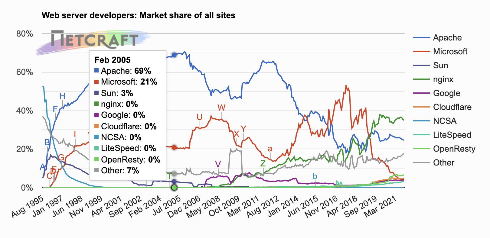

<div align="justify">

# TECNOLOGÍAS EN EL DESPLIEGUE DE APLICACIONES WEB

  Hemos de comprender que en desarrollo y despliegue de aplicaciones web pueden verse relacionadas diferentes tecnologías en nuestra organización.

  En este módulo describiremos algunos de ellos y continuaremos con la creación de nuestro sistema, que contemple todo lo necesario en la organización.

## APACHE

<div align="center">
  
</div>

  Apache es un servidor web HTTP de código abierto. Está desarrollado y mantenido por una comunidad de usuarios en torno a la Apache Software Foundation.

  Actualmente y desde el 1996 es el servidor web más usado en todo el mundo debido a su seguridad y estabilidad.

### ¿Cómo funciona?

  La funcionalidad principal de este servicio web es servir a los usuarios todos los ficheros necesarios para visualizar la web. Las solicitudes de los usuarios se hacen normalmente mediante un navegador (Chrome, Firefox, Safari, etc.).

  Por ejemplo, cuando un usuario escribe en su navegador www.jpexposito.com, esa petición llegará a nuestro servidor Apache que mediante el protocolo _HTTP_ este se encargará de facilitarle los textos, imágenes, estilos, etc. que conforman la portada de nuestra web de forma segura.

  __Apache__ tiene una estructura basada en módulos, que permite activar y desactivar funcionalidades adicionales, por ejemplo, módulos de seguridad como _mod_security_, módulos de caché como Varnish, o de personalización de cabeceras como _mod_headers_. También permite ajustar los parámetros de PHP de tu hosting de forma personalizada mediante el fichero _.htaccess_.

### Ventajas y desventajas

#### Ventajas
  Las principales ventajas de usar este el servicio web son las siguientes:
  - De código abierto y gratuito, con una gran comunidad de usuarios.
  - Parches de seguridad regulares y actualizados con frecuencia.
  - Estructura basada en módulos.
  - Multiplataforma. Está disponible en servidores Windows y Linux.
  - Personalización mediante _.htaccess_ independiente en cada hosting.
  - Compatible con los principales CMS y tiendas online y plataformas e-learning.

#### Desventajas

  Sus principales desventajas son las siguientes:
  - Presenta problemas de estabilidad por encima de las 10000 conexiones.
  - Un uso abusivo de módulos pueden generar brechas de seguridad.

### Instalación y configuración básica

  Para realizar la instalación y configuración básica sigue la siguiente [tarea](tareas/instalacion-apache.md).


## APACHE-TOMCAT

<div align="center">
  
</div>

  Estrictamente hablando, _Tomcat_ no es un servidor web como Apache HTTPS Server o NGINX.

  Comenzado en 1999 y desarrollado como un proyecto de código abierto por la Apache Software Foundation (ASF), Apache Tomcat es un contenedor Java Servlet, o contenedor web, que proporciona la funcionalidad extendida para interactuar con Java Servlets, al tiempo que implementa varias especificaciones técnicas de la plataforma Java: JavaServer Pages (JSP), Java Expression Language (Java EL) y WebSocket.

### Características

  Tomcat puede funcionar como servidor web por sí mismo. En sus inicios existió la percepción de que el uso de Tomcat de forma autónoma era sólo recomendable para entornos de desarrollo y entornos con requisitos mínimos de velocidad y gestión de transacciones. Hoy en día ya no existe esa percepción y Tomcat es usado como servidor web autónomo en entornos con alto nivel de tráfico y alta disponibilidad.

  La jerarquía de directorios de instalación de Tomcat incluye:
  - __bin__: arranque, cierre, y otros scripts y ejecutables.
  - __common__: clases comunes que pueden utilizar Catalina y las aplicaciones web.
  - __conf__: ficheros XML y los correspondientes DTD para la configuración de Tomcat.
  - __logs__: logs de Catalina y de las aplicaciones.
  - __server__: clases utilizadas solamente por Catalina.
  - __shared__: clases compartidas por todas las aplicaciones web.
  - __webapps__: directorio que contiene las aplicaciones web.
  - __work__: almacenamiento temporal de ficheros y directorios.

  <div align="center">
    
  </div>


### Instalación y configuración básica

  Para realizar la instalación y configuración básica sigue la siguiente [tarea](tareas/instalacion-apache-tocat.md).


### Despliegue de una Aplicación

  Para realizar el despliegue de una aplicación sigue la siguiente [tarea](tareas/despliegue-jsp-apache-tomcat.md).


## Wildfly


### Instalación y configuración básica

  Para realizar la instalación y configuración básica sigue la siguiente [tarea](tareas/instalacion-jboss-wildfly.md).

### Arquitectura de directorios en wildfly

  La estructura de directorios sigue la arquitectura de _redhat_, dado que como se ha descrito es una producto gratuito de esta empresa, y en concreto del servicior de aplicaciones ___JBOSS___, de pago.

  Para consultar la estructura de directorios pulsa el siguiente [enlace](https://access.redhat.com/documentation/es-es/jboss_enterprise_application_platform/6.3/html/installation_guide/installation_structure).

  Vamos a centrarnos en la estructura de directorios ___standalone___.


| Nombre |	Propósito |
| ------------- | ------------- |
| _configuration/_ |	Los archivos de configuración para el servidor autónomo. Estos archivos se modifican por medio de la consola de administración y el CLI de administración y no se debe modificar directamente.|
| _deployments/_ | Información sobre los servicios implementados. El servidor autónomo incluye un escaner de implementación de manera que pueda poner los archivadores en este directorio a implementarse. Sin embargo, el enfoque que se recomienda es administrar las implementaciones usando la consola de administración o CLI de administración.|
| _data/_ |	Información sobre los servicios implementados. Los servicios se implementan usando la consola de administración y el CLI de administración en lugar de un escaner de implementación. Por lo tanto no ponga archivos en este directorio manualmente.|
| _log/_ |	Contiene los archivos de registro del tiempo de ejecución para el host y los controladores de procesos, los cuales ejecutan en la instancia local.|
| _lib/_ |	Bibliotecas externas, las cuales pertenecen al modo del servidor autónomo. Vacío por defecto.|
| _tmp/_ |	Contiene datos temporales tales como los archivos que pertenecen al mecanismo de clave compartida que el CLI de administración utiliza para autenticar a los usuarios locales en el servidor.|


### Despliegue de una Aplicación

  Para realizar el despliegue de una aplicación sigue la siguiente [tarea](tareas/despliegue-rest-ws-jboss-wildfly.md).

## Cuota de mercado de Servidores de Aplicaciones con Java

  La cuota de mercado de servidores a _30 de septiembre_ es la que muestra la siguiente imagen.

  <div align="center">
    
  </div>

## Nginx

<div align="center">
  
</div>

  Nginx, pronunciado como “engine-ex”, es un servidor web de código abierto que, desde su éxito inicial como servidor web, ahora también es usado como proxy inverso, cache de HTTP, y balanceador de carga.

  Algunas compañías de alto perfil que utilizan Nginx incluyen _Autodesk, Atlassian, Intuit, T-Mobile, GitLab, DuckDuckGo, Microsoft, IBM, Google, Adobe, Salesforce, VMWare, Xerox, LinkedIn, Cisco, Facebook, Target, Citrix Systems, Twitter, Apple , Intel_, y muchos más.

  Nginx creado originalmente por Igor Sysoev, y tuvo su primer lanzamiento público en octubre de 2004. Igor concibió inicialmente el software como una respuesta al problema C10K, que se refiere al problema de rendimiento de manejar 10,000 conexiones concurrentes.

  Debido a que sus raíces yacen en la optimización del rendimiento bajo escala, Nginx a menudo supera a otros populares servidores web en pruebas de rendimiento (Benchmarks), especialmente en situaciones con contenido estático y/o un elevado número de solicitudes concurrentes.

  Para realizar la instalación, en un servidor de linux Ubuntu, consulta el siguiente [enlace](tareas/instalacion-nginx.md).


  <div align="center">
    
  </div>

  [Fuente](https://news.netcraft.com/archives/category/web-server-survey/).

## Apache vs. Nginx: ¿Qué servidor web es la mejor opción?


  __Nginx__ puede ser más del doble de rápido que Apache cuando sirve contenido estático.

  Si estás ejecutando muchos sitios web desde el mismo servidor, Apache puede funcionar mejor.

  __Nginx y Apache__ combinados sirven a más del 50% de la web. Pero Apache ha experimentado un declive en los últimos años, a favor de Nginx. _¿Nginx es realmente mejor y hay algún beneficio al usar Apache?_.

### Nginx es más nuevo y más rápido

    __Nginx__ es mucho más ligero que Apache. Este es un problema arraigado en el diseño: bajo el capó, Apache debe crear un nuevo hilo de proceso para cada conexión. Y aunque puede procesar 10 subprocesos a una velocidad comparable a __Nginx__, cuando se amplía a cientos de conexiones simultáneas, __Nginx__ toma la delantera decisiva.

  <div align="center">
    
  </div>

    Nginx funciona de manera diferente y puede procesar múltiples conexiones dentro de un solo hilo de proceso. Está diseñado para funcionar también como un proxy inverso simple, por lo que en lugar de traer la sobrecarga de un servidor web completo, simplemente está diseñado para mover bytes de datos de un lugar a otro. ___Nginx puede ser más del doble de rápido que Apache cuando sirve contenido estático, y mucho menos intensivo en CPU al hacerlo, lo que lo hace excelente para ejecutarse en sistemas de baja potencia.___

    Sin embargo, esta velocidad solo importa cuando se entrega contenido estático a muchos usuarios a la vez. Cuando comienzas a ofrecer contenido dinámico, el cuello de botella se encuentra en otra parte, como en tu motor PHP, tu aplicación web o tu base de datos.

    _Debido a que Nginx también es un proxy inverso, puedes usarlo frente a otro servidor (incluso Apache) específicamente para alojar contenido estático. Un ejemplo útil son las aplicaciones de nodo de renderizado del lado del servidor, donde las solicitudes HTTP a páginas dinámicas deben reenviarse a un servidor que ejecuta Express, pero los recursos estáticos (imágenes, hojas de estilo, etc.) se pueden atender desde Nginx. La sobrecarga al hacer esto es mínima y puede acelerar significativamente el contenido estático._

### Apache es más configurable

  __Apache__ está más enfocado en ser un servidor web y tiene algunas características útiles como archivos de configuración basados en directorios y hosts virtuales. Esto facilita la ejecución de varios sitios en el mismo servidor. Por ejemplo, puedes agregar un bloque VirtualHost como este a /etc/__httpd/conf/httpd.conf__:

  ```xml
    <VirtualHost 127.0.0.1:80>
      DocumentRoot /var/www/html
      ServerName www.misite.com
    </VirtualHost>
  ```
  Esto hará que Apache enrute todas las solicitudes a _www.misite.com_ a una carpeta específica, que puede tener su propia configuración independiente de otros sitios que se ejecutan en el servidor. Esto se puede aumentar aún más con archivos __.htaccess__, que pueden sobrescribir la configuración del servidor para una carpeta específica. Sin embargo, ejecutar sitios con archivos __.htaccess__ es más lento que usar la configuración global, y solo se recomienda en los casos en los que desea permitir que otros usuarios modifiquen la configuración del servidor para un directorio sin tocar la configuración global (el alojamiento compartido es el principal ejemplo de esto).

  Nginx también puede servir varios dominios desde un solo servidor y enrutarlos a sus propias carpetas, pero simplemente no es tan configurable, especialmente con una falta de funcionalidad similar a __.htaccess__. Pero, si realmente necesitas ese tipo de funcionalidad, puedes usar _Nginx_ como un proxy inverso para acceder al contenido servido en otro lugar, incluso ejecutándose en otra instancia de Nginx o en múltiples contenedores Docker.

  Apache también tiene un soporte de complementos mucho mejor, [en forma de módulos](https://maven.apache.org/plugins/index.html) que se pueden cargar dinámicamente sin reiniciar el servidor. _Nginx_ también admite módulos, pero solo la carga de módulos agregados recientemente, por lo que muchos módulos aún requieren que se parchee el binario.

### ¿Qué servidor deberías elegir?

  A pesar de las deficiencias, ambos son servidores web decentes. Ambos son gratuitos y de código abierto, aunque Nginx tiene una versión de pago llamada [Nginx Plus](https://www.nginx.com/products/nginx/) que agrega un equilibrador de carga de software sobre _Nginx_ de código abierto. Ambos servidores son seguros, tienen buenas comunidades de soporte y son fáciles de configurar. Si bien Nginx gana en velocidad, ambos son comparables en el servicio de contenido dinámico.

  ___Si no estás seguro de cuál usar, elige Nginx. En general, si estás ejecutando un sistema Unix, Nginx es una buena opción simplemente debido a su velocidad y facilidad de uso. Si necesitas más configuración, especialmente si estás ejecutando muchos sitios web desde el mismo servidor, Apache puede funcionar mejor.___

  __Nginx__ y __Apache__ son totalmente compatibles con cualquier sistema Unix, incluido FreeBSD. Si bien _Nginx_ tiene técnicamente una versión que se ejecuta en Windows, no es la mejor. Apache es totalmente compatible con Windows y, como tal, es el servidor web de referencia en esa plataforma.


</div>
