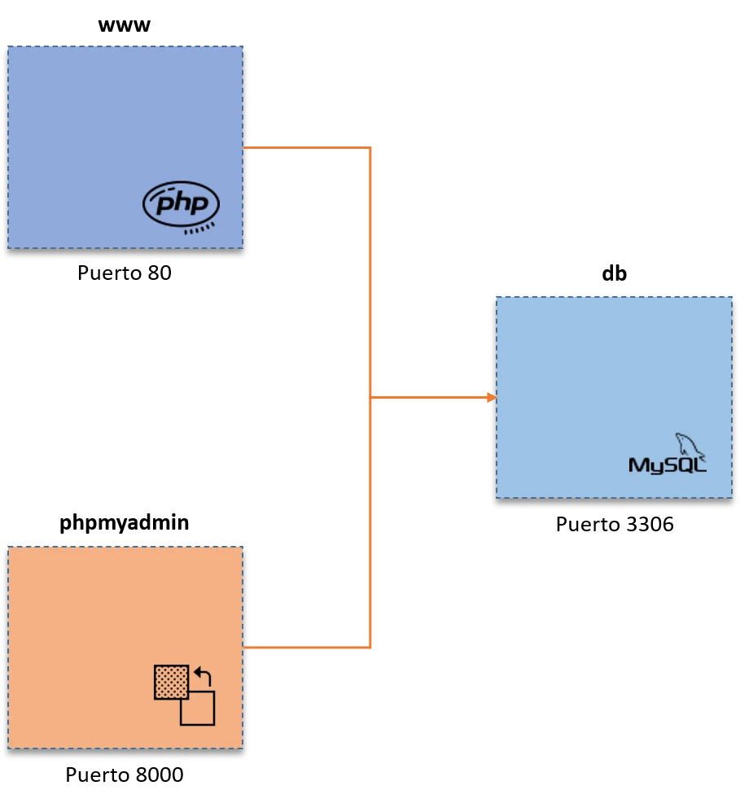
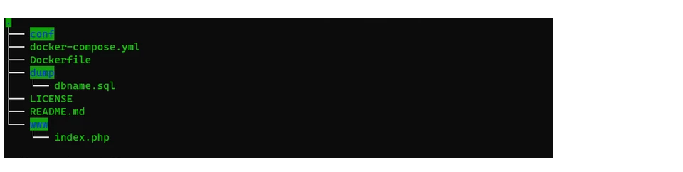

<div align="justify">


<div align="center">
  
</div>

# Infraestructura LAMP en Docker

  Vamos a arrancar un entorno LAMP con Docker Compose con unos sencillos pasos y explicada para que construyas tus aplicaciones sobre un sistema distribuido bien organizado.

  El objetivo es proporcionarte las herramientas para que puedas ejecutar el entorno ___LAMP sobre Docker___, usando [Docker Compose](../DOCKER-COMPOSE.md), sin importar en que sistema operativo o distribución estés utilizándolo, ___se trata de contenedores y obviamente, ejecutado sobre Docker___.

## ¿Por qué un sistema LAMP con Docker?

  Es la manera de ir escalando en tu nivel de conocimiento y de acción para desarrollar software, e proporcionar un entorno que se pueda reutilizar en un futuro no muy lejano.

  Existen herramientas que proporcionan la mista infraestructura, pero difícilmente escalable o reutilizadable. Alguna de ellas:
  - LAMP (Linux, Apache, MySQL y PHP)
  - WAMP (Windows, Apache, MySQL y PHP)
  - XAMPP (X = Cualquier OS, Apache, MariaDB/MySQL, PHP y Perl)

  ___Utilizaremos Docker por la contenerización, para formar un ambiente donde tu aplicación no falle por temas de dependencias y que tengas un script fiable a la mano que siempre puedas correr. Además, te familiarizas más con los sistemas GNU/Linux y shell scripting___.

## Práctica de una pila LAMP

  Una pila es un conjunto de servicios o paquetes instalables y que se relacionan entre si. En el siguiente diagrama se puede observar una pila LAMP (GNU/Linux, Apache, MySQL y PHP).

  <div align="center">
    
  </div>

## Diagram Docker

  Como descripción básica, nos damos cuenta que en primera instancia tenemos 3 contenedores que conforman un sistema distribuido, todos ellos interconectados entre sí. Cada contenedor tiene servicios distintos que hará que la __pila LAMP__ se constituye por medio de una red local.

### Servidor web:

  El contenedor tiene por nombre www.
  - Se expone el puerto 80.
  - Servidor de base de datos:
  - El contenedor tiene por nombre db.
  - Se expone el puerto 3306.


  Servidor del sistema gestor de base de datos gráfico:
  - El contenedor tiene por nombre __phpmyadmin__.
  - Se expone el puerto __8000__.

  La estructura del proyecto es la siguiente:

  <div align="center">
    
  </div>

___Vamos___ a instalar __php__ en la versión __8.0.0__ con __apache__.

  Se define un argumento donde se modifica una variable de entorno DEBIAN_FRONTED a modo no interactivo, que lo define para que los demás paquetes de instalación en consecuencia que soliciten una confirmación de algo en ejecución, lo omitan.

  Las demás ejecuciones ya son para instalar extensiones de comunicación con docker, __php y mysqli__, así como las actualizaciones del repositorio de paquetes y por último la instalación de librerías y dependencias.

  ```console
  FROM php:8.0.0-apache
  ARG DEBIAN_FRONTEND=noninteractive
  RUN docker-php-ext-install mysqli
  RUN apt-get update \
      && apt-get install -y libzip-dev \
      && apt-get install -y zlib1g-dev \
      && rm -rf /var/lib/apt/lists/* \
      && docker-php-ext-install zip

  RUN a2enmod rewrite
  ```

  Finalmente, el mágico fichero de configuración de Docker Compose. En este punto, encontramos 3 bloques importantes donde se definen los servicios: __www, db y phpmyadmin__.

  Si analizan la configuración, pueden observar que es tan sencillo que se explica sólo, incluso porque antes he explicado un poco el diagrama de stack LAMP y de los servicios como tal.

  ```console
  version: "3.5"
  services:
      www:
          build: .
          ports:
              - "80:80"
          volumes:
              - ./www:/var/www/html
          links:
              - db
          networks:
              - default
      db:
          image: mysql:8.0
          ports:
              - "3306:3306"
          command: --default-authentication-plugin=mysql_native_password
          environment:
              MYSQL_DATABASE: dbname
              MYSQL_USER: admin
              MYSQL_PASSWORD: test
              MYSQL_ROOT_PASSWORD: test
          volumes:
              - ./dump:/docker-entrypoint-initdb.d
              - ./conf:/etc/mysql/conf.d
              - persistent:/var/lib/mysql
          networks:
              - default
      phpmyadmin:
          image: phpmyadmin/phpmyadmin
          links:
              - db:db
          ports:
              - 8000:80
          environment:
              MYSQL_USER: admin
              MYSQL_PASSWORD: test
              MYSQL_ROOT_PASSWORD: test
  volumes:
      persistent:
  ```

  ___Recuerda que los contenedores se catalogan como servicios___. En esta configuración son 3 y la explicación de cada uno de los bloques es la siguiente:

#### www

  Si hay algo que falta por comentar, por supuesto, serán los atributos:
  - __build__ tiene como valor ., indicando que se construirá el .dockerfile sobre este contenedor.
  - __ports__ mantendrá el mismo puerto con que el servicio internamente está corriendo, que es el 80 y será expuesto hacia afuera.
  - __volumes__ aplica una definición de donde sincronización entre 2 directorios o volumen de datos, para ello, se sincroniza ./www con /var/www/html que se encuentra en el contenedor.
  - __links__ selecciona con quien podrá verse y compartir recursos en red, para ello es necesario que el servidor web esté conectado al sistema gestor de base de datos que se encuentra en el contenedor db.
  - __networks__ define el nombre de la red por la cual estará conectados los contenedores, para este caso default.

  ```console
  www:
      build: .
      ports:
          - "80:80"
      volumes:
          - ./www:/var/www/html
      links:
          - db
      networks:
          - default
  ```

    Es habitual que cambiemos el puerto 80 que se expone, pues muchas veces tenemos aplicaciones que ya están corriendo sobre ese puerto. Esto, para tenerlo en cuenta si algo falla.

#### db

  Este bloque tiene un poco más de atributos que revisar, como los siguientes:

  - En primera instancia comentar que no tiene un atributo build, dando a entender que no es necesario instalar paquetes desde un .dockerfile como si lo necesitaba el contenedor www.
 - __image__ selecciona la de mysql en la versión 8.0.
 - __ports__ mantendrá el mismo puerto con que el servicio internamente está corriendo, que es el 3306 y será expuesto hacia afuera.
 - __command__ es funcional para que se inserte un comando, donde dicha instrucción será para habilitar la autenticación con la contraseña nativa de MySQL.
 - __environment__ es la aplicación de variables de entorno, donde este contenedor recibe 4 con el prefijo de MYSQL_ donde escribe el nombre de la base de datos, nombre de usuario y contraseña.
volumes aplica una definición de donde sincronización entre ficheros, así como la configuración y donde corre el demonio de MySQL.
- __networks__ define el nombre de la red por la cual estará conectados los contenedores, para este caso default, donde ya se puede conocer con el contenedor www.

```console
  db:
      image: mysql:8.0
      ports:
          - "3306:3306"
      command: --default-authentication-plugin=mysql_native_password
      environment:
          MYSQL_DATABASE: dbname
          MYSQL_USER: admin
          MYSQL_PASSWORD: test
          MYSQL_ROOT_PASSWORD: test
      volumes:
          - ./dump:/docker-entrypoint-initdb.d
          - ./conf:/etc/mysql/conf.d
          - persistent:/var/lib/mysql
      networks:
          - default
```

  Desde esta configuración, ya se importa la base de datos que se encuentra en __dump\dbname.sql__.

  Es habitual que cambiemos el puerto 3306 que se expone, pues muchas veces tenemos aplicaciones que ya están corriendo sobre ese puerto. Esto, para tenerlo en cuenta si algo falla.
  Se hace notar que en esta configuración tampoco existe el atributo links para conectar con algún otro contenedor. Esto pasa porque el contenedor donde se encuentra el sistema gestor de base de datos, en este caso MySQL, quedará aislado, proveyendo seguridad en su acceso y ortogándoselo a los que realmente necesitan hacer consultas, tal como el contenedor de www y phpmyadmin.

  <div align="center">
    
  </div>


Este bloque tiene menos atributos y básicos como los que ya hemos abordado:
 - __image__ selecciona la de phpmyadmin/phpmyadmin.
 - __ports__ es diferente a los demás, porque internamente el servicio está funcionando con el puerto 80, pero al exponerlo se necesita hacer con otro, puesto que colisionaría con el puerto que tiene expuesto el contenedor del servidor web __www__. De este modo, se expone el puerto __8000__.
 - __links__ se conecta con el contenedor db para tener acceso al sistema gestor de base de datos.
 - __environment__ es la aplicación de variables de entorno, donde este contenedor recibe 3 con el prefijo de MYSQL_ donde escribe el nombre de usuario, contraseña y contraseña de root.
```console
  phpmyadmin:
     image: phpmyadmin/phpmyadmin
     links:
         - db:db
     ports:
         - 8000:80
     environment:
         MYSQL_USER: admin
         MYSQL_PASSWORD: test
         MYSQL_ROOT_PASSWORD: test
```

  Todos los volúmenes se encuentran en modo persistente, por lo que no hay pérdida de datos y de enlace.

  Este es el __.sql__ que se importa a MySQL.

```sql
  SET SQL_MODE = "NO_AUTO_VALUE_ON_ZERO";
  SET time_zone = "+00:00";

  /*!40101 SET @OLD_CHARACTER_SET_CLIENT=@@CHARACTER_SET_CLIENT */;
  /*!40101 SET @OLD_CHARACTER_SET_RESULTS=@@CHARACTER_SET_RESULTS */;
  /*!40101 SET @OLD_COLLATION_CONNECTION=@@COLLATION_CONNECTION */;
  /*!40101 SET NAMES utf8mb4 */;

  CREATE TABLE `Data` (
    `id` int(11) NOT NULL,
    `name` varchar(20) NOT NULL
  ) ENGINE=InnoDB DEFAULT CHARSET=latin1;

  INSERT INTO `Data` (`id`, `name`) VALUES (1, 'OpenWebinars Article'), (2, 'Crashell'), (3, 'Jerson Martinez'), (4, 'Antonio Moreno');

  /*!40101 SET CHARACTER_SET_CLIENT=@OLD_CHARACTER_SET_CLIENT */;
  /*!40101 SET CHARACTER_SET_RESULTS=@OLD_CHARACTER_SET_RESULTS */;
  /*!40101 SET COLLATION_CONNECTION=@OLD_COLLATION_CONNECTION */;

```

  Este código php ubicado en __www/index.php__ es para comprobar que el sitio carga bien y que existe correcta conectividad con la base de datos y que este puede dar lectura.

```html
<html>
    <head>
        <title>Welcome to LAMP Infrastructure</title>
        <meta charset="utf-8">
        <link rel="stylesheet" href="http://maxcdn.bootstrapcdn.com/bootstrap/3.3.6/css/bootstrap.min.css">
        <script src="http://maxcdn.bootstrapcdn.com/bootstrap/3.3.6/js/bootstrap.min.js"></script>
    </head>
    <body>
        <div class="container-fluid">
          
            <?php
                echo "<h1>¡Hola, soy Alumno y te da la bienvenida!</h1>";

                $conn = mysqli_connect('db', 'root', 'test', "dbname");
                $query = 'SELECT * From Data';
                $result = mysqli_query($conn, $query);

                echo '<table class="table table-striped">';
                echo '<thead><tr><th></th><th>id</th><th>name</th></tr></thead>';
                while($value = $result->fetch_array(MYSQLI_ASSOC)){
                    echo '<tr>';
                    echo '<td><a href="#"><span class="glyphicon glyphicon-search"></span></a></td>';
                    foreach($value as $element){
                        echo '<td>' . $element . '</td>';
                    }

                    echo '</tr>';
                }
                echo '</table>';

                $result->close();
                mysqli_close($conn);
            ?>
        </div>
    </body>
</html>

```

  A partir de este punto, necesitaremos ejecutar todas las instrucciones de consola con privilegios elevados, para ello, un sudo su y poner su contraseña bastará.

  Para lanzar la configuración, se ejecuta la siguiente instrucción:

  ```console
    docker-compose up -d
  ```

  Los datos resultantes son de que se crean 3 contenedores, en principio con los prefijos docker-lamp_ que es el directorio donde se encuentra, procediendo a concatenar el nombre del contenedor y el sufijo _1 con resultado done.

  Para verificar los contenedores corriendo desde Docker Compose:

  ```console
    docker-compose ps
  ```

  Es notable un mayor detalle del estado como de los puertos expuestos, así como el protocolo y la dirección local ::1, 127.0.0.1 o localhost por medio de 0.0.0.0. El comando ___docker-compose ps___ es equivalente a docker ps, solo que este último con mayor detalle.

  Con esto bastará para hacer la prueba en un navegador y escribir 127.0.0.1, equivalente a 127.0.0.1:80 y localhost:80 con el puerto opcional.

  Se procede a realizar una consulta a la dirección 127.0.0.1:8000 para llegar al contenedor phpmyadmin. El usuario y la contraseña han sido definidos en el __.yml__.

```console
  Usuario: root
  Contraseña: test
```


  Se comprueba que el acceso ha sido correcto. Por otro lado, se verifica que la base de datos se encuentra bien importada con su respectiva tabla y datos dentro, listo para ser gestionada.

  A partir de aquí, el proyecto que vayas a trabajar, tendrá que colocarlo dentro del directorio www/, por ejemplo, si tu proyecto se llama app-servidor, lo revisarás en tu navegador como 127.0.0.1/app-servidor.

  Para detener el stack con Docker Compose, es de esta manera:

  ```console
    docker-compose stop
  ```

## Se pide

  Realizar la construcción de los contenedores docker, con el fin de poder desplegar cualquier de las aplicaciones creadas por el alumno en la asignatura de __servidor__, verificando el despliegue de la aplicación seleccionada, así como el acceso correcto a __phpmyadmin__.

## Realiza el Informe

  Realiza un informe indicando los pasos que has seguido para la instalación y se muestre la creación de los contenedores para __LAMP__ en __Docker__.

  Además el informe debe de contener:
   - Titulo de la tarea.
   - Nombre y Apellidos.
   - Indice
   - Pasos descritos.
   - Capturas de pantalla.

### A tener en cuenta:

  - Se pasará el programa antí copia para verificar autenticidad.
  - __5 faltas de ortografía se baja dos puntos__.
  - Al menos (1 folio indice, al menos 3 desarrollo de la práctica).
  - Carecer faltas de ortografía.
  - Capturas de pantalla con los resultados obtenidos.  

## Referencias

- [Instalación PHPMyAdmin](https://hub.docker.com/r/phpmyadmin/phpmyadmin/)

</div>
