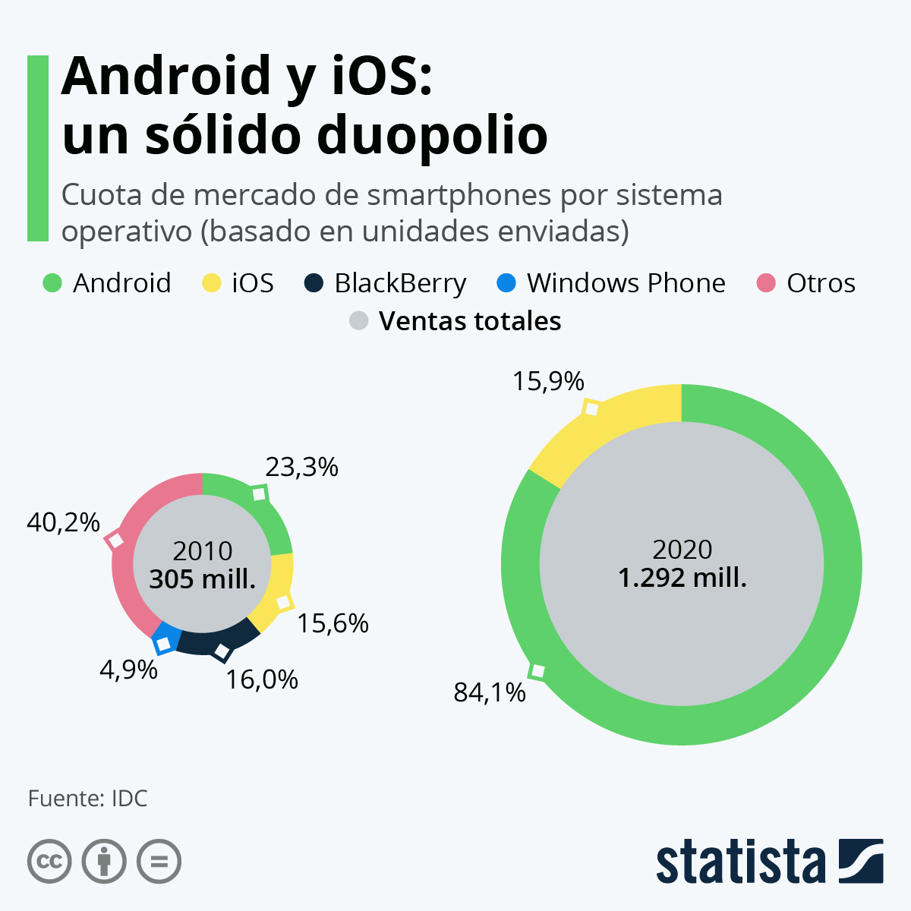

# Análisis de tecnologías para aplicaciones en dispositivos móviles

## Introducción

  El uso generalizado en los últimos tiempos de dispositivos móviles como smartPhones ha dado lugar a una gran demanda de software para este nuevo tipo de hardware.

## Introducción. ¿Qué es un dispositivo móvil?

  La primera pregunta que podemos hacernos es ¿qué entendemos por "móvil"? Si se nos ocurre investigar sobre ese término, a través de algún buscador de Internet, podremos observar que no hay una respuesta única y que en algunas ocasiones las diferencias pueden ser sustanciales en función de qué es lo que consideremos "móvil". Obviamente esto da lugar a su vez a muchas otras preguntas como por ejemplo: Es móvil… ¿alguna parte del dispositivo? ¿El dispositivo completo? ¿La aplicación que usamos en el dispositivo? ¿Una aplicación cliente? ¿Una aplicación servidor? ¿El usuario del dispositivo? ¿Es "móvil" sinónimo de "portátil"? ¿Es "móvil" sinónimo de "limitado"? ¿Hasta qué punto "móvil" es sinónimo de "autónomo"? ¿Existen diversos grados de "movilidad"? ¿Se pueden clasificar los dispositivos móviles en distintos tipos? ¿Bajo qué criterios? Y así sucesivamente podríamos plantearnos más y más preguntas…

  Para evitar este tipo de controversias, en nuestro caso vamos a intentar dar una definición con la que trabajaremos a lo largo del desarrollo del módulo:

### ¿Qué es un dispositivo móvil?

  Se trata de un aparato de pequeño tamaño (normalmente que quepa en un bolsillo) y de poco peso, con pantalla, con capacidades de procesamiento medias, memoria limitada y conexión a una red. Este tipo de dispositivos están diseñados para cumplir algún tipo de función específica (realizar llamadas telefónicas, servir como agendas, jugar, navegación GPS, escuchar música, acceso al correo electrónico, navegar por Internet, etc.) aunque normalmente pueden llevar a cabo también funciones más generales. Es importante tener en cuenta que aunque existan dispositivos de alta gama los desarrollos deben cubrir la mayor cuota de mercado posible.

  Estos aparatos a día de hoy son indispensables en el día a día de mucha gente.

####  Limitaciones que plantea la ejecución de aplicaciones en los dispositivos móviles

  Antes de comenzar a desarrollar software para alguno de estos dispositivos, es necesario ser conscientes de las limitaciones con las que nos podemos encontrar en estos aparatos. ¿Cuáles son las restricciones a las que nos vamos a tener que enfrentar?

  Algunas de estas restricciones son:
   - Suministro de energía limitado (normalmente dependiente de baterías).
   - Procesadores con capacidad de cómputo reducida en dispositivos de gama baja. Suelen tener una baja frecuencia de reloj por la necesidad de ahorrar energía. En dispositivos de gama media alta, la capacidad de cómputo es alta.
   - Poca memoria principal (RAM) en dispositivos de gama baja. En dispositivos de gama media la memoria no es una limitación.
   - Almacenamiento de datos limitado. A pesar de contar con altas capacidades las aplicaciones y archivos son cada vez más pesados.
   - Conexión a red. Aunque el ancho de banda puede ser reducido en función de tarifas.
   Este tipo de restricciones, y algunas otras que dependerán de cada dispositivo en concreto, habrán de ser tenidas muy en cuenta a la hora del análisis y diseño de una aplicación "móvil", pues no podemos pretender, que esa aplicación pueda contener la misma funcionalidad, que la que podemos encontrar habitualmente en un programa que es ejecutado en un ordenador de sobremesa o un portátil.

 Por otro lado, no todo va a ser restricciones. También habrá que tener en consideración que esta tecnología va a aportar una serie de ventajas muy importantes: movilidad, poco peso, pequeño tamaño, facilidad para el transporte, conectividad a diversos tipos de redes de comunicaciones (mensajería SMS y MMS; voz; Internet; Bluetooth; infrarrojos; radiofrecuencia, etc.). Ésas serán las ventajas que podrás explotar en tus aplicaciones.

#### Tecnologías disponibles

  Cuando vas a desarrollar una aplicación para un dispositivo móvil, algunas de las primeras preguntas que te puedes hacer son:
  - ¿Sobre qué tipos de dispositivos móviles se pueden hacer programas? ¿Sobre qué tipo de hardware se puede programar?
  - ¿Qué sistema operativo puede llevar ese hardware?
  - ¿Qué plataformas de desarrollo existen para desarrollar sobre ese hardware y ese sistema operativo? ¿con qué lenguajes puedo programar? ¿qué herramientas (compiladores, bibliotecas, entornos, etc.) hay disponibles?

  Las respuestas a este tipo de preguntas pueden ser múltiples y muy variadas:
  - Respecto al hardware, te puedes encontrar, como has visto ya, con teléfonos móviles (smartPhones), PDA y con otros dispositivos. Entre los principales fabricantes de teléfonos móviles se encuentran Nokia (el mayor proveedor de teléfonos móviles en 2010 con una gran diferencia del segundo, que sería Samsung), Samsung, HTC, Apple, Motorola, LG, Sony Ericsson, Alcatel-Lucent, etc. Entre los principales fabricantes de PDA se encuentran HP, HTC, Palm (adquirida por HP en 2010), Motorola, Samsung o LG. En realidad muchas veces coinciden los proveedores que desarrollan smartPhones con los que fabrican PDA. Por otro lado, ambos tipos de productos están en muchas ocasiones convergiendo hacia un único dispositivo final que cumple las dos funciones (telefonía móvil y asistente personal).
  - En cuanto a los sistemas operativos, dependiendo del hardware habrá sistemas diseñados para unos u otros dispositivos. Los hay basados en Microsoft Windows, en Linux, y en MAC OS X, así como otros totalmente originales y desarrollados específicamente para estos nuevos tipos de dispositivos. Entre los más populares se encuentran Symbian OS, Android, iOS, Blackberry OS y Windows Phone.
  - Si lo que deseas es conocer algo acerca de las plataformas de desarrollo disponibles para cada entorno (hardware y/o sistema operativo), podemos hablar de Java ME, Windows Mobile SDK, Maemo SDK, o bien de IDE como Microsoft Visual Studio, CodeWarrior, Eclipse, Netbeans.
  - Si te refieres a lenguajes de programación, normalmente te encontrarás con lenguajes que son ya viejos conocidos para otras plataformas, como pueden ser las aplicaciones de escritorio para los PCs o las aplicaciones web (Java, C#, C, etc.).

 En definitiva puedes observar que en este nuevo mundo del desarrollo para dispositivos móviles te encuentras con una problemática similar a la que te puedes enfrentar con los ordenadores convencionales: distintos tipos de hardware, distintas opciones de sistemas operativos dependiendo del hardware que los soporte, diferentes lenguajes de programación, plataformas, API y bibliotecas, entornos de desarrollo, etc.

#### Hardware

  Como has visto en los apartados anteriores, dependiendo de los criterios que se utilicen para clasificar los dispositivos móviles se puede hablar de más o menos tipos. Este curso se va a centrar sobre todo en smartPhones.

### Smartphones

  Se puede definir un smartPhone o "teléfono inteligente" como un terminal de telefonía móvil que proporciona unas prestaciones y una funcionalidad mayor que la que podría ofrecer un teléfono móvil normal. Hoy día una buena parte de los teléfonos móviles que se pueden adquirir en el mercado son de este tipo.

  Este tipo de terminales se caracteriza por tener instalado un sistema operativo y por tanto la posibilidad de ejecutar aplicaciones desarrolladas bien por el propio fabricante del terminal, bien por el operador de telefonía móvil, o bien por un tercero (empresa de desarrollo de software).

  Algunas otras características que suelen tener este tipo de dispositivos son:
   - Funcionamiento en multitarea (ejecución concurrente de varios procesos en el sistema operativo).
   - Acceso a Internet.
   - Conectividad Wi-Fi, Bluetooth, etc.
   - Posibilidad de conexión con un ordenador para cargar y descargar información. Normalmente con conexión USB o bien una conexión inalámbrica.
   - Posibilidad de ampliación de memoria mediante tarjetas externas de memoria (por ejemplo SD).
   - Pequeñas pantallas pero de alta resolución y/o con millones de colores.
   - Posibilidad de pantallas táctiles o incluso multitáctiles (multitouch).
   - Sensores (de orientación, de temperatura, de presión, acelerómetros, magnetómetros, etc.).
   - Cámaras digitales integradas. Capacidades fotográficas. Grabación de audio y vídeo.
   - Receptor GPS.
   - Receptor de radio FM.
   - Emisor de radio FM.
   - Posibilidad de instalar y ejecutar aplicaciones sofisticadas:
   - Aplicaciones de asistente personal (gestión de contactos, calendarios, citas, agendas, alarmas, etc.).
   - Gestión del correo electrónico.
   - Gestión del sistema archivos del dispositivo.
   - Microaplicaciones de ofimática (procesador de textos, hoja de cálculo, etc.).
   - Aplicaciones multimedia (reproducción de audio y vídeo en diversos formatos).
   - Aplicaciones de cartografía y navegación.
   - Diccionarios.
   - Pequeñas aplicaciones científicas (matemáticas, física, medicina, etc.).
   - Juegos.
   - Aplicaciones de mensajería instantánea. Chats.

 Puedes observar que aunque el dispositivo es un teléfono móvil muchas veces su uso principal no va a ser necesariamente el de un teléfono (hacer y recibir llamadas) sino que podrá estar dedicado a muchos otros usos (hacer fotos, navegar por Internet, reproducir archivos de audio, jugar, gestionar la agenda personal, consultar un mapa, usar un diccionario, escuchar la radio, ver una película, trazar una ruta para el navegador por satélite, etc.).

#### Fabricantes de smartPhones

Algunos ejemplos de smartPhones son:
  - Los iPhone de Apple.
  - Las series Galaxy y Nexus de Samsung (con Android).
  - En general cualquier fabricante de terminales de telefonía móvil actual desarrolla smartPhones.

### Sistemas operativos

Los sistemas operativos, más populares, en __2010__ fueron  :
  - Symbian OS. La mayoría de teléfonos móviles con Symbian son del fabricante Nokia (entre ellos la mayoría de los de la serie N).
  - Android. Desarrollado inicialmente por Google y basado en el núcleo de Linux. El primer fabricante de móviles que lo incorporó fue HTC.
  - iOS. Desarrollado por Apple para el iPhone y usado más tarde también para el iPod Touch y el iPad.
  - Windows Phone (anteriormente llamado Windows Mobile). Desarrollado por Microsoft tanto para smartPhones como para otros dispositivos móviles (por ejemplo PDA). Algunos fabricantes de teléfonos móviles que incorporan este sistema operativo son Samsung, LG o HTC.
  - Blackberry OS. Desarrollado por Research in Motion (RIM) para sus dispositivos Blackberry.
  - HP webOS, desarrollado por Palm, adquirido por HP (Palm era la desarrolladora del más antiguo Palm OS). Está basado en un kernel de Linux.
  - Palm OS. Desarrollado por PalmSource para PDA, aunque las últimas versiones también funcionan para smartPhones.
  - Maemo OS. Desarrollado por Nokia para smartPhones, PDA e Internet tables.
  - Bada. Desarrollado por Samsung.

Hay que tener en cuenta que a medida que los teléfonos móviles crecen en popularidad, los sistemas operativos con los que trabajan también adquieren mayor importancia. Según un artículo en la publicación española "Cinco días", la cuota de mercado de sistemas operativos móviles en noviembre de 2010 era la siguiente:
  - Symbian OS 36,6% (51% en 2010).
  - Android 25% (1,8% en 2010).
  - iOS 16,7% (13% en 2010).
  - BlackBerry OS 14,8% (19% en 2010).
  - Windows Phone 2,8% (9,3% en 2010).

 En la actualidad han desaparecido multitud de lenguajes y sistemas operativos. Veamos como se encuentra el mercado a 31 de diciembre de 2020.

  Es sumamente probable que quienes adquieran en la actualidad un nuevo teléfono móvil, basen su elección entre sólo dos sistemas operativos: Android y iOS, pero esto no siempre fue así.

  Habiendo comenzado como un mercado multi-plataforma, el panorama de los smartphones se ha convertido en un duopolio en los últimos años, después de que el iOS de Apple y el Android de Google desplazaran al resto de plataformas, incluyendo el Windows Phone de Microsoft y el sistema operativo BlackBerry.

  _Según datos de la consultora de tecnología IDC, los dispositivos Android representaron algo más del 84% de las unidades enviadas en 2020, y los iOS de Apple casi el 16% restante. En cambio, en 2010, hace poco más de una década, la cuota de mercado combinada de Android e iOS era inferior al 40%, con BlackBerry, Windows Phone y otros sistemas operativos compartiendo el resto del mercado._

#### Android.

 

 
 

 Android fue inicialmente desarrollado por Android Inc., hoy día parte de la compañía Google. Está basado en una versión modificada del kernel de Linux.

 El primer fabricante que incorporó Android en sus dispositivos fue HTC con su terminal HTC Dream (comercializado también como T-Mobile G1 y popularmente conocido con los nombres de Google Phone o GPhone) en 2008.

 Es uno de los más "jóvenes" dentro del grupo de sistemas operativos para dispositivos móviles y se ha hecho un notable hueco alcanzando un tercio de la cuota de mercado a comienzos de 2011. Existen miles de aplicaciones que funcionan sobre Android, con un crecimiento cada vez mayor.

 Hoy día podemos encontrar multitud de fabricantes que incorporan Android en sus terminales: Sony Ericsson (Xperia X10 y X8), HTC (Serie A), Acer (beTouch E110), Motorola (Droid X), Samsung (series Galaxy y Nexus), Garmin (GarminPhone), Dell, Alcatel, LG, etc.

 A mediados de 2011, la última de versión de Android era la 2.3 (GingerBread, o "pan de jengibre"). Algunas versiones anteriores han sido: 2.2 (FroYo), 2.1 (Éclair), 1.6 (Donut) o 1.5 (Cupcake). Podemos observar que los nombres de las versiones corresponden con postres y que además según avanzan la versión avanza alfabéticamente la letra del postre.

#### iOS.

 Se trata del sistema operativo desarrollado por Apple originalmente para su iPhone, aunque hoy día también es utilizado por otros dispositivos de la empresa.

 Apple sólo permite que este sistema operativo funcione sobre hardware Apple. Es un sistema operativo derivado del Mac OS X, también de Apple.

 En octubre de 2010 la tienda de aplicaciones de Apple (servicio de descarga de aplicaciones), llamada Apple Store, disponía ya de más de 300000 productos. A finales de 2010 la cuota de mercado de iOS en los dispositivos móviles que se vendían era de aproximadamente un 17%.

 Como se ha comentado antes, los únicos dispositivos que incorporan este sistema operativo son los distintos modelos de dispositivos fabricados por la propia compañía Apple. Es decir, los iPhones (iPhone, iPhone 3G, iPhone 3GS, iPhone 4, etc.), el iPod Touch, el iPad, y la Apple TV.

 Para desarrollar aplicaciones sobre iOS, las aplicaciones deben ser compiladas específicamente para este sistema operativo basado en la arquitectura ARM. Para ello puede utilizarse el kit de desarrollo iPhone SDK. El lenguaje de programación principal para este conjunto de herramientas es el Objective-C. Para poder utilizar este kit de desarrollo es necesario un ordenador MAC con un sistema operativo MAC OS X Leopard o superior. A mediados de 2011 ni el entorno .NET y ni Adobe Flash son soportados por iOS. Lo mismo sucede con Java, aunque se han producido algunos intentos de máquinas virtuales de Java (basadas en JAVA ME) para iOS, que rozan la legalidad a la que están sometidas las restrictivas licencias de Apple. Por supuesto, siempre habrá comunidades de usuarios y desarrolladores que intentarán saltarse estas restricciones (para más información al respecto puedes consultar el término iOS Jailbreaking en la web).

 El iOS SDK se puede descargar gratuitamente, aunque es necesario registrarse en el Programa de Desarrollo del iPhone para poder publicar el software creado, lo cual requiere la aprobación de la compañía Apple y un pago por ese servicio, que proporcionará al programador las claves firmadas que le permitirán publicar en la Apple Store.

### Entornos integrados de trabajo.

#### IDE para desarrollo en nativo.

##### XCode

 Xcode es un entorno de desarrollo integrado (IDE) creado por Apple para desarrollar aplicaciones (iOS, macOS, watchOS y tvOS). Proporciona un conjunto de herramientas para construir y probar aplicaciones. Una vez que se ha completado el desarrollo, Xcode permite empaquetar la aplicación y enviarla al App Store. Su editor de código permite diferentes lenguajes de programación como: C, C ++, Objective-C, Objective-C ++, Java, AppleScript, Python, Ruby, ResEdit y Swift.

 __Xcode solo se ejecuta en plataformas macOS__.

##### Android Studio

 Android Studio él es IDE oficial para el desarrollo de aplicaciones Android, está basado en IntelliJ IDEA. Incorpora herramientas que ofrecen distintas funciones como: compilación flexible, entorno unificado para todos los dispositivos Android, integración con GitHub, identificador de problemas (rendimiento, usabilidad y compatibilidad) entre otras. Admite lenguajes de programación como Java y Kotlin.

 Android Studio está disponible para plataformas de escritorio como Mac, Windows y Linux. Lo puedes descargar en el siguiente [enlace](https://developer.android.com/studio?hl=es).

#### Frameworks para desarrollo multiplataforma.

 ¿Cuánto me costaría desarrollar una aplicación para Android? ¿Y si la quiero adaptar para iOS o navegadores? Estas son preguntas que muchas empresas se hacían hace tiempo a la hora de comenzar el desarrollo de una aplicación hasta la aparición de los distintos frameworks multiplataforma.

 Hoy en día muchas empresas necesitan soluciones para distintas plataformas móviles. El desarrollo nativo puede resultar complicado, ya que cada plataforma requiere de un lenguaje, entorno y herramientas distintas. Lo que puede suponer un problema ante presupuestos ajustados o equipos pequeños, en los cuales los conocimientos pueden ser más limitados.

 Para estos casos es aconsejable valorar diferentes frameworks ya que reducirían considerablemente los costes de tiempo y dinero para el cliente o el proveedor.

 A continuación, os explicamos cuáles son los mejores frameworks para el desarrollo de aplicaciones multiplatofrma.

##### Flutter

Este framework ha sido desarrollado por Google y utiliza el lenguaje de programación Dart. Flutter permite reutilizar casi todo el código haciendo que todo el proceso de desarrollo de aplicaciones móviles sea ágil y rentable, facilitando el desarrollo de aplicaciones móviles compilas de forma nativa para todo tipo de plataformas móviles, escritorio y web.

Hoy en días es el Sistema Operativo más utilizado en los smartphones ya que es una herramienta gratuita y fácil de usar.

Sus características son:

 - Experiencia nativa: ayuda a los desarrolladores en problemas críticos de la plataforma que pueden surgir como la navegación, el desplazamiento, las fuentes, los iconos…
 - Proceso de desarrollo ágil: permite a los desarrolladores desarrollar y diseñar aplicaciones con facilidad ya que cuenta con múltiples elementos incorporados que reducen el tiempo total de desarrollo de la aplicación.
 - Interfaz de usuario intuitiva: permite a los desarrolladores diseñar y desarrollar una interfaz de usuario interactiva e intuitiva. Crear una aplicación atractiva es muy importante, ya que permite a las marcas conectar con sus usuarios y proporcionar una experiencia de usuario impecable.

##### Ionic

Fue creado en 2013 por Drifty Co. Permite crear aplicaciones híbridas, las cuales son apps nativas, que esconden en su código, una página web. Se programa en HTML, CSS y JavaScript.

La principal ventaja de Ionic es que se pueden utilizar cientos de elementos de interfaz de usuario predeterminados como formularios, filtros, hojas de acción, vistas de lista, barras de pestañas y menú de navegación en su diseño.

 - Independiente de la plataforma: para ofrecer el aspecto de una aplicación nativa, puede determinar la plataforma en la que la aplicación está trabajando basada en el estilo CSS. Además, se une a AngularJS y proporciona una potente construcción con un código más sensible.
 - Compatibilidad entre plataformas: frece un proceso de desarrollo de aplicaciones rápido y ágil reduciendo el tiempo y esfuerzo para diseñar y desarrollar aplicaciones.
 - Cualidades de AngularJS: Dado que este framework se basa libremente en AngularJS, utiliza la mayor parte de sus funcionalidades y ayuda a los desarrolladores a crear aplicaciones móviles y web atractivas y ricas en características.
Debido a su capacidad para construir aplicaciones tanto nativas como multiplataforma, Ionic es un gran marco para el desarrollo de las Progressive Web Apps (PWA).

###### React Native

 Fue creado por Facebok en 2015 y sirve para crear aplicaciones híbridas. Es una de las plataformas más populares entre las empresas para construir aplicaciones Android e iOS. Está basado en JavaScript y en un conjunto de componentes de ReactJS. Proporciona a los desarrolladores la posibilidad de escribir módulos en lenguajes Objective-C, Swift o Java.

  - Fácil de mantener: los desarrolladores y empresarios no necesitan mantener dos códigos separados haciendo el proceso mucho más sencillo.
  - Reutilización del código: los desarrolladores pueden reutilizar el código escrito para una plataforma mientras crean la aplicación para otra.
  - Alto rendimiento: ya sea una aplicación para una pequeña empresa o una empresa a gran escala.

 Muchas aplicaciones populares como Instagram, Facebook Ads Manager, Airbnb, han sido desarrolladas utilizando React Native.

##### Xamarin

 Xamarin es el framework desarrollado por Microsoft, y se caracteriza por ser de código abierto y gratuito.

 Entre sus características se encuentran:

 - Enlaces completos para los SDK subyacentes: proporcionan una sólida comprobación de tipos en tiempo de compilación y durante el desarrollo. Producen menos errores en tiempo de ejecución y aplicaciones de mayor calidad.
 - Interoperabilidad con Objective-C, Java, C y C++ : permite usar una amplia variedad de código de terceros y enlazar bibliotecas nativas de Objective-C y Java mediante una sintaxis declarativa.
 - Construcciones de lenguaje moderno: se escriben en C#, características de lenguaje dinámico, construcciones funcionales como lambdas, LINQ, características de programación en paralelo, genéricos y mucho más.
 - Biblioteca de clases base (BCL) sólida: el código de C# existente se puede compilar para usarlo en una aplicación, lo que proporciona acceso a miles de bibliotecas que agregan funcionalidad más allá de la BCL.
 - Entorno de desarrollo integrado (IDE) moderno: incluye finalización automática de código, sistema de administración de proyectos y soluciones, biblioteca de plantillas de proyecto, control de código fuente integrado, etc.
 - Compatibilidad multiplataforma móvil iOS, Android y Windows: se pueden escribir aplicaciones de modo que compartan hasta el 90 % del código reduciendo considerablemente los costos de desarrollo y el tiempo de salida al mercado para los desarrolladores para dispositivos móviles.

 Como podemos observar, el desarrollo de aplicaciones móviles multiplataforma tiene múltiples posibilidades siendo una buena opción para equipos pequeños o presupuestos ajustados. Dependiendo de las necesidades que tengamos, y los costes que podamos asumir, estos frameworks serian la utilidad perfecta para construir aplicaciones con un tiempo y unos costes más reducidos, aunque según el framework que se utilice quizás no se pueda acceder a ciertas funcionalidades nativas del dispositivo.

 En Hiberus Tecnología, nuestros expertos del área Hiberus Mobile cuentan con experiencia en el desarrollo de soluciones adaptadas a dispositivos móviles, que favorecen la accesibilidad y posibilitan la creación de nuevos modelos de negocio. Contacta con nosotros y descubre los todos los beneficios que Hiberus Mobile puede aportar a tu negocio.

 Como podemos observar, el desarrollo de aplicaciones móviles multiplataforma tiene múltiples posibilidades siendo una buena opción para equipos pequeños o presupuestos ajustados. Dependiendo de las necesidades que tengamos, y los costes que podamos asumir, estos frameworks serian la utilidad perfecta para construir aplicaciones con un tiempo y unos costes más reducidos, aunque según el framework que se utilice quizás no se pueda acceder a ciertas funcionalidades nativas del dispositivo.

 En Hiberus Tecnología, nuestros expertos del área Hiberus Mobile cuentan con experiencia en el desarrollo de soluciones adaptadas a dispositivos móviles, que favorecen la accesibilidad y posibilitan la creación de nuevos modelos de negocio. Contacta con nosotros y descubre los todos los beneficios que Hiberus Mobile puede aportar a tu negocio.

### Módulos para el desarrollo de aplicaciones móviles.

 Lo veremos con cada una de las herramientas que utilicemos en el desarrollo de aplicaciones.

### Emuladores.

 Aparte de las limitaciones de tiempo, existen problemas de tener suficientes recursos disponibles para ejecutar pruebas en cada función de aplicaciones diversificadas. Como resultado, el uso de emuladores ha ganado una popularidad que es una solución para agilizar y facilitar el proceso de prueba para hacerlo más fácil y menos tedioso.

 Antes de continuar, primero aprendamos un "emulador". ¿Así que qué es lo?

#### ¿Qué es el emulador?

 Bueno, para empezar, un emulador, por definición, es una herramienta que imita el sistema operativo Android en la computadora de escritorio. Los desarrolladores diseñan un emulador para ayudar a los usuarios o desarrolladores que quieran usar Android sin pasar por la molestia de la instalación.

 Es un programa que se ejecuta en un sistema informático emulando la arquitectura del dispositivo del invitado. Por ejemplo, puede aprovechar al máximo los juegos como PUBG o Pokemon Go en su PC sin tenerlos instalados. Genial, ¿no?

 Continuando, ahora que sabemos para qué es exactamente esta herramienta, veamos cómo ayuda a probar las aplicaciones.

 Hemos sido testigos de un aumento significativo en la desarrollo de aplicaciones móviles. Gradualmente, estas aplicaciones móviles, posiblemente, se han convertido en el eje de nuestra existencia y seguirían creciendo a medida que el uso de teléfonos móviles se vuelva aún más omnipresente. Ya sea algo tan doméstico como comprar alimentos o actividades recreativas como jugar, ahora todo está a un simple clic de distancia.

 Hablando de esto, para que algo funcione a la perfección, debe estar a la altura.

 Por lo tanto, cada aplicación debe someterse a una rigurosa fase de pruebas para rastrear cualquier anomalía antes de que se envíe a los usuarios. Por lo tanto, para todos los desarrolladores, esto es realmente un regalo del cielo considerando cómo identifica patrones de comportamiento inesperados o inusuales durante la fase de prueba de una aplicación móvil.

 Antes de embarcarnos en el viaje de discutir varios emuladores, exploremos un poco sobre cómo funciona y qué es lo que impulsa a los usuarios a optar por dicha herramienta.

 _Una aplicación de Android o iOS o un navegador es emulado por un emulador en un sistema operativo considerado como definido, como el de Mac y Windows. Lo que hace es que establece condiciones de hardware virtual de la de un dispositivo Android o iOS. Después de esto, lo usamos para probar además de depurar. Como todo en este mundo, un emulador también viene con una buena cantidad de limitaciones._

 No podemos negar lo caro que es configurar y mantener un laboratorio de dispositivos Android real porque no es pan comido abordar los costos de mantenimiento regular, además de las actualizaciones frecuentes del dispositivo. Por lo tanto, los emuladores de Android e iOS en línea son una opción popular entre los usuarios, ¡y con razón!.

##### Apetito

 Apetito es un emulador basado en navegador y se adapta bien a HTML5 y JavaScript.

 Teniendo en cuenta que no hay opciones disponibles para emuladores de iOS para PC y Mac, o éstas son limitadas, Appetize es la mejor solución, ya que lo máximo que le pide es que cargue la aplicación en el sitio web y, a partir de ese momento, ya está listo para comenzar. Atiende de manera eficiente tanto a Android como a iOS.

[Descarga](https://apk4k.fun/es/app/com.apetito.apetitocatering).

##### LambdaTest

 Con una selección de más de 2000 combinaciones diferentes de navegadores y entornos de SO, LambdaTest garantiza que los sitios web y todas las aplicaciones eliminen todos los errores y funcionen sin problemas. Las herramientas de desarrollo integradas son la puerta de entrada a la depuración, también en tiempo real.

 Facilita las pruebas en varios navegadores en varios navegadores móviles, como Safari, Mozilla y Google Chrome. La función de túnel Lambda proporciona un beneficio adicional de probar páginas alojadas tanto de forma local como privada.

[Crear Cuenta](https://www.lambdatest.com/)

##### Sauce Labs

La Saucelab's Los simuladores de Android e iOS son un enfoque económico para ejecutar pruebas en aplicaciones móviles. Sus emuladores te permiten llevar prueba de navegador cruzado a una velocidad atractiva a un costo menor que los dispositivos reales.

En resumen, probablemente sean los mejores que existen para proporcionar una buena combinación de emuladores, simuladores en combinación con dispositivos reales para lograr lo mejor cuando se trata de automatización de pruebas móviles.

[Descarga Prueba Gratuita](https://saucelabs.com/platform/mobile-emulators-and-simulators)

### Ciclo de vida de una aplicación: descubrimiento, instalación, ejecución, actualización y borrado.

 Existe la equivocada creencia de que el objetivo de una app es llegar a publicarse en la App Store (u otra tienda). Hemos trabajado duro durante semanas, meses incluso. Mucha planificación, horas de reuniones con el cliente, diseño, programación, depuración de código… y llega el día en que, al fin, vemos la app disponible para que todo el mundo la pueda descargar. Es el momento de celebrarlo, ¿correcto?

__Error.__

 En el mundo de las apps, como en muchos otros relacionados con el desarrollo de aplicaciones a medida, la meta es siempre engañosa. Las apps tienen un ciclo de vida, unos pasos a seguir y un modo en que tienen que mantenerse activas. En el momento en que dejamos de seguir estos pasos la app se dirige irremediablemente hacia una muerte agónica en el que lentamente veremos cómo disminuye el número de descargas, cómo se empobrece la experiencia de usuario y suben las quejas en las reseñas. Es el fin.

__Todos los seres crecen agitadamente pero luego vuelven a su raíz.__

 De modo que no debemos hablar simplemente de desarrollar una app sino de crearla y mantenerla con vida. Para ello describimos los pasos representados en la imagen superior:

 - __Planificación__. No importa cuanto tiempo pases en esta etapa. Piensa que todo el tiempo que inviertes aquí es tiempo que te ahorrarás en las etapas siguientes. Hay que definir bien los objetivos que tiene la app y cuáles van a ser las funcionalidades que habrá que implementar para conseguirlos.

 - __Desarrollo__. Diseñadores y programadores trabajando codo con codo para materializar la idea de una forma coherente.

- __Test__. Consiste en probar la app hasta que falla. Es importante que este paso lo lleven a cabo personas externas al equipo de desarrollo. Usuarios random. Como se suele decir: “Lo puedes hacer a prueba de bombas, pero no a prueba de tontos.” Cuando encuentres el fallo vuelve al punto 2. O incluso al punto 1 si los fallos van más allá del desarrollo.

 - __Lanzamiento__. En el caso de la versión 1 ten en cuenta que vale más una app publicada que una por publicar. No te quedes en el bucle 1-2-3 más tiempo del estrictamente necesario. La app necesita nacer para desarrollarse. Anota las mejoras para la siguiente versión y lanza la app.

 - __Monitorización__. Muchos desarrolladores y clientes no saben que esta etapa existe y se sientan a adivinar lo que está ocurriendo con su app basándose únicamente en el número de descargas. Existen muchas formas de conocer en detalle la conducta de los usuarios de nuestra app. Debemos conocerla y paralelamente llevar un seguimiento de los errores y bugs que irán surgiendo.

 El proceso de monitorización nos hará tomar la siguiente decisión. Si la app está bien planteada volveremos a la fase de desarrollo para resolver los errores, mejorarla e implementar nuevas funcionalidades. Empieza la fase de mejoras de la app. En caso contrario será necesaria una nueva etapa de planificación para resolver errores de base que no tienen que ver con programación o diseño.

 Familiarízate con el concepto de error/bug. Muchos clientes no los toleran, muchos jefes de departamento no los toleran. Pero son una realidad. No existe ninguna app libre de fallos. Son algo inherente a las apps, a la programación en general y a toda la humanidad en su conjunto. Soluciona lo que puedas solucionar en cada momento y sigue el camino. Tu objetivo no es solucionar los errores, tu objetivo es que la gente use tu app. Vas a tener muchas oportunidades, en cada iteración del ciclo, para devanarte la cabeza para solucionar los fallos.

#### Marketin

 Antes hemos visto que lanzar una app sin realizar ninguna acción posterior supone la muerte segura. No es menos cierto que si no llevamos a cabo una estrategia de marketing, nuestra app también morirá sin importar lo bien planteada que esté y lo libre de fallos que se encuentre. Actualmente hay disponibles 1,2 millones de apps únicamente en la App Store. Otros 1,3 millones en Google Play. De modo que lanzar una nueva app es como dejar caer una gota de agua en el océano. No podemos esperar que de esta acción aislada surja ningún efecto.

 La estrategia de marketing es un ciclo que corre paralelo al desarrollo y que nos va a permitir que el resto del mundo sepa que hay una nueva app y que merece la pena descargarla.

 Las acciones que podemos llevar a cabo son muchas y muy variadas, y también dependen de la inversión que podamos hacer. Debemos tener preparado material gráfico: teasers, logotipos, notas de prensa, videos, etc. También diseñar una buena campaña para el momento del lanzamiento (o anterior a éste): redes sociales, blogs, publicidad de pago, ASO, etc. Hay que hacer todo el ruido posible, a diario. El marketing es una carrera de fondo que requiere de conocimiento y de constancia. También aquí, la etapa de monitorización nos irá dando pistas sobre nuevas acciones de marketing que vamos a tomar o de cómo optimizar las acciones que se estén llevando a cabo.

## Referencias

 -  https://conocimientolibre.mx/herramientas-desarrollo-aplicaciones-moviles/
