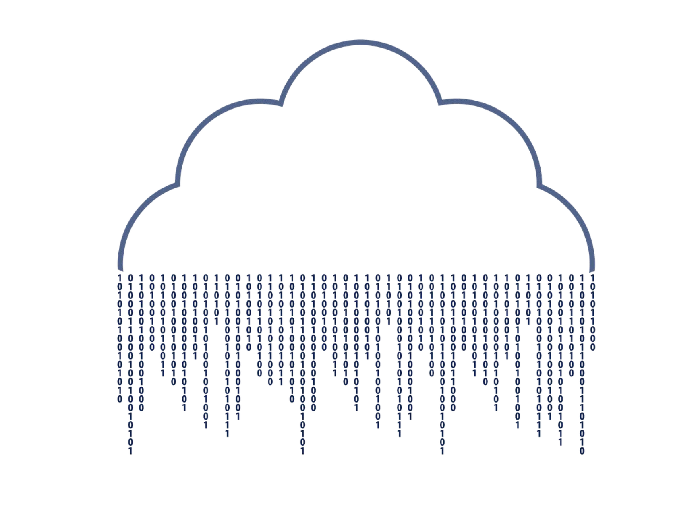

# CONCEPTOS BÁSICOS Y CONTEXTO HISTÓRICO

- Índice:
  - [Historia del almacenamiento de la información](#Historia-del-almacenamiento-de-la-información)
  - [Surgimiento de las bases de datos](#Surgimiento-de-las-bases-de-datos)

## Historia del almacenamiento de la información

>En la antiguedad la información era transmitida de boca en boca y esto causaba que aveces sea distorsionada, además parte de la información que poseía una persona se perdía al concluir con su tiempo de vida. Así las antiguas civilizaciones se dieron cuenta que era necesario almacenar la información. Una de las primeras sistemas de escritura primitivos es el sistema sumerio, que se tallaba en piedra y en arcilla. 

 

 
  
  <h5>Escritura cuneiforme de los sumerios </h5>

 

>Como puede suponerse transportar estas tablillas era en suma complicado y muchas veces algunas terminaban por romperse. Es en este punto donde se da un salto a otro tipo de almacenamiento de informacion como fue papiro y el pergamino. Eran mucho mas portatiles y ligeros pero al estar basados en material vegetal o animal se descomponian con facilidad. 

 

 
  
  <h5>Papiros y pergaminos</h5>

 

>Fue entocnes cuando los chinos revolucionaron el mundo con la creación del papel, el cual era muy portatel y medianamente resistente a la degradación. Sin embargo el proximo gran salto en la revolucion del almacenamiento de datos se da en el siglo 20 con el microfilm un sistema de archivo, gestión y difusión documental. Su gran ventaja era que podia almacenar datos de manera virtualmente infinita, pero su desventaja era poder leer y/o modificar su información que requiere de máquinas especializadas de difícil adquisición.

 

 
  
  <h5>Microfilms</h5>

 

>Posteriormente los medios digitales representaron un gran avance en el almacenamiento de información. Que lograba almacenar la inforamación en formatos de 1 y 0.

 

 
  
  <h5>Medios digitales</h5>

 

>Luego de ello el avance de metodos de almacenamiento de información experimentaría un periodo de recesión hasta la llegada de la nube. La nube trajo consigo una gran ventaja de accesibilidad. Tu puedes acceder a la nube desde cualquier parte del mundo. Además es un medio que puede ser utilizado por varias personas al mismo tiempo.

 

 
  
  <h5>La mitica nube</h5>

 

## Surgimiento de las bases de datos

> La bases de datos surgen en la transición a los medios digitales y posteriormente evolucionaría para su uso conjunto con la nube. Las bases de datos como tal son un conjunto de datos almacenados sistemáticamente que mediante programas y servidores facilitan su administración, gestión y uso.  
> Tradicionalmente se reconocen 2 tipos de bases de Datos: 
> -Relacionales: En la industria hay varias compañías dedicadas a ser manejadoras de bases de datos relacionales como SQL Server, Oracle, MariaDB, entre otras. 
> -No relacionales: Todavía están avanzando y existen ejemplos muy distintos como cassandra, elasticsearch, neo4j, MongoDB, entre otras. 

 

 
  
  <h5>SQL vs noSQL</h5>

 

> Sin embargo tambie podemos clasificar ciertas bases de datos de acuerdos al tipo de sus servicios:  
> -Auto administrados: Es la base de datos que instalas tú y te encargas de actualizaciones, mantenimiento, etc.  
> -Administrados: Servicios que ofrecen las nubes modernas como Azure y no debes preocuparte por mantenimiento o actualizaciones.  

