

# MODELO ENTIDAD/RELACIÓN

El modelo Entidad-Relación es el modelo más utilizado para el diseño conceptual de bases de datos. Fue introducido por Peter Chen en 1976 y se basa en la existencia de objetos a los que se les da el nombre de entidades, y asociaciones entre ellos, llamadas relaciones. Sus símbolos principales se representan en el cuadro siguiente.

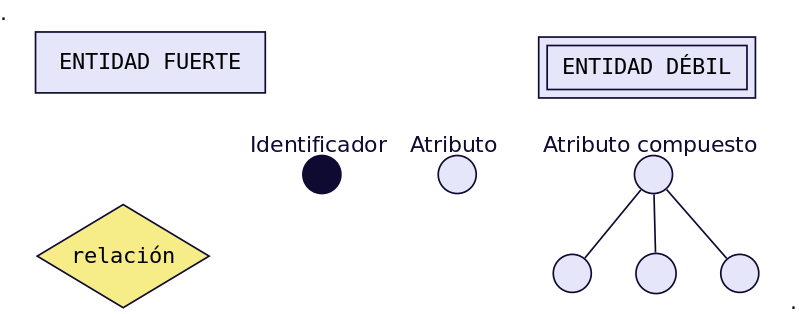

## Entidades

Una entidad es cualquier objeto o elemento acerca del cual se pueda almacenar información en la BD. Las entidades pueden ser concretas como una persona o abstractas como una fecha. Las entidades se representan gráficamente mediante rectángulos y su nombre aparece en el interior. Un nombre de entidad sólo puede aparecer una vez en el esquema conceptual.

### Tipos de entidades

Hay dos tipos de entidades: fuertes y débiles. Una entidad débil es una entidad cuya existencia depende de la existencia de otra entidad. Una entidad fuerte es una entidad que no es débil.

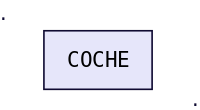
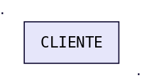
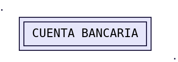

## Atributos

Una entidad se caracteriza y distingue de otra por los atributos, en ocasiones llamadas propiedades o campos, que representan las características de una entidad. Los atributos de una entidad pueden tomar un conjunto de valores permitidos al que se le conoce como dominio del atributo. Dando valores a estos atributos, se obtienen las diferentes ocurrencias de una entidad.

En esencia, existen __dos tipos__ de atributos: 
- _Identificadores de entidad (también llamados clave primaria o clave principal)_: son atributos que identifican de manera unívoca cada ocurrencia de una entidad.
 - _Descriptores de entidad_: son atributos que muestran unas características de la entidad.

__Siempre debe existir, al menos, un atributo identificativo__.

### Ejemplos de atributos:

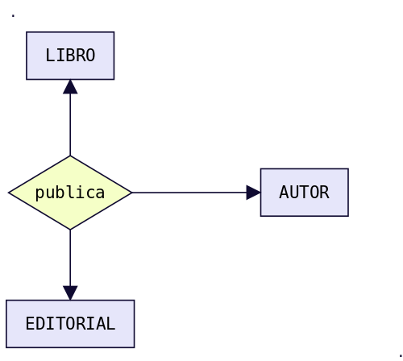

### Tipos de atributos:

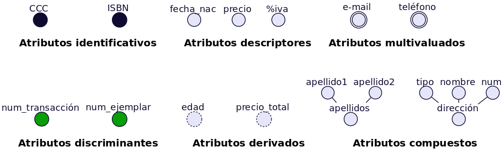

 

- __Atributos identificadores o identificativos__: Son atributos cuyos valores no se repiten dentro de una misma entidad o relación. _Sirven para identificar de forma unívoca cada ocurrencia_. __Actúan como clave principal o primaria__. Por ejemplo __CCC (Código Cuenta Corriente)__ que identifica cada cuenta bancaria. O __ISBN__ (International Standard Book Number) que identifica cada libro que se publica. _Un atributo identificativo puede ser un atributo compuesto_. Por ejemplo CCC podría descomponerse en 3 atributos: _num_banco, num_sucursal y num_cuenta_.
- __Atributos discriminadores o discriminantes__: _Son atributos que discriminan distintas ocurrencias de una entidad débil en identificación dentro de la entidad fuerte de la que dependen_. Lo representaremos con un círculo relleno de un color distinto a los atributos identificadores y descriptivos. __Por ejemplo num_transacción dentro de una CCC o num_ejemplar dentro de un ISBN__.
- __Atributos descriptores o descriptivos__: Son los atributos que describen diversas propiedades de una entidad o relación __(¡la relaciones también pueden tener atributos!)__. Son los más frecuentes.
- __Atributos derivados__: Son atributos cuyos valores se calculan a partir de los valores de otros atributos. _Por ejemplo podemos disponer de un atributo_ __fecha_nac__ _que sería un atributo descriptivo normal y calcular el valor del atributo_ __edad__ _a partir de él. El __precio_total__ _también podría calcularse a partir del_ __precio + %igic__.
- __Atributos multivaluados__: Son atributos descriptores que poseen varios valores de un mismo dominio. Por ejemplo, si necesitamos almacenar varios e-mail de una misma persona entonces deberemos utilizar un atributo multivaluado. Igual sucede con el teléfono. Si sólo necesitamos almacenar un sólo valor utilizaremos un atributo descriptivo normal. __Necesitamos N del mismo tipo__.
- __Atributos compuestos__: Muchas veces se confunden con los anteriores, aunque no tienen nada que ver con ellos. _Un atributo compuesto es un atributo que puede ser descompuesto en otros atributos pertenecientes a distintos dominios_.

## Relaciones

Una relación es la _asociación que existe entre dos a más entidades_. Cada relación tiene un nombre que describe su función. Las relaciones se representan gráficamente mediante rombos y su nombre aparece en el interior. Normalmente le pondremos de nombre la primera o primeras letras de las entidades que relaciona. __Las entidades que están involucradas en una determinada relación se denominan entidades participantes__. __El número de participantes en una relación es lo que se denomina grado de la relación__. Por ejemplo la relación __CLIENTE-COCHE es de grado 2 o binaria, ya que intervienen dos entidades__.

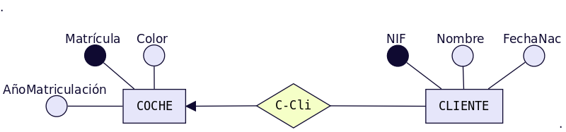

 

Observa que el nombre que ponemos a la relación usa las primeras letras de cada entidad. En este caso como ambas empiezan por __«C» se añade algunas letras más para hacer referencia a CLIENTES__. También podríamos haber puesto como nombre de la relación uno más descriptivo de la misma, por ejemplo __«Compra»__ _(CLIENTE compra COCHE)_, pero esta nomenclatura puede conducir a confusión a la hora de determinar la cardinalidad de la relación cuando estamos aprendiendo. La relación PUBLICAR, es de __grado 3__, ya que involucra las entidades __LIBRO, EDITORIAL y AUTOR__.

 

### Entidad reflexiva

Cuando una entidad está relacionada consigo misma, hablamos de relación reflexiva.

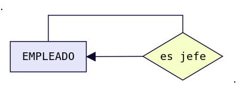

 

__Aunque el modelo E-R permite relaciones de cualquier grado, la mayoría de las aplicaciones del modelo sólo consideran relaciones del grado 2.__

### El Papel o Rol de una entidad en una relación

Es la función que tiene en una relación. Se especifican los papeles o roles cuando se quiera aclarar el significado de una entidad en una relación. A continuación mostramos los mismos ejemplos del punto anterior pero incluyendo el papel o rol de cada entidad en las relaciones:

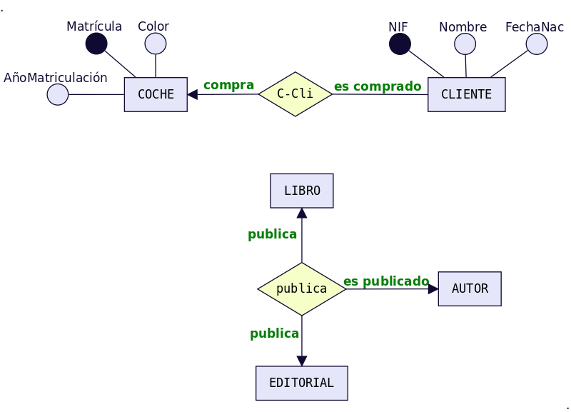

 

### La Cardinalidad de una relación

Cuando la relación es binaria, cosa que ocurre en la mayoría de los casos, la cardinalidad es el número de ocurrencias de una entidad asociadas a una ocurrencia de la otra entidad. Existen principalmente tres tipos de cardinalidades binarias:

#### Relación uno a uno 1:1

A cada elemento de la primera entidad le corresponde no más de un elemento de la segunda entidad, y a la inversa. Es representado gráficamente de la siguiente manera:

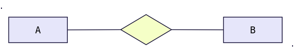

 

##### Ejemplo

Realiza la representación de la cardinalidad de un __persona-conduce-coche__.

<!-- 

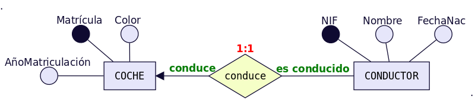

-->
#### Relación uno a muchos 1:N

Significa que cada elemento de una entidad del tipo A puede relacionarse con cualquier cantidad de elementos de una entidad del tipo B, y un elemento de una entidad del tipo B solo puede estar relacionado con un elemento de una entidad del tipo A. Su representación gráfica es la siguiente: __Nótese en este caso que el extremo punteado de la flecha de la relación de A y B, indica un elemento de A conectado a muchos de B__.

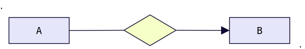

##### Ejemplo

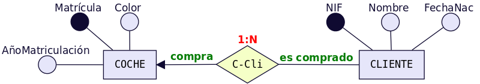

 

### La Participación de una entidad

La participación de una entidad también se conoce como cardinalidad de la entidad dentro de una relación. Una misma entidad puede tener distinta cardinalidad dentro de distintas relaciones. Para obtener la participación, se debe fijar una ocurrencia concreta de una entidad y averiguar cuántas ocurrencias de la otra entidad le corresponden como mínimo y como máximo. Después realizar lo mismo en el otro sentido. Estas ocurrencias mínimas y máximas (llamadas también participación de una entidad) se representarán entre paréntesis y con letras minúsculas en el lado de la relación opuesto a la entidad cuyas ocurrencias se fijan. Para determinar la cardinalidad nos quedamos con las participaciones máximas de ambas y se representan con letras mayúsculas separadas por dos puntos junto al símbolo de la relación. Veamos algunos ejemplos:

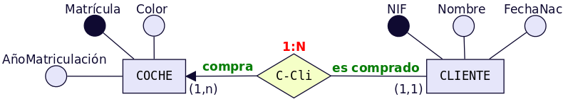

 

#### Explicación

Un cliente «compra» como mínimo 1 coche y como máximo puede comprar más de un coche, es decir, varios coches. Ese varios se representa con la letra «n» → __Participación (1,n)__) y se pone en el lado opuesto a CLIENTE, es decir, junto a COCHE. Un coche «es comprado» como mínimo por 1 cliente y como máximo por 1 cliente → __Participación (1,1)__ y se pone en el lado opuesto a COCHE, es decir, junto a CLIENTE. Para determinar la cardinalidad nos quedamos con las __dos participaciones máximas y la «n» se pone en mayúsculas «N»__. Es decir → __1:N__.

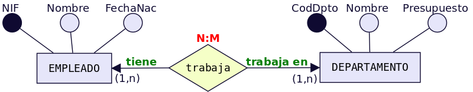

 

#### Explicación

Un empleado «trabaja» como mínimo 1 departamento y como máximo puede trabajar en varios. Ese varios se representa con la letra «n» → __Participación(1,n)__) y se pone en el lado opuesto a EMPLEADO, es decir, junto a DEPARTAMENTO. Un departamento «tiene» como mínimo por 1 empleado y como máximo puede tener varios → __Participación (1,n)__ y se pone en el lado opuesto a DEPARTAMENTO, es decir, junto a EMPLEADO. Para determinar la cardinalidad nos quedamos con las dos participaciones máximas y la «n» se pone en mayúsculas __«N» y para diferenciar el otro «varios» en lugar de «N» ponemos «M»__ (Igual que cuando en matemáticas había dos variables no se ponía x e x sino x e y). Es decir → __N:M__.

### Relaciones de dependencia: Entidades Fuertes y Entidades Débiles

Al definir las entidades hablamos de dos tipos de ellas: __fuertes y débiles__. Una __entidad débil__ está unida a una entidad fuerte a través de una relación de dependencia. Hay dos tipos de relaciones de dependencia:

##### Dependencia en existencia.

Se produce cuando una entidad débil necesita de la presencia de una fuerte para existir. Si desaparece la existencia de la entidad fuerte, la de la débil carece de sentido. Se representa con una barra atravesando el rombo y la letra __E__ en su interior. Son relaciones poco frecuentes.

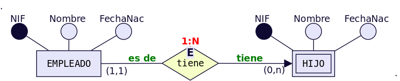

 

###### Explicación
 En la figura se muestra el caso de que __un empleado puede tener ninguno, uno o varios hijos__, por lo que los datos de los hijos deben sacarse en una entidad aparte, aunque __siguen siendo datos propios de un empleado__. _Si se eliminase un registro de un empleado, no tendría sentido seguir manteniendo en la base datos la información sobre sus hijos_.

##### Dependencia en identificación.

__Se produce cuando una entidad débil necesita de la fuerte para identificarse__. _Por sí sola la débil no es capaz de identificar de manera unívoca sus ocurrencias_. __La clave de la entidad débil se forma al unir la clave de la entidad fuerte con los atributos identificadores de la entidad débil__.

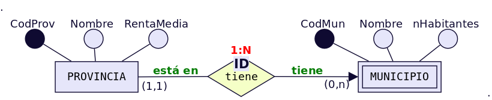

 

###### Explicación

En la figura se observa que la provincia tiene uno o varios municipio y que un municipio pertenece a una sola provincia. Ahora bien si lo que identifica a los municipios es el código que aparece en el código postal, se tiene que las dos primeras cifras corresponden al código de la provincia y las tres últimas al del municipio. Por ejemplo, el C.P de Écija es 41400, dónde 41 es el código de la provincia y 400 el del municipio. De esta forma, habrá distintos municipios con código 400 en distintas provincias. Uno de estos municipios se distinguirá del resto al anteponerle las dos primeras cifras correspondientes al código de la provincial.

#### Símbolos de exclusividad o inclusividad entre relaciones

___Otros símbolos usados en el modelo E/R son los siguientes:___

__Restricción de exclusividad__ entre dos tipos de relaciones R1 y R2 respecto a la entidad E1. _Significa que_ __E1__ está relacionada, o bien con_ __E2__ o bien con __E3__, pero __NO PUEDENDARSE EN AMBAS RELACIONES DE FORMA SIMULTÁNEA__.

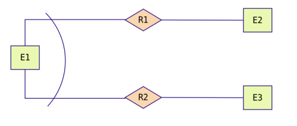

 

__Ejemplo__: Un empleado puede estar en una empresa, o bien realizando prácticas, en cuyo caso está asignado a un grupo de prácticas y no pertenece a ningún departamento en concreto. O bien puede ser empleado en plantilla y en este caso pertenece a un departamento.

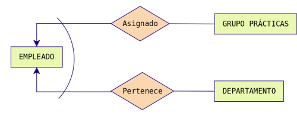

 

__Restricción de inclusividad entre dos tipos de relaciones R1 y R2 respecto a la entidad E1__. Para que la entidad E1 participe en la relación R2 debe participar previamente en la relación R1.

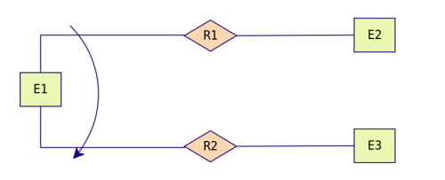

 

__Ejemplo__: Para que un empleado pueda trabajar como diseñador de productos debe haber asistido, al menos, a dos cursos.

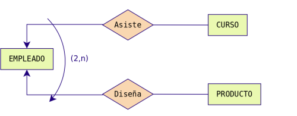

 

__Restricción de exclusión entre dos tipos de relaciones R1 y R2__. Significa que E1 está relacionada con E2 bien mediante R1, o bien mediante R2 pero que no pueden darse ambas relaciones simultáneamente.

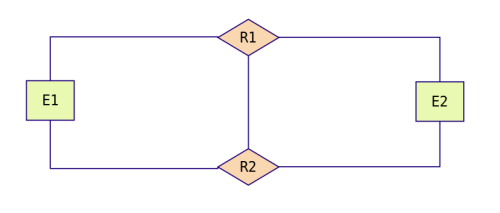

 

__Ejemplo__: Los empleados, en función de sus capacidades, o son diseñadores de productos o son operarios y los fabrican, no es posible que ningún empleado sea diseñador y fabricante a la misma vez.

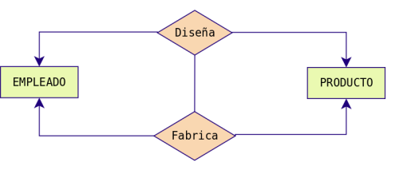

 

__Restricción de inclusión entre dos tipos de relaciones R1 y R2__. Para que la entidad E1 participe en la relación R2 con E2 debe participar previamente en la relación R1.

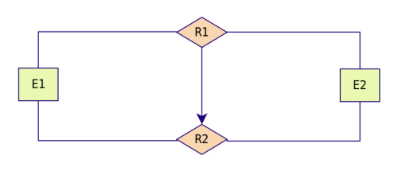

 

__Ejemplo__: Para que un hombre se divorcie de una mujer, previamente ha de haberse casado con ella.

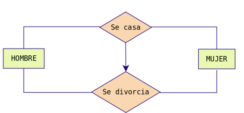

 

## MODELO E/R EXTENDIDO

El modelo __Entidad/Relación extendido__ incluye todo lo visto en el modelo Entidad/Relación pero además las __Relaciones de Jerarquía__.

_Una relación de jerarquía se produce cuando una entidad se puede relacionar con otras a través de una relación cuyo rol_ sería __«Es un tipo de»__.

__Por ejemplo__, imaginemos la siguiente situación.

Queremos hacer una __BD__ sobre los animales de un Zoo. Tenemos las entidades __ANIMAL, FELINO, AVE, REPTIL, INSECTO. FELINO, AVE, REPTIL e INSECTO__ tendrían el mismo __tipo de__ relación con __ANIMAL: «son un tipo de»__. _Ahora bien, su representación mediante el E/R clásico sería bastante engorrosa_:

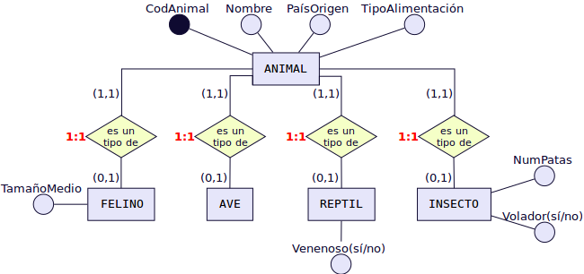

 

Para evitar tener que repetir tantas veces el rombo de la misma relación, ___se utilizan unos símbolos especiales para estos casos y se sustituyen todos los rombos___ de relación ___«es un tipo de»___ por un ___triángulo invertido,___ donde _las entidades de abajo son siempre un tipo de la entidad de arriba y se llaman subtipo e entidades hijas_. La de arriba se denominará supertipo o ___entidad padre___. Las relaciones jerárquicas siempre se hacen en función de un atributo que se coloca al lado de la relación «es_un». En la figura siguiente sería «tipo». El ejemplo anterior quedaría del modo siguiente utilizando símbolos del E/R extendido.

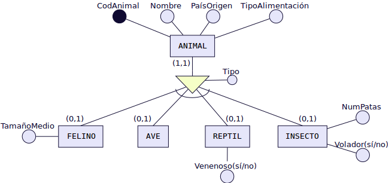

 

### Relaciones de Jerarquía

Vamos a ver los distintos tipos de relaciones de jerarquía existentes:

#### Total: 
Subdividimos la entidad __Empleado__ en: __Ingeniero, Secretario y Técnico__ y en nuestra __BD NO hay ningún otro empleado que no pertenezca a uno de estos tres tipos__.

#### Parcial: 

Subdividimos la __entidad Empleado en: Ingeniero, Secretario y Técnico__ pero en nuestra __BD puede haber empleados que no pertenezcan a ninguno de estos tres tipos__.

#### Solapada: 

Subdividimos la entidad ___Empleado, en: Ingeniero, Secretario y Técnico___ y en nuestra __BD puede haber empleados que sean a la vez Ingenieros y Secretarios, o Secretarios y Técnicos, etc__.

#### Exclusiva: 

Subdividimos la entidad ___Empleado en: Ingeniero, Secretario y Técnico___. En nuestra __BD ningún empleado pertenece a más de una subentidad__.

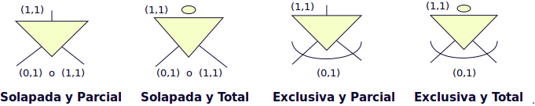

 

#### Ejemplos:

##### Jerarquía solapada y parcial

 
En esta BD un empleado podría ser simultáneamente técnico, científico y astronauta o técnico y astronauta, etc. (solapada). Además puede ser técnico, astronauta, científico o desempeñar otro empleo diferente (parcial).

#### Jerarquía solapada y total

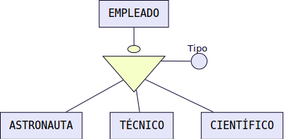

 

En esta BD un empleado podría ser simultáneamente técnico, científico y astronauta o técnico y astronauta, etc. (solapada). Además puede ser solamente técnico, astronauta o científico (total).

#### Jerarquía exclusiva y parcial

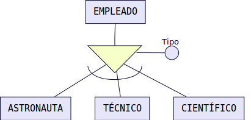

 

En esta BD un empleado sólo puede desempeñar una de las tres ocupaciones (exclusiva) . Además puede ser técnico, o ser astronauta, o ser científico o también desempeñar otro empleo diferente, por ejemplo, podría ser FÍSICO (parcial).

#### Jerarquía exclusiva y total

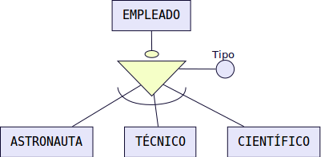

 

Un empleado puede ser solamente técnico, astronauta o científico (total) y no ocupar más de un puesto (exclusiva).

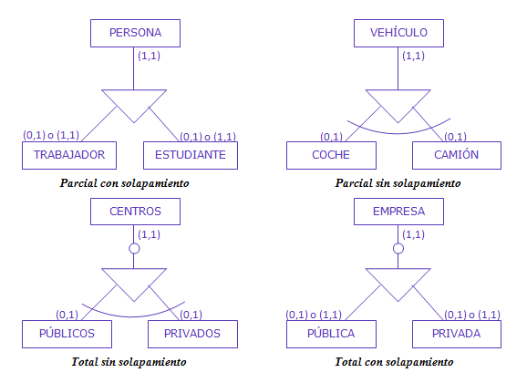

 

## Notación de símbolos en el Modelo E/R

La notación original de __Peter Chen__ considera iconos o figuras para cada elemento del modelo, así, las entidades se
representan con rectángulos, las relaciones con un rombo y los atributos con óvalos. Las líneas unen las relaciones
(los rombos) con las entidades (rectángulos) y las entidades con los atributos (óvalos), tal como se muestra en siguiente imagen.

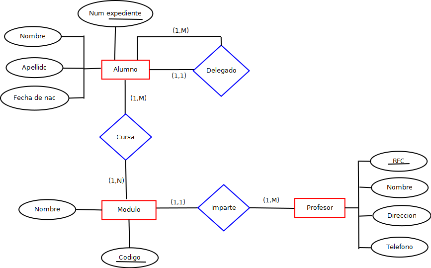

Si bien la notación de __Chen__ sigue siendo __muy utilizada__, _otras notaciones posteriores han logrado aceptación y popularidad_, particularmente tres se consideran válidas en el DNP para dibujar el modelo:
- Notación Pata de Gallo.
- Notación IDEF1X.
- Notación REIN85.

La transformación de la notación __CHEN__ a  las anteriormente citadas son las siguientes:

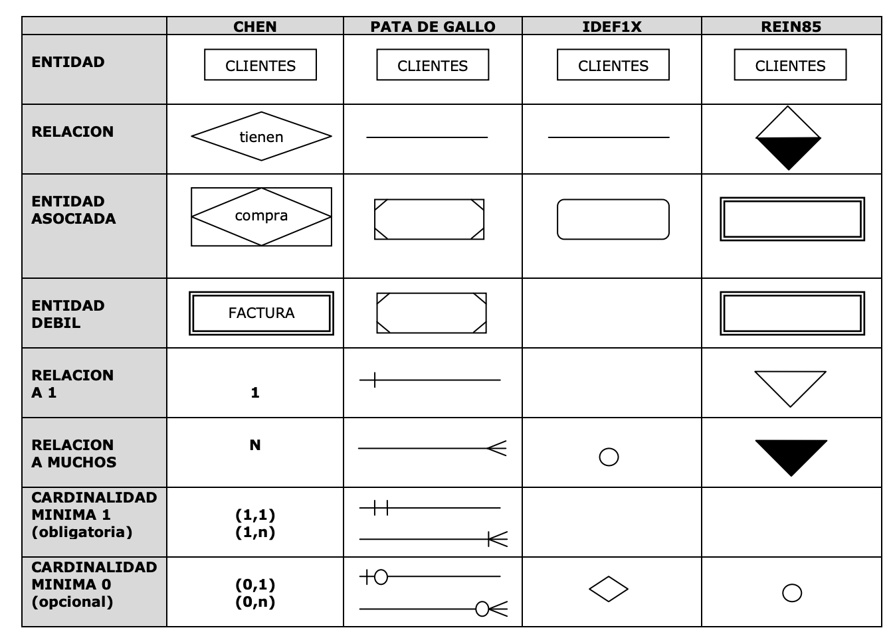

