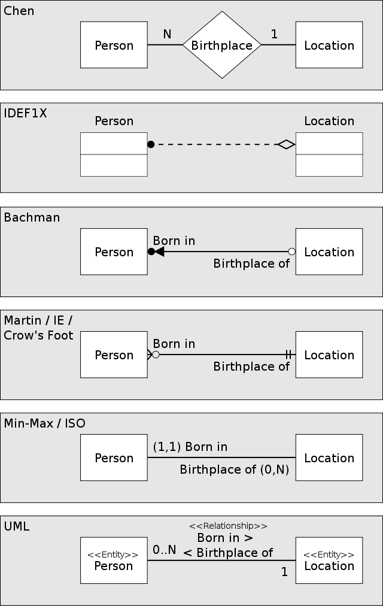

# INTRODUCCIÓN-A-LAS-BASES-DE-DATOS-RELACIONALES

- Índice:
  - [Historia de las RDB](#Historia-de-las-RDB)
  - [Entidades y atributos](#Entidades-y-atributos)
  - [Entidades del Platziblog](#Entidades-del-Platziblog)
  - [Relaciones](#Relaciones)
    - [Tipos de cardinalidad](#Tipos-de-cardinalidad)
    - [Cardinalidad muchos a muchos](#Cardinalidad-muchos-a-muchos)
  - [Diagrama ER](#Diagrama-ER)
  - [Tipos de datos y constraints](#Tipos-de-datos-y-constraints)
    - [Datos de texto](#Datos-de-texto)
    - [Datos numéricos](#Datos-numéricos)
    - [Datos de fecha y hora](#Datos-de-fecha-y-hora)
    - [Datos lógicos](#Datos-lógicos)
    - [Los constraints](#Los-constraints)
  - [La Normalización](#La-Normalización)
    - [Normalizacion de Platziblog](#Normalizacion-de-Platziblog)

# INTRODUCCIÓN A LAS BASES DE DATOS RELACIONALES

## Historia de las RDB

> Las bases de datos surgen de la necesidad de conservar la información más allá de lo que existe en la memoria RAM. El modelo de von Neumann o arquitectura Princeton, es una arquitectura de computadoras que constaba de una unidad de procesamiento, una unidad de control, una memoria y mecanismos de entrada y salida  

> Sin embargo la memoria del modelo de von Neuman solo se utilizaba para almacenar tanto datos como instrucciones (lo que hoy sería el equivalente a la RAM), mas no contemplaba el guardado de datos persistentes. En este punto se empezaron a buscar formas de como guardar estos datos. Así surgen primero las bases de datos basadas en archivos eran datos guardados en texto plano, fáciles de guardar pero muy difíciles de consultar.

 

 
  
  <h5>Modelo de von Neuman</h5>

 

> Ante la necesidad de mejorar esto nacen las bases de datos relacionales. Su inventor Edgar Codd dejó ciertas reglas para asegurarse de que toda la filosofía de las bases de datos no se perdiera (LAS 12 REGLAS DE CODD), estandarizando de este modo el el proceso, estó a raiz de que en 1990 Codd mismo se preocupó al ver que ciertos sistemas de gestión de bases de datos (SGBD) que decían ser relacionales, no lo eran. Además de ello Codd invento el ALGEBRA RELACIONAL. 

Reglas  | Descripción
------------- | -------------
Regla 0: Regla de fundación. | Cualquier sistema que se proclame como relacional, debe ser capaz de gestionar sus bases de datos enteramente mediante sus capacidades relacionales.
Regla 1: Regla de la información. | a) Todos los datos deben estar almacenados en las tablas.   b) Esas tablas deben cumplir las premisas del modelo relacional.  c) No puede haber información a la que accedemos por otra vía.
Regla 2: Regla del acceso garantizado. | a) Cualquier dato es accesible sabiendo la clave de su fila y el nombre de su columna o atributo.  b) Si a un dato no podemos acceder de esta forma, no estamos usando un modelo relacional.
Regla 3: Regla del tratamiento sistemático de valores nulos. | a) Esos valores pueden dar significado a la columna que los contiene.   b) El SGBD debe tener la capacidad de manejar valores nulos.   c) El SGBD reconocerá este valor diferenciándolo de cualquier otro.   d) El SGBD deberá aplicársele la lógica apropiada.   e) Es un valor independiente del tipo de datos de la columna.
Regla 4: Catálogo dinámico en línea basado en el modelo relacional. | a) El catálogo en línea es el diccionario de datos.   b) El diccionario de datos se debe de poder consultar usando las mismas técnicas que para los datos.   c) Los metadatos, por tanto, se organizan también en tablas relacionales.   d) Si SELECT es una instrucción que consulta datos, también será la que consulta los metadatos.
Regla 5: Regla comprensiva del sublenguaje de los datos completo. | a) Al menos tiene que existir un lenguaje capaz de hacer todas las funciones del SGBD.   b) No puede haber funciones fuera de ese lenguaje.   c) Puede haber otros lenguajes en el SGBD para hacer ciertas tareas.   d) Pero esas tareas también se deben poder hacer con el “lenguaje completo”.
Regla 6: Regla de actualización de vistas. | a) Las vistas tienen que mostrar información actualizada.   b) No puede haber diferencias entre los datos de las vistas y los datos de las tablas base.
Regla 7: Alto nivel de inserción, actualización, y cancelación. | a) La idea es que el lenguaje que maneja la base de datos sea muy humano.   b) Eso implica que las operaciones del lenguaje de manipulación de los datos (DML) trabajen con conjuntos de filas a la vez.   c) Para modificar, eliminar o añadir datos, no hará falta programar de la forma en la que lo hacen los lenguajes de tercera generación como C o Java.
Regla 8: Independencia física de los datos. | a) Cambios en la física de la BD no afecta a las aplicaciones ni a los esquemas lógicos.   b) El acceso a las tablas (elemento lógico) no cambia porque la física de la base de datos cambie.
Regla 9: Independencias lógicas de los datos. | a) Cambios en el esquema lógico (tablas) de la BD no afectan al resto de esquemas.   b) Si cambiamos nombres de tabla, o de columna o modificamos información de las filas, las aplicaciones (esquema externo) no se ven afectadas.   c) Es más difícil de conseguir.
Regla 10: Independencia de la integridad. | a) Las reglas de integridad (restricciones) deben de ser gestionadas y almacenadas por el SGBD.
Regla 11: Independencia de la distribución. | a) Que la base de datos se almacene o gestione de forma distribuida en varios servidores, no afecta al uso de esta ni a la programación de las aplicaciones de usuario.   b) El esquema lógico es el mismo independientemente de si la BD es distribuida o no.
Regla 12: La regla de la no subversión. | a) La base de datos no permitirá que exista un lenguaje o forma de acceso, que permita saltarse las reglas anteriores.

## Entidades y atributos

>Entidad: Es algo similar a un objeto (revisar progrmación orientada a objetos), la diferencia con estos últimos, es que una entidad solo se refiere a los datos, en cambio un objeto se refiere a datos y los métodos (o funciones) como tal que controlan estos datos. En bases de datos, una entidad es cuando abstraemos un objeto de la vida real. Al igual que los obejtos las entidades poseen atributos ligados a si, que son las cosas que los hacen ser una entidad. Por convención se diagraman dentro de cuadrados y por además se ponen en plural.

 

 
  
  <h5>Entidad "laptops"</h5>

 

>Atributos: Son las características que podemos proporcionarles a una entidad, y que por convención se representan con ovalos. Existen ciertos atributos especiales a los que se les desgina de forma particular:

ATRIBUTOS  | Descripción
------------- | -------------
Multivaluado | Puede poseer multiples valores (ejemplo: 4 valores diferentes par el atributo "llantas" de la entidad "automóviles").
Compuestos | Los cuales están compuestos por otros atributos (ejemplo: para la entidad "laptos" el atributo "metodos de entrada " esta compuesto por el atributo "trackpad" y "teclado"). 
Especiales (almacenados y derivados)| Que puedes representarse con líneas punteadas (ejemplo: antiguedad o edad de una persona, se puede primero determinar en la misma base de datos la fecha de nacimiento y cuando la edad sea desfasada, se actualiza automáticamente a partir de su fecha de nacimiento.)

 

 
  
  <h5>Atributos de la entidad "laptops"</h5>

 

> Pero quizá los atributos mas importantes,sean los denominados los ATRIBUTOS LLAVES son aquellos que identifican a la entidad y no pueden ser repetidos. Se representan con un subrayado. Existen principalemnte 2:  
> -Naturales: son inherentes al objeto como el número de serie.  
> -Clave artificial: no es inherente al objeto y se asigna de manera arbitraria.

 

 
  
  <h5>Atributo llave "Student id"</h5>

 

> Finalmente debemos conocer que las entidades pueden ser  
> -Entidades fuertes: Son entidades que pueden sobrevivir por si solo. Al leer la tabla sabes que son las entidades (se encierra en un recuadro).  
> -Entidades débiles: No puede existir sin una entidad fuerte. Al leer la tabla no puedes saber que son las entidades (se encierra en un recuadro doble). En esto podemos diferenciar 2 subtipos: las **Identidades Débiles por Identidad** (no se diferencian entre sí más que por la clave de su identidad fuerte) y las **Identidades Débiles por Existencia** (que se les asigna una clave propia, pero su existencia sigue siendo dependiente de una fuerte).

 

 
  
  <h5>Resumen representativo de entidades y atributos</h5>

 

## Entidades del Platziblog

> Durante el curso desarrollares un proyecto completo de inicio a fin basandonos en un Platziblog. Este proyecto nos presenta un contexto familiar y nos representará retos muy interesantes.  
> -Primer paso: Identificar las entidades.
 

 
  
  <h5>Las Entidades del Platziblog</h5>

 

> Segundo paso: Pensar en los atributos.
 

 
  
  <h5> Atributos de entidad "Posts"</h5>

 

 
  
  <h5> Atributos de entidad "Usuarios"</h5>

 

> Una recomendación importante que es que no utilicemos el correo del usuario como id. Es mejor generar un id independiente para cada usuario puesto que a pesar de que email es único, limitará la identificación cuando el usuario quiera cambiar su email.

## Relaciones

> Las relaciones, clasifcamente son representadas por un rombo. Sirven para poder ligar o unir nuestras diferentes entidades. Por convención las relaciones son verbos que conectan entidades.  
> *NOTA:Los atributos multivaluados (ejm. discos duros),pueden relacionarse de diversas formas con el resto de entidades. Por ello, se suele convertilos a entidad separadas, a este proceso de se le denomina "normalizar" (se explicará luego).*

 

 
  
  <h5> Atributos de entidad "Usuarios"</h5>

 

> Y para comprender mejor cuántos de un lado pertenecen a cuántos del otro lado, surge el concepto de **CARDINALIDAD**. La cual es una propiedad de las relaciones que indica la cantidad y correspondencia con la que puede estar relacionada una entidad. 

### Tipos de cardinalidad

TIPOS DE CARDINALIDAD | Descripción
------------- | -------------
Uno-Uno (1:1) | Significa que cada entidad de la primera relación se va a relacionar con una entidad de la segunda relación y viceversa.
Cero-Uno (0:1) | Esta cardinalidad aveces se debate, y se sugiere denominarlo de 1 a 1 opcional. Con esto nos referimos a que puede existir la opción de que no exista uno de los datos. 
Cero-Muchos (0:N) | Esta cardinalidad igualmente se debate, y se sugiere denominarlo de 1 a N opcional. Con esto nos referimos a que puede existir la opción de que no exista uno de los datos. 
Una-Muchas (1:N) | Las entidades de la relación r1 se pueden relacionar con varias entidades de la relación r2. Pero las entidades de la relación r2 solo pueden asociarse con una entidad de r1. 
Muchas-Una (N:1) | Las entidades de r1 solo pueden asociarse con una entidad de r2. Mientras que las entidades de r2 pueden asociarse con varias entidades contenidas en r1.
Muchas-Muchas (N:N) | Las entidades de ambas relaciones pueden asociarse con varias entidades de la contraria.

 

 
  
  <h5> Cardinalidad 1:1 </h5>

 

 
  
  <h5> Cardinalidad 0:1 </h5>

 

 

 
  
  <h5> Cardinalidad 0:N </h5>

 

 
  
  <h5> Cardinalidad 1:N </h5>

### Cardinalidad muchos a muchos

> La cardinalidad muchos a muchos es una de las cardinalidades mas especiales y que mas retos deberemos ir resolviendo a lo largo del desarrollo de una base de datos. *(Nota: En la representación grafica, se puede añidir una barra verticar a cada lado que simboliza que la relación es estricta, osea que SIEMPRE hay muchos a un lado y muchos al otro. Pero se usa para casos muy particulares).*

 

 
  
  <h5> Cardinalidad N:N </h5>

## Diagrama ER

> Un diagrama Entidad-Relación es como un mapa y nos ayuda a entender cuáles son las entidades con las que vamos a trabajar, cuáles son sus relaciones y qué papel van a jugar en las aplicaciones de la base de datos.  

> *Nota:Una página muy util para elaborar estos ../diagramas es [DIAGRAMS](https://app.diagrams.net)*

 

 
  
  <h5> Diagrama E:R de Platziblog </h5>

> Debemos recordar que existen varios métodos para representar una misma relación. A estos diversos metodos se les conoce como: **Diagramming Convention Techniques**

 

 
  
  <h5> Diagramming Convention Techniques </h5>

### Tipos de datos y constraints

Para llevar a la práctica un diagrama debemos ir más allá y darle detalle con parámetros, convirtiendo nuestro Diagrama ER en un Diagrama Físico, pero para poder desarrollarlo primero debemos comprende 2 conceptos: **los tipos de datos** y **los constraints**

#### Datos de texto

Datos tipo texto | Descripción
------------- | -------------
Char(n) | Permite almacenar caracteres y cadenas de texto. Este tipo de dato reserva un espacio de memoria del número de caracteres que va a ser ocupado.
Varchar(n) | Al igual que char, este reserva espacio en la memoria. Su diferencia radica en que este reserva un mínimo espacio de memoria, y a partir de esta va creciendo o encogiéndose, es eficiente cuando desconocés cual será el tamaño de tu cadena de texto (Su limite es de 255 caracteres).
Text | Su función es guardar cadenas de texto que sean muy grandes.

#### Datos numéricos

Datos numéricos | Descripción
------------- | -------------
Integer | Número que no tiene punto decimal, se usa para declarar un tipo de dato entero que puede ser usado para hacer operaciones. Al usar este tipo de dato nuestra base de datos sabrá que estamos hablando de número y no solo de un simple carácter.
Bigint | Subtipo de integer, nos sirve para declarar números muy grandes.
Smallint | Subtipo de integer, nos para declarar números muy pequeños (99 o menos).
Decimal (n, s) y Numeric (n, s) | Tienen dos parámetros (n y s, en este ejemplo). La primera entrada es para números enteros, y la segunda entrada es para números decimales. Nos sirve para hacer operaciones mas precisas.

#### Datos de fecha y hora
> Esta clase de tipos de datos es muy peculiar ya que nos ayuda internamente a tener una bitácora de nuestra base de datos.

Datos de fecha y hora | Descripción
------------- | -------------
Date | Solo contiene la fecha (año, mes y día).
Time | Solo contiene la hora.
Datetime | Es una mezcla de los dos primeros, contiene fecha y hora.
Timestamp | Es el número de segundos que ha transcurrido desde que tu archivo fue creado. En otras palabras, podría decirse que es un medidor de tiempo.

#### Datos lógicos

Datos lógicos | Descripción
------------- | -------------
Booleano | Este solo puede tener dos valores, funciona como un tipo de dato binario. Es usado de manera discriminatoria para hacer validaciones.

 

 
  
  <h5> Tipos de datos </h5>

#### Los constraints
> Por su lado los contraints o restricciones son los tipos de reglas que vas a permitir que tenga tu base de datos. Y son:

Constraints | Descripción
------------- | -------------
Not null | Se asegura que tu columna no tenga valores nulos.
Unique | Asegura que cada valor en tu columna no se repita. (ejemplo: el email)
Primary Key o Llave primaria | Es una etiqueta muy importante, es una combinación entre not null y unique. **Es el constraint que nos permite hacer relaciones entre distintas entidades.**
Foreign Key o Llave foránea | Es el otro lado de una primary key, cuando queremos juntar dos tablas y decir que estan relacionadas entre si, lo que va a suceder es la primary key de una de las tablas se añadirá como foreign key de la otra.
Check | Algunas bases de datos removieron este tipo de contraints, pero las que lo conservan son muy potentes. Tiene la función de permitir que añadamos las reglas que queramos a nuestra base de datos.
Default | Coloca un valor por defecto cuando no hay un valor especificado.
Index | Se crea por columna, su función es hacer búsquedas con mayor rapidez. Su única desventaja es que suele volverse lenta cada vez que se añaden nuevos registros. (No recomendada en tablas donde escribimos muchos nuevos registros)

 

 
  
  <h5> Los constraints </h5>

### La Normalización

> El proceso de normalización es un estándar que consiste, básicamente, en un proceso de conversión de las relaciones entre las entidades. Es útil para separar la información, minimizar la redundancia de los datos, para que la actualización de los datos sea más sencilla y la integridad de los datos se conserve. Esto obedece a las 12 reglas de Codd y nos permiten separar componentes en la base de datos. Identificamos para ello 4 reglas denominadas **Formas normales**.

Formas normales | Descripción
------------- | -------------
Primera forma normal (1FN) | **Atributos atómicos (Sin campos repetidos)**   Para un atributo sólo debe existir una columna, si surge la necesidad, no se debe crear otra columna (Esto porque si crees que con n columnas es suficiente, tarde que temprano necesitarás n+1) Sencillamente se añade un identificador y posteriormente se divide por filas.
Segunda forma normal (2FN) | **Cumple 1FN y cada campo de la tabla debe depender de una clave única.**   Esto nos ayuda a tener datos más organizados, y distinguir entre si un atributo hace parte de una entidad, o si son dos entidades separadas relacionadas estrechamente.
Tercera forma normal (3FN) | **Cumple 1FN, 2FN y los campos que no son clave no deben tener dependencias.**   Sí un dato de un atributo esta directamente relacionado con otro, para que al editar un dato, no deba editar otro campo y haya espacio a errores (porque alguno “se me olvidó”), se separa en una tabla diferente de esta manera la actualización de los datos es más limpia.
Cuarta forma normal (4FN) | **Cumple 1FN, 2FN, 3FN y los campos multivaluados se identifican por una clave única.**   Esta es usualmente útil cuándo se tiene una cardinalidad N:M, de muchos a muchos, y simplemente se crea una tabla especial para relacionar las claves únicas de las entidades.

 

 
  
  <h5> Tabla sin normalizar </h5>

  
  <h5> 1FN </h5>

  
  <h5> 2FN </h5>

  
  <h5> 3FN </h5>

  
  <h5> 4FN </h5>

> Al normalizar evitanmos:  
> -La redundancia de los datos: repetición de datos en un sistema.  
> -Anomalías de actualización: Inconsistencias de los datos como resultado de datos redundantes y actualizaciones parciales.  
> -Anomalías de borrado: Pérdidas no intencionadas de datos debido a que se han borrado otros datos.  
> -Anomalías de inserción: Imposibilidad de adicionar datos en la base de datos debido a la ausencia de otros datos.

#### Normalizacion de Platziblog

> Ahora aplicaremos la normalización a nuestro proyecto de Platziblog

 

 
  
  <h5> Diagrama Platziblog </h5>

> *NOTA 01: Al normalizar aunque parezca que la información se multiplicó, en realidad la descompusimos de manera que a un sistema le sea fácil de reconocer y mantener la consistencia de los datos.*  
> *NOTA 02: Algunos autores precisan una 5FN que hace referencia a que después de realizar esta normalización a través de uniones (JOIN) permita regresar a la data original de la cual partió.*

