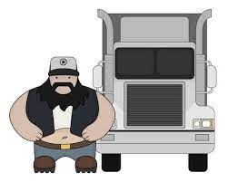
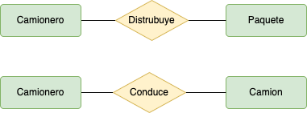
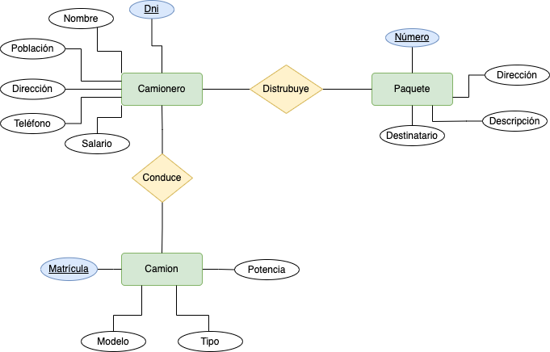
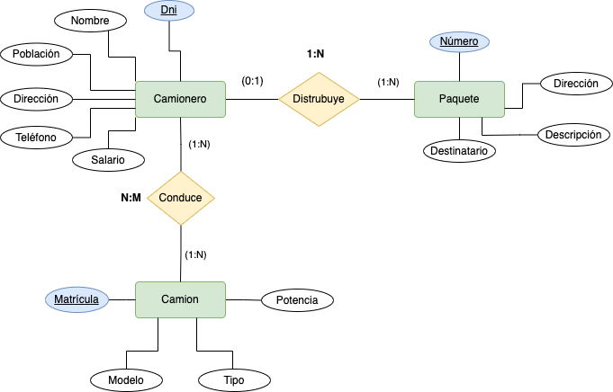

# Sistema de Reparto

A partir del siguiente enunciado se desea realizar el modelo __entidad-relación__. Se desea informatizar la gestión de una empresa de reparto de mercancías que reparte paquetes por toda la isla. Los encargados de llevar los paquetes son los camioneros, de los que se quiere guardar el dni, nombre, teléfono, dirección, salario y población en la que vive. De los paquetes transportados interesa conocer el código de paquete, descripción, destinatario y dirección del destinatario. Un camionero distribuye muchos paquetes, y un paquete sólo puede ser distribuido por un camionero. De los camiones que llevan los camioneros, interesa conocer la matrícula, modelo, tipo y potencia. Un camionero puede conducir diferentes camiones en fechas diferentes, y un camión puede ser conducido por varios camioneros.
Se solicita:
1. Identifica las posibles __entidades y las relaciones__.
2. Proponer las frases que describan el problema.
 __Por ejemplo de la frase__: _Los encargados de llevar los paquetes son los camioneros._
 __Se deduce que__: _Camionero lleva (distribuye) Paquetes_.
 __De la frase__: _Los camiones que llevan los camioneros_.
 __Se deduce que__: _Camionero conduce camión_.
3. Generar los entidades y relaciones de cada frase que hayas detectado, sin indicar cardinalidad, etc.
4. Monta correctamente todas las entidades y sus relaciones.
5. Colocar los atributos a cada entidad e interrelación.
6. Indica la cardinalidad de las relaciones.

<!--

      
PASO 1 - PULSA PARA VER RESPUESTA
   
   
  
  

   

      
PASO 2 - PULSA PARA VER RESPUESTA
   
   
  
  

   

      
PASO 3 - PULSA PARA VER RESULTADO
   
   
  
  
   

__Explicación__:
  “Un camionero distribuye muchos paquetes, y un paquete sólo puede ser distribuido por un camionero”. Por lo que será:
  - Camionero – Paquete __(1,N)__
  - Paquete – Camionero __(0,1)__, si entendemos que puede haber paquetes no distribuidos. Si no realizamos esta consideración la cardinalidad sería __(1:1)__
  
  La participación en la relación “conduce” viene definida en la frase “Un camionero puede conducir diferentes camiones en fechas diferentes, y un camión puede ser conducido por varios camioneros”. Por lo que será:
  - Camionero – Camión __(1,N)__
  - Camión – Camionero __(1,N)__
  Por lo tanto la cardinalidad de la relación “conduce” es __N:M__ (las dos máximas).

-->

