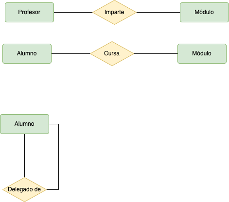

# Profesorado

A partir del siguiente enunciado se desea realizar el modelo __entidad-relación__.

“Se desea diseñar la base de datos de un Instituto. En la base de datos se desea guardar los datos de __los profesores del Instituto__ (_DNI, nombre, dirección y teléfono_). Los profesores imparten __módulos__, y cada módulo tiene un _código y un nombre_. Cada __alumno__ _está matriculado en uno o varios módulos_. De cada alumno se desea guardar el _nº de expediente, nombre, apellidos y fecha de nacimiento_. _Los profesores pueden impartir varios módulos, pero un módulo sólo puede ser impartido por un profesor_. Cada _curso tiene un grupo de alumnos, uno de los cuales es el delegado del grupo_”.

Se pide:
1. Identifica las posibles __entidades y las relaciones__.
2. Proponer las frases que describan el problema.
3. Generar los entidades y relaciones de cada frase que hayas detectado, sin indicar cardinalidad, etc.
4. Monta correctamente todas las entidades y sus relaciones.
5. Colocar los atributos a cada entidad e interrelación.
6. Indica la cardinalidad de las relaciones.

<!--

      
PASO 1 - PULSA PARA VER RESULTADO
   
   
  
  
  
   

      
PASO 2 - PULSA PARA VER RESULTADO
   
   
  
  
  
   

      
PASO 3 - PULSA PARA VER RESULTADO
   
   
  
  
  
   

 También se puede deducir que __Alumno pertenece a grupo__. Pero en este caso no podemos asignar ningún atributo a la posible entidad Grupo. Por lo que de momento la desechamos. Entendemos que podemos agrupar a los alumnos que tienen al mismo delegado.

  - La participación en la relación __“imparte”__ viene definida en la frase “Los profesores pueden impartir varios módulos, pero un módulo sólo puede ser impartido por un profesor”. Por lo que será:
    - Profesor – Módulo (1,n)
    - Módulo – Profesor (1,1)
   Por lo tanto la cardinalidad de la relación “imparte” es 1:N (las dos máximas).
 - La participación en la relación __“cursa”__ viene definida en la frase “Cada alumno está matriculado en uno o varios módulos”. Por lo que será:
   - Alumno – Módulo (1,n)
   - Módulo – Alumno (1,n)
   Por lo tanto la cardinalidad de la relación “cursa” es N:M (las dos máximas).
 - La participación en la relación __“delegado_de”__ viene definida en la frase “Cada curso tiene un grupo de alumnos, uno de los cuales es el delegado del grupo”. Por lo que será:
   - Alumno(Delegado) – Alumno (1,n)
   - Alumno – Alumno(Delegado) (1,1)
   Por lo tanto la cardinalidad de la relación “delegado_de” es 1:N (las dos máximas).
  
   

      
SOLUCIÓN (OPCIONAL) - PULSA PARA VER RESULTADO
   
   
  
  
  
 La participación en la relación __“pertenece a”__ viene definida en la frase “Cada curso tiene un grupo de alumnos”. Por lo que será: 
  - Alumno – Grupo (1,1) suponemos que los alumnos perteneces a un único grupo o Grupo – Alumno (1,n).
  Por lo tanto la cardinalidad de la relación “pertenece a” es 1:N (las dos máximas).

   

-->

