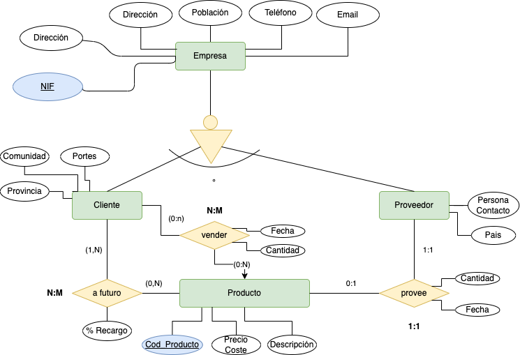

# Empresa

Una empresa de importación desea informatizar la gestión de compra/ventas de productos. Compra diversos productos a empresas extranjeras y los vende a empresas españolas.
- Por cada empresa necesita NIF, dirección, población, teléfono y fax.
- Cada empresa es cliente o proveedora.
- Para las empresas clientes necesita saber además la provincia, comunidad autónoma y portes (debidos o pagados).
- Para las empresas proveedoras necesita saber el país, CIF internacional y nombre de la persona de contacto.
- Por cada producto tenemos código, descripción y precio de coste.
- Cada proveedor provee un único producto, y cada producto es provisto por un único proveedor. En el momento de contactar con un nuevo proveedor se guardará constancia del mismo y el producto que le debemos comprar.
- Tras cerrar el acuerdo con los clientes guardaremos constancia de qué productos nos demandará en el futuro y cual será el porcentaje de recargo a aplicar en cada producto.
- Se desea guardar constancia de cada compra y venta con la fecha y cantidad de productos comprados/vendidos.
- Pueden existir proveedores y/o clientes con los cuales tengamos firmados acuerdos y aún no hayamos realizado ninguna compra y/o venta.

Se pide:
  1. Proponer las frases que describan el problema.
  2. Identifica las posibles __entidades y las relaciones y valores de dominio si existiera__.
  3. Generar los entidades y relaciones de cada frase que hayas detectado, sin indicar cardinalidad, etc.
  4. Monta correctamente todas las entidades y sus relaciones.
  5. Colocar los atributos a cada entidad e interrelación.
  6. Indica la cardinalidad de las relaciones.

      
Frases a tener en cuenta
   

  - 3 primeras frases:
    - Por cada empresa necesita NIF, dirección, población, teléfono y fax.
    - Cada empresa es cliente o proveedora.
    - Para las empresas clientes necesita saber además la provincia, comunidad autónoma y portes (debidos o pagados).
    > Identificamos la entidad empresa, que posee sus atributos (NIF, ...). Además en la segunda frase se identifican dos tipos (cliente/proveedora). No obstante, dado que las empresas clientes tienen propiedades (provincia,...), __cliente y proveedora__ pasan a ser entidades de la relación.
  - Cada proveedor provee un único producto, y cada producto es provisto por un único proveedor.
    > Producto se identifica como entidad, y se identifica la relación _provee_.
  - Tras cerrar el acuerdo con los clientes guardaremos constancia de qué productos nos demandará en el futuro y cual será el porcentaje de recargo a aplicar en cada producto.
    > Se debe de guardar la relación entre el __Cliente__ y el __Producto__ _a futuro_.     

      
Entidades, Relaciones y Valores de Dominio si existen
   
  
  - Entidades:
    > Empresa, Cliente, Proveedor, Producto.
  - Relaciones:  
    > provee, a futuro, vender.

      
Generar entidades y relaciones
   
   
  
  > Empresa __jerarquía__: Cliente/Proveedor.
  > Cliente __vende__ Producto.
  > Proveedor __posee__ Producto.
  > Producto __a futuro__ Cliente.

      
Diagrama, atributos y cardinalidades
   
   
  

