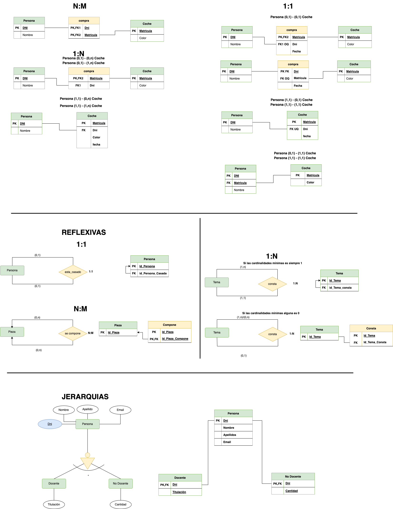

# MODELO RELACIONAL

## Introducción
Los SGBD se pueden clasificar de acuerdo con el modelo lógico que soportan, el número de usuarios, el número de puestos, el coste… La clasificación más importante de los SGBD se basa en el modelo lógico, siendo los principales modelos que se utilizan en el mercado los siguientes:
- Jerárquico.
- En Red.
- Relacional.
- Orientado a Objetos.

La mayoría de los __SGBD comerciales__(Oracle, MySQL,...) actuales están basados en el __modelo relacional__, en el que nos vamos a centrar, mientras que los __sistemas más antiguos__ estaban basados en el __modelo de red o el modelo jerárquico__. Otros modelos basados en objetos, son los utilizados en la actualidad __Big Data__.

Los motivos del __éxito__ del __modelo relacional__ son fundamentalmente dos:
- Se basan en el álgebra relacional que es un modelo matemático con sólidos fundamentos. 
> Nota: En esta sección se presenta el modelo relacional. Realizaremos la descripción de los principios básicos del modelo relacional: la estructura de datos relacional y las reglas de integridad.

Ofrecen sistemas simples y eficaces para representar y manipular los datos.
La estructura fundamental del modelo relacional es precisamente esa, la __«relación»__, es decir una tabla bidimensional constituida por __filas (registros o tuplas)__ y __columnas (atributos o campos)__. Las __relaciones o tablas__ _representan_ __las entidades del modelo E/R__, mientras que los __atributos__ de la __relación__ _representarán_ las __propiedades o atributos de dichas entidades__. Por ejemplo, si en la base de datos se tienen que representar la entidad __PERSONA__, está pasará a ser una relación o tabla llamada __«PERSONA»__, cuyos _atributos_ describen las características de las personas (tabla siguiente). Cada tupla o registro de la relación __«PERSONA»__ __representará una persona concreta__.

## Estructura de datos relacional

### Tabla PERSONA

D.N.I. | Nombre | Apellido | Nacimiento | Sexo | Estado civil
---|---|---|---|---|---
52.768.987 | Juan | Loza | 15/06/1976 | H | Soltero
06.876.983 | Isabel | Gálvez | 23/12/1969 | M | Casada
34.678.987 | Micaela | Ruiz | 02/10/1985 | M | Soltera

En realidad, siendo rigurosos, una __RELACIÓN__ del __MODELO RELACIONAL__ _es sólo la definición de la estructura de la tabla_, es decir su __nombre y la lista de los atributos que la componen_. Una representación de la definición de esa relación podría ser la siguiente:

Para distinguir un registro de otro, se usa la __«clave primaria o clave principal»__.

En _una relación puede haber más combinaciones de atributos que permitan identificar unívocamente una fila_ (estos se llamarán __«llaves o claves candidatas»__), pero entre éstas __SÓLO__ _se elegirá una_ sola para utilizar como llave primaria. __Los atributos de la llave primaria no pueden asumir el valor nulo__.

## Elementos y propiedades del modelo relacional

### Relación (tabla): 
Representan las entidades de las que se quiere almacenar información en la BD. Esta formada por:
- Filas (Registros o Tuplas): Corresponden a cada ocurrencia de la entidad.
- Columnas (Atributos o campos): Corresponden a las propiedades de la entidad. Siendo rigurosos una relación está constituida sólo por los atributos, sin las tuplas.

Las relaciones tienen las siguientes propiedades:
- Cada relación (__TABLA__)tiene un nombre y éste es distinto del nombre de todas las demás relaciones de la misma BD.
- No hay dos atributos que se llamen igual en la misma relación.
- El orden de los atributos no importa: los atributos no están ordenados.
- Cada tupla es distinta de las demás: no hay tuplas duplicadas. __(Como mínimo se diferenciarán en la clave principal)__.
- El orden de las tuplas no importa: las tuplas no están ordenadas.
- __Clave candidata__: atributo que identifica unívocamente una tupla. _Cualquiera de las claves candidatas se podría elegir como clave principal_.
- __Clave Principal__: _Clave candidata que elegimos como identificador de la tuplas_.
- __Clave Alternativa__: Toda clave candidata que no es clave primaria (las que no hayamos elegido como clave principal).
- ___Una clave principal no puede asumir el valor nulo (Integridad de la entidad).___
- __Dominio de un atributo (Valores de Dominio)__: Conjunto de valores que pueden ser asumidos por dicho atributo.
- __Clave Externa o foránea o ajena__: el atributo o conjunto de atributos que forman la clave principal de otra relación. Que un atributo sea clave ajena en una tabla significa que para introducir datos en ese atributo, previamente han debido introducirse en la tabla de origen. __Es decir, los valores presentes en la clave externa tienen que corresponder a valores presentes en la clave principal correspondiente (Integridad Referencial)__.
## Transformación de un esquema E/R a esquema relacional
Pasamos ya a enumerar las normas para traducir del Modelo E/R al modelo relacional, ayudándonos del siguiente ejemplo:

> Nota:
Al pasar del esquema E/R al esquema Relacional deberemos añadir las claves foráneas necesarias para establecer las interrelaciones entre las tablas. Dichas claves foráneas no aparecen representadas en el esquema E/R.

> __Importante__: Se deben elaborar los diagramas relacionales de tal forma que, posteriormente al introducir datos, no quede ninguna clave foránea a valor nulo (NULL). Para ello se siguen las reglas que se muestran a continuación.

### Entidades
Cada entidad se transforma en una tabla. El identificador (o identificadores) de la entidad pasa a ser la clave principal de la relación y aparece subrayada o con la indicación: __PK (Primary Key)__. Si hay clave alternativa esta se pone en __«negrita»__.

#### Ejemplo

Todas las entidades del ejemplo anterior generan tabla. En concreto, la entidad AULA genera la siguiente tabla:

### Relaciones binarias (de grado 2)
#### Relaciones N:M: Es el caso más sencillo. 
Siempre generan tabla. Se crea una tabla que incorpora como __claves ajenas o foráneas FK (Foreign Key)__ _cada una de las claves de las entidades que participan en la relación_. __La clave principal de esta nueva tabla está compuesta por dichos campos__. _Es importante resaltar que_ __NO__ _se trata de 2 claves primarias, sino de_ __una clave primaria compuesta por 2 campos__. Si hay atributos propios, pasan a la tabla de la relación. Se haría exactamente igual si hubiera participaciones mínimas 0. Orden de los atributos en las claves compuestas: Se deben poner a la izquierda todos los atributos que forman la clave. El orden de los atributos que forman la clave vendrá determinado por las consultas que se vayan a realizar. Las tuplas de la tabla suelen estar ordenadas siguiendo como índice la clave. Por tanto, conviene poner primero aquel/los atributos por los que se va a realizar la consulta.

##### Ejemplo: 
Realicemos el paso a tablas de la relación __N:M__ entre __MÓDULO (1,n)__ y __ALUMNO (1,n)__. _Este tipo de relación siempre genera tabla y los atributos de la relación, pasan a la tabla que ésta genera_.

### Relaciones 1:N:
Por lo general no generan tabla. Se dan 2 casos.

#### Caso 1
Si la entidad del lado __«1»__ presenta participación __(0,1)__, entonces _se crea una nueva tabla para la relación que incorpora como claves ajenas las claves de ambas entidades_. La clave principal de la relación será sólo la clave de la entidad del lado __«N»__.
##### Ejemplo: 
Realicemos el paso a tablas de la relación __1:N entre PROFESOR (1,n) y EMPRESA (0,1)__. Como en el lado __«1»__ encontramos participación mínima 0, se generará una nueva tabla.

#### Caso 2
Para el resto de situaciones, la entidad del lado __«N»__ recibe como clave ajena la clave de la entidad del lado __«1»__. Los atributos propios de la relación pasan a la tabla donde se ha incorporado la clave ajena.
##### Ejemplo:

Realicemos el paso a tablas de la relación __1:N__ entre MÓDULO __(1,1)__ y TEMA __(1,n)__. Como __NO__ hay participación mínima __«0»__ en el lado 1, no genera tabla y la clave principal del lado __«1»__ pasa como foránea al lado __«n»__.

### Relaciones 1:1
Por lo general no generan tabla. Se dan 3 casos:

#### Caso 1
Si las dos entidades participan con participación __(0,1)__, entonces se crea una nueva tabla para la relación.
##### Ejemplo

No se presenta ninguna situación así en el esquema estudiado. Una situación donde puede darse este caso es en HOMBRE __(0,1)__ se casa con MUJER __(0,1)__. _Es similar al caso 1_ del apartado anterior en relaciones __1:N__, aunque en este caso debemos establecer una restricción de valor único para FK2.

#### Caso 2
Si alguna entidad, _pero no las dos_, participa con participación mínima 0 __(0,1)__, entonces se pone _la clave ajena_ en dicha entidad, para evitar en lo posible, los valores nulos.

#### Caso 3
Si tenemos una relación __1:1__ y __ninguna__ tiene participación _mínima 0_, elegimos la clave principal de una de ellas y la introducimos como clave clave ajena en la otra tabla. Se elegirá una u otra forma en función de como se quiera organizar la información para facilitar las consultas. Los atributos propios de la relación pasan a la tabla donde se introduce la clave ajena.

##### Ejemplo de caso 2 (y 3)
 Realicemos el paso a tablas de la relación 1:1 entre ALUMNO (1,1) y BECA (0,1). Como BECA tiene participación mínima 0, incorporamos en ella, como clave foránea, la clave de ALUMNO. Esta forma de proceder también es válida para el caso 3, pudiendo acoger la clave foránea cualquiera de las entidades.

### Relaciones de dependencia (Siempre de grado 2 y cardinalidad 1:N)
Relaciones de dependencia en existencia: Se comportan como una __1:N normal__. _La clave principal del lado 1 pasa al lado «N» como foránea (hacia adonde apunta la flecha)_.
#### Ejemplo
No encontramos ningún ejemplo, reseñado como tal, en el supuesto anterior. Ahora bien, se comportan en el paso a tablas como cualquier otra relación 1:N. Sólo se tendría en cuenta, el hecho de ser débil en existencia para en el momento de creación de la BD, imponer que al borrar una ocurrencia en el lado «1», se borren las asociadas en el lado «n».

### Relaciones de dependencia en identificación

Por lo general no generan tablas, porque __suelen ser 1:1 o 1:N__. Como en toda relación 1:N, La clave de la entidad fuerte debe introducirse en la tabla de la entidad débil como foránea y, además en este caso, formar parte de la clave de ésta. En las entidades débiles, la clave de la entidad fuerte debe ir la primera y, a continuación, los discriminadores de la débil.
#### Ejemplo
Realicemos el paso a tablas de la relación débil en identificación entre CURSO Y GRUPO.

### Relaciones de grado mayor que 2(solo veremos hasta grado 3)
Siempre generan tabla. Las claves principales de las entidades que participan en la relación pasan a la nueva tabla como claves foráneas. Y solo las de los lados «n» forman la principal. Si hay atributos propios de la relación, estos se incluyen en esa tabla.
#### Ejemplo

No encontramos ningún ejemplo de relación de más de grado 2 en el supuesto anterior. Se verán cuando aparezcan en algún ejercicio.

### Relaciones reflexivas
Relaciones __reflexivas o recursivas__
generan tabla o no en función de la cardinalidad. Si es __1:1__, _no genera tabla_. En la entidad se introduce dos veces la clave, una como clave principal y otra como clave ajena. Se suele introducir una modificación en el nombre por diferenciarlas. Si es __1:N__, se puede generar tabla o no. Si hubiese participación 0 en el lado 1, obligatoriamente se generaría tabla. Si es N:N, la relación genera tabla.

#### Ejemplo
Realicemos el paso a tablas de la relación reflexiva de ALUMNO. Como no tiene participación mínima __«0»__ en el lado __1___, no genera tabla. La clave principal de ALUMNOS, volverá a aparecer en ALUMNOS como clave foránea, igual que en cualquier relación 1:N. Ahora bien, como no puede haber dos campos con el mismo nombre en la misma tabla, deberemos cambiar un poco el nombre de la clave principal, para que haga referencia al papel que ocupa como clave foránea.

### Jerarquías
#### Eliminación de las relaciones jerárquicas
Las relaciones jerárquicas son un caso especial. Se pueden dar algunas guías que sirvan de referencia, pero en la mayoría de los casos, va a depender del problema concreto. Estas guías son: Se creará una tabla para la entidad supertipo. A no ser que tenga tan pocos atributos que dejarla sea una complicación. Si la entidad subtipo no tiene atributos y no está relacionada con ninguna otra entidad, desaparece. Si la entidad subtipo tiene algún atributo, se crea una tabla. Si no tiene clave propia, hereda la de la entidad supertipo. Si la relación es exclusiva, el atributo que genera la jerarquía se incorpora en la tabla de la entidad supertipo. Si se ha creado una tabla por cada una de las entidades subtipo, no es necesario incorporar dicho atributo a la entidad supertipo. 
#### Ejemplo

No encontramos ningún ejemplo de relación de jerarquía 2 en el supuesto anterior. Su paso a tablas, se verán en cuando aparezcan en los ejemplos concretos.
### Relaciones grado 3

Siempre que sea posible se recomienda convertir las relaciones de grado 3 en dos relaciones de grado 2.

Las relaciones de grado 3 pueden generar una nueva tabla dependiendo de la cardinalidad de la relación.

#### Cardinalidad N:N:N

En este caso creamos una tabla. __La clave primaria de la nueva tabla estará formada por las 3 claves de las entidades que participan en la relación__.

#### Cardinalidad 1:N:N

En este caso creamos una tabla. __La clave primaria de la nueva tabla estará formada por las dos claves de las entidades que participan como N en la relación__.
#### Cardinalidad 1:1:N

En este caso __NO__ es necesario crear una tabla. __La entidad que participa como N recibe las claves de las dos entidades que participan como 1.

## Truco

A continuación se muestra un resumen de los casos disponibles en relaciones __N:M, 1:N y 1:1__.

_La            transformación se realiza empleando las siguientes reglas_:
- Toda entidad se transforma en una tabla.
- Todo atributo se transforma en columna dentro de la tabla.
- El identificador único de la entidad se convierte en clave primaria.
- Como las relaciones del modelo E/R no tienen equivalente en el modelo relacional, ya que sólo existen tablas y operaciones entre ellas, es necesario aplicar lo siguiente:
  - En las relaciones M:N se crea una nueva tabla que tendrá como clave primaria la concatenación de los atributos clave de las entidades que asocia y con los atributos propios de la relación si los hay. Esta tabla posee dos claves ajenas, una por cada entidad con la que está relacionada.
  - En las relaciones 1:N la entidad del lado N de la relación añade el conjunto de campos necesarios para incorporar a sus atributos la totalidad de la clave primaria de la entidad del lado 1, creando una clave ajena, de modo que se puedan relacionar ambas tablas medianteoperadores relacionales. El nombre de la relació desaparece.
  - Las relaciones 1:1 se transforman en función de las cardinalidades:
    -  Cuando ambas entidades participan con cardinalidades (1,1 )propagando cualquiera de los atributos identificadores y sus atributos asociados creando una única tabla con el conjunto de los atributos de ambas entidades. La clave primaria sería cualquiera de las dos. 
    - Cuando ambas tablas tiene cardinalidades (0,1) crear una nueva tabla a partir de la relación con las dos claves de ambas.
    - Cuando una es (1,1) y la otra (0,1)debemos propagar la clave de la entidad con cardinalidad (1,1) a la entidad que tenga (0,1).

