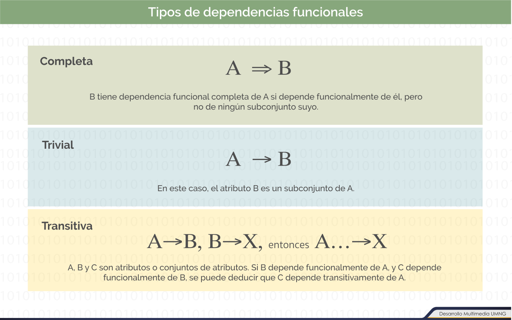
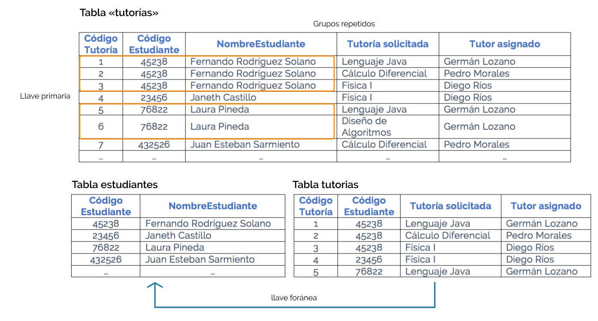
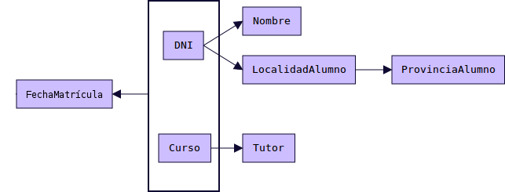
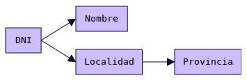
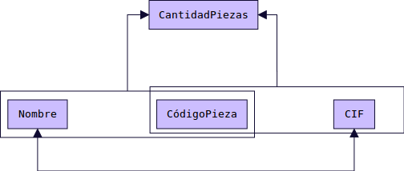
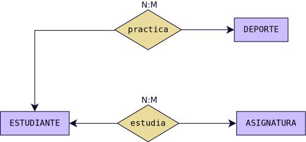
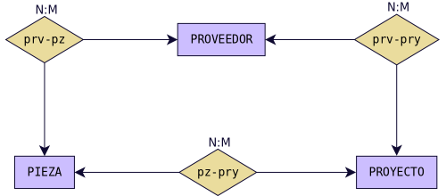

# NORMALIZACION

El diseño de una BD relacional se puede realizar aplicando al mundo real, en una primera fase, un modelo como el modelo E/R, a fin de obtener un esquema conceptual; en una segunda fase, se transforma dicho esquema al modelo relacional mediante las correspondientes reglas de transformación. También es posible, aunque quizás menos recomendable, obtener el esquema relacional sin realizar ese paso intermedio que es el esquema conceptual. En ambos casos, es conveniente (obligatorio en el modelo relacional directo) aplicar un conjunto de reglas, conocidas como __Teoría de normalización__, que nos permiten asegurar que un esquema relacional cumple unas ciertas propiedades, evitando:

- La __redundancia__ de los datos: repetición de datos en un sistema.
- __Anomalías de actualización__: inconsistencias de los datos como resultado de datos redundantes y actualizaciones parciales.
- __Anomalías de borrado__: pérdidas no intencionadas de datos debido a que se han borrado otros datos.
- __Anomalías de inserción__: imposibilidad de adicionar datos en la base de datos debido a la ausencia de otros datos.

En la práctica, _si la BD se ha diseñado haciendo uso de modelos semánticos como el modelo E/R_ __NO__ _suele ser necesaria la normalización_. Por otro lado __SI__ _nos proporcionan una base de datos creada sin realizar un diseño previo, es muy probable que necesitemos normalizar_.

En la teoría de bases de datos relacionales, _las formas normales_ __(FN)__ _proporcionan los criterios para determinar el grado de vulnerabilidad de una tabla a inconsistencias y anomalías lógicas. Cuanto más alta sea la forma normal aplicable a una tabla, menos vulnerable será a inconsistencias y anomalías_.
 > P.Examen: Esta afirmación es un posible pregunta de examen.

Edgar F. Codd definió originalmente las tres primeras formas normales __(1FN, 2FN, y 3FN) en 1970__. Estas formas normales se han resumido como requiriendo que todos los atributos sean atómicos, dependan de la clave completa y en forma directa (no transitiva). _La forma normal de_ __Boyce-Codd (FNBC)__ fue introducida en __1974__ por los dos autores que aparecen en su denominación. Las cuarta y quinta formas normales __(4FN y 5FN)__ _se ocupan específicamente de la representación de las relaciones muchos a muchos y uno a muchos entre los atributos y fueron introducidas por Fagin en 1977 y 1979 respectivamente_. __Cada forma normal incluye a las anteriores__.

 > P.Examen: Esta última afirmación es un posible pregunta de examen.

 

 
 
  

Antes de dar los conceptos de formas normales veamos unas definiciones previas:
- __Dependencia funcional__: _A → B_, representa que __B es funcionalmente dependiente de A__. _Para un valor de A siempre aparece un valor de B._
  > Ejemplo: Si A es el D.N.I., y B el Nombre, está claro que para un número de D.N.I, siempre aparece el mismo nombre de titular.

- __Dependencia funcional completa__: _A → B_, __si B depende de A en su totalidad__. _Tiene sentido plantearse este tipo de dependencia cuando A está compuesto por más de un atributo_.
  > Supongamos que A corresponde al atributo compuesto: D.N.I._Empleado + Cod._Dpto. y B es Nombre_Dpto. En este caso B depende del Cod_Dpto., pero no del D.N.I._Empleado. Por tanto no habría dependencia funcional completa.

- __Dependencia transitiva__: _A→B→C_. __Si A→B y B→C, Entonces decimos que C depende de forma transitiva de A__.       
  > Sea A el D.N.I. de un alumno, B la localidad en la que vive y C la provincia. Es un caso de dependencia transitiva A→ B → C.

- __Determinante funcional__: _todo atributo, o conjunto de ellos, de los que depende algún otro atributo_.

  > El D.N.I. es un determinante funcional pues atributos como nombre, dirección, localidad, etc, dependen de él.

- __Dependencia multivaluada__: _A→→B_. _Son un tipo de dependencias en las que un determinante funcional no implica un único valor, sino un conjunto de ellos_. __Un valor de A siempre implica varios valores de B.__
  > CursoBachillerato →→ Modalidad. Para primer curso siempre va a aparecer en el campo Modalidad uno de los siguientes valores: Ciencias, Humanidades/Ciencias Sociales o Artes. Igual para segundo curso.

  

  
  
  

## Primera Forma Normal: 1FN

Una Relación está en __1FN__ ___si y sólo si___ _cada atributo es atómico_.

### Ejemplo 1.

Supongamos que tenemos la siguiente tabla con datos de alumnado de un centro de enseñanza secundaria.

__Alumno__

DNI | Nombre | Curso | Fecha |	Tutor | Localidad | Provincia | Teléfono |
---|---|---|---|---|---|---|---|
11111111A | Eva | 1ESO-A | 01-Julio-2016 | Isabel | Écija | Sevilla | 660111222  |
22222222B | Ana | 1ESO-A | 09-Julio-2016 | Isabel | Écija | Sevilla | 660222333 660333444 660444555 |
33333333C | Susana | 1ESO-B | 11-Julio-2016 | Roberto | Écija | Sevilla |   |
44444444D | Juan | 2ESO-A | 05-Julio-2016 | Federico | El Villar | Córdoba |   |
55555555E | José | 2ESO-A | 02-Julio-2016 | Federico | El Villar | Córdoba | 661000111 661000222 |

Como se puede observar, esta tabla __NO__ está en __1FN__ puesto que el campo Teléfono contiene varios datos dentro de una misma celda y por tanto no es un campo cuyos valores sean atómicos. _La solución sería la siguiente_:

__Teléfono__

DNI | Número
---|---|
11111111A | 660111222 |
22222222B | 660222333 |
22222222B | 660333444 |
22222222B | 660444555 |
55555555E | 661000111 |
55555555E | 661000222 |

  > Pregunta:
  - ¿Cuál sería la clave primaria y por qué?
  - ¿Cuál sería la clave foránea y por qué?

### Ejemplo 2

Esta figura presenta una tabla con información sobre las tutorías solicitadas por un grupo de estudiantes. En este caso, las columnas __«tutoría solicitada»__ y __«tutor asignado»__ ___tienen múltiples valores___, así que una posible solución es ___AUMENTAR___ _el número de columnas_; sin embargo, se estarían estableciendo límites respecto del número de posibles tutorías a realizar.

Para dar cumplimiento a la premisa de valores atómicos para los campos y un crecimiento vertical, se debe incrementar el número de filas haciendo que las solicitudes de tutorías se consideren como nuevas filas de la tabla __«tutorías»__, tal como se refleja en el gráfico.

Continuando con el proceso de normalización, la 1FN también establece que se eliminen los grupos de datos repetidos. En el ejemplo que se está analizando, se observa que los datos de los estudiantes se estarían repitiendo por cada tutoría solicitada, por lo que para solucionar esta situación se procede con la recomendación de la primera forma normal que indica:

- Verificar que la tabla base posea un campo que permita identificar de forma única __(llave primaria)__ el registro de filas de la tabla.
- Crear una nueva tabla con el grupo de datos repetitivos, conservando en la tabla base un campo que permita establecer un vínculo con la nueva tabla. Este campo se convertirá en la llave foránea de la tabla.

En esta segunda figura se aprecia que _se extraen los datos repetitivos creando una nueva tabla denominada_ __«estudiantes»__, la cual debe tener su propia llave primaria, mientras que al conjunto de datos que permanece en la tabla «tutorías» se le deja un vínculo con el estudiante a través del «código estudiante» que se constituye en la llave foránea de esta tabla y establece la relación entre las dos tablas.

De esta forma se puede concluir que la tabla «tutorías» se encuentra en primera forma normal.

## Segunda Forma Normal: 2FN

Una Relación esta en __2FN si y sólo si está en 1FN__ y _todos los atributos que_ ___NO___ _forman parte de la_ __Clave Principal__ _tienen dependencia funcional completa de ella_.

__Alumno__

DNI | Nombre | Curso | FechaMatricula | Tutor | Localidad | Provincia
---|---|---|---|---|---|---|
11111111A | Eva | 1ESO-A | 01-Julio-2016 | Isabel | Écija | Sevilla |
22222222B | Ana | 1ESO-A | 09-Julio-2016 | Isabel | Écija | Sevilla |
33333333C | Susana | 1ESO-B | 11-Julio-2016 | Roberto | Écija | Sevilla |
44444444D | Juan | 2ESO-A | 05-Julio-2016 | Federico | El Villar | Córdoba |
55555555E | José | 2ESO-A | 02-Julio-2016 | Federico | El Villar | Córdoba |

Vamos a examinar las dependencias funcionales.
 El gráfico que las representa es el siguiente:

> Siempre que aparece un __DNI__ aparecerá el __Nombre__ correspondiente y la Localidad correspondiente. Por tanto __DNI → Nombre y DNI → Localidad__.
Por otro lado siempre que aparece un __Curso__ aparecerá el __Tutor__ correspondiente. Por tanto __Curso → Tutor__. Los atributos __Nombre y Localidad__ no dependen funcionalmente de __Curso__, y el atributo __Tutor__ no depende funcionalmente de __DNI__.
El único atributo que sí depende de forma completa de la clave compuesta DNI y Curso es __FechaMatrícula__: __(DNI,Curso) → FechaMatrícula__.
A la hora de establecer la __Clave Primaria__ de una tabla debemos escoger un atributo o conjunto de ellos de los que dependan funcionalmente el resto de atributos. Además debe ser una dependencia funcional completa. Si escogemos __DNI__ como __clave primaria__, tenemos un atributo __(Tutor)__ que no depende funcionalmente de él. Si escogemos __Curso__ como __clave primaria__, tenemos otros atributos que no dependen de él.
Si escogemos la combinación __(DNI, Curso)__ como __clave primaria, entonces sí tenemos todo el resto de atributos con dependencia funcional respecto a esta clave. Pero es una dependencia parcial, no total (salvo __FechaMatrícula__, donde sí existe dependencia completa). Por tanto esta tabla no está en __2FN__. La solución sería la siguiente:

__Alumno__

DNI | Nombre | Localidad | Provincia
---|---|---|---|
11111111A | Eva | Écija | Sevilla
22222222B | Ana | Écija | Sevilla
33333333C | Susana | El Villar | Córdoba
44444444D | Juan | El Villar | Córdoba
55555555E | José | Écija | Sevilla

__Matrícula__

DNI | Curso | Fecha
---|---|---|
11111111A | 1ESO-A | 01-Julio-2016
22222222B | 1ESO-A | 09-Julio-2016
33333333C | 1ESO-B | 11-Julio-2016
44444444D | 2ESO-A | 05-Julio-2016
55555555E | 2ESO-A | 02-Julio-2016

__Curso__

Identificador | Tutor
---|---|
1ESO-A | Isabel
1ESO-B | Roberto
2ESO-A | Federico

### Tercera Forma Normal: 3FN
Una Relación esta en __3FN__ ___si y sólo si está en 2FN y no existen dependencias transitivas___. Todas las dependencias funcionales deben ser respecto a la clave principal.

__Alumno__

DNI | Nombre | Localidad | Provincia
---|---|---|---|
11111111A | Eva | Écija | Sevilla
22222222B | Ana | Écija | Sevilla
33333333C | Susana | El Villar | Córdoba
44444444D | Juan | El Villar | Córdoba
55555555E | José | Écija | Sevilla

Las dependencias funcionales existentes son las siguientes. Como podemos observar existe una dependencia funcional transitiva: __DNI → Localidad → Provincia__.

Para que la tabla esté en __3FN__, no pueden existir dependencias funcionales transitivas. Para solucionar el problema deberemos crear una nueva tabla. El resultado es:

__Alumno__

DNI | Nombre | Localidad
---|---|---|
11111111A | Eva | Écija
22222222B | Ana | Écija
33333333C | Susana | El Villar
44444444D | Juan | El Villar
55555555E | José | Écija

__Localidad__

Identificador | Provincia
---|---|
Écija | Sevilla
El Villar | Córdoba

__Teléfono__

DNI | Número
---|---|
11111111A | 660111222
22222222B | 660222333
22222222B | 660333444
22222222B | 660444555
55555555E | 661000111
55555555E | 661000222

__Matrícula__

DNI | Curso | Fecha
---|---|---|
11111111A | 1ESO-A | 01-Julio-2016
22222222B | 1ESO-A | 09-Julio-2016
33333333C | 1ESO-B | 11-Julio-2016
44444444D | 2ESO-A | 05-Julio-2016
55555555E | 2ESO-A | 02-Julio-2016

__Curso__

Identificador | Tutor
---|---|
1ESO-A | Isabel
1ESO-B | Roberto
2ESO-A | Federico

> Pregunta:
- ¿Cuál sería la clave primaria de cada una de las tablas y por qué?
- ¿Cuál sería la clave foránea de cada una de las tablas y por qué?

### Forma Normal de Boyce-Codd: FNBC

Una Relación esta en __FNBC__ ___si está en 3FN y no existe solapamiento de claves candidatas___. Solamente hemos de tener en cuenta esta forma normal cuando tenemos varias claves candidatas compuestas y existe solapamiento entre ellas. Pocas veces se da este caso.

#### Ejemplo 1

Tenemos una tabla con información de proveedores, códigos de piezas y cantidades de esa pieza que proporcionan los proveedores. Cada proveedor tiene un nombre único. Los datos son:

__Suministro__

CIF | Nombre | CódigoPieza | CantidadPiezas
---|---|---|---|
S-11111111A | Ferroman | 1 | 10
B-22222222B | Ferrotex | 1 | 7
M-33333333C | Ferropet | 3 | 4
S-11111111A | Ferroman | 2 | 20
S-11111111A | Ferroman | 3 | 15
B-22222222B | Ferrotex | 2 | 8

El gráfico de dependencias funcionales es el siguiente:

El atributo __CantidadPiezas__ tiene dependencia funcional de dos claves candidatas compuestas, que son:
- (NombreProveedor, CodigoPieza)
- (CIFProveedor, CódigoPieza)

Existe también una dependencia funcional en doble sentido (que no nos afecta): __NombreProveedor <-> CIFProveedor__.

Para esta tabla existe un __solapamiento de 2 claves candidatas compuestas__. Para evitar el __solapamiento de claves candidatas dividimos la tablas__. La solución es:

__Proveedor__

CIF | Nombre
---|---|
S-11111111A | Ferroman
B-22222222B | Ferrotex
M-33333333C | Ferropet

__Suministro__

CIF | CódigoPieza | CantidadPiezas
---|---|---|
S-11111111A | 1 | 10
B-22222222B | 1 | 7
M-33333333C | 3 | 4
S-11111111A | 2 | 20
S-11111111A | 3 | 15
B-22222222B | 2 | 8
B-22222222B | 3 | 4

## Cuarta Forma Normal: 4FN

Una Relación esta en __4FN__ ___si y sólo si está en 3FN (o FNBC) y las únicas dependencias multivaluadas son aquellas que dependen de las claves candidatas___.

### Ejemplo

Tenemos una tabla con la información de nuestros alumnos y alumnas y las asignaturas que cursan así como los deportes que practican.

__Alumnado__

Estudiante | Asignatura | Deporte
---|---|---|
11111111A | Matemáticas, Lengua | Baloncesto
22222222B | Matemáticas | Fútbol, Natación

__Alumnado__

Estudiante | Asignatura | Deporte
---|---|---|
11111111A | Matemáticas | Natación
11111111A | Matemáticas | Baloncesto
11111111A | Lengua | Natación
11111111A | Lengua | Baloncesto
22222222B | Matemáticas | Fútbol
22222222B | Matemáticas | Natación

Para normalizar esta tabla, debemos darnos cuenta que la oferta de asignaturas está compuesta por un conjunto de valores limitado. Igual sucede con los deportes. Por tanto existen dos dependencias multivaluadas:
- __Estudiante →→ Asignatura__.
- __Estudiante →→ Deporte__.

Por otro lado no existe ninguna dependencia entre la asignatura cursada y el deporte practicado. Para normalizar a 4FN creamos 2 tablas:

__EstudiaAsignatura__

Estudiante | Asignatura
---|---|
11111111A | Matemáticas
11111111A | Lengua
22222222B | Matemáticas

__PracticaDeporte__

Estudiante | Deporte
---|---|
11111111A | Natación
11111111A | Baloncesto
22222222B | Fútbol
22222222B | Natación

Diagrama E/R equivalente

## Quinta Forma Normal: 5FN

La quinta forma normal (5FN), es una generalización de la anterior. También conocida como forma normal de proyección-unión (PJ/NF). Una tabla se dice que está en __5NF__ ___si y sólo si está en 4NF y cada dependencia de unión (join) en ella es implicada por las claves candidatas___.

### Ejemplo
Tenemos una tabla con varios proveedores que nos proporcionan piezas para distintos proyectos. Asumimos que un Proveedor suministra ciertas Piezas en particular, un Proyecto usa ciertas Piezas, y un Proyecto es suplido por ciertos Proveedores, entonces tenemos las siguientes dependencias multivaluadas:
- __Proveedor →→ Pieza__.
- __Pieza →→ Proyecto__.
- __Proyecto →→ Proveedor__.

Se puede observar como se produce un ciclo:
__Proveedor →→ Pieza →→ Proyecto →→ Proveedor__.

__Suministro__

Proveedor | Pieza | Proyecto
---|---|---|
E1, E4, E6 | PI3, PI6 | PR2, PR4
E2, E5 | PI1, PI2 | PR1, PR3
E3, E7 | PI4, PI5 | PR5, PR6

__Suministro__

Proveedor | Pieza | Proyecto
---|---|---|
E1 | PI3 | PR2
E1 | PI3 | PR4
E1 | PI6 | PR2
E1 | PI6 | PR4
E4 | PI3 | PR2
E4 | PI3 | PR4
E4 | PI6 | PR2
E4 | PI6 | PR4
E6 | PI3 | PR2
E6 | PI3 | PR4
E6 | PI6 | PR2
E6 | PI6 | PR4
E2 | PI1 | PR1
E2 | PI1 | PR3
E2 | PI2 | PR1
E2 | PI2 | PR3
E5 | PI1 | PR1
E5 | PI1 | PR3
E5 | PI2 | PR1
E5 | PI2 | PR3
E3 | PI4 | PR5
E3 | PI4 | PR6
E3 | PI5 | PR5
E3 | PI5 | PR6
E7 | PI4 | PR5
E7 | PI4 | PR6
E7 | PI5 | PR5
E7 | PI5 | PR6

Descomponemos la tabla en 3 tabla nuevas: __Proveedor-Pieza, Pieza-Proyecto, Proyecto-Proveedor__.

__Proveedor-Pieza__

Proveedor | Pieza
---|---|
E1 | PI3
E1 | PI6
E4 | PI3
E4 | PI6
E6 | PI3
E6 | PI6
E2 | PI1
E2 | PI2
E5 | PI1
E5 | PI2
E3 | PI4
E3 | PI5
E7 | PI4
E7 | PI5

__Pieza-Proyecto__

Pieza | Proyecto
---|---|
PI3 | PR2
PI3 | PR4
PI6 | PR2
PI6 | PR4
PI1 | PR1
PI1 | PR3
PI2 | PR1
PI2 | PR3
PI4 | PR5
PI4 | PR6
PI5 | PR5
PI5 | PR6

__Proyecto-Proveedor__

Proyecto | Proveedor
---|---|
PR2 | E1
PR4 | E1
PR2 | E4
PR4 | E4
PR2 | E6
PR4 | E6
PR1 | E2
PR3 | E2
PR1 | E5
PR3 | E5
PR5 | E3
PR6 | E3
PR5 | E7
PR6 | E7

El producto natural de estas 3 tablas nos da la tabla original. __Proveedor-Pieza |x| Pieza-Proyecto |x| Proyecto-Proveedor = Suministro__.

Diagrama E/R equivalente:

