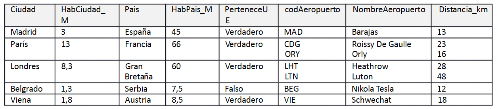
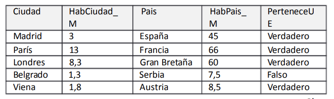
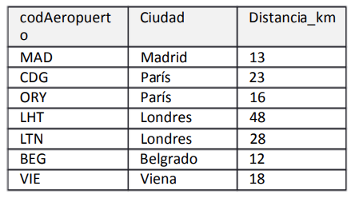
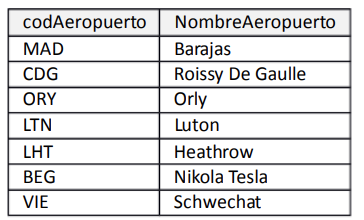

# Gestión de Aeropuertos 

Se ha creado una base de datos con los datos de ciudades y sus aeropuertos. Los campos y los tipos de datos son los que se indican a continuación:
- Ciudad: Nombre de la ciudad (único).
- HabCiudad_M: número de habitantes de la ciudad en millones. 
- País: País en el que se encuentra la ciudad.
- HabPais_M: Número de habitantes del país en millones.
- PerteneceUE: campo booleano. TRUE si el país Pertenece a la Unión Europea; FALSE, no pertenece a la Unión Europea. 
- codigoAeropuerto: único.
- NombreAeropuerto: único.
- Distancia_km: distancia del aeropuerto a la ciudad en km.

La representación de la información dentro de la BBDD es la siguiente:

 
 

Se pide:
1. Indicar claves candidatas.
2. Comprobar si se cumple la 1ª Forma Normal.
3. Normalizar si no se cumple el apartado 2.
4. Determinantes sobre las tablas resultado del apartado 3.
5. Indicar claves candidatas de todas las tablas resultantes.

  

      
SOLUCIÓN

   

  1. Indicar claves candidatas.
  Las claves candidatas son las siguientes:
  - __Cuidad, CodAeropuerto__.
  - __Cuidad, NombreAeropuerto__.
  2.Comprobar si se cumple la 1ª Forma Normal.
  No cumple la 1FN dado que tiene __valores multivaluados__. Los campos __CodAeropuerto, NombreAeropuerto y distancia_km__ no son atómicos.
  3.Normalizar si no se cumple el apartado 2.
  Vamos a ver como se relacionan los campos:
    - La relación es de tipo __N:N__ _si suponemos que una ciudad puede tener varios aeropuertos y que un aeropuerto puede serlo de varias ciudades_.

  
  
  
  __ciudad__

  
  

__ciudada_aeropuerto__  
  

__aeropuerto__  
  

  
  4.Determinantes sobre las tablas resultado del apartado 3.
  Se crean nuevas tablas reordenando los campos que los componen. Ver imágenes anteriores. 

  5.Indicar claves candidatas de todas las tablas resultantes.
  - ciudad: ciudad. Aunque la columna debe de llamarse "nombre", y evitar la redundancia entre tabla y nombre.
  - aeropuerto: codAeropuerto. Aunque la columna debe de llamarse código.
  - ciudada_aeropuero: codAeropuerto y ciudada.

__P.D.__: Recuerda la relación que se crea es __N:M__, aunque también podría ser __1:N__ siendo el resultado diferente. 

 
