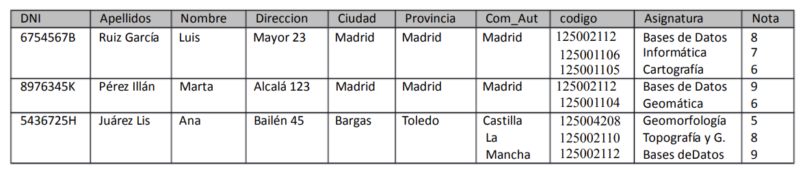
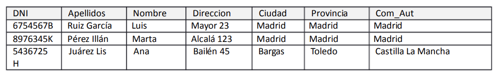
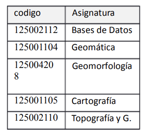

# Gestión Escuela de Topografía de Madrid

Se ha creado una base de datos para llevar las calificaciones de las asignaturas de los alumnos de primer curso de la Escuela de Topografía de Madrid.
La tabla creada tiene los siguientes campos
- DNI varchar (20).
- Apellidos varchar (255).
- Nombre varchar (50).
- Direccion varchar (255).
- Ciudad varchar (50).
- Provincia varchar (50).
- Comunidad varchar (50).
- Codigo integer.
- Asignatura varchar(50).
- Nota double.

Además la información que se aporta es:
- DNI es un identificador único del alumno; lo mismo que {Apellidos, Nombre}.
- Ciudad es el nombre de la ciudad de residencia (único)
- Provincia es el nombre de la provincia de residencia (único)
- Com_Aut es el nombre de la Comunidad Autónoma de residencia (único)
- Codigo es el código de una asignatura (único). Asignatura es el nombre de la asignatura (único)
- Asignatura es el nombre de la asignatura (único)
- Nota es la nota que el alumno ha obtenido en la asignatura
- Codigo, Asignatura y Nota se escriben en el mismo orden en los campos correspondientes

Ejemplo de datos de la tabla:

 
 

Se pide:
1. Indicar claves candidatas.
2. Comprobar si se cumple la 1ª Forma Normal.
3. Normalizar si no se cumple el apartado 2.
4. Determinantes sobre las tablas resultado del apartado 3.
5. Indicar claves candidatas de todas las tablas resultantes.

  

      
SOLUCIÓN

   

  1. Indicar claves candidatas
  Es una tabla que relaciona alumnos y asignaturas.Claves candidatas
  - DNI, Asignatura. 
  - Apellidos, Nombre, Asignatura.
  - DNI, Codigo.
  - Apellidos, Nombre, Codigo.
  2.Comprobar si se cumple la 1ª Forma Normal.
    No cumple la primera forma normal porque los campos __Código, Asignatura y Nota__ no son atómicos.
  3.Normalizar si no se cumple el apartado 2.

__Alumno__

 
 

 

 __Alumno-Asignatura__

 
 

 

__Asignatura__

 
 

  4.Determinantes sobre las tablas resultado del apartado 3.
  Se relacionan los campos según se indica en la imagén anterior.
  5.Indicar claves candidatas de todas las tablas resultantes.
  - Alumno: dni.
  - Asignatura: código.
  - Alumno-Asignatura: dni,código.

  

      
PULSA PARA VER LA SOLUCIÓN

   

 

 
