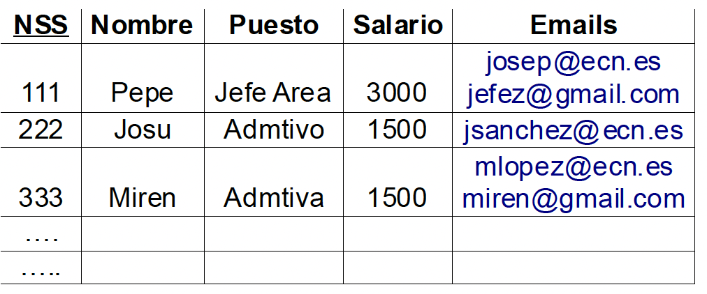
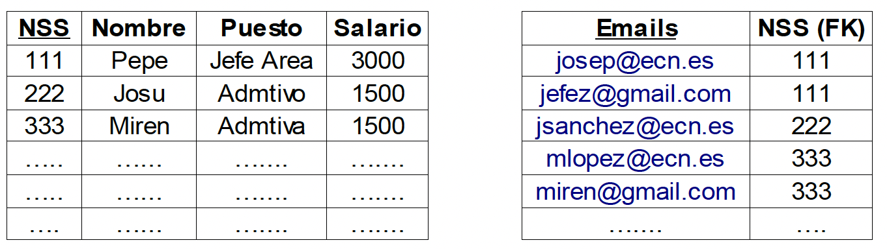
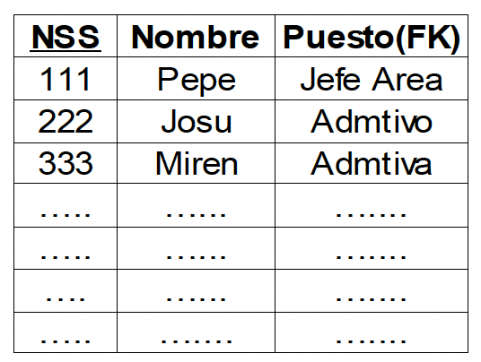
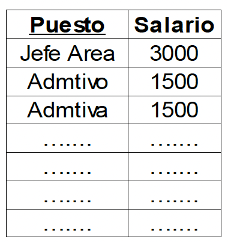

# Gestión de INEM

Tenemos una empresa publica donde los puestos de trabajo, están regulados por el estado, de modo que las condiciones salariales están determinadas por el puesto de trabajo, se ha creado el siguiente esquema relacional:
(con el ___número de la seguridad social NSS como clave primaria__)
La representación de la información dentro de la BBDD es la siguiente:

__Empleados (NSS, Nombre, puesto, salario, emails)__

 
 

Se pide:
1. Indicar claves candidatas.
2. Comprobar si se cumple la 1ª Forma Normal.
3. Normalizar si no se cumple el apartado 2.
4. Comprobar si se cumple la 2ª Forma Normal.
5. Normalizar si no se cumple el apartado 4.
6. Comprobar si se cumple la 3ª Forma Normal.
7. Normalizar si no se cumple el apartado 5.
8. Indicar claves candidatas de todas las tablas resultantes.
9. Genera el __diagrama E/R resultante__.

<!--
  

      
SOLUCIÓN

   

1. Indicar claves candidatas.
Las claves candidatas serán:
- NSS.
- Emails.

2. Comprobar si se cumple la 1ª Forma Normal.
Una tabla está en 1FN si sus atributos contienen valores atómicos. En el ejemplo, podemos ver que el atributo __emails__ puede contener __más de un valor__, por lo que __viola 1FN__.

3. Normalizar si no se cumple el apartado 2.
Crear una nueva relación, es decir, una relación con una clave ajena (__FK__) referenciando a la clave primaria(__PK__), junto al atributo si existiera. Dicho de otra forma creamos una relación __1:N__.
Quedando como:

  

4. Comprobar si se cumple la 2ª Forma Normal.
Un esquema está en 2FN si:
 - Está en 1FN.
 - Todos sus atributos que no son de la clave principal tienen dependencia funcional completa respecto de todas las claves existentes en el esquema. En otras palabras, para determinar cada atributo no clave se necesita la clave primaria completa, no vale con una subclave.

La 2FN se aplica a las relaciones que tienen claves primarias compuestas por dos o más atributos. Si una relación está en 1FN y su clave primaria es simple (tiene un solo atributo), entonces también está en 2FN. Por tanto, la solución anterior, la tabla EMPLEADOS está en 1FN (y la tabla EMAILS no tiene atributos no clave), por lo que el esquema está en 2FN. Sin embargo, tenemos que examinar las dependencias funcionales de los __atributos no clave de EMPLEADO__. Las dependencias funcionales que tenemos son las siguientes:
 - nss->nombre, salario, email (__1FN__)
 - puesto->salario
___Como la clave es (nss, email), las dependencias de nombre, salario y email son incompletas, por lo que la relación no está en 2FN___.

En general, tendremos que observar los atributos no clave que dependan de parte de la clave.

Para solucionar este problema, tenemos que hacer lo siguiente para los grupos de atributos con dependencia incompleta.

Siguiendo el ejemplo anterior, crearíamos una nueva relación con los atributos que tienen dependencia incompleta:
 - Salario

5. Normalizar si no se cumple el apartado 4.

El resultado que tendremos será el siguiente:

 

__Empleado__

 

__Salario__

6. Comprobar si se cumple la 3ª Forma Normal.

Una relación está en tercera forma normal si, y sólo si:
    - está en 2FN y, además, cada atributo que no está incluido en la clave primaria no depende transitivamente de la clave primaria.

Por lo tanto, a partir de un esquema en 2FN, tenemos que buscar dependencias funcionales entre atributos que no estén en la clave.

    > ¿Se encuentra en 3FN?

7. Normalizar si no se cumple el apartado 5.
8. Indicar claves candidatas de todas las tablas resultantes.
9. Genera el __diagrama E/R resultante__.
 

  
-->

 
