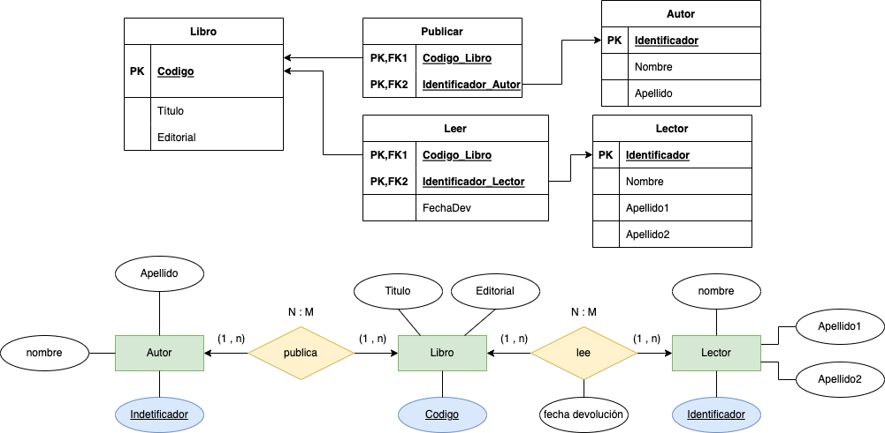

# Biblioteca

Tenemos una __biblioteca__ que tiene como objetivo la gestión de la información de sus libros y lectores.

La representación de la información dentro de la BBDD es la siguiente:

| CodLibro | Titulo| Autor |Editorial | NombreLector| FechaDev | 
|-----|-----|-----|-----|-----|-----| 
| 1001 | Variable compleja  |  Murray Spiegel  | McGraw Hill |Pérez Gómez, Juan |15/04/2022 |
|1004 | Visual Basic 5 | E. Petroustsos | Anaya | Ríos Terán, Ana | 17/04/2022  | 
| 1005 | Estadística | Murray Spiegel | McGraw Hill | Roca, René | 16/04/2022  | 
| 1006  | Oracle University | Nancy Greenberg y Priya Nathan | Oracle Corp. | García Roque, Luis | 20/04/2022 | 
| 1007 | Clipper 5.01 | Ramalho | McGraw Hill | Pérez Gómez, Juan | 18/04/2022 |

Se pide:

1. Comprobar si se cumple la 1ª Forma Normal.
2. Normalizar si no se cumple el apartado 2.
3. Comprobar si se cumple la 2ª Forma Normal.
4. Normalizar si no se cumple el apartado 4.
5. Comprobar si se cumple la 3ª Forma Normal.
6. Normalizar si no se cumple el apartado 5.
7. Indicar claves de todas las tablas resultantes.
9. Genera el __diagrama E/R resultante__.

      
SOLUCIÓN

   
    
    > Nota: Hemos de tener en cuenta las definición de las tres formas normales:
 1. Una tabla está en _1FN si y sólo si_ ___cada atributo es atómico___.
 2. Una tabla esta en _2FN si y sólo si está en 1FN y_ ___todos los atributos tienen dependencia funcional completa de la Clave Principal___.
 3.  Una tabla esta en _3FN si y sólo si está en 2FN_ y ___no existen dependencias transitivas___.

Dicho esto, vamos a contestar a cada una de las preguntas:
 1. Comprobar si se cumple la 1ª Forma Normal.
  __No cumple__, ya que los valores no son atómicos. El campo __autor__ tiene el una uno a más autores en una misma __tupla/fila__. _Es decir, autor es un valor multivaluado_ __(Nancy Greenberg y Priya Nathan)__.

 2. Normalizar si no se cumple el apartado 1.

| CodLibro | Titulo| Autor |Editorial | NombreLector| FechaDev | 
|-----|-----|-----|-----|-----|-----| 
| 1001 | Variable compleja  |  Murray Spiegel  | McGraw Hill |Pérez Gómez, Juan |15/04/2022 |
|1004 | Visual Basic 5 | E. Petroustsos | Anaya | Ríos Terán, Ana | 17/04/2022  | 
| 1005 | Estadística | Murray Spiegel | McGraw Hill | Roca, René | 16/04/2022  | 
| 1006  | Oracle University | Priya Nathan | Oracle Corp. | García Roque, Luis | 20/04/2022 |
| 1006  | Oracle University | Nancy Greenberg  | Oracle Corp. | García Roque, Luis | 20/04/2022 |  
| 1007 | Clipper 5.01 | Ramalho | McGraw Hill | Pérez Gómez, Juan | 18/04/2022 |

Como podemos observar existe ___redundancia en la base de datos___, y sigue sin cumplir la __1FN__, ya que no todos los valores son atómicos. Por ejemplo, observa el valor __NombreLector__, _¿es atómico?_, la respuesta es que no, con lo cual hemos de transformarlo, un elemplo será _(Ríos Terán, Ana)_.

| CodLibro | Titulo| Autor |Editorial | Apellido1Lector | Apellido2Lector | NombreLector | FechaDev | 
|-----|-----|-----|-----|-----|-----|-----|-----|  
| 1001 | Variable compleja  |  Murray Spiegel  | McGraw Hill | Pérez  |Gómez | Juan | 15/04/2022 |
|1004 | Visual Basic 5 | E. Petroustsos | Anaya | Ríos | Terán |Ana | 17/04/2022  | 
| 1005 | Estadística | Murray Spiegel | McGraw Hill | Roca | | René | 16/04/2022  | 
| 1006  | Oracle University | Priya Nathan | Oracle Corp. | García | Roque | Luis | 20/04/2022 |
| 1006  | Oracle University | Nancy Greenberg  | Oracle Corp. | García | Roque | Luis | 20/04/2022 |  
| 1007 | Clipper 5.01 | Ramalho | McGraw Hill | Pérez | Gómez | Juan | 18/04/2022 |

_Como podemos observar, existe reduncia en la información_. Yo siempre soy de la opinión de sacar de la tabla los valores que son multievaluados, en este caso como podemos observar el __Autor__.

| Autor |
|-----| 
|  Murray Spiegel | 
| E. Petroustsos |
| Murray Spiegel |
| Priya Nathan |
| Nancy Greenberg  |
| Ramalho |

| Autor |
|-----| 
|  Murray Spiegel | 
| E. Petroustsos |
| Murray Spiegel |
| Priya Nathan |
| Nancy Greenberg  |
| Ramalho |

Transformando esta tabla quedará de la siguiente manera:

| __Autor__ |  
| Identificador __(PK)__ | Nombre | Apellido |
|-----|-----|-----|  
| 001 | Murray | Spiegel | 
| 002 | E. | Petroustsos |
| 003 | Murray | Spiegel |
| 004 | Priya | Nathan |
| 005 | Nancy | Greenberg  |
| 006 | Ramalho |

Como podemos observar, la tabla cumple la __1FN__ y hemos incorporado una __clave primaria (PK)__, identificador, dado que __NO__ existía ninguna columna que fuera _clave candidata_.

| CodLibro | Titulo| Editorial | Apellido1Lector | Apellido2Lector | NombreLector | FechaDev | 
|-----|-----|-----|-----|-----|-----|-----| 
| 1001 | Variable compleja  | McGraw Hill | Pérez  |Gómez | Juan | 15/04/2022 |
| 1004 | Visual Basic 5 | Anaya | Ríos | Terán |Ana | 17/04/2022  | 
| 1005 | Estadística | McGraw Hill | Roca | | René | 16/04/2022  | 
| 1006 | Oracle University | Oracle Corp. | García | Roque | Luis | 20/04/2022 |
| 1006 | Oracle University | Oracle Corp. | García | Roque | Luis | 20/04/2022 |  
| 1007 | Clipper 5.01 | Ramalho | Pérez | Gómez | Juan | 18/04/2022 |

3. Comprobar si se cumple la 2ª Forma Normal.

La __Segunda Forma Normal (2NF)__ pide que no existan dependencias parciales o dicho de otra manera, todos los atributos no clave deben depender por completo de la clave primaria. Actualmente en nuestra tabla tenemos varias dependencias parciales si consideramos como atributo clave el código del libro.

4. Normalizar si no se cumple el apartado 4.
   
Por ejemplo, el _título es completamente identificado por el código del libro_, pero __el lector en realidad no tiene dependencia de este código__, por tanto estos datos deben ser trasladados a otra tabla.

| Identificador | Apellido1 | Apellido2| Nombre |
|-----|-----|-----|-----|  
| 001 | Pérez  |Gómez | Juan | 
| 002 | Anaya | Ríos | Terán |Ana |
| 003 | Roca | | René | 
| 004 | García | Roque | Luis |
| 005 | García | Roque | Luis |
| 006 | Pérez| Gómez | Juan | 
    
_Como vemos la fila_ __004, y 005__, _se encuentran repetidas, con lo cual se elimina, quedando_:

__Lector__

| __Identificador (PK)__ | Apellido1 | Apellido2| Nombre |
|-----|-----|-----|-----|  
| 001 | Pérez  |Gómez | Juan | 
| 002 | Anaya | Ríos | Terán |Ana |
| 003 | Roca | | René | 
| 004 | García | Roque | Luis |
| 005 | Pérez| Gómez | Juan | 

Además se ha incluido la clave primaria __identificador__ dado que no existía ninguna columna que pudiera ser candidata a clave.

La tabla Libro quedará ahora:

__Libro__

| Codigo | Titulo| Editorial  | FechaDev | 
|-----|-----|-----|-----|
| 1001 | Variable compleja | McGraw Hill | 15/04/2022 |
| 1002 | Visual Basic 5 | Anaya | 17/04/2022  | 
| 1003 | Estadística | McGraw Hill | 16/04/2022  | 
| 1004  | Oracle University | Oracle Corp. | 20/04/2022 |
| 1005 | Clipper 5.01 | Ramalho | 18/04/2022 |

 5. Comprobar si se cumple la 3ª Forma Normal.
    La tabla esta en __2FN__, y además no existe transitividad entre las columnas de cada una de las tablas. __Cumple la 3FN__.
 6. Normalizar si no se cumple el apartado 5.
    No es necesario realizar este paso.
 7. Indicar claves de todas las tablas resultantes.
 9. Genera el __diagrama E/R resultante__.
Realizando el __diagrama E/R__, nos daremos cuenta que necesitamos crear nuevas tablas para evitar la perdida de información. Esta información estará en las relaciones y la cardinalidad de estas.
- Un __autor__ _publica_ __libro__. Esta relación será __N:M__, dado que un autor publicas __más de un__ libro, y como hemos visto __un libro__, puede ser publicado por __más de un autor__.
- Un __libro__ _es leido_ por __lector__. Esta relación también será __N:M__, dado que un libro puede ser leido por más de un lector, y este leer más de un libro. Además esta relación contendrá la __fecha de devolución__.

   

        
    
  

Como podemos observar, se generan 5 tablas con sus respectivas claves.

 > NOTA: __La 2FN dependerá en gran medida de lo que haga en la 1FN__.
 __Una solución aun más optima de cara al mantenimiento futuro, sería sacar editorial, y tener una relación edita, con una cardinalidad 1:N__. 

