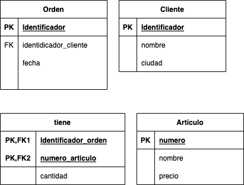
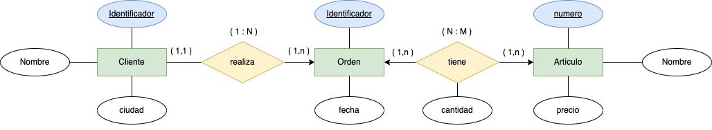
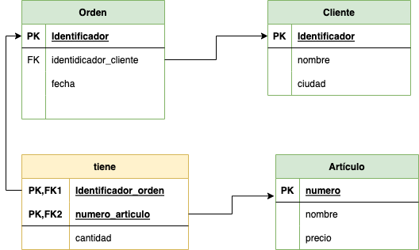

# Pedidos

Tenemos una empresa de __pedidos__ que tiene como objetivo la gestión de la información de sus compras.

La representación de la información dentro de la BBDD es la siguiente:

__orden (id_orden, fecha, id_cliente, nom_cliente, ciudad, num_art,
nom_art, cant, precio)__

__(Tabla) Orden__

| Id_orden |  Fecha |  Id_cliente |  Nom_cliente |  Ciudad |  Num_art |  nom_art |  cant |  Precio |
|-----|-----|-----|-----|-----|-----|-----|-----|-----| 
| 2301 |  23/11/22 |  101 |  Martin |  S/C Tenerife |  3786 |  Red |  3 |  35,00 |
| 2301 |  23/11/22 |  101 |  Martin |  S/C Tenerife |  4011 |  Raqueta |  6 |  65,00 |
| 2301 |  23/11/22 |  101 |  Martin |  S/C Tenerife |  9132 |  Paq-3 |  8 |  4,75 |
| 2302 |  25/11/22 |  107 |  Herman |  Las Palmas de Gran Canaria |  5794 |  Paq-6 |  4 |  5,00 |
| 2303 |  27/11/22 |  110 |  Pedro |  San Cristobal de la Laguna |  4011 |  Raqueta |  2 |  65,00 |
| 2303 |  27/11/22 |  110 |  Pedro |  San Cristobal de la Laguna |  3141 |  Funda |  2 |  10,00 |

Se pide:

1. Comprobar si se cumple la 1ª Forma Normal.
2. Normalizar si no se cumple el apartado 2.
3. Comprobar si se cumple la 2ª Forma Normal.
4. Normalizar si no se cumple el apartado 4.
5. Comprobar si se cumple la 3ª Forma Normal.
6. Normalizar si no se cumple el apartado 5.
7. Indicar claves de todas las tablas resultantes.
9. Genera el __diagrama E/R resultante__.

  

      
SOLUCIÓN

   
    
    >> Nota: Hemos de tener en cuenta las definición de las tres formas normales:
 1. Una tabla está en _1FN si y sólo si_ ___cada atributo es atómico___.
 2. Una tabla esta en _2FN si y sólo si está en 1FN y_ ___todos los atributos tienen dependencia funcional completa de la Clave Principal___.
 3.  Una tabla esta en _3FN si y sólo si está en 2FN_ y ___no existen dependencias transitivas___.

Dicho esto, vamos a contestar a cada una de las preguntas:
 1. Comprobar si se cumple la 1ª Forma Normal.
  __No cumple__, ya que los valores no son atómicos. El campo __id_orden__ tiene el mismo valor en diferentes tuplas.
 2. Normalizar si no se cumple el apartado 2.
    Hemos de separar en tablas para que sus __valores sean atómicos__.
    
    

        
    

 3. Comprobar si se cumple la 2ª Forma Normal.
    Esta en __1FN__, y además, todos los atributos de las tablas tienen dependencia funcional completa con su respectivas claves primarias (__PK__). Con lo cual __cumple la 2FN__.
 4. Normalizar si no se cumple el apartado 4.
    No es necesario realizar el paso 3.
 5. Comprobar si se cumple la 3ª Forma Normal.
    La tabla esta en __2FN__, y además no existe transitividad entre las columnas de cada una de las tablas. __Cumple la 3FN__.
 6. Normalizar si no se cumple el apartado 5.
    No es necesario realizar este paso.
 7. Indicar claves de todas las tablas resultantes.
 9. Genera el __diagrama E/R resultante__.

 

        
    

   

        
    
  

    > Nota: Imaginemos que en la primera pregunta, respondemos que la tabla se encuentra normalizada en 1FN.

La pregunta sería: ¿Se cumple la 2FN?
 La respuesta es que no, y debemos de sacar todas las columnas que no se encuentran asociadas con la __clave principal__. 
 La solución parcial indicaría sería similar al resultado final. No obstante, cuando transformamos a MR y ER, nos daremos cuenta que debemos de realizar una nueva tabla (N:M), con su propiedad y quedando la solución como la que se muestra.

  
