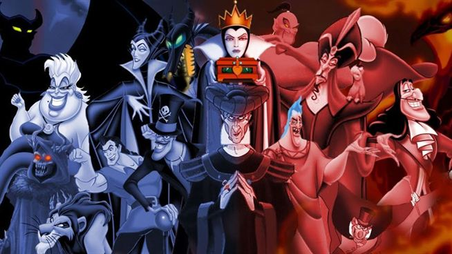
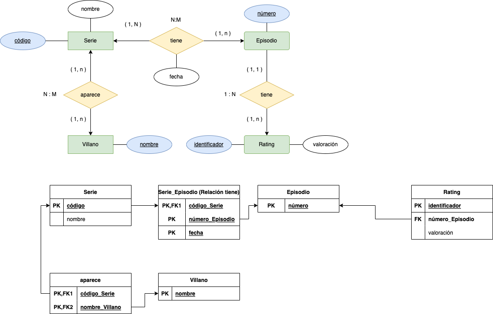

# Villanos

Tenemos una empresa dedicada al mundo de las __series__ que tiene como objetivo la gestión de la información de estas.

La representación de la información dentro de la BBDD es la siguiente:

|Código | Episodio | Nombre Serie | Villanos | Fecha Estreno | Ratings | 
|-----|-----|-----|-----|-----|-----|
|100 | 01 | Batman | Gatubela,Doomsday |  2014 | 5.9,8.1,4.3 |
|100 | 02 | Batman | Gatubela,Doomsday |  2014 | 7.1,9,3.5 |
|100 | 03 | Batman | Gatubela,Doomsday |  2014 | 5.9,8.1,4.3 | 
|200 | 01 | Batman | Gatubela,Doomsday |  2015 | 3.5,7.8,7.1 | 
|200 | 02 | Batman | Gatubela,Doomsday |  2015 | 7.8,7.1 | 
|300 | 01 | Superman | Doomsday,LexLuthor |  2013 | 5.9,8.1,4.3 | 
|300 | 02 | Superman | Doomsday,LexLuthor |  2014 | 3.5,7.8,7.1 | 
|300 | 03 | Superman | Doomsday,LexLuthor |  2015 | 4.5 | 
|300 | 04 | Superman | Doomsday,LexLuthor |  2015 | 5.9,4.3 | 
|400 | 01 | El Capitán América | LexLuthor,Gatubela |  2013 | 4.3,9 | 
|400 | 02 | El Capitán América | LexLuthor,Gatubela |  2014 | 9.5,4.3,6.7 | 

Se pide:

1. Comprobar si se cumple la 1ª Forma Normal.
2. Normalizar si no se cumple el apartado 2.
3. Comprobar si se cumple la 2ª Forma Normal.
4. Normalizar si no se cumple el apartado 4.
5. Comprobar si se cumple la 3ª Forma Normal.
6. Normalizar si no se cumple el apartado 5.
7. Indicar claves de todas las tablas resultantes.
9. Genera el __diagrama E/R resultante__.

      
SOLUCIÓN

 
   
    
    > Nota: Hemos de tener en cuenta las definición de las tres formas normales:
 1. Una tabla está en _1FN si y sólo si_ ___cada atributo es atómico___.
 2. Una tabla esta en _2FN si y sólo si está en 1FN y_ ___todos los atributos tienen dependencia funcional completa de la Clave Principal___.
 3.  Una tabla esta en _3FN si y sólo si está en 2FN_ y ___no existen dependencias transitivas___.

Dicho esto, vamos a contestar a cada una de las preguntas:
 1. Comprobar si se cumple la 1ª Forma Normal.
  __No cumple__, ya que los valores no son atómicos. El campo __villanos__ tiene uno a más autores en una misma __tupla/fila__. _Es decir, autor es un valor multivaluado_ __(Gatubela,Doomsday)__. Otro ejemplo sería __Ratings__, con el valor __5.9,8.1,4.3__.

 2. Normalizar si no se cumple el apartado 1.

Sacando las tablas __villano__ y __rating__, la __BBDD__ queda de la siguiente manera:

__Serie__:

|Código | Episodio | Nombre Serie  | Fecha Estreno | 
|-----|-----|-----|-----|
|100 | 01 | Batman |  2014 | 
|100 | 02 | Batman |  2014 | 
|100 | 03 | Batman |  2014 | 
|200 | 01 | Batman |  2015 | 
|200 | 02 | Batman |  2015 | 
|300 | 01 | Superman |  2013 |
|300 | 02 | Superman|  2014 | 
|300 | 03 | Superman|  2015 | 
|300 | 04 | Superman|  2015 | 
|400 | 01 | El Capitán América |  2013 | 
|400 | 02 | El Capitán América |  2014 | 

__Rating:__

| Rating | 
|-----|
| 5.9 |
| 8.1 |
| 4.3 |
| 7.1 |
| 9 |
| 3.5 |  
| 4.5 | 
| 9.5 |
| 6.7 | 

__Villano:__

| Villano | 
|-----|
| Gatubela |
| Doomsday |
| LexLuthor |

Como podemos observar existe ___redundancia en la base de datos___. Uno de los motivos es el campo __Nombre Serie__, que se repite.

3. Comprobar si se cumple la 2ª Forma Normal.

La __Segunda Forma Normal (2NF)__ pide que no existan dependencias parciales o dicho de otra manera, todos los atributos no clave deben depender por completo de la clave primaria. Actualmente en nuestra tabla tenemos varias dependencias parciales si consideramos como atributo clave el __código de la serie__ y __episodio__.

4. Normalizar si no se cumple el apartado 4.
   
Teniendo en cuenta lo anterior, el campo __Fecha de estreno__ tiene una dependencia funcional completa sobre la clave, al igual que el campo __Nombre serie__.

En principio esta sería la solución a la __2FN__, pero existe un detalle que hace que debamos incluir una nueva tabla, que es el siguiente:
>"Los villanos aparecen en las series y no en los episodios. Un ejemplo de ello será: __Doomsday, Gatubela, y LexLuthor__, que aparecen en, al menos, dos series."

Es por ello, que debemos crear una nueva tabla llamada __serie__, con los campos: __código, y nombre__, que nos permita relacionar la información de los villanos y las series, para evitar la perdida de información.

__Serie__

|Código | Nombre  | 
|-----|-----|
|100 | Batman |
|300 | Superman |
|400 | El Capitán América |

Y la tabla __Episodio__ que quedaria como sigue:

| __(Código)FK,PK__ | __Episodio(PK)__ | Nombre  | __Fecha Estreno(PK)__ | 
|-----|-----|-----|-----|
|100 | 01 | Batman |  2014 | 
|100 | 02 | Batman |  2014 | 
|100 | 03 | Batman |  2014 | 
|100 | 01 | Batman |  2015 | 
|100 | 02 | Batman |  2015 | 
|300 | 01 | Superman |  2013 |
|300 | 02 | Superman|  2014 | 
|300 | 03 | Superman|  2015 | 
|300 | 04 | Superman|  2015 | 
|400 | 01 | El Capitán América |  2013 | 
|400 | 02 | El Capitán América |  2014 | 

> ¿Por qué esta solución?

Dado que el campo _fecha_ es un valor __átómico__ puede formar parte de la __clave primaria__.

> Mejor solución: Podríamos realizar una mejor solución, y es sacando la información de la __serie,capítulo y fecha__ en una tabla intermedia que fuera la realación entre ellas, teniendo como __PK()__ la relación de las tres. Esta solución es la que se mostrará en la solución final.

 5. Comprobar si se cumple la 3ª Forma Normal.
    La tabla esta en __2FN__, y además no existe transitividad entre las columnas de cada una de las tablas. __Cumple la 3FN__.
 6. Normalizar si no se cumple el apartado 5.
    No es necesario realizar este paso.
 7. Indicar claves de todas las tablas resultantes.
Las claves se muestran en el punto __8__.
 8. Genera el __diagrama E/R resultante__.
Realizando el __diagrama E/R__, nos daremos cuenta que necesitamos crear nuevas tablas para evitar la perdida de información. Esta información estará en las relaciones y la cardinalidad de estas.

   

        
    
  

 > Como podemos observar, se generan __6__ tablas con sus respectivas claves, en la solución óptima, y __5__ en la anterior.
  > __La 2FN dependerá en gran medida de lo que haga en la 1FN__.

