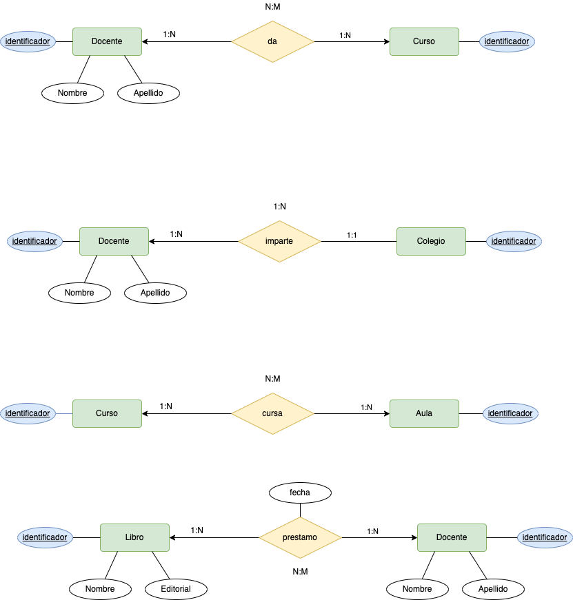
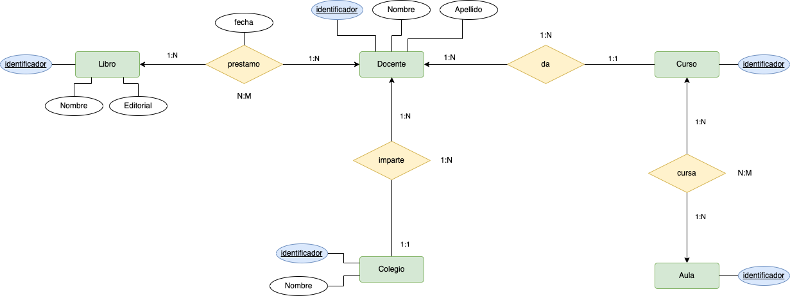

# Centro Estudios

 

| Colegio | Profesor | Asignatura/ habilidad | Aula | Curso | Libro | Editorial | Fecha_prestamo |
|-----|-----|-----|-----|-----|-----|-----|-----|  
| C.P Cervantes | Juan Pérez | Pensamiento Lógico | 1.A01  | 1er Grado  | Aprender y enseñar en educación infantil  |  Graó  | 09/09/2022 |
| C.P Cervantes | Juan Pérez | Escritura  |  1.A01  | 1er Grado  | Preescolar Rubio,N56 | TécnicasRubio | 05/05/2022 |
| C.P Cervantes | Juan Pérez | Pensamiento Numérico | 1.A01 | 1er Grado | Aprender y Enseñar eneducación infantil | Graó | 05/05/2022 |
| C.P Cervantes | Alicia García | Pensamiento Espacial, Temporal y causal | 1.B01 | 1er Grado | Educación Infantil N9 | Prentice Hall | 06/05/2022 |
| C.P Cervantes | Alicia García | Pensamiento Numérico| 1.A01 | 1er Grado | Aprender y Enseñar eneducación infantil | Graó | 06/05/2022 |
| C.P Cervantes | Andrés Fernández | Escritura | 1.A01  | 2er Grado  | Aprender y enseñar en educación infantil  |  Graó  | 09/09/2022 |
| C.P Cervantes | Andrés Fernández | Ingles | 1.A01  | 2er Grado  | Saber educar: guía para Padres y Profesores | Temas de Hoy   | 05/05/2022 |  
| C.P Quevedo | Juan Méndez | Pensamiento Lógico | 2.B01 | 1er Grado | Saber educar: guía para Padres y Profesores | Temas de Hoy | 18/12/2022 |
| C.P Quevedo | Juan Méndez | Pensamiento Numérico | 2.B01 | 1er Grado | Aprender y Enseñar eneducación infantil | Graó | 06/05/2022 |

Dada la siguiente relación PRÉSTAMO (Colegio, Profesor,Asignatura, Aula, Curso, Libro, Editorial,Fecha_Préstamo) que contiene información relativa a los préstamos que realizan las editoriales a los profesores de primaria de los colegios para su evaluación en alguna de las asignaturas/habilidades que imparten.

> Considera las tuplas relación PRÉSTAMO mostradas en la tabla anterior, que a un profesor no se le puede prestar más de un libro de la misma editorial en el mismo día y que a un profesor no se le puede prestar más de una vez un mismo libro.

Se pide:
1. Realiza la normalización hasta la 3FN, indicando cada uno de los pasos (1, 2 y 3 FN).
- 1FN.
- 2FN.
- 3FN.
2. Realiza el Modelo Relacional con la solución obtenida (1 punto).
3. Realiza el Modelo Entidad Relacional con la solución obtenida (1 punto).

__Solución__

1. __1FN__

> Recordemos que: Una tabla está en ___1FN si y sólo si  cada atributo es atómico___.

 En este caso la tabla __NO__ se encuentra en __1FN__ dado que sus valores no son atómicos. Por ejemplo la columna __Profesor__ no es atómino, La primera aproximación a la solución, será hacer atómicos todos los valores de la tabla.

| Colegio | Nombre Profesor | Apellido Profesor | Asignatura/ habilidad | Aula | Curso | Libro | Editorial | Fecha_prestamo |
|-----|-----|-----|-----|-----|-----|-----|-----|-----|
| C.P Cervantes | Juan | Pérez | Pensamiento Lógico | 1.A01  | 1er Grado  | Aprender y enseñar en educación infantil  |  Graó  | 09/09/2022 |
| C.P Cervantes | Juan | Pérez | Escritura  |  1.A01  | 1er Grado Preescolar Rubio,N56 | Técnicas | Rubio | 05/05/2022 |
| C.P Cervantes | Juan | Pérez | Pensamiento Numérico | 1.A01 | 1er Grado | Aprender y Enseñar eneducación infantil | Graó | 05/05/2022 |
| C.P Cervantes | Alicia | García | Pensamiento Espacial, Temporal y causal | 1.B01 | 1er Grado | Educación Infantil N9 | Prentice Hall | 06/05/2022 |
| C.P Cervantes | Alicia | García | Pensamiento Numérico| 1.A01 | 1er Grado | Aprender y Enseñar eneducación infantil | Graó | 06/05/2022 |
| C.P Cervantes | Andrés | Fernández | Escritura | 1.A01  | 2er Grado  | Aprender y enseñar en educación infantil  |  Graó  | 09/09/2022 |
| C.P Cervantes | Andrés | Fernández | Ingles | 1.A01  | 2er Grado  | Saber educar: guía para Padres y Profesores | Temas de Hoy   | 05/05/2022 |  
| C.P Quevedo | Juan | Méndez | Pensamiento Lógico | 2.B01 | 1er Grado | Saber educar: guía para Padres y Profesores | Temas de Hoy | 18/12/2022 |
| C.P Quevedo | Juan | Méndez | Pensamiento Numérico | 2.B01 | 1er Grado | Aprender y Enseñar eneducación infantil | Graó | 06/05/2022 |

Como podemos observar, ahora mismo todos los valores son atómicos, pero existe __redundancia en la BBDD__.

En este momento vamos que la hay múltiples valores que se repiten. Por ejemplo: __Colegio, Profesor, Asignatura, Aula,...__.

Por ejemplo el profesor Juan Pérez, imparte en el colegio Cervantes tres asignaturas, las cuales serán: __Pensamiento Lógico, Escritura, y Pensamiento Número__, todas ellas relacionadas con su __libro, editorial y fecha de prestamo__. Además este __sólo imparte__ en un aula (1.A01), y en el mismo curso (1er Grado). Esto quiere decir que el valor multievaluado será __La Asignatura, con su nombre, libro, editorial y fecha de prestamo__.

__Asignatura:__

| Asignatura/ habilidad | Libro | Editorial | Fecha_prestamo |
|-----|-----|-----|-----|
| Pensamiento Lógico | Aprender y enseñar en educación infantil  |  Graó  | 09/09/2022 |
| Escritura | Preescolar Rubio,N56 | Técnicas Rubio | 05/05/2022 |
| Pensamiento Numérico | Aprender y Enseñar eneducación infantil | Graó | 05/05/2022 |
| Pensamiento Espacial, Temporal y causal | Educación Infantil N9 | Prentice Hall | 06/05/2022 |
| Pensamiento Numérico | Aprender y Enseñar eneducación infantil | Graó | 06/05/2022 |
| Escritura | Aprender y enseñar en educación infantil  |  Graó  | 09/09/2022 |
| Ingles | Saber educar: guía para Padres y Profesores | Temas de Hoy  | 05/05/2022 |  
| Pensamiento Lógico | Saber educar: guía para Padres y Profesores | Temas de Hoy | 18/12/2022 |
| Pensamiento Numérico | Aprender y Enseñar en educación infantil | Graó | 06/05/2022 |

2. __2FN__

> Una tabla ___esta en 2FN si y sólo si está en 1FN y todos los atributos tienen dependencia funcional completa de la Clave Principal___.

En este caso, esta claro que el __docente no guarda relación con la clave principal, al igual que el colegio__.

Siguiendo la normalización, las tablas quedarán como siguen:

__Colegio:__

| Identificador | Nombre |
|-----|-----|
| 001 | C.P Cervantes |
| 002 | C.P Quevedo |

__Docente:__

| Identificador | Nombre | Apellido | Oficina |Seccion |
|-----|-----|-----|-----|-----|
|  0001 |  Carlos | Arambulo | CB-214 |  U |
|  0002 | Petra | Rondinel | CB-110 | U |
|  0003 | Victor | Moncada | CB-120 | W |
|  0004 | César | Fernandez | SC-220 | V |
|  0005 |  Carlos | Arambulo | CB-214 |  V |
|  0006 | Victor | Moncada | CB-120 | U |

> Añadimos una clave principal dado que __NO__ existe para el docente. Además hemos cambiado la columna __curso__, por la __especialidad__ del docente, por ejemplo, para que no colicione con la tabla __curso__, si existiera.

Si observamos esta tabla ahora no cumple la __1FN__, dado que tiene datos repetidos, y un docente esta en una __misma oficina__, pero puede estar en __2 o más especialidades__. Por este motivo. ___La oficina se relaciona con 1 o más especialidades___. Por este motivo, la oficina pasa a ser una entidad independiente.

Las tablas quedarán como sigue:

__Oficina:__

| Identificador |
|-----|
| CB-214 |
| CB-110 |
| CB-120 |
| SC-220 |

__Docente:__

| Identificador | Nombre | Apellido |
|-----|-----|-----|
|  0001 |  Carlos | Arambulo |
|  0002 | Petra | Rondinel |
|  0003 | Victor | Moncada |
|  0004 | César | Fernandez |

__Seccion:__

| Nombre |
|-----|
|  U |
| W |
| V |

En este momento la BBDD se encuentra en __2FN__, aunque ___hemos de tener en cuenta, que ___estamos perdiendo información, es decir, las relaciones entre las asignaturas, docentes, etc.____.

3. __3FN__

Actualmente se cumple la __2FN__, y no existe transitividad en sus tablas.

4. Realiza el Modelo Entidad Relacional con la solución obtenida.
    - Cosas a tener en cuenta:
        - Un aula puede estar en más de un colegio.
        - Un colegio tiene más de un aula.
        - Un profesor puede tener en préstamo más de un Libro.
        - Un libro puede ser prestato a más de un profesor.
        - Un tiene más de un aula.
        - Un aula puede estar en más de un curso.

Teniendo esto en cuenta:

__Relaciones:__

__Modelo ER__:

5. Realiza el Modelo Relacional con la solución obtenida. Será realizar la transformación del modelo __ER__ anterior.
Con la información del __diagrama  ER__ resulta sencillo.

