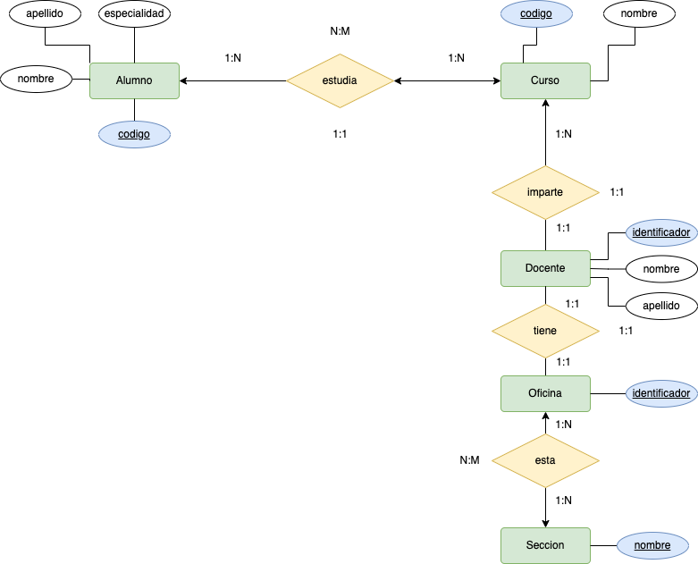

# Centro Estudios

 

| Codigo alumno | Nombre alumno | Seccion | Codigo curso | Nombre curso | Nombre docente | Oficina | Curso| 
|-----|-----|-----|-----|-----|-----|-----|-----|
| 382145A | Luis Zuloaga | Industrial | MA123 | Matematica 2 |  Carlos Arambulo |  CB-214 |  U |
| 382145A | Luis Zuloaga | Industrial | QU514 | Física y química | Petra Rondinel | CB-110 | U | 
| 382145A | Luis Zuloaga | Industrial | AU521 | Descriptiva | Victor Moncada | CB-120 | W | 
| 360247K | Raúl Rojas | Sistemas | PA714 | Investigación I | César Fernandez | SC-220 | V | 
| 360247K | Raúl Rojas | Sistemas | MA123 | Matemática 2 | Carlos Arambulo | CB-214 | V | 
| 360247K | Raúl Rojas| Sistemas | AU511 | Dibujo | Victor Moncada | CB-120 | U | 

Dada la siguiente relación MATRICULA  que contiene información relativa a las matrículas. Se pide:
1. Realiza la normalización hasta la 3FN, indicando cada uno de los pasos (1, 2 y 3 FN).
- 1FN.
- 2FN.
- 3FN.
2. Realiza el Modelo Relacional con la solución obtenida (1 punto).
3. Realiza el Modelo Entidad Relacional con la solución obtenida (1 punto).

__Solución__

1. __1FN__

> Recordemos que: Una tabla está en ___1FN si y sólo si  cada atributo es atómico___.

 En este caso la tabla __NO__ se encuentra en __1FN__ dado que sus valores no son atómicos.
 La primera aproximación a la solución, será hacer atómicos todos los valores de la tabla. 

| Codigo alumno | Nombre Alumno | Apellido Alumno |Seccion | Codigo curso | Nombre curso | Nombre docente | Apellido docente | Oficina | Curso| 
|-----|-----|-----|-----|-----|-----|-----|-----|-----|-----|
| 382145A | Luis | Zuloaga | Industrial | MA123 | Matematica 2 |  Carlos | Arambulo |  CB-214 |  U |
| 382145A | Luis | Zuloaga | Industrial | QU514 | Física y química | Petra | Rondinel | CB-110 | U | 
| 382145A | Luis | Zuloaga | Industrial | AU521 | Descriptiva | Victor | Moncada | CB-120 | W | 
| 360247K | Raúl | Rojas | Sistemas | PA714 | Investigación I | César | Fernandez | SC-220 | V | 
| 360247K | Raúl | Rojas | Sistemas | MA123 | Matemática 2 | Carlos | Arambulo | CB-214 | V | 
| 360247K | Raúl | Rojas| Sistemas | AU511 | Dibujo | Victor | Moncada | CB-120 | U | 

Como podemos observar, ahora mismo todos los valores son atómicos, pero existe __redundancia en la BBDD__.

En este momento vamos que la clave principal se repite __"360247K"__. 

Si nos fijamos veremos que la tabla representa __elementos multivaluedos__. Por ejemplo, el alumno __"360247K"__, cursa 3 asignaturas: __Investigación I, Matemática 2, y Dibujo__. Esto quiere decir que los valores del curso (__Código y Curso__) son elementos multivaualos y deben salir de la tabla. Nos quedará como sigue:

| Codigo alumno | Nombre Alumno | Apellido Alumno |Seccion | Nombre docente | Apellido docente | Curso| 
|-----|-----|-----|-----|-----|-----|-----|
| 382145A | Luis | Zuloaga | Industrial |  Carlos | Arambulo | U |
| 382145A | Luis | Zuloaga | Industrial | Petra | Rondinel | U | 
| 382145A | Luis | Zuloaga | Industrial | Victor | Moncada | W | 
| 360247K | Raúl | Rojas | Sistemas | César | Fernandez | V | 
| 360247K | Raúl | Rojas | Sistemas | Carlos | Arambulo | V | 
| 360247K | Raúl | Rojas| Sistemas | Victor | Moncada | U | 

__Curso__
Codigo | Nombre |
|-----|-----|
| MA123 | Matematica 2 | 
| QU514 | Física y química | 
| AU521 | Descriptiva | 
| PA714 | Investigación I | 
| AU511 | Dibujo |

2. __2FN__

> Una tabla ___esta en 2FN si y sólo si está en 1FN y todos los atributos tienen dependencia funcional completa de la Clave Principal___.

En este caso, esta claro que el __docente no guarda relación con la clave principal__. 

Siguiendo la normalización, las tablas quedarán como siguen:

__Alumno__:

| Codigo | Nombre  | Apellido |Especialidad | 
|-----|-----|-----|-----|
| 382145A | Luis | Zuloaga | Industrial |
| 360247K | Raúl | Rojas | Sistemas | 

__Docente:__

| Identificador | Nombre | Apellido | Oficina |Seccion | 
|-----|-----|-----|-----|-----|
|  0001 |  Carlos | Arambulo | CB-214 |  U |
|  0002 | Petra | Rondinel | CB-110 | U | 
|  0003 | Victor | Moncada | CB-120 | W | 
|  0004 | César | Fernandez | SC-220 | V | 
|  0005 |  Carlos | Arambulo | CB-214 |  V |
|  0006 | Victor | Moncada | CB-120 | U |

> Añadimos una clave principal dado que __NO__ existe para el docente. Además hemos cambiado la columna __curso__, por la __especialidad__ del docente, por ejemplo, para que no colicione con la tabla __curso__, si existiera.

Si observamos esta tabla ahora no cumple la __1FN__, dado que tiene datos repetidos, y un docente esta en una __misma oficina__, pero puede estar en __2 o más especialidades__. Por este motivo. ___La oficina se relaciona con 1 o más especialidades___. Por este motivo, la oficina pasa a ser una entidad independiente.

Las tablas quedarán como sigue:

__Oficina:__

| Identificador |
|-----|
| CB-214 |
| CB-110 |
| CB-120 |
| SC-220 |

__Docente:__

| Identificador | Nombre | Apellido | 
|-----|-----|-----|
|  0001 |  Carlos | Arambulo |
|  0002 | Petra | Rondinel | 
|  0003 | Victor | Moncada | 
|  0004 | César | Fernandez |

__Seccion:__

| Nombre | 
|-----|
|  U |
| W | 
| V |

En este momento la BBDD se encuentra en __2FN__, aunque ___hemos de tener en cuenta, que estamos perdiendo información, es decir, las relaciones entre los alumnos, asignaturas, y docentes, y especialidades que veremos más adelante___.

3. __3FN__

Actualmente se cumple la __2FN__, y no existe transitividad en sus tablas.

4. Realiza el Modelo Entidad Relacional con la solución obtenida.
    - Cosas a tener en cuenta:
        - Una oficina puede tener una o más secciones.
        - Un alumno puede tener una o más asignaturas.
        - Una asignatura puede estar cursada por más de un alumno.
        - Una asignatura tiene un docente.
        - Un docente tiene una oficina, y una oficina sólo la tiene un docente.

Teniendo esto en cuenta:

5. Realiza el Modelo Relacional con la solución obtenida. Será realizar la transformación del modelo __ER__ anterior.

