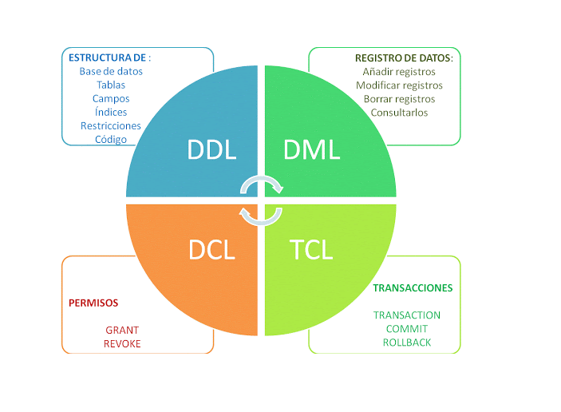

# DDL, DML, DCL y TCL

# Tipos de Lenguajes SQL en Bases de Datos

## DDL (Data Definition Language - Lenguaje de Definición de Datos)

- **Propósito:** Define y modifica la estructura de la base de datos.
- **Comandos Principales:**
  - `CREATE`: Crea objetos de la base de datos como tablas, índices, etc.
  - `ALTER`: Modifica la estructura de la base de datos (añade, modifica o elimina objetos).
  - `DROP`: Elimina objetos de la base de datos (tablas, índices, etc.).
  - `TRUNCATE`: Elimina todos los registros de una tabla sin eliminar la tabla en sí.

## DML (Data Manipulation Language - Lenguaje de Manipulación de Datos)

- **Propósito:** Realiza operaciones en los datos almacenados en la base de datos.
- **Comandos Principales:**
  - `SELECT`: Recupera datos de una o más tablas.
  - `INSERT`: Inserta nuevos registros en una tabla.
  - `UPDATE`: Modifica los datos existentes en una tabla.
  - `DELETE`: Elimina registros de una tabla.

## DCL (Data Control Language - Lenguaje de Control de Datos)

- **Propósito:** Gestiona los permisos y privilegios de acceso a los datos.
- **Comandos Principales:**
  - `GRANT`: Concede permisos de acceso a usuarios o roles.
  - `REVOKE`: Retira permisos de acceso concedidos previamente.

## TCL (Transaction Control Language - Lenguaje de Control de Transacciones)

- **Propósito:** Gestiona las transacciones en la base de datos.
- **Comandos Principales:**
  - `COMMIT`: Confirma y aplica los cambios realizados en la transacción.
  - `ROLLBACK`: Deshace los cambios realizados en la transacción.
  - `SAVEPOINT`: Establece un punto de salvado dentro de una transacción.
  - `SET TRANSACTION`: Define características de la transacción como el aislamiento y nivel de acceso.

Estos lenguajes SQL proporcionan las herramientas necesarias para administrar y utilizar eficientemente una base de datos, desde la definición de su estructura hasta la manipulación y control de los datos almacenados.

## Resumiento todo

| Comando                  | Descripción                                                             |
|--------------------------|-------------------------------------------------------------------------|
| **DDL (Data Definition Language)**                                      |                                                                         |
| CREATE TABLE             | Crea una nueva tabla en la base de datos.                                |
| ALTER TABLE              | Modifica la estructura de una tabla existente (añade, modifica o elimina columnas). |
| DROP TABLE               | Elimina una tabla y sus datos de la base de datos.                      |
|                                                                         |                                                                         |
| **DML (Data Manipulation Language)**                                    |                                                                         |
| SELECT                   | Recupera datos de una o más tablas.                                     |
| INSERT INTO              | Inserta nuevos registros en una tabla.                                   |
| UPDATE                   | Modifica los datos existentes en una tabla.                             |
| DELETE                   | Elimina registros de una tabla.                                         |
|                                                                         |                                                                         |
| **DCL (Data Control Language)**                                        |                                                                         |
| GRANT                    | Concede permisos de acceso a usuarios.                                  |
| REVOKE                   | Retira permisos de acceso a usuarios.                                   |
|                                                                         |                                                                         |
| **TCL (Transaction Control Language)**                                 |                                                                         |
| COMMIT                   | Confirma y aplica los cambios realizados en la transacción.            |
| ROLLBACK                 | Deshace los cambios realizados en la transacción.                       |
| SAVEPOINT                | Establece un punto de salvado dentro de una transacción.               |
|                                                                         |                                                                         |
| **DDL y DML combinados**                                               |                                                                         |
| TRUNCATE TABLE           | Elimina todos los registros de una tabla, pero mantiene su estructura. |
|                                                                         |                                                                         |
| **Otras Operaciones**                                                  |                                                                         |
| USE                      | Selecciona la base de datos con la que se va a trabajar.               |
| SHOW                     | Muestra información sobre bases de datos, tablas, etc.                 |
| DESCRIBE/DESC            | Proporciona información sobre la estructura de una tabla.              |
|                                                                         |                                                                         |
| **Comentarios**                                                        |                                                                         |
| --                       | Comentario de una sola línea.                                          |
| /* ... */                | Comentario de varias líneas.   

