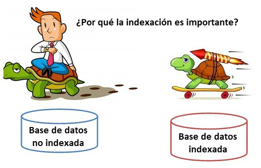

<div align="justify">

# Índices en MySQL

Un ___índice es un puntero a una fila de una determinada tabla de nuestra base de datos___._Un puntero no es más que una referencia que asocia el valor de una determinada columna (o el conjunto de valores de una serie de columnas) con las filas que contienen ese valor (o valores) en las columnas que componen el puntero_.


__Los índices mejoran el tiempo de recuperación de los datos en las consultas realizadas contra nuestra base de datos__. 

_La creación de índices implica un aumento en el tiempo de ejecución sobre aquellas consultas de inserción, actualización y eliminación realizadas sobre los datos afectados por el índice. Del mismo modo, los índices necesitan un espacio para almacenarse, por lo que también tienen un coste adicional en forma de espacio en disco_.

<div align="center">

</div>

## ¿Para qué?

Los índices se emplean para __encontrar las filas que contienen los valores específicos de las columnas empleadas en la consulta de una forma más rápida__. _Si no existiesen índices, MySQL empezaría buscando por la primera fila de la tabla hasta la última buscando aquellas filas que cumplen los valores establecidos para las columnas empleadas en la consulta. Esto implica que, cuanto más filas tenga la tabla, más tiempo tardará en realizar la consulta. En cambio, si la tabla contiene índices en las columnas empleadas en la consulta, MySQL tendría una referencia directa hacia los datos sin necesidad de recorrer secuencialmente todos ellos_.

En general, MySQL emplea los índices para las siguientes acciones:
- __Encontrar las filas que cumplen la condición WHERE__ de la consulta cuyas columnas estén indexadas.
- __Para recuperar las filas de otras tablas cuando se emplean operaciones de tipo JOIN__. Para ello, es importante que los índices sean del mismo tipo y tamaño ya que aumentará la eficiencia de la búsqueda. Por ejemplo: una operación de tipo JOIN sobre dos columnas que tengan un índice del tipo INT(10).
- __Disminuir el tiempo de ejecución de las consultas con ordenación (ORDER BY) o agrupamiento (GROUP BY)__ si todas las columnas presentes en los criterios forman parte de un índice.
- __Si la consulta emplea una condición simple cuya columna de la condición está indexada__, las filas serán recuperadas directamente a partir del índice, sin pasar a consular la tabla.

## Tipos

Cuando creamos un índices lo hacemos con el objectivo de _acelerar futuras busquedas sobre los datos que poseemos_. ___Cada motor de base de datos ofrece distintos tipos de índices pero varias son comunes y algunos son mas especificos para cada DB___. __MySQL__ _hay_ ___5___ _tipos de índices_.
A continuación, vamos a analizar los distintos tipos de índices que se pueden crear y las condiciones que deben cumplir cada uno de ellos:
- __INDEX (NON-UNIQUE)__: este tipo de índice se refiere a un índice normal, no único. Esto implica que admite valores duplicados para la columna (o columnas) que componen el índice. No aplica ninguna restricción especial a los datos de la columna (o columnas) que componen el índice sino que se emplea simplemente para mejorar el tiempo de ejecución de las consultas.
- __UNIQUE__: este tipo de índice se refiere a un índice en el que todas las columnas deben tener un valor único. Esto implica que no admite valores duplicados para la columna (o columnas) que componen el índice. Aplica la restricción de que los datos de la columna (o columnas) deben tener un valor único.
- __PRIMARY__: este tipo de índice se refiere a un índice en el que todas las columnas deben tener un valor único (al igual que en el caso del índice UNIQUE) pero con la limitación de que sólo puede existir un índice PRIMARY en cada una de las tablas. Aplica la restricción de que los datos de la columna (o columnas) deben tener un valor único.
- __FULLTEXT__: estos índices se emplean para realizar búsquedas sobre texto __(CHAR, VARCHAR y TEXT)__. Estos índices se componen por todas las palabras que están contenidas en la columna (o columnas) que contienen el índice. No aplica ninguna restricción especial a los datos de la columna (o columnas) que componen el índice sino que se emplea simplemente para mejorar el tiempo de ejecución de las consultas. Soportado a partir de __MySQL 5.7__.
- __SPATIAL__: estos índices se emplean para realizar búsquedas sobre datos que componen formas geométricas representadas en el espacio. Soportado a partir de __MySQL 5.7__.
_Es importante destacar que todos estos índices pueden construirse empleando una o más columnas. Del mismo modo, el orden de las columnas que se especifique al construir el orden es relevante para todos los índices menos para el FULLTEXT (ya que este índice mira en TODAS las columnas que componen el índice)_.

## Sintaxis 

La sintaxis básica extraída de su web oficial:

```sql
CREATE [ONLINE|OFFLINE] [UNIQUE|FULLTEXT SPATIAL] INDEX index_name
    [index_type]
    ON tbl_name (index_col_name,...)
    [index_option] ...

```

Supongamos que tenemos la siguiente tabla en nuestra __BBDD__.

```sql
-- Podemos ejecutar la misma sentencia pero solo se ejecutara si la DB no existe.
CREATE DATABASE IF NOT EXISTS damdaw;

-- Creamos una tabla
CREATE TABLE usuarios(id int, nombre varchar(50), apellidos varchar(70));

```

Teniendo en cuenta que la __BBDD__ queda como sigue:

```sql
mysql> DESCRIBE usuarios;
+-----------+-------------+------+-----+---------+-------+
| Field     | Type        | Null | Key | Default | Extra |
+-----------+-------------+------+-----+---------+-------+
| id        | int(11)     |      |     | NULL    |       |
| nombre    | varchar(50) | YES  |     | NULL    |       |
| apellidos | varchar(70) | YES  |     | NULL    |       |
+-----------+-------------+------+-----+---------+-------+
3 rows in set (0.00 sec)
```

Veamos ahora la creación de cada uno de los tipos de índices que nos permiten __MySQL__.

Podemos seguir __dos caminos__ para la creación de índices. __Uno__ en el momento de creación de la tabla, o __dos__, detectando una necesidad, se incluye un índice.

#### Creación de la tabla

```sql
CREATE TABLE nombreTabla(campo1 tipoDato, campo2 tipoDato,..
  INDEX [nombreIndice] (campo1 [,campo2...]));
```
#### Modificación de la tabla

```sql
ALTER TABLE nombreTabla ADD INDEX [nombreIndice] (campo1 [,campo2...]);
```

__Ó__

```sql
CREATE INDEX nombreIndice ON nombreTabla(campo1 [,campo2...]);
```

___Ambas sentencias piden el nombre del índice, sin embargo con la sentencia CREATE INDEX el nombre es obligatorio.___

Por ejemplo, para la siguiente definición de tabla:

```sql
CREATE TABLE usuarios(id int, nombre varchar(50), apellidos varchar(70));
```

Se puede crear un índice en la columna apellidos con una sentencia ALTER TABLE:

```sql
ALTER TABLE usuarios ADD INDEX idx_apellidos (apellidos);
````

O bien, con una sentencia __CREATE INDEX__:

```sql
CREATE INDEX idx_apellidos ON usuarios(apellidos);
````

### Índice Unique

Los índices únicos son básicamente como los índices ordinarios, excepto que los valores duplicados no son permitidos. 

Siguiendo el ejemplo que hemos definido anteriormente, tenemos la tabla:

```sql
CREATE TABLE usuarios(id int, nombre varchar(50),
 apellidos varchar(70));
````

Podríamos crear un índice UNIQUE en la columna nombre, y un índice UNIQUE en la columna apellidos.

```sql
ALTER TABLE usuarios ADD UNIQUE idx_nombre (nombre);
```
y

```sql
CREATE UNIQUE INDEX idx_apellidos ON usuarios(apellidos);
````

_En el primer caso hacemos uso del comando_ ___ALTER TABLE___ _, y en el segundo caso creamos el índice con la sentencia_ ___CREATE INDEX___.

### Índices de clave primaria

_Una clave primaria es un índice sobre uno o más campos donde cada valor es único y ninguno de los valores son_ ___NULL___.

Por ejemplo, suponiendo que ya tenemos en nuestro sistema una tabla que fue creada de la siguiente manera (sin clave primaria, y con el campo id aceptando valores NULL):

```sql
CREATE TABLE usuarios(id int, nombre varchar(50), apellidos varchar(70));
```

Podemos crear una clave primaria sobre el campo id con esta sentencia:

```sql
ALTER TABLE usuarios MODIFY id INT NOT NULL, ADD PRIMARY KEY(id);
```

Teniendo como resultado:

```sql
mysql> DESCRIBE usuarios;
+-----------+-------------+------+-----+---------+-------+
| Field     | Type        | Null | Key | Default | Extra |
+-----------+-------------+------+-----+---------+-------+
| id        | int(11)     |      | PRI | 0       |       |
| nombre    | varchar(50) | YES  |     | NULL    |       |
| apellidos | varchar(70) | YES  |     | NULL    |       |
+-----------+-------------+------+-----+---------+-------+
```

> ___Nota___: _Compara el resultado con el valor obtenido en la definición de la tabla de la BBDD_.

### Índices de texto completo

Los índices de texto completo son del tipo ___FULLTEXT__, y pueden contener uno o más campos del tipo __CHAR, VARCHAR y TEXT__. _Un índice de texto completo está diseñado para facilitar y optimizar la búsqueda de palabras clave en tablas que tienen grandes cantidades de información en campos de texto_.

Siguiendo con el ejemplo anterior:

```sql
CREATE TABLE usuarios(id int, nombre varchar(50), apellidos varchar(70));
````

Podríamos crear un índice ___FULLTEXT___ en la columna __nombre__, en la columna __apellidos__, o bien, un índice que ocupe __ambos campos__. A continuación se muestran los tres casos.

```sql
CREATE FULLTEXT INDEX idx_nombre ON usuarios(nombre);

CREATE FULLTEXT INDEX idx_apellidos ON usuarios(apellidos);

CREATE FULLTEXT INDEX idx_nombre_apellidos ON usuarios(nombre,apellidos);
```

### Índices compuestos

Los índices compuestos son simplemente aquellos que ___están basados en múltiples columnas___. MySQL únicamente usa un índice por tabla cuando está procesando una consulta. Esto significa que si tenemos varias columnas que frecuentemente aparecen juntas en una cláusula WHERE, tenemos la oportunidad de acelerar estas consultas al crear un índice compuesto.

Siguiendo con el ejemplo utilizado:

```sql
CREATE TABLE usuarios(id int, nombre varchar(50), apellidos varchar(70));
```

podemos crear el siguiente indice:

```sql
ALTER TABLE usuarios ADD INDEX idx_nombre(nombre, apellidos);
```

### Índices de parte de campos

En las columnas __CHAR__ y __VARCHAR__ se nos permite crear un índice que no use el campo por completo. Retomemos el ejemplo anterior de la tabla usuarios. A pesar de que el nombre de una persona puede ser de hasta __50 caracteres__, es muy común que los nombres de las personas sean diferentes en los primeros __10 caracteres__. Al usar un índice de 10 caracteres en lugar de 50, el índice será más pequeño, y permitirá que las consultas __INSERT__ y __UPDATE__ sean más rápidas, a la vez que no se afecta la velocidad de las consultas __SELECT__.

Teniendo como base el ejemplo que hemos utilizado.

```sql
CREATE TABLE usuarios(id int, nombre varchar(50), apellidos varchar(70));
```

Para crear un índice como parte de un campo, sólo se tiene que especificar el tamaño entre paréntesis después del nombre de la columna. Por ejemplo, nuestro índice idx_nombre pudo haber sido creado también de la siguiente manera:

```sql
ALTER TABLE usuarios ADD INDEX idx_nombre(nombre(10), apellidos(20));;
```

## Operaciones sobre índices

| Operación                   | Sintaxis                                                              | Descripción                                                   |
|-----------------------------|-----------------------------------------------------------------------|---------------------------------------------------------------|
| Ver índices de una tabla   | `SHOW INDEX FROM nombre_tabla;`<br> `DESCRIBE nombre_tabla;`          | Muestra los índices de una tabla específica.                 |
| Crear un índice            | `CREATE INDEX nombre_indice ON nombre_tabla (columna);`               | Crea un nuevo índice en la tabla especificada.               |
| Crear un índice único      | `CREATE UNIQUE INDEX nombre_indice ON nombre_tabla (columna);`        | Crea un nuevo índice único en la tabla especificada.         |
| Eliminar un índice         | `DROP INDEX nombre_indice ON nombre_tabla;`                           | Elimina un índice existente de la tabla especificada.        |
| Eliminar un índice único   | `ALTER TABLE nombre_tabla DROP INDEX nombre_indice;`                  | Elimina un índice único existente de la tabla especificada.  |
| Ver tamaño de un índice    | `SHOW INDEX FROM nombre_tabla;`                                       | Muestra el tamaño del índice de una tabla.                   |
| Analizar tabla             | `ANALYZE TABLE nombre_tabla;`                                        | Recopila estadísticas sobre la distribución de valores.      |
| Optimizar tabla            | `OPTIMIZE TABLE nombre_tabla;`                                        | Reorganiza el almacenamiento de una tabla para mejorar el rendimiento. |


## Prácticando índices

Supongamos que tenemos una base de datos para gestionar una tienda en línea que vende productos electrónicos. La base de datos tiene dos tablas principales: productos y pedidos.

#### Tabla `productos`:

| Columna   | Tipo          | Descripción                        |
|-----------|---------------|------------------------------------|
| id        | INT           | Identificador único del producto  |
| nombre    | VARCHAR(100)  | Nombre del producto                |
| precio    | DECIMAL(10,2) | Precio del producto                |
| categoria | VARCHAR(50)   | Categoría del producto             |

#### Tabla `pedidos`:

| Columna     | Tipo         | Descripción                        |
|-------------|--------------|------------------------------------|
| id          | INT          | Identificador único del pedido     |
| producto_id | INT          | ID del producto                    |
| cantidad    | INT          | Cantidad de productos en el pedido |
| fecha       | DATE         | Fecha del pedido                   |
| total       | DECIMAL(10,2)| Total del pedido                   |

A continuación completa la __sentencia sql__ con los líneas que faltan:

```sql
CREATE TABLE productos (
    id INT AUTO_INCREMENT PRIMARY KEY,
    nombre VARCHAR(100),
    precio DECIMAL(10,2),
    categoria VARCHAR(50)
);

CREATE TABLE pedidos (
    id INT AUTO_INCREMENT PRIMARY KEY,
    producto_id INT,
    cantidad INT,
    fecha DATE,
    total DECIMAL(10,2)
);
```

>__Nota__:_¿Qué es lo que falta?_.

Realiza la inserción de los elementos de ejermlo:

```sql
INSERT INTO productos (nombre, precio, categoria) VALUES
('Laptop', 999.99, 'Electrónica'),
('Teléfono', 299.99, 'Electrónica'),
('Tablet', 199.99, 'Electrónica');

INSERT INTO pedidos (producto_id, cantidad, fecha, total) VALUES
(1, 2, '2024-03-20', 1999.98),
(2, 1, '2024-03-20', 299.99),
(3, 3, '2024-03-21', 599.97);
```

A continuación realiza:

- Crea Índices:
  - Crea un índice en la columna nombre de la tabla productos para mejorar la velocidad de búsqueda por nombre de producto.
  
    ```sql
    CREATE INDEX idx_nombre ON productos (nombre);
    ```

  - Crea un índice único en la columna id de la tabla productos para garantizar la unicidad de los identificadores de producto.
  
    ```sql
    CREATE UNIQUE INDEX idx_id ON productos (id);
    ```

  - Crea un índice en la columna fecha de la tabla pedidos para optimizar la búsqueda por fecha de pedido.
  
      ```sql
    CREATE INDEX idx_fecha ON pedidos (fecha);
    ```

- Ver Índices:
  - Utiliza la sentencia SHOW INDEX FROM productos; para ver los índices de la tabla productos.
  
    ```sql
    SHOW INDEX FROM productos;
    ```

  - Utiliza la sentencia SHOW INDEX FROM pedidos; para ver los índices de la tabla pedidos.
  
    ```sql
    SHOW INDEX FROM pedidos;
    ```

- Eliminar Índices:
  - Elimina el índice en la columna nombre de la tabla productos.
  
    ```sql
    DROP INDEX idx_nombre ON productos;
    ```

  - Elimina el índice en la columna fecha de la tabla pedidos.
  
    ```sql
    DROP INDEX idx_fecha ON pedidos;
    ```

- Optimizar Tabla:
  - Utiliza la sentencia OPTIMIZE TABLE productos; para reorganizar el almacenamiento de la tabla productos y mejorar el rendimiento de las consultas.

    ```sql
    OPTIMIZE TABLE productos;
    ```

  >__Nota__: Obtendremos una salida similar a la siguiente:

  ```sql
    mysql> OPTIMIZE TABLE productos;
  +--------------------------+----------+----------+-------------------------------------------------------------------+
  | Table                    | Op       | Msg_type | Msg_text                                                          |
  +--------------------------+----------+----------+-------------------------------------------------------------------+
  | tienda_en_linea.productos | optimize | note     | Table does not support optimize, doing recreate + analyze instead |
  | tienda_en_linea.productos | optimize | status   | OK                                                                |
  +--------------------------+----------+----------+-------------------------------------------------------------------+
  2 rows in set (0.09 sec)
  ```

### Un Ejemplo (Jardinería)

Suponga que estamos trabajando con la base de datos [jardineria](file/jardineria.sql) y queremos optimizar la siguiente consulta.

```sql
SELECT nombre_contacto, telefono
FROM cliente
WHERE pais = 'France';
```

Lo primero que tenemos que hacer es hacer uso de __EXPLAIN__ para obtener información sobre cómo se está realizando la consulta.

```sql
EXPLAIN SELECT nombre_contacto, telefono
FROM cliente
WHERE pais = 'France';

+----+-------------+---------+------------+------+---------------+------+---------+------+------+----------+-------------+
| id | select_type | table   | partitions | type | possible_keys | key  | key_len | ref  | rows | filtered | Extra       |
+----+-------------+---------+------------+------+---------------+------+---------+------+------+----------+-------------+
|  1 | SIMPLE      | cliente | NULL       | ALL  | NULL          | NULL | NULL    | NULL |   36 |    10.00 | Using where |
+----+-------------+---------+------------+------+---------------+------+---------+------+------+----------+-------------+
```

Tenemos que fijarnos en los valores que nos aparecen en las columnas type y rows. En este caso tenemos ___type =  ALL___, que quiere decir que es necesario realizar un escaneo completo de todas las filas de la tabla. Y ___rows = 36___, _quiere decir que en este caso ha tenido que examinar 36 filas_. Que es el número total de filas que tiene la tabla.

Para obtener información sobre la tabla y sobre los índices que existen en ella podemos usar ___DESCRIBE o SHOW INDEX___.

```sql
DESCRIBE cliente;

+----------------------------+---------------+------+-----+---------+-------+
| Field                      | Type          | Null | Key | Default | Extra |
+----------------------------+---------------+------+-----+---------+-------+
| codigo_cliente             | int(11)       | NO   | PRI | NULL    |       |
| nombre_cliente             | varchar(50)   | NO   |     | NULL    |       |
| nombre_contacto            | varchar(30)   | YES  |     | NULL    |       |
| apellido_contacto          | varchar(30)   | YES  |     | NULL    |       |
| telefono                   | varchar(15)   | NO   |     | NULL    |       |
| fax                        | varchar(15)   | NO   |     | NULL    |       |
| linea_direccion1           | varchar(50)   | NO   |     | NULL    |       |
| linea_direccion2           | varchar(50)   | YES  |     | NULL    |       |
| ciudad                     | varchar(50)   | NO   |     | NULL    |       |
| region                     | varchar(50)   | YES  |     | NULL    |       |
| pais                       | varchar(50)   | YES  |     | NULL    |       |
| codigo_postal              | varchar(10)   | YES  |     | NULL    |       |
| codigo_empleado_rep_ventas | int(11)       | YES  | MUL | NULL    |       |
| limite_credito             | decimal(15,2) | YES  |     | NULL    |       |
+----------------------------+---------------+------+-----+---------+-------+
```

```sql
SHOW INDEX FROM cliente;

+---------+------------+----------------------------+--------------+----------------------------+-----------+-------------+----------+--------+------+------------+---------+---------------+
| Table   | Non_unique | Key_name                   | Seq_in_index | Column_name                | Collation | Cardinality | Sub_part | Packed | Null | Index_type | Comment | Index_comment |
+---------+------------+----------------------------+--------------+----------------------------+-----------+-------------+----------+--------+------+------------+---------+---------------+
| cliente |          0 | PRIMARY                    |            1 | codigo_cliente             | A         |          36 |     NULL | NULL   |      | BTREE      |         |               |
| cliente |          1 | codigo_empleado_rep_ventas |            1 | codigo_empleado_rep_ventas | A         |          11 |     NULL | NULL   | YES  | BTREE      |         |               |
+---------+------------+----------------------------+--------------+----------------------------+-----------+-------------+----------+--------+------+------------+---------+---------------+
```

Según los resultados obtenidos con __DESCRIBE y SHOW INDEX__ podemos observar que ___NO___ existe ningún índice sobre la columna pais.

Para crear un índice sobre la _columna pais_ hacemos uso de __CREATE INDEX__:

```sql
CREATE INDEX idx_pais ON cliente(pais);
```

```sql
SHOW INDEX FROM cliente;

+---------+------------+----------------------------+--------------+----------------------------+-----------+-------------+----------+--------+------+------------+---------+---------------+
| Table   | Non_unique | Key_name                   | Seq_in_index | Column_name                | Collation | Cardinality | Sub_part | Packed | Null | Index_type | Comment | Index_comment |
+---------+------------+----------------------------+--------------+----------------------------+-----------+-------------+----------+--------+------+------------+---------+---------------+
| cliente |          0 | PRIMARY                    |            1 | codigo_cliente             | A         |          36 |     NULL | NULL   |      | BTREE      |         |               |
| cliente |          1 | codigo_empleado_rep_ventas |            1 | codigo_empleado_rep_ventas | A         |          11 |     NULL | NULL   | YES  | BTREE      |         |               |
| cliente |          1 | idx_paix                   |            1 | pais                       | A         |           5 |     NULL | NULL   | YES  | BTREE      |         |               |
+---------+------------+----------------------------+--------------+----------------------------+-----------+-------------+----------+--------+------+------------+---------+---------------+
```

Una vez que hemos comprobado que el índice se ha creado de forma correcta podemos volver a ejecutar la consulta con EXPLAIN para comprobar si hemos conseguido optimizarla.

```sql
EXPLAIN SELECT nombre_contacto, telefono
FROM cliente
WHERE pais = 'France';

+----+-------------+---------+------------+------+---------------+----------+---------+-------+------+----------+-------+
| id | select_type | table   | partitions | type | possible_keys | key      | key_len | ref   | rows | filtered | Extra |
+----+-------------+---------+------------+------+---------------+----------+---------+-------+------+----------+-------+
|  1 | SIMPLE      | cliente | NULL       | ref  | idx_pais      | idx_pais | 203     | const |    2 |   100.00 | NULL  |
+----+-------------+---------+------------+------+---------------+----------+---------+-------+------+----------+-------+
```

De nuevo tenemos que fijarnos en los valores que nos aparecen en las columnas ___type y rows___. En este caso ambos valores han cambiado, ahora type es igual a _ref_, y por lo tanto ya no es necesario realizar un escaneo completo de todas las filas de la tabla. Y el valor de _rows es igual a 2_, que quiere decir que en este caso ha tenido que examinar solamente __2 filas__.

#### Ejemplo 2 (FULLTEXT INDEX)

Suponga que estamos trabajando con la base de datos jardineria y queremos buscar todos los productos que contienen la palabra acero en el nombre o en la descripción del producto. Una posible solución podrías ser esta:

```sql
SELECT *
FROM producto
WHERE nombre LIKE '%acero%' OR descripcion LIKE '%acero%';
```

Si la analizamos con __EXPLAIN__ veremos que no es muy eficiente porque esta consulta realiza un escaneo completo de toda la tabla.

```sql
EXPLAIN SELECT *
FROM producto
WHERE nombre LIKE '%acero%' OR descripcion LIKE '%acero%';
```

En estos casos es muy útil hacer uso de los índices de tipo ___FULLTEXT INDEX___.

En primer lugar vamos a modificar la tabla producto para crear el índice __FULLTEXT__ con las ___dos columnas___ sobre las que queremos _realizar la búsqueda_.

```sql
CREATE FULLTEXT INDEX idx_nombre_descripcion ON producto(nombre, descripcion);
```

Una vez creado el índice ejecutamos la consulta haciendo uso de _MATCH_ y _AGAINST_.

```sql
SELECT *
FROM producto
WHERE MATCH(nombre, descripcion) AGAINST ('acero');
```

Si analizamos la consulta con __EXPLAIN__ veremos que ya no es necesario escanear toda la tabla para encontrar el resultado que buscamos.

```sql
EXPLAIN SELECT *
FROM producto
WHERE MATCH(nombre, descripcion) AGAINST ('acero');
```

### Ejemplo 3 (FULLTEXT INDEX)

En este ejemplo vamos a trabajar con una base de datos llamada viajes que contiene la tabla lugares que almacena en una columna la descripción con texto enriquecido con etiquetas HTML.

El script SQL de creación de la base de datos es el siguiente.

```sql
DROP DATABASE IF EXISTS viajes;
CREATE DATABASE viajes CHARACTER SET utf8mb4;
USE viajes;

CREATE TABLE lugares (
  id INT UNSIGNED AUTO_INCREMENT PRIMARY KEY,
  nombre VARCHAR(100) NOT NULL,
  descripcion TEXT NOT NULL
);

INSERT INTO lugares VALUES (1, 'París', 'Viaje a <strong>París</strong>, fascinado por la <strong>Torre Eiffel</strong> iluminada de noche y el museo del <strong>Louvre</strong> con la <strong>Mona Lisa</strong>.');

INSERT INTO lugares VALUES (2, 'Santorini', 'Pintoresco pueblo de <strong>Santorini</strong> con casas blancas y tejados azules, playas de arena volcánica. Cuenta con museos fascinantes como el del Louvre que muestran la rica historia de la isla y su cultura.');

INSERT INTO lugares VALUES (3, 'Gran Cañon', 'Impresionante <strong>Gran Cañón</strong> con paredes rocosas y espectaculares puestas de sol.');

INSERT INTO lugares VALUES (4, 'Machu Pichu', 'Ruinas antiguas de <strong>Machu Picchu</strong>, caminar por calles empedradas y admirar templos y terrazas.');

INSERT INTO lugares VALUES (5, 'Tokio', 'Contraste de tradición y modernidad en <strong>Tokio</strong>, con templos históricos y brillantes letreros de neón.');
```

___El problema que queremos resolver es que queremos realizar una búsqueda de una frase exacta sobre la columna descripcion, pero tenemos el inconveniente de que esta columna contiene etiquetas HTML, lo que dificulta la búsqueda de una frase exacta___.
Por ejemplo, suponga que queremos buscar todas las filas que contengan la frase museo del __Louvre__. Si utilizamos la siguiente consulta no obtendremos ningún resultado, porque en la tabla lugares la fila que contiene esa frase tiene la palabra Louvre está encerrada entre etiquetas: museo del _<strong>Louvre</strong>_.

```sql
SELECT *
FROM lugares
WHERE descripcion LIKE '%museo del Louvre%';
```

#### Paso 1

La primera solución que vamos a realizar consiste en utilizar la función __REGEXP_REPLACE__ para eliminar las etiquetas HTML que aparecen en el texto de la descripción.

La expresión regular que nos permite eliminar las etiquetas HTML es: "<[^>]+>". Vamos a analizar cada uno de los elementos que forman la expresión:

"<": Busca el caracter < dentro del texto.
[^>]+: Entre los corchetes indicamos que vamos a seleccionar todos los caracteres que no sean el carácter >. El símbolo + indica que se deben buscar uno o más caracteres que cumplan la regla definida dentro de los corchetes.
">": Busca el caracter > dentro del texto.
La consulta SQL quedaría así:

```sql
SELECT REGEXP_REPLACE(descripcion, "<[^>]+>", "")
FROM lugares
WHERE REGEXP_REPLACE(descripcion, "<[^>]+>", "") LIKE '%museo del Louvre%';
```

Esta consulta no es eficiente porque tiene que recorrer todas las filas de la tabla para hacer la búsqueda.

Podemos utilizar el operador EXPLAIN para obtener información sobre cómo se está realizando la consulta.

```sql
EXPLAIN SELECT REGEXP_REPLACE(descripcion, "<[^>]+>", "")
FROM lugares
WHERE REGEXP_REPLACE(descripcion, "<[^>]+>", "") LIKE '%museo del Louvre%';

+----+-------------+---------+------------+------+---------------+----------+---------+-------+------+----------+--------------+
| id | select_type | table   | partitions | type | possible_keys | key      | key_len | ref   | rows | filtered | Extra        |
+----+-------------+---------+------------+------+---------------+----------+---------+-------+------+----------+--------------+
|  1 | SIMPLE      | lugares | NULL       | ALL  | NULL          | NULL     | NULL    | NULL  |    5 |   100.00 | Using where  |
+----+-------------+---------+------------+------+---------------+----------+---------+-------+------+----------+--------------+
```

En la columna type podemos observar que es necesario realizar un escaneo completo de toda la tabla y en la columna __rows__ vemos que se han recorrido las __5__ filas que tiene la tabla.

#### Paso 2

Para evitar tener que recorrer toda la tabla durante la búsqueda vamos a crear índice de tipo __FULLTEXT__ sobre la columna descripcion que es la que contiene el texto enriquecido con etiquetas.

```sql
CREATE FULLTEXT INDEX idx_nombre ON lugares(descripcion);
```

Hacemos una búsqueda sobre el índice que acabamos de crear, pero tenemos el inconveniente de que no podemos utilizar la función __REGEXP_REPLACE__ dentro de las cláusulas MATCH y AGAINST.

Por lo tanto, no vamos a poder utilizar una búsqueda de frase completa porque con las cláusulas MATCH y AGAINST no podemos eliminar las etiquetas HTML que aparecen en el texto de la descripción.

La consulta SQL quedaría así:

```sql
SELECT *, MATCH(descripcion) AGAINST ('museo del Louvre')
FROM lugares
WHERE MATCH(descripcion) AGAINST ('museo del Louvre');
```

Esta consulta es más eficiente que la anterior porque está haciendo uso de índices, pero el resultado no es correcto del todo porque devuelve filas con contenido relacionado con las palabras de búsqueda.

```
+---+-----------+-----------------------------------+---------------------+
| 1 | París     | Viaje a <strong>París</strong>... | 0.805271565914154   |
| 2 | Santorini | Pintoresco pueblo de <strong>...  | 0.31671249866485596 |
+---+-----------+-----------------------------------+---------------------+
```

Podemos utilizar el operador EXPLAIN para obtener información sobre cómo se está realizando la consulta.

```sql
EXPLAIN SELECT *, MATCH(descripcion) AGAINST ('museo del Louvre')
FROM lugares
WHERE MATCH(descripcion) AGAINST ('museo del Louvre');

+----+-------------+---------+------------+----------+---------------+------------+---------+-------+------+----------+--------------+
| id | select_type | table   | partitions | type     | possible_keys | key        | key_len | ref   | rows | filtered | Extra        |
+----+-------------+---------+------------+----------+---------------+------------+---------+-------+------+----------+--------------+
| 1  | SIMPLE      | lugares | NULL       | fulltext | idx_nombre    | idx_nombre | 0       | const | 1    | 100.00   | Using where  |
+----+-------------+---------+------------+----------+---------------+------------+---------+-------+------+----------+--------------+
```

En la columna type podemos observar que no es necesario realizar un escaneo completo de toda la tabla porque está utilizando un índice de tipo FULLTEXT, y en la columna rows vemos que sólo se ha escaneado 1 fila de la tabla.

#### Paso 3

Podemos mejorar la consulta anterior para hacer uso del índice de tipo FULLTEXT y filtrar únicamente las filas que coinciden con la búsqueda exacta haciendo uso de la función REGEXP_REPLACE. En este caso vamos a utilizar dos condiciones en la cláusula WHERE:

La primera para hacer uso del índice con las cláusulas MATCH y AGAINST, y filtrar únicamente las filas que pueden tener el resultado que estamos buscando.

Y la segunda será una expresión regular con la función REGEXP_REPLACE para eliminar las etiquetas HTML y hacer una comparación exacta con la cadena que estamos buscando.

La consulta optimizada quedaría así:

```sql
SELECT *
FROM lugares
WHERE 
  MATCH(descripcion) AGAINST ('museo del Louvre') AND
  REGEXP_REPLACE(descripcion, "<[^>]+>", "") LIKE '%museo del Louvre%';
```

Esta consulta devuelve el resultado que estamos buscando.

```
+---+-----------+-----------------------------------+
| 1 | París     | Viaje a <strong>París</strong>... |
+---+-----------+-----------------------------------+
```

Podemos utilizar el operador EXPLAIN para obtener información sobre cómo se está realizando la consulta.

```sql
EXPLAIN SELECT *
FROM lugares
WHERE 
  MATCH(descripcion) AGAINST ('museo del Louvre') AND
  REGEXP_REPLACE(descripcion, "<[^>]+>", "") LIKE '%museo del Louvre%';

+----+-------------+---------+------------+----------+---------------+------------+---------+-------+------+----------+--------------+
| id | select_type | table   | partitions | type     | possible_keys | key        | key_len | ref   | rows | filtered | Extra        |
+----+-------------+---------+------------+----------+---------------+------------+---------+-------+------+----------+--------------+
| 1  | SIMPLE      | lugares | NULL       | fulltext | idx_nombre    | idx_nombre | 0       | const | 1    | 100.00   | Using where  |
+----+-------------+---------+------------+----------+---------------+------------+---------+-------+------+----------+--------------+
```

En la columna __type__ podemos observar que no es necesario realizar un escaneo completo de toda la tabla porque está utilizando un índice de tipo __FULLTEXT__, y en la columna __rows__ vemos que sólo se ha escaneado __1__ fila de la tabla.


## Referencias.

- [Crear Índices](https://dev.mysql.com/doc/refman/8.0/en/create-index.html).
- [Eliminar Índices](https://dev.mysql.com/doc/refman/8.0/en/drop-index.html).

</div>