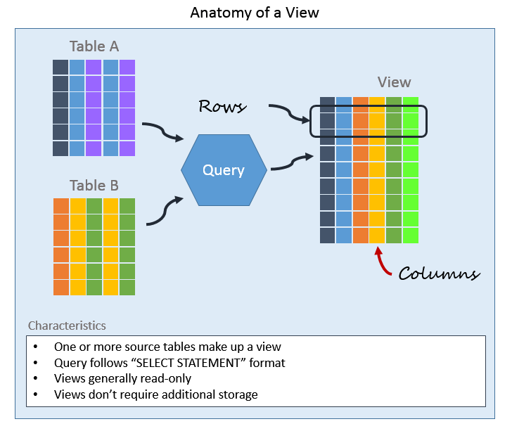

<div align="justify">

# Vistas en MySQL

En pocas palabras, las VIEWS ___son tablas virtuales___. Por virtual, queremos decir que las tablas no almacenan ningún dato propio, sino que muestran los datos almacenados en otras tablas.

_En otras palabras,_ ___VIEWS___ _no es más que_ ___SELECT Queries___.

```sql
CREATE VIEW `view_name` AS SELECT;
```

donde:
- __CREATE VIEW  view_name__ le dice al servidor MySQL que cree un objeto de vista en la base de datos llamado  __view_name__
- ___AS SELECT statement___ son las sentencias SQL que se empaquetarán en las vistas. Puede ser una instrucción __SELECT__ que puede contener datos de una tabla o varias tablas.

Supongamos que los requisitos de autorización establecen que el departamento de cuentas solo puede ver el _número, nombre y género_ del miembro en la tabla del _miembro_. Para lograr esto, puede crear una __VISTA__:

```sql
CREATE VIEW accounts_v_members AS SELECT membership_number, full_names, gender FROM members;
```
<div align="center">

</div>
</div>

Veamos un pequeño ejemplo:

 Una vista permite preservar los resultados obtenidos mediante una consulta. Esto es útil pues no se tienen que estar reescribiendo relaciones, agrupando resultado, ordenando los registros, etc. La vista se almacena en memoria como si fuera una tabla cualquiera. 

   Por ejemplo, la tabla que almacena las ventas, puede relacionarse con los empleados y los artículo. Podemos crear una vista que almacene esta relación como si fuera un *ticket*.
   
   Lo primero será, definir la consulta.

   ```sql
   SELECT v.clave, v.fecha, a.nombre producto, a.precio, concat(e.nombre, ' ', e.apellido_paterno) empleado 
   FROM venta v
   JOIN empleado e
     ON v.id_empleado = e.id_empleado
   JOIN articulo a
     ON v.id_articulo = a.id_articulo;
   ```
   
   
   
   
   Ahora crearemos la vista con la instrucción `CREATE VIEW`. Le daremos el nombre `tickets`.
    
   ```sql
   CREATE VIEW tickets AS
   (SELECT v.clave, v.fecha, a.nombre producto, a.precio, concat(e.nombre, ' ', e.apellido_paterno) empleado 
   FROM venta v
   JOIN empleado e
     ON v.id_empleado = e.id_empleado
   JOIN articulo a
     ON v.id_articulo = a.id_articulo);
   ```
   
3. Ahora que se ha creado la vista, pueden realizarse consultas sobre la misma al igual que con cualquier tabla.

   ```sql
   SELECT *
   FROM tickets;
   ```

   
 
   ```sql
   SELECT clave, round(sum(precio),2) total
   FROM tickets
   GROUP BY clave;	
   ```
  
   


  >__Nota__:Las vistas de una base de datos MySQL tienen la misma estructura de filas y columnas de una tabla, no puede haber una vista con el mismo nombre de una tabla.

Las sentencias relacionadas con vistas en MySQL son:

- __DROP VIEW MySQL__: Eliminar una vista creada.
- __ALTER VIEW MySQL__: Modificar las vistas de una base de datos.

Sintaxis de CREATE VIEW MySQL:

```sql
CREATE [OR REPLACE] VIEW nombre_vista [column_list]
AS consulta_SELECT
```

Donde:
- __OR REPLACE__: Reemplaza una vista existente en caso de coincidir en nombre.
nombre_vista: Nombre de la vista a crear.
- __column_list__: Listado de columnas a crear.
- __consulta_SELECT__: Consulta __SELECT__ que queremos realizar para obtener la información que contendrá la vista.

## Ventajas de usar vistas en MySQL

- __Privacidad de la información__: Mostramos a los usuarios con acceso a la vista únicamente la información que creamos conveniente. De esta manera no se tiene acceso a la tabla original con todas sus filas y columnas.
- __Optimización del rendimiento de la base de datos__: Podemos crear de querys sobre vistas complejas, es decir, vistas cuya información ha sido extraída y creada a través de unas SELECT complejas. De esta manera nos ahorramos estar ejecutando queys pesadas y atacamos directamente al resultado de dichas querys.
- __Tablas de prueba:__ Para los desarrolladores que no tengan entornos de preproducción es muy útil usar las vistas para no tener miedo a perder información.

## Ejemplo Fútbol

- Creamos la vista:
Una vista con todas las filas y columnas de la tabla futbolistas.
  
  ```sql
  CREATE VIEW  vista_futbolistas AS  SELECT * FROM futbolistas;
  ```

- Creamos una segunda vista:
Una vista con los datos de los futbolistas que contienen tarjetas amarillas usando la sentencia __INNER JOIN__.
  
  ```sql
  CREATE VIEW vista_futbolistas_amarilla AS  SELECT futbolistas.id, nombre, apellidos FROM futbolistas INNER JOIN tarjetas_amarillas  ON futbolistas.id = tarjetas_amarillas.id_futbolista;
  ```

- Una tercera vista con los futbolistas cuya edad sea mayor de __30 años__.

  ```sql
  CREATE VIEW  vista_futbolistas_30 AS  SELECT futbolistas.id, nombre, apellidos FROM futbolistas WHERE edad < 30;
  ```

## Referencias.

- [Documentación Oficial Visas](https://dev.mysql.com/doc/refman/8.0/en/views.html).


</div>