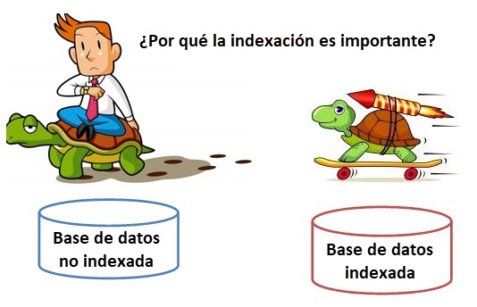

<div align="justify">

# Tarea 3 de trabajo con índices

<div align="center">

</div>

Vamos a continuar trabajando con índices. Se pide ejecutar cada una de las acciones necesarias para realizar las operaciones indicadas.

Las operaciones son las siguientes:

- Crea una base de datos que tendrá por nombre __Base_Indices__.

- En la BD crea una tabla de nombre MOVIMIENTO con la siguiente estructura:

    | Nombre del campo | Tipo de dato | Propiedades                |
    |------------------|--------------|----------------------------|
    | Identificador    | int       | AUTO_INCREMENT, __Clave primaria__  |
    | Articulo         | varchar(50)  | Obligatorio                |
    | Fecha            | date         | Obligatorio                |
    | Cantidad         | int     | Obligatorio                |

- Aplica la sentencia adecuada para visualizar los índices que hay en la tabla.
  
>__Nota__: _Muestra el resultado y razona la respueta_.

- Ejecuta la siguiente sentencia sql para generar datos de prueba:

    ```sql
    CREATE TABLE NumerosUnicos (
    Numero INT AUTO_INCREMENT PRIMARY KEY
    );

    INSERT INTO NumerosUnicos (Numero)
    SELECT NULL FROM INFORMATION_SCHEMA.COLUMNS LIMIT 5000;

    INSERT INTO MOVIMIENTO (Identificador, Articulo, Fecha, Cantidad)
    SELECT 
        n.Numero,
        CONCAT('Producto', n.Numero),
        DATE_ADD('2012-01-01', INTERVAL FLOOR(RAND() * 120) DAY),
        FLOOR(RAND() * 1000000) + 1
    FROM 
        NumerosUnicos n;

        DROP TABLE NumerosUnicos;
    ```

>__Nota__: _Muestra el resultado y razona la respueta. Ejecuta un count sobre la tabla_.

- Crea con la sentencia CREATE TABLE…SELECT… un duplicado de la tabla MOVIMIENTO a
la que llamaremos MOVIMIENTO_BIS.

```sql
create table MOVIMIENTO_BIS select * from MOVIMIENTO;
```

>__Nota__: _Muestra el resultado y razona la respueta_.

- Con la cláusula __DESCRIBE__ observa cuál es la situación de la tabla clonada, ¿Qué le pasa al
índice y a la propiedad __AUTO_INCREMENT__?

>__Nota__: _Compara el resultado con la tabla MOVIMIENTO_.

- Utilizando EXPLAIN observa el plan de ejecución de la consulta que devuelve toda la información de los movimientos con identificador=3. Tanto en la tabla MOVIMIENTOS como en la tabla MOVIMIENTOS_bis. Escribe tus conclusiones al respecto.

- Supongamos que las consultas de rango que se van a hacer en nuestra tabla son frecuentes y además no por el identificador, sino por la fecha. Este es motivo suficiente para que sea la fecha un índice de tabla y así mejorar el tiempo de respuesta de nuestras consultas.
En la tabla MOVIMIENTO_BIS creamos un índice para la fecha (IX_FECHA_BIS) y otro índice para el identificador (IX_IDENTIFICADOR).

- 8.- Analiza el plan de ejecución de las siguientes consultas y observa la diferencia:
Consulta1

```sql
select * from MOVIMIENTO where identificador=3;
```

consulta 2

```sql
select identificador from MOVIMIENTO_BIS where identificador=3;
```

Fíjata en que en la consulta 1 pedimos todos los campos. ¿A través de que indice se busca? ¿Por qué crees que lo hace así?
En la consulta 2 solo pedimos el identificador. ¿A través de que índice busca? ¿Por qué crees que lo hace así? Analiza la ejecución.

- Analiza el plan de ejecución de las siguientes consultas y observa la diferencia:

Consulta 1:

```sql
SELECT fecha FROM MOVIMIENTO WHERE fecha BETWEEN ‘01/01/2012’ and ‘01/03/2012’;
```

Consulta 2

```sql
SELECT * FROM MOVIMIENTO_BIS WHERE fecha BETWEEN ‘01/01/2012’ and ‘01/03/2012’;
```

Fijate que en la consulta 2 pedimos todos los campos. ¿A través de que índice busca? ¿Por qué crees que lo hace así?
En la consulta 1 solo pedimos la fecha. ¿A través de que índice busca? ¿Por qué crees que lo hace así? Analiza la ejecución.

- Vamos a crear un índice por fecha (IX_FECHA) en la tabla MOVIMIENTO, puesto que no lo tenía, en este caso la tabla ya tenía un indice, la clave primaria.
- Visualiza los indices de las tablas MOVIMIENTO y MOVIMIENTO_BIS.
- - Analiza el plan de ejecución de las siguientes consultas y observa la diferencia:
Consulta 1:

```sql
SELECT fecha FROM MOVIMIENTO WHERE fecha BETWEEN 01/01/2012 AND 01/03/2012;
```

Consulta 2:

```sql
SELECT * FROM MOVIMIENTO WHERE fecha BETWEEN 01/01/2012 AND 01/03/2012;
```

Consulta 3:

```sql
SELECT fecha FROM MOVIMIENTO_BIS WHERE fecha BETWEEN 01/01/2012 AND 01/03/2012;
```

Consulta 4:

```sql
SELECT * FROM MOVIMIENTO_BIS WHERE fecha BETWEEN 01/01/2012 AND 01/03/2012;
```
## Referencias

- [Índices en MySql](https://dev.mysql.com/doc/refman/8.0/en/mysql-indexes.html).
- [Apuntes sobre índices](../../Indices.md).

</div>