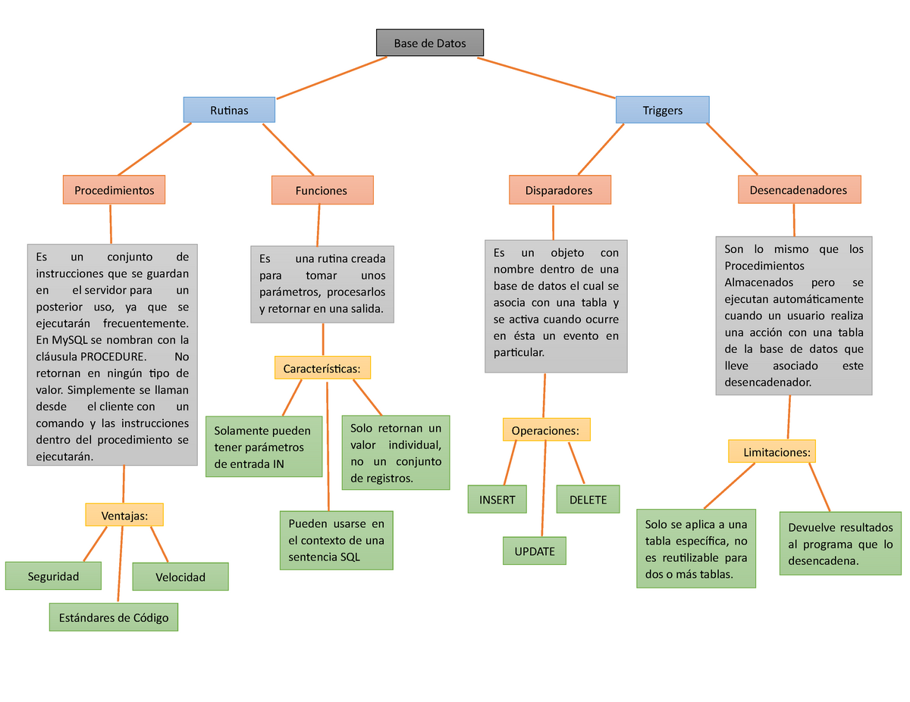

<!-- 
<div align="justify">

# Triggers, procedimientos y funciones en MySQL

En esta unidad vamos a estudiar los procedimientos, funciones y triggers de MySQL, que son objetos que contienen código SQL y se almacenan asociados a una base de datos.

- __Procedimiento almacenado__: Es un objeto que se crea con la sentencia __CREATE PROCEDURE__ y se invoca con la sentencia __CALL__. Un procedimiento puede tener cero o muchos parámetros de entrada y cero o muchos parámetros de salida.

- __Función almacenada__: Es un objeto que se crea con la sentencia __CREATE FUNCTION__ y se invoca con la sentencia __SELECT__ o dentro de una expresión. Una función puede tener cero o muchos parámetros de entrada y siempre devuelve un valor, asociado al nombre de la función.

- __Trigger__: Es un objeto que se crea con la sentencia __CREATE TRIGGER__ y tiene que estar asociado a una tabla. Un trigger se activa cuando ocurre un evento de inserción, actualización o borrado, sobre la tabla a la que está asociado.

## Procedimientos

Un procedimiento almacenado es un conjunto de instrucciones SQL que se almacena asociado a una base de datos. Es un objeto que se crea con la sentencia CREATE PROCEDURE y se invoca con la sentencia CALL. Un procedimiento puede tener cero o muchos parámetros de entrada y cero o muchos parámetros de salida.

### Sintaxis

```sql
CREATE
    [DEFINER = { user | CURRENT_USER }]
    PROCEDURE sp_name ([proc_parameter[,...]])
    [characteristic ...] routine_body

proc_parameter:
    [ IN | OUT | INOUT ] param_name type

func_parameter:
    param_name type

type:
    Any valid MySQL data type

characteristic:
    COMMENT 'string'
  | LANGUAGE SQL
  | [NOT] DETERMINISTIC
  | { CONTAINS SQL | NO SQL | READS SQL DATA | MODIFIES SQL DATA }
  | SQL SECURITY { DEFINER | INVOKER }

routine_body:
    Valid SQL routine statement
```

Nota > Puede encontrar más información en la documentación oficial de MySQL.
### DELIMITER

Para definir un procedimiento almacenado es necesario modificar temporalmente el carácter separador que se utiliza para delimitar las sentencias SQL.

El carácter separador que se utiliza por defecto en SQL es el punto y coma __(;)__. En los ejemplos que vamos a realizar en esta unidad vamos a utilizar los caracteres __$$__ para delimitar las instrucciones SQL, __pero es posible utilizar cualquier otro carácter__.

__Ejemplo__:

En este ejemplo estamos configurando los caracteres __$$__ como los separadores entre las sentencias SQL.

```sql
DELIMITER $$
```

__Ejemplo__:

En este ejemplo volvemos a configurar que el carácter separador es el punto y coma.

```sql
DELIMITER ;
```

### Parámetros de entrada, salida y entrada/salida

En los procedimientos almacenados podemos tener tres tipos de parámetros:

- __Entrada__: Se indican poniendo la palabra reservada IN delante del nombre del parámetro. Estos parámetros no pueden cambiar su valor dentro del procedimiento, es decir, cuando el procedimiento finalice estos parámetros tendrán el mismo valor que tenían cuando se hizo la llamada al procedimiento. En programación sería equivalente al paso por valor de un parámetro.
- __Salida__: Se indican poniendo la palabra reservada OUT delante del nombre del parametro. Estos parámetros cambian su valor dentro del procedimiento. Cuando se hace la llamada al procedimiento empiezan con un valor inicial y cuando finaliza la ejecución del procedimiento pueden terminar con otro valor diferente. En programación sería equivalente al paso por referencia de un parámetro.
- __Entrada/Salida__: Es una combinación de los tipos IN y OUT. Estos parámetros se indican poniendo la palabra reservada IN/OUT delante del nombre del parámetro.

__Ejemplo__:

_En este ejemplo, se muestra la cabecera de un procedimiento llamado___ __listar_productos__ _que sólo tiene el parámetro gama que es de entrada (IN)_.

```sql
CREATE PROCEDURE listar_productos(IN gama VARCHAR(50))
```

__Ejemplo__:

_Aquí se muestra la cabecera de un procedimiento llamado_ ___contar_productos___ _que tiene el parámetro gama de entrada (IN) y el parámetro total de salida (OUT)_.

```sql
CREATE PROCEDURE contar_productos(IN gama VARCHAR(50), OUT total INT UNSIGNED)
```

__Ejemplo de un procedimiento con parámetros de entrada___

_Escriba un procedimiento llamado_ ___listar_productos___ _que reciba como entrada el nombre de la gama y muestre un listado de todos los productos que existen dentro de esa gama. Este procedimiento no devuelve ningún parámetro de salida, lo que hace es mostrar el listado de los productos_.

```sql
DELIMITER $$
DROP PROCEDURE IF EXISTS listar_productos$$
CREATE PROCEDURE listar_productos(IN gama VARCHAR(50))
BEGIN
  SELECT *
  FROM producto
  WHERE producto.gama = gama;
END
$$
```

### Llamada de procedimientos con CALL

Para hacer la llamada a un procedimiento almacenado se utiliza la palabra reservada __CALL__.

__Ejemplo__:

```sql
DELIMITER ;
CALL listar_productos('Herramientas');
SELECT * FROM producto;
```

### Ejemplos de procedimientos con parámetros de salida

__Ejemplo__:

_Escriba un procedimiento llamado_ ___contar_productos___ _que reciba como entrada el nombre de la gama y devuelva el número de productos que existen dentro de esa gama. Resuelva el ejercicio de dos formas distintas, utilizando SET y SELECT ... INTO._

__Solución 1. Utilizando SET__

```sql
DELIMITER $$
DROP PROCEDURE IF EXISTS contar_productos$$
CREATE PROCEDURE contar_productos(IN gama VARCHAR(50), OUT total INT UNSIGNED)
BEGIN
  SET total = (
    SELECT COUNT(*) 
    FROM producto 
    WHERE producto.gama = gama);
END
$$

DELIMITER ;
CALL contar_productos('Herramientas', @total);
SELECT @total;
```

__Solución 2. Utilizando SELECT ... INTO__

```sql
DELIMITER $$
DROP PROCEDURE IF EXISTS contar_productos$$
CREATE PROCEDURE contar_productos(IN gama VARCHAR(50), OUT total INT UNSIGNED)
BEGIN
  SELECT COUNT(*) 
  INTO total
  FROM producto 
  WHERE producto.gama = gama;
END
$$

DELIMITER ;
CALL contar_productos('Herramientas', @total);
SELECT @total;
```

__Ejemplo:__

_Escribe un procedimiento que se llame_ ___calcular_max_min_media__, _que reciba como parámetro de entrada el nombre de la gama de un producto y devuelva como salida tres parámetros. El precio máximo, el precio mínimo y la media de los productos que existen en esa gama. Resuelva el ejercicio de dos formas distintas, utilizando_ ___SET y SELECT ... INTO___.

__Solucioń 1. Utilizando SET__

```sql
DELIMITER $$
DROP PROCEDURE IF EXISTS calcular_max_min_media$$
CREATE PROCEDURE calcular_max_min_media(
  IN gama VARCHAR(50),
    OUT maximo DECIMAL(15, 2),
  OUT minimo DECIMAL(15, 2),
    OUT media DECIMAL(15, 2)
)
BEGIN
  SET maximo = (
    SELECT MAX(precio_venta)
    FROM producto
        WHERE producto.gama = gama);
  
  SET minimo = (
    SELECT MIN(precio_venta)
    FROM producto
        WHERE producto.gama = gama);
  
  SET media = (
    SELECT AVG(precio_venta)
    FROM producto
        WHERE producto.gama = gama);
END
$$

DELIMITER ;
CALL calcular_max_min_media('Herramientas', @maximo, @minimo, @media);
SELECT @maximo, @minimo, @media;
```

__Solucioń 2. Utilizando SELECT ... INTO__

```sql
DELIMITER $$
DROP PROCEDURE IF EXISTS calcular_max_min_media$$
CREATE PROCEDURE calcular_max_min_media(
  IN gama VARCHAR(50),
    OUT maximo DECIMAL(15, 2),
  OUT minimo DECIMAL(15, 2),
    OUT media DECIMAL(15, 2)
)
BEGIN
  SELECT 
    MAX(precio_venta),
    MIN(precio_venta),
    AVG(precio_venta)
    FROM producto
  WHERE producto.gama = gama
    INTO maximo, minimo, media;
END
$$

DELIMITER ;
CALL calcular_max_min_media('Herramientas', @maximo, @minimo, @media);
SELECT @maximo, @minimo, @media;
```

## Funciones

_Una función almacenada es un conjunto de instrucciones SQL que se almacena asociado a una base de datos_. Es un objeto que se crea con la sentencia __CREATE FUNCTION__ y se invoca con la sentencia __SELECT__ o __dentro de una expresión__. _Una función puede tener cero o muchos parámetros de entrada y siempre devuelve un valor, asociado al nombre de la función_.

### Sintaxis

```sql
CREATE
    [DEFINER = { user | CURRENT_USER }]
    FUNCTION sp_name ([func_parameter[,...]])
    RETURNS type
    [characteristic ...] routine_body

func_parameter:
    param_name type

type:
    Any valid MySQL data type

characteristic:
    COMMENT 'string'
  | LANGUAGE SQL
  | [NOT] DETERMINISTIC
  | { CONTAINS SQL | NO SQL | READS SQL DATA | MODIFIES SQL DATA }
  | SQL SECURITY { DEFINER | INVOKER }

routine_body:
    Valid SQL routine statement
```

Puede encontrar más información en la documentación oficial de MySQL.

### Parámetros de entrada

En una función todos los parámetros son de entrada, por lo tanto, no será necesario utilizar la palabra reservada IN delante del nombre de los parámetros.

__Ejemplo__:

A continuación se muestra la cabecera de la función contar_productos que tiene un parámetro de entrada llamado gama.

```sql
CREATE FUNCTION contar_productos(gama VARCHAR(50))
```

### Resultado de salida

Una función siempre devolverá un valor de salida asociado al nombre de la función. En la definición de la cabecera de la función hay que definir el tipo de dato que devuelve con la palabra reservada RETURNS y en el cuerpo de la función debemos incluir la palabra reservada RETURN para devolver el valor de la función.

__Ejemplo__:

En este ejemplo se muestra una definción incompleta de una función donde se se puede ver el uso de las palabras reservadas RETURNS y RETURN.

```sql
DELIMITER $$
DROP FUNCTION IF EXISTS contar_productos$$
CREATE FUNCTION contar_productos(gama VARCHAR(50))
  RETURNS INT UNSIGNED
  ...
BEGIN
  ...

  RETURN total;
END
$$
```

### Características de la función

Después de la definición del tipo de dato que devolverá la función con la palabra reservada RETURNS, tenemos que indicar las características de la función. Las opciones disponibles son las siguientes:

- __DETERMINISTIC__: Indica que la función siempre devuelve el mismo resultado cuando se utilizan los mismos parámetros de entrada.
- __NOT DETERMINISTIC__: Indica que la función no siempre devuelve el mismo resultado, aunque se utilicen los mismos parámetros de entrada. Esta es la opción que se selecciona por defecto cuando no se indica una característica de forma explícita.
- __CONTAINS SQL__: Indica que la función contiene sentencias SQL, pero no contiene sentencias de manipulación de datos. Algunos ejemplos de sentencias SQL que pueden aparecer en este caso son operaciones con variables _(Ej: SET @x = 1)_ o uso de funciones de MySQL _(Ej: SELECT NOW();)_ entre otras. Pero en ningún caso aparecerán sentencias de escritura o lectura de datos.
- __NO SQL__: Indica que la función no contiene sentencias SQL.
- __READS SQL DATA__: Indica que la función no modifica los datos de la base de datos y que contiene sentencias de lectura de datos, como la sentencia SELECT.
- __MODIFIES SQL DATA__: Indica que la función sí modifica los datos de la base de datos y que contiene sentencias como _INSERT, UPDATE o DELETE_.

Para poder crear una función en MySQL es necesario indicar al menos una de estas tres características:
- DETERMINISTIC
- NO SQL
- READS SQL DATA

Si no se indica al menos una de estas características obtendremos el siguiente mensaje de error.

```sql
ERROR 1418 (HY000): This function has none of DETERMINISTIC, NO SQL,
or READS SQL DATA in its declaration and binary logging is enabled
(you *might* want to use the less safe log_bin_trust_function_creators variable)
```

Es posible configurar el valor de la varible global log_bin_trust_function_creators a 1, para indicar a MySQL que queremos eliminar la restricción de indicar alguna de las características anteriores cuando definimos una función almacenada. Esta variable está configurada con el valor 0 por defecto y para poder modificarla es necesario contar con el privilegio SUPER.

```sql
SET GLOBAL log_bin_trust_function_creators = 1;
```

En lugar de configurar la variable global en tiempo de ejecución, es posible modificarla en el archivo de configuración de MySQL.

### Declaración de variables locales con DECLARE

Tanto en los procedimientos como en las funciones es posible declarar variables locales con la palabra reservada DECLARE.

La sintaxis para declarar variables locales con DECLARE es la siguiente.

```sql
DECLARE var_name [, var_name] ... type [DEFAULT value]
```

El ámbito de una variable local será el bloque BEGIN y END del procedimiento o la función donde ha sido declarada.

Una restricción que hay que tener en cuenta a la hora de trabajar con variables locales, es que se deben declarar antes de los cursores y los handlers.

__Ejemplo__:

En este ejemplo estamos declarando una variable local con el nombre total que es de tipo INT UNSIGNED.

```sql
DECLARE total INT UNSIGNED;
```

Puede encontrar más información en la documentación oficial de MySQL.

__Ejemplo__:

Escriba una función llamada contar_productos que reciba como entrada el nombre de la gama y devuelva el número de productos que existen dentro de esa gama.

```sql
DELIMITER $$
DROP FUNCTION IF EXISTS contar_productos$$
CREATE FUNCTION contar_productos(gama VARCHAR(50))
  RETURNS INT UNSIGNED
BEGIN
  -- Paso 1. Declaramos una variable local
  DECLARE total INT UNSIGNED;

  -- Paso 2. Contamos los productos
  SET total = (
    SELECT COUNT(*) 
    FROM producto 
    WHERE producto.gama = gama);

  -- Paso 3. Devolvemos el resultado
  RETURN total;
END
$$

DELIMITER ;
SELECT contar_productos('Herramientas');
```

## Estructuras de control

### Instrucciones condicionales

#### IF-THEN-ELSE

```sql
IF search_condition THEN statement_list
    [ELSEIF search_condition THEN statement_list] ...
    [ELSE statement_list]
END IF
```

Puede encontrar más información en la documentación oficial de MySQL.

#### CASE

Existen dos formas de utilzar CASE:

```sql
CASE case_value
    WHEN when_value THEN statement_list
    [WHEN when_value THEN statement_list] ...
    [ELSE statement_list]
END CASE
```

o

```sql
CASE
    WHEN search_condition THEN statement_list
    [WHEN search_condition THEN statement_list] ...
    [ELSE statement_list]
END CASE
```

Puede encontrar más información en la documentación oficial de MySQL.

### Instrucciones repetitivas o bucles

#### LOOP

```sql
[begin_label:] LOOP
    statement_list
END LOOP [end_label]
```

__Ejemplo:__

```sql
CREATE PROCEDURE doiterate(p1 INT)
BEGIN
  label1: LOOP
    SET p1 = p1 + 1;
    IF p1 < 10 THEN
      ITERATE label1;
    END IF;
    LEAVE label1;
  END LOOP label1;
  SET @x = p1;
END;
```

__Ejemplo:__

```sql
DELIMITER $$
DROP PROCEDURE IF EXISTS ejemplo_bucle_loop$$
CREATE PROCEDURE ejemplo_bucle_loop(IN tope INT, OUT suma INT)
BEGIN
  DECLARE contador INT;
    
  SET contador = 1;
  SET suma = 0;
    
  bucle: LOOP
    IF contador > tope THEN
      LEAVE bucle;
    END IF;

    SET suma = suma + contador;
    SET contador = contador + 1;
  END LOOP;
END
$$

DELIMITER ;
CALL ejemplo_bucle_loop(10, @resultado);
SELECT @resultado;
```

Puede encontrar más información en la documentación oficial de MySQL.

#### REPEAT

```sql
[begin_label:] REPEAT
    statement_list
UNTIL search_condition
END REPEAT [end_label]
```

__Ejemplo:__

```sql
DELIMITER $$
DROP PROCEDURE IF EXISTS ejemplo_bucle_repeat$$
CREATE PROCEDURE ejemplo_bucle_repeat(IN tope INT, OUT suma INT)
BEGIN
  DECLARE contador INT;
    
    SET contador = 1;
    SET suma = 0;
    
    REPEAT
    SET suma = suma + contador;
    SET contador = contador + 1;
  UNTIL contador > tope
  END REPEAT;
END
$$

DELIMITER ;
CALL ejemplo_bucle_repeat(10, @resultado);
SELECT @resultado;
```

Puede encontrar más información en la documentación oficial de MySQL.

#### WHILE

```sql
[begin_label:] WHILE search_condition DO
    statement_list
END WHILE [end_label]
```

__Ejemplo:__

```sql
DELIMITER $$
DROP PROCEDURE IF EXISTS ejemplo_bucle_while$$
CREATE PROCEDURE ejemplo_bucle_while(IN tope INT, OUT suma INT)
BEGIN
  DECLARE contador INT;
    
  SET contador = 1;
  SET suma = 0;
    
  WHILE contador <= tope DO
    SET suma = suma + contador;
    SET contador = contador + 1;
  END WHILE;
END
$$

DELIMITER ;
CALL ejemplo_bucle_while(10, @resultado);
SELECT @resultado;
```

Puede encontrar más información en la documentación oficial de MySQL.

## Manejo de errores

### DECLARE ... HANDLER

```sql
DECLARE handler_action HANDLER
    FOR condition_value [, condition_value] ...
    statement

handler_action:
    CONTINUE
  | EXIT
  | UNDO

condition_value:
    mysql_error_code
  | SQLSTATE [VALUE] sqlstate_value
  | condition_name
  | SQLWARNING
  | NOT FOUND
  | SQLEXCEPTION
```

Las acciones posibles que podemos seleccionar como handler_action son:
- __CONTINUE__: La ejecución del programa continúa.
- __EXIT__: Termina la ejecución del programa.
- __UNDO__: No está soportado en MySQL.

Puede encontrar más información en la documentación oficial de MySQL.

__Ejemplo indicando el número de error de MySQL:__

_En este ejemplo estamos declarando un handler que se ejecutará cuando se produzca el_ ___error 1051 de MySQL___, _que ocurre cuando se intenta acceder a una tabla que no existe en la base de datos. En este caso la acción del handler es_ ___CONTINUE___ lo que quiere decir que después de ejecutar las instrucciones especificadas en el cuerpo del handler el procedimiento almacenado continuará su ejecución_.

```sql
DECLARE CONTINUE HANDLER FOR 1051
BEGIN
  -- body of handler
END;
```

__Ejemplo para SQLSTATE:__

También podemos indicar el valor de la variable SQLSTATE. Por ejemplo, cuando se intenta acceder a una tabla que no existe en la base de datos, el valor de la variable SQLSTATE es 42S02.

```sql
DECLARE CONTINUE HANDLER FOR SQLSTATE '42S02'
BEGIN
  -- body of handler
END;
```

__Ejemplo para SQLWARNING:__

Es equivalente a indicar todos los valores de SQLSTATE que empiezan con 01.

```sql
DECLARE CONTINUE HANDLER FOR SQLWARNING
BEGIN
  -- body of handler
END;
```

__Ejemplo para NOT FOUND:__

Es equivalente a indicar todos los valores de SQLSTATE que empiezan con 02. Lo usaremos cuando estemos trabajando con cursores para controlar qué ocurre cuando un cursor alcanza el final del data set. Si no hay más filas disponibles en el cursor, entonces ocurre una condición de NO DATA con un valor de SQLSTATE igual a 02000. Para detectar esta condición podemos usar un handler para controlarlo.

```sql
DECLARE CONTINUE HANDLER FOR NOT FOUND
BEGIN
  -- body of handler
END;
```

__Ejemplo para SQLEXCEPTION:__

Es equivalente a indicar todos los valores de SQLSTATE que empiezan por 00, 01 y 02.

```sql
DECLARE CONTINUE HANDLER FOR SQLEXCEPTION
BEGIN
  -- body of handler
END;
```

__Ejemplo DECLARE CONTINUE HANDLER:__

```sql
-- Paso 1
DROP DATABASE IF EXISTS test;
CREATE DATABASE test;
USE test;

-- Paso 2
CREATE TABLE test.t (s1 INT, PRIMARY KEY (s1));

-- Paso 3
DELIMITER $$
CREATE PROCEDURE handlerdemo ()
BEGIN
  DECLARE CONTINUE HANDLER FOR SQLSTATE '23000' SET @x = 1;
  SET @x = 1;
  INSERT INTO test.t VALUES (1);
  SET @x = 2;
  INSERT INTO test.t VALUES (1);
  SET @x = 3;
END
$$

DELIMITER ;
CALL handlerdemo();
SELECT @x; 
```

Nota>¿Qué valor devolvería la sentencia SELECT @x?

__Ejemplo DECLARE EXIT HANDLER__

```sql
-- Paso 1
DROP DATABASE IF EXISTS test;
CREATE DATABASE test;
USE test;

-- Paso 2
CREATE TABLE test.t (s1 INT, PRIMARY KEY (s1));

-- Paso 3
DELIMITER $$
CREATE PROCEDURE handlerdemo ()
BEGIN
  DECLARE EXIT HANDLER FOR SQLSTATE '23000' SET @x = 1;
  SET @x = 1;
  INSERT INTO test.t VALUES (1);
  SET @x = 2;
  INSERT INTO test.t VALUES (1);
  SET @x = 3;
END
$$

DELIMITER ;
CALL handlerdemo();
SELECT @x; 
```

>__Nota:__¿Qué valor devolvería la sentencia SELECT @x?

## Cómo realizar transacciones con procedimientos almacenados

Podemos utilizar el manejo de errores para decidir si hacemos ROLLBACK de una transacción. En el siguiente ejemplo vamos a capturar los errores que se produzcan de tipo SQLEXCEPTION y SQLWARNING.

__Ejemplo:__

```sql
DELIMITER $$
CREATE PROCEDURE transaccion_en_mysql()
BEGIN
  DECLARE EXIT HANDLER FOR SQLEXCEPTION
    BEGIN
      -- ERROR
      ROLLBACK;
  END;
 
  DECLARE EXIT HANDLER FOR SQLWARNING
  BEGIN
      -- WARNING
  ROLLBACK;
  END;

  START TRANSACTION;
    -- Sentencias SQL
  COMMIT;
END
$$
```

En lugar de tener un manejador para cada tipo de error, podemos tener uno común para todos los casos.

```sql
DELIMITER $$
CREATE PROCEDURE transaccion_en_mysql()
BEGIN
  DECLARE EXIT HANDLER FOR SQLEXCEPTION, SQLWARNING
    BEGIN
      -- ERROR, WARNING
      ROLLBACK;
  END;
 
  START TRANSACTION;
    -- Sentencias SQL
  COMMIT;
END
$$
```

## Cursores

Los cursores nos permiten almacenar una conjunto de filas de una tabla en una estructura de datos que podemos ir recorriendo de forma secuencial.

Los cursores tienen las siguientes propiedades:

- __Asensitive__: The server may or may not make a copy of its result table.
- __Read only__: son de sólo lectura. No permiten actualizar los datos.
- __Nonscrollable__: sólo pueden ser recorridos en una dirección y no podemos saltarnos filas.

Cuando declaramos un cursor dentro de un procedimiento almacenado debe aparecer antes de las declaraciones de los manejadores de errores (HANDLER) y después de la declaración de variables locales.

### Operaciones con cursores

Las operaciones que podemos hacer con los cursores son las siguientes:

#### DECLARE

El primer paso que tenemos que hacer para trabajar con cursores es declararlo. La sintaxis para declarar un cursor es:

```sql
DECLARE cursor_name CURSOR FOR select_statement
```

#### OPEN

Una vez que hemos declarado un cursor tenemos que abrirlo con OPEN.

```sql
OPEN cursor_name
```

#### FETCH

Una vez que el cursor está abierto podemos ir obteniendo cada una de las filas con FETCH. La sintaxis es la siguiente:

```sql
FETCH [[NEXT] FROM] cursor_name INTO var_name [, var_name] ...
```

Cuando se está recorriendo un cursor y no quedan filas por recorrer se lanza el error NOT FOUND, que se corresponde con el valor SQLSTATE ‘02000’. Por eso cuando estemos trabajando con cursores será necesario declarar un handler para manejar este error.

```sql
DECLARE CONTINUE HANDLER FOR NOT FOUND ...
```

#### CLOSE

Cuando hemos terminado de trabajar con un cursor tenemos que cerrarlo.

```sql
CLOSE cursor_name
```

__Ejemplo:__

```sql
-- Paso 1
DROP DATABASE IF EXISTS test;
CREATE DATABASE test;
USE test;

-- Paso 2
CREATE TABLE t1 (
  id INT UNSIGNED PRIMARY KEY,
    data VARCHAR(16)
);

CREATE TABLE t2 (
  i INT UNSIGNED
);

CREATE TABLE t3 (
  data VARCHAR(16),
    i INT UNSIGNED
);

INSERT INTO t1 VALUES (1, 'A');
INSERT INTO t1 VALUES (2, 'B');

INSERT INTO t2 VALUES (10);
INSERT INTO t2 VALUES (20);

-- Paso 3
DELIMITER $$
DROP PROCEDURE IF EXISTS cuardemo$$
CREATE PROCEDURE cuardemo()
BEGIN
  DECLARE done INT DEFAULT FALSE;
  DECLARE a CHAR(16);
  DECLARE b, c INT;
  DECLARE cur1 CURSOR FOR SELECT id,data FROM test.t1;
  DECLARE cur2 CURSOR FOR SELECT i FROM test.t2;
  DECLARE CONTINUE HANDLER FOR NOT FOUND SET done = TRUE;

  OPEN cur1;
  OPEN cur2;

  read_loop: LOOP
    FETCH cur1 INTO b, a;
    FETCH cur2 INTO c;
    IF done THEN
      LEAVE read_loop;
    END IF;
    IF b < c THEN
      INSERT INTO test.t3 VALUES (a,b);
    ELSE
      INSERT INTO test.t3 VALUES (a,c);
    END IF;
  END LOOP;

  CLOSE cur1;
  CLOSE cur2;
END

-- Paso 4
DELIMITER ;
CALL cuardemo();

SELECT * FROM t3;
```

__Solución utilizando un bucle WHILE:__

```sql
DELIMITER $$
DROP PROCEDURE IF EXISTS curdemo$$
CREATE PROCEDURE curdemo()
BEGIN
  DECLARE done INT DEFAULT FALSE;
  DECLARE a CHAR(16);
  DECLARE b, c INT;
  DECLARE cur1 CURSOR FOR SELECT id,data FROM test.t1;
  DECLARE cur2 CURSOR FOR SELECT i FROM test.t2;
  DECLARE CONTINUE HANDLER FOR NOT FOUND SET done = TRUE;

  OPEN cur1;
  OPEN cur2;

  WHILE done = FALSE DO
    FETCH cur1 INTO b, a;
    FETCH cur2 INTO c;
  
    IF done = FALSE THEN
    IF b < c THEN
      INSERT INTO test.t3 VALUES (a,b);
    ELSE
      INSERT INTO test.t3 VALUES (a,c);
    END IF;
  END IF;
  END WHILE;

  CLOSE cur1;
  CLOSE cur2;
END;
```

## Triggers

```sql
CREATE
    [DEFINER = { user | CURRENT_USER }]
    TRIGGER trigger_name
    trigger_time trigger_event
    ON tbl_name FOR EACH ROW
    [trigger_order]
    trigger_body

trigger_time: { BEFORE | AFTER }

trigger_event: { INSERT | UPDATE | DELETE }

trigger_order: { FOLLOWS | PRECEDES } other_trigger_name
```

Un trigger es un objeto de la base de datos que está asociado con una tabla y que se activa cuando ocurre un evento sobre la tabla.

Los eventos que pueden ocurrir sobre la tabla son:
- __INSERT__: El trigger se activa cuando se inserta una nueva fila sobre la tabla asociada.
- __UPDATE__: El trigger se activa cuando se actualiza una fila sobre la tabla asociada.
- __DELETE__: El trigger se activa cuando se elimina una fila sobre la tabla asociada.

__Ejemplo:__

Crea una base de datos llamada test que contenga una tabla llamada alumnos con las siguientes columnas.

Tabla alumnos:
- id (entero sin signo)
- nombre (cadena de caracteres)
- apellido1 (cadena de caracteres)
- apellido2 (cadena de caracteres)
- nota (número real)

Una vez creada la tabla escriba dos triggers con las siguientes características:

```sql
    Trigger 1: trigger_check_nota_before_insert
        Se ejecuta sobre la tabla alumnos.
        Se ejecuta antes de una operación de inserción.
        Si el nuevo valor de la nota que se quiere insertar es negativo, se guarda como 0.
        Si el nuevo valor de la nota que se quiere insertar es mayor que 10, se guarda como 10.
    Trigger2 : trigger_check_nota_before_update
        Se ejecuta sobre la tabla alumnos.
        Se ejecuta antes de una operación de actualización.
        Si el nuevo valor de la nota que se quiere actualizar es negativo, se guarda como 0.
        Si el nuevo valor de la nota que se quiere actualizar es mayor que 10, se guarda como 10.
```

Una vez creados los triggers escriba varias sentencias de inserción y actualización sobre la tabla alumnos y verifica que los triggers se están ejecutando correctamente.

```sql
-- Paso 1
DROP DATABASE IF EXISTS test;
CREATE DATABASE test;
USE test;

-- Paso 2 
CREATE TABLE alumnos (
    id INT UNSIGNED AUTO_INCREMENT PRIMARY KEY,
    nombre VARCHAR(50) NOT NULL,
    apellido1 VARCHAR(50) NOT NULL,
    apellido2 VARCHAR(50), 
    nota FLOAT
);

-- Paso 3
DELIMITER $$
DROP TRIGGER IF EXISTS trigger_check_nota_before_insert$$
CREATE TRIGGER trigger_check_nota_before_insert
BEFORE INSERT
ON alumnos FOR EACH ROW
BEGIN
  IF NEW.nota < 0 THEN
    set NEW.nota = 0;
  ELSEIF NEW.nota > 10 THEN
    set NEW.nota = 10;
  END IF;
END

DELIMITER $$
DROP TRIGGER IF EXISTS trigger_check_nota_before_update$$
CREATE TRIGGER trigger_check_nota_before_update
BEFORE UPDATE
ON alumnos FOR EACH ROW
BEGIN
  IF NEW.nota < 0 THEN
    set NEW.nota = 0;
  ELSEIF NEW.nota > 10 THEN
    set NEW.nota = 10;
  END IF;
END

-- Paso 4
DELIMITER ;
INSERT INTO alumnos VALUES (1, 'Pepe', 'López', 'López', -1);
INSERT INTO alumnos VALUES (2, 'María', 'Sánchez', 'Sánchez', 11);
INSERT INTO alumnos VALUES (3, 'Juan', 'Pérez', 'Pérez', 8.5);

-- Paso 5
SELECT * FROM alumnos;

-- Paso 6
UPDATE alumnos SET nota = -4 WHERE id = 3;
UPDATE alumnos SET nota = 14 WHERE id = 3;
UPDATE alumnos SET nota = 9.5 WHERE id = 3;

-- Paso 7
SELECT * FROM alumnos;
```
## Resumen

<div align="center">

</div>

</div>
-->