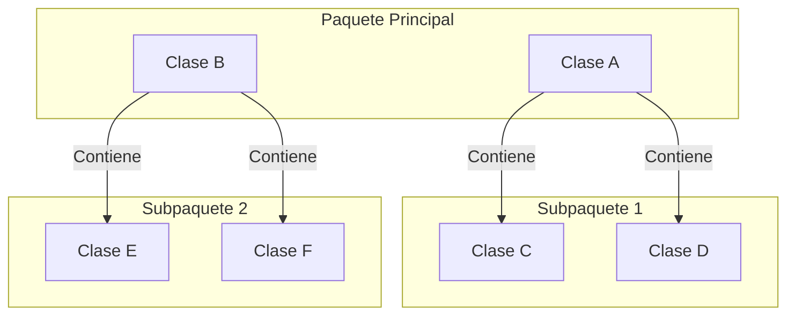

# Diagramas de Páquetes

Los __diagramas de paquetes__ son una herramienta de modelado en UML que se utiliza para __organizar y estructurar__ _elementos en una aplicación_. Se centran en la agrupación lógica de elementos relacionados, proporcionando una vista jerárquica y modular del sistema.

## Estructura Básica del Diagrama

Un diagrama de paquetes está compuesto por "__paquetes__" que representan unidades de organización y agrupación. Estos paquetes pueden contener elementos como __clases, interfaces, subpaquetes__, y __otros elementos__ del sistema.

Un paquete además puede contener otro paquete. 

Como ejemplo, un paquete que contiene otros paquetes tendría la siguiente representación:

## Dependencia entre paquetes
Una dependencia entre paquetes representan que un paquete necesita de los elementos de otro paquete para poder funcionar con normalidad.

Se representa con una __flecha discontinua__ que va desde el paquete que requiere la función hasta el paquete que ofrece esa función.

### Ejemplo

Ejemplo de paquete que incluye otros paquetes
En esta imagen se dice que el Paquete Origen depende del Paquete Destino para dar su servicio.

### Ejemplo

A continuación se muestra, a modo de ejemplo, un diagrama de paquetes de una aplicación:

- La aplicación, que tiene como finalidad la recepción y gestión de quejas y sugerencias, estaría compuesta por los siguientes paquetes:
  - Capa de presentación. Incluye a su vez los paquetes Interfaz de Usuario e Interfaz Admin
  - Capa de Lógica de Negocio, con los siguientes paquetes:
    - Subsistema de recepción de dudas y sugerencias.
     - Subsistema de asignación de responsable.
     - Subsistema de creación de informes.
  - Gestor documental.
     - Subsistema de gestión de usuarios.
   - Envío de notificaciones.
   - Base de datos.
   - CRM.
   - DataWarehouse.

>__Nota__:Como puedes observar, cada uno de los subpaquetes podría expandirse en otros paquetes, hasta llegar al punto de tener unos paquetes primitivos que no pueden volver a explotarse.

>__Nota__: __mermaid__ no soporta diagrama de paquetes pero puedes simularlo de la siguiente forma.
---

