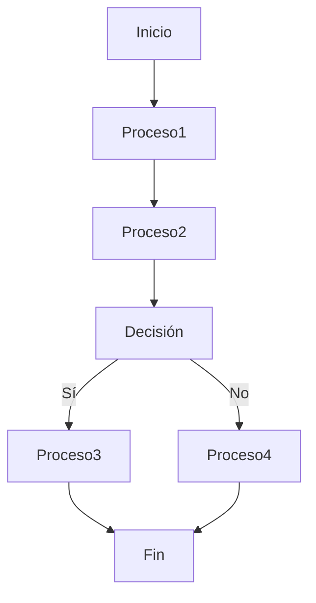
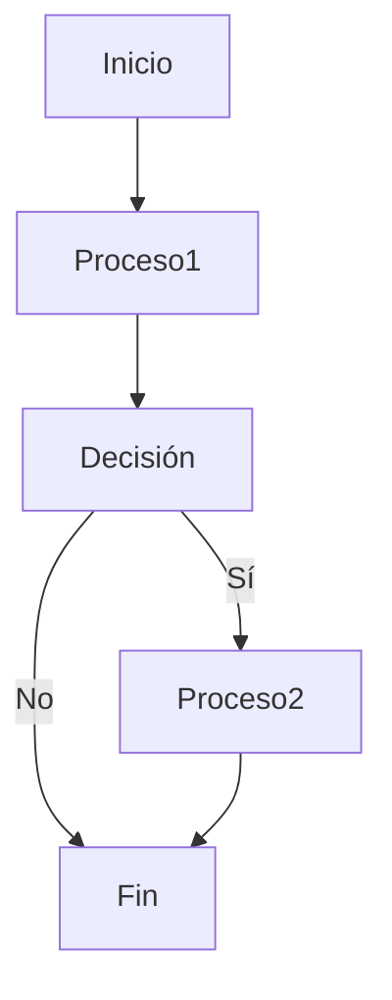
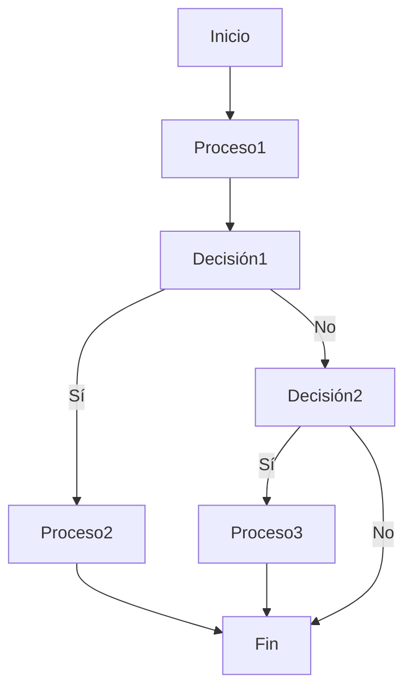
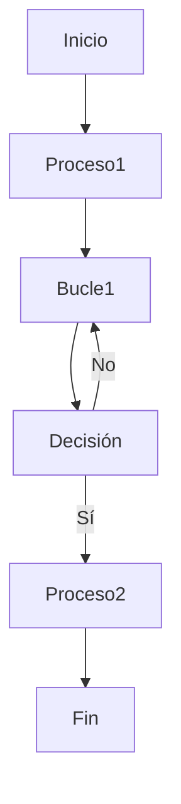
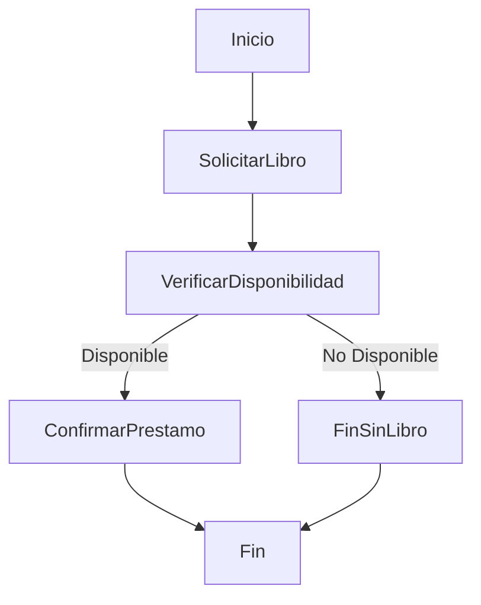

<div align="justify">

# Diagramas de Actividad

Un diagrama de Actividad muestra __el conjunto de actividades__ que deben ser realizadas en __un determinado caso de uso__, así como _los diferentes caminos  por los cuales  pueden irse desenvolviendo para logar un objetivo particular_.

Es importante enfatizar que aunque _un diagrama de actividad_ es muy __similar en definición__ a un _diagrama de flujo_ de un determinado __algoritmo__, estos no son lo mismo. Un diagrama de actividad __es utilizado en compañía de un diagrama de casos de uso__ como herramienta  para __ayudar__ al _programador  a entender el objetivo y funcionalidad del programa__. 

>__Nota__: ___Un diagrama de actividad___ _ayuda a_ ___visualizar___ _un determinado_ __caso de uso__ _a un nivel más_ ___detallado___.

## Elementos clave del Diagrama de Actividad

| Símbolo                  | Nombre                         | Utilice                                                                                     |
|--------------------------|--------------------------------|---------------------------------------------------------------------------------------------|
|                  | Nodo de Inicio/ Inicial        | Se utiliza para representar el punto de partida o el estado inicial de una actividad        |
|                 | Actividad / Acción Estado      | Se utiliza para representar las actividades del proceso                                     |
|                    | Acción                         | Se utiliza para representar las subáreas ejecutables de una actividad                        |
|        | Control de flujo / Borde       | Se utiliza para representar el flujo de control de una acción a otra                         |
|       | Flujo de objetos / Borde de control | Se utiliza para representar la trayectoria de los objetos que se mueven a través de la actividad |
|  | Actividad Nodo final           | Se utiliza para marcar el final de todos los flujos de control dentro de la actividad       |
|       | Nodo final del flujo           | Se utiliza para marcar el final de un flujo de control único                                 |
|          | Nodo de decisión               | Se utiliza para representar un punto de ramificación condicional con una entrada y múltiples salidas |
|          | Nodo de fusión                 | Se utiliza para representar la fusión de flujos. Tiene varias entradas, pero una salida.   |
|                   | Tenedor                        | Se utiliza para representar un flujo que puede ramificarse en dos o más flujos paralelos    |
|                     | Merge                          | Se utiliza para representar un flujo que puede ramificarse en dos o más flujos paralelos    |
|         | Envío de señales               | Se utiliza para representar la acción de enviar una señal a una actividad de aceptación    |
|        | Recepción de la señal          | Se utiliza para representar que la señal se recibe                                          |
|         | Nota/ Comentario               | Se utiliza para añadir comentarios pertinentes a los elementos                              |

>__Nota__: _En función de la herramienta que utilicemos para el_ ___diseño___ _los elementos pueden tener uno u otro nombre y su representación puede cambiar, pero todas tienen el mismo objetivo_.




## Ejemplos

### Proceso Simple



#### Descripción

Este diagrama de flujo representa un proceso simple que comienza en el nodo de inicio, pasa por un primer proceso (_Proceso1_), toma una decisión (_Decisión_) basada en una condición (_Sí o No_), y continúa hacia otro proceso (_Proceso2_) o termina en el nodo final (_Fin_).

### Evaluación de Condiciones



#### Descripción

Este diagrama de flujo muestra un proceso más complejo. Comienza en el nodo de __inicio__, pasa por __Proceso1__, toma una primera decisión (_Decisión1_), y, dependiendo de la condición, sigue hacia __Proceso2__ o pasa a otra decisión (_Decisión2_). Si la segunda decisión es Sí, se dirige a __Proceso3__, de lo contrario, termina en el nodo final (_Fin_).

### Bucle Simple



#### Descripción

Este diagrama de flujo ilustra un bucle simple. Comienza en el nodo de inicio, pasa por __Proceso1__, entra en un bucle (_Bucle1_) que incluye una decisión (_Decisión_). Si la decisión es __Sí__, se ejecuta __Proceso2__ y termina en el nodo final (Fin). Si la decisión es No, vuelve al bucle para repetir el proceso.

### Préstamo Bibliotecario

En este ejemplo, se asumirá un _proceso simple_ que __incluye__ _la verificación de disponibilidad de libros y la confirmación del préstamo_. 



#### Descripción

1. Inicio:
El proceso comienza cuando un usuario solicita un libro en la biblioteca.
2. Solicitar Libro:
El usuario proporciona el título del libro que desea.
3. Verificar Disponibilidad:
La biblioteca verifica si el libro está disponible en su inventario.
4. Decisión (Disponible/No Disponible):
Si el libro está disponible, el proceso continúa a la confirmación de préstamo. Si no está disponible, el proceso termina indicando que el libro no está disponible.
4. Confirmar Préstamo: Si el libro está disponible, se confirma el préstamo y el usuario puede llevárselo. El proceso termina.
5. Fin Sin Libro: Si el libro no está disponible, se informa al usuario que no se puede realizar el préstamo. El proceso termina.
6.Fin: Nodo final del flujo.

>__Nota__:Este es el proceso básico de préstamo bibliotecario, desde la solicitud del libro hasta la confirmación del préstamo o la indicación de que el libro no está disponible.

### Diagrama de Actividad Calculadora

<div align="center">
  
</div>

#### ¿Sabes interpretar el diagrama anterior y realizar su implementación?

## Swimlanes

Una __"swimlane"__ es una __línea o área visual__ que __divide el diagrama__ en __secciones__ para representar __diferentes actores, sistemas o componentes__. Cada sección (carril) contiene casos de uso relacionados. Ayuda a organizar y entender mejor la __relación entre los actores y los casos de uso en un sistema más complejo__.

Los "swimlanes" __NO__ están definidos como una __característica estándar__ en la especificación de UML para los diagramas de casos de uso, algunas _herramientas de modelado o metodologías específicas pueden adoptar su uso para mejorar la claridad visual del diagrama_.

>__Nota__: __NO__ es una _práctica estándar en UML_, pero puede ser útil en ciertos contextos para mejorar la organización y la comprensión visual del sistema.

```gantt
    title Diagrama de Actividad con Swimlanes

    section Actor 1
    Inicio                 :2024-01-01, 1d
    Actividad 1            :after Inicio  , 2d
    Actividad 2            :after Actividad 1, 3d
    Fin                    :after Actividad 2, 1d

    section Actor 2
    Inicio                 :2024-01-01, 1d
    Actividad 3            :after Inicio  , 2d
    Actividad 4            :after Actividad 3, 2d
    Fin                    :after Actividad 4, 1d

    section Actor 3
    Inicio                 :2024-01-01, 1d
    Actividad 5            :after Inicio  , 4d
    Fin                    :after Actividad 5, 1d

```
</div>