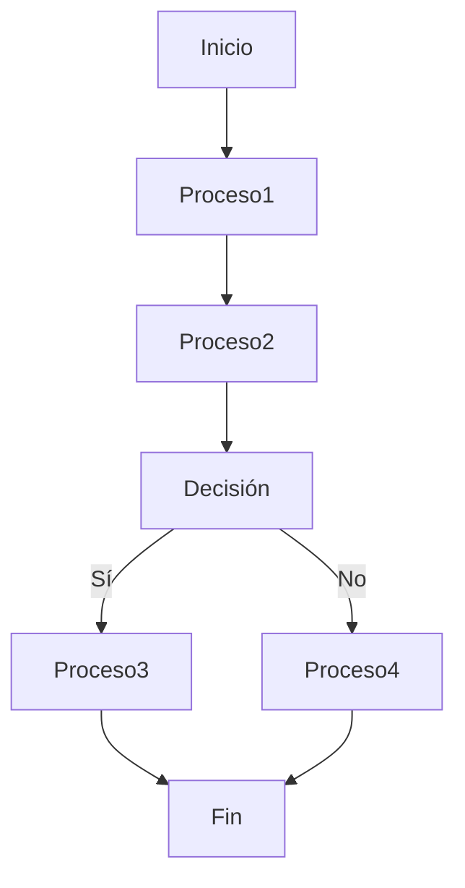

# Diagramas de Actividad

El Diagrama de Actividad en UML se utiliza para modelar el flujo de control de actividades dentro de un sistema, mostrando las acciones y las decisiones que se toman durante la ejecución de un proceso o una tarea. Este tipo de diagrama es especialmente útil para modelar procesos de negocio, flujos de trabajo, algoritmos y cualquier actividad que tenga un comportamiento dinámico. 

>__Nota__:_Serán necesarios para modelar los casos de uso especificados en el diagrama creado y descrito en la especificación_.

## Elementos clave del Diagrama de Actividad

| Elemento                 | Descripción                                         |
|--------------------------|-----------------------------------------------------|
| **Inicio**               | Representa el punto de inicio del flujo de actividad.|
| **Actividad / Nodo**     | Representa una acción o conjunto de acciones dentro del sistema.|
| **Decisión / Fusión**    | Se utiliza para tomar decisiones y combinar flujos divergentes.|
| **Bifurcación / Unión**  | Divide y luego une flujos de control.               |
| **Fin**                  | Representa el punto de finalización del flujo de actividad.|
| **Flujo de Control**     | Flechas que conectan nodos de actividad, indicando la secuencia del flujo.|

  

