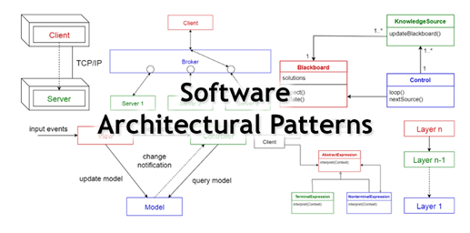

<div align="justify">

# Patrones en la Arquitectura de Software



_¿Se han preguntado alguna vez como se diseñan los sistemas a gran escala en una organización?_ Antes de comenzar el desarrollo de algún software o solución tecnológica, conviene elegir la arquitectura adecuada que proporcione la funcionalidad y atributos de calidad deseados. En ese particular, cobra importancia el conocer los distintos patrones de arquitecturas, o maneras de abordar los temas de diseño de aplicaciones complejas, esto con el propósito de obtener el mejor diseño antes de iniciar algún esfuerzo en el desarrollo de software.
## ¿Qué es un Patrón de Arquitectura?

En términos generales, un patrón de arquitectura es la conceptualización de ___una solución genérica y reutilizable, aplicable a un problema de diseño de software__ en un __contexto__ determinado, __satisfaciendo__ las __necesidades__ del negocio.
_Los patrones arquitectónicos son la representación de las buenas prácticas y estructuras de diseño probadas, de modo que puedan reutilizarse. El objetivo es reutilizar las experiencias y conocimientos arquitectónicos que han dado buenos resultados en el pasado_.

> ___Un patrón arquitectónico es un conjunto de decisiones de diseño que se repiten en la práctica, que tienen características bien definidas y que pueden reutilizarse, describiendo así características de una arquitectura bien diferenciada___.

La __elaboración de una arquitectura__ para __una solución concreta__ puede verse como __un proceso de selección, adaptación y combinación de patrones__. El ___ARQUITECTO___ de software debe decidir cómo __reutilizar un patrón__, hacer los ajustes necesarios al contexto específico, a las restricciones del problema, y a la solución que está diseñando.

Existen ___varios patrones arquitectónicos de software___, que son ___soluciones probadas___ para problemas recurrentes en el diseño y desarrollo de sistemas.:

## Modelo-Vista-Controlador (MVC)

Divide una aplicación en __tres componentes__:
 - __Modelo__ (gestiona la lógica de la aplicación y los datos).
 - __Vista__ (maneja la presentación y la interfaz de usuario)
 - __Controlador__ (gestiona la entrada del usuario y coordina las acciones).

```lua
miapp
|-- model
|   |-- Usuario.java
|   |-- Producto.java
|   |-- ...
|-- view
|   |-- InicioVista.java
|   |-- UsuarioFormulario.java
|   |-- ...
|-- controller
|   |-- UsuarioControlador.java
|   |-- ProductoControlador.java
|   |-- ...
|-- resources
|   |-- style.css
|   |-- logo.png
|-- config
|   |-- ConfiguracionBaseDatos.java
|   |-- ConfiguracionServidor.java
|-- MiAppPrincipal.java
```

## Modelo-Vista-Presentador (MVP)

___Similar a MVC__, pero el Presentador maneja la lógica de la aplicación y la comunicación entre el Modelo y la Vista.

```lua
miapp
|-- model
|   |-- Usuario.java
|   |-- Producto.java
|   |-- ...
|-- view
|   |-- InicioVista.java (Interface)
|   |-- UsuarioFormulario.java (Interface)
|   |-- impl
|       |-- InicioVistaImpl.java (Implementación)
|       |-- UsuarioFormularioImpl.java (Implementación)
|       |-- ...
|-- presenter
|   |-- InicioPresentador.java (Interface)
|   |-- UsuarioFormularioPresentador.java (Interface)
|   |-- impl
|       |-- InicioPresentadorImpl.java (Implementación)
|       |-- UsuarioFormularioPresentadorImpl.java (Implementación)
|       |-- ...
|-- resources
|   |-- style.css
|   |-- logo.png
|-- config
|   |-- ConfiguracionBaseDatos.java
|   |-- ConfiguracionServidor.java
|-- MiAppPrincipal.java

```

## Modelo-Vista-VistaModelo (MVVM)

Diseñado para aplicaciones con interfaces de usuario ricas. Similar a MVP, pero con un componente adicional llamado ViewModel que gestiona la presentación y la lógica del usuario.

```lua
miapp
|-- model
|   |-- Usuario.java
|   |-- Producto.java
|   |-- ...
|-- view
|   |-- InicioVista.java
|   |-- UsuarioFormularioVista.java
|   |-- impl
|       |-- InicioVistaImpl.java
|       |-- UsuarioFormularioVistaImpl.java
|       |-- ...
|-- viewmodel
|   |-- InicioViewModel.java
|   |-- UsuarioFormularioViewModel.java
|   |-- impl
|       |-- InicioViewModelImpl.java
|       |-- UsuarioFormularioViewModelImpl.java
|       |-- ...
|-- resources
|   |-- style.css
|   |-- logo.png
|-- config
|   |-- ConfiguracionBaseDatos.java
|   |-- ConfiguracionServidor.java
|-- MiAppPrincipal.java
```

## Arquitectura Hexagonal (Puertos y Adaptadores)

Separa la lógica de la aplicación del entorno externo, utilizando puertos (interfaces) y adaptadores (implementaciones específicas del entorno).

```lua
miapp
|-- domain
|   |-- Usuario.java
|   |-- Producto.java
|   |-- ...
|-- ports
|   |-- input
|   |   |-- GestionUsuarioInputPort.java
|   |   |-- GestionProductoInputPort.java
|   |-- output
|   |   |-- GestionUsuarioOutputPort.java
|   |   |-- GestionProductoOutputPort.java
|-- adapters
|   |-- input
|   |   |-- GestionUsuarioInputAdapter.java
|   |   |-- GestionProductoInputAdapter.java
|   |-- output
|   |   |-- GestionUsuarioOutputAdapter.java
|   |   |-- GestionProductoOutputAdapter.java
|-- resources
|   |-- application.properties
|   |-- log4j.xml
|-- config
|   |-- ConfiguracionBaseDatos.java
|   |-- ConfiguracionServidor.java
|-- MiAppPrincipal.java
```

## Capas (Layered Architecture)

Organiza la aplicación en capas, donde cada capa tiene una responsabilidad específica. Comúnmente se dividen en capas de presentación, lógica de negocio y persistencia.

```lua
miapp
|-- presentation
|   |-- controllers
|   |   |-- UsuarioController.java
|   |   |-- ProductoController.java
|   |-- views
|   |   |-- InicioView.java
|   |   |-- UsuarioFormularioView.java
|-- business
|   |-- UsuarioManager.java
|   |-- ProductoManager.java
|-- data
|   |-- repositories
|   |   |-- UsuarioRepository.java
|   |   |-- ProductoRepository.java
|   |-- mappers
|   |   |-- UsuarioMapper.java
|   |   |-- ProductoMapper.java
|-- services
|   |-- UsuarioService.java
|   |-- ProductoService.java
|-- resources
|   |-- style.css
|   |-- logo.png
|-- config
|   |-- ConfiguracionBaseDatos.java
|   |-- ConfiguracionServidor.java
|-- MiAppPrincipal.java
```

## Arquitectura de Microservicios

Descompone una aplicación en servicios independientes y autónomos que pueden ser desarrollados, implementados y escalados de forma independiente.

```lua
users
|-- controller
|   |-- UserController.java
|-- service
|   |-- UserService.java
|-- repository
|   |-- UserRepository.java
|-- dto
|   |-- UserDTO.java
|-- UsersMicroserviceApplication.java

products
|-- controller
|   |-- ProductController.java
|-- service
|   |-- ProductService.java
|-- repository
|   |-- ProductRepository.java
|-- dto
|   |-- ProductDTO.java
|-- ProductsMicroserviceApplication.java

common
|-- util
|   |-- DateUtils.java
|-- security
|   |-- JWTUtils.java

config
|-- DatabaseConfig.java
|-- SecurityConfig.java
```

## Arquitectura Monolítica

Una sola aplicación grande y única que contiene todas las funcionalidades. Es más fácil de desarrollar e implementar, pero puede volverse difícil de mantener y escalar a medida que la aplicación crece.

```lua
myapp
|-- presentation
|   |-- controllers
|   |   |-- UserController.java
|   |   |-- ProductController.java
|   |-- views
|   |   |-- UserView.java
|   |   |-- ProductView.java
|-- business
|   |-- UserManager.java
|   |-- ProductService.java
|-- data
|   |-- repositories
|   |   |-- UserRepository.java
|   |   |-- ProductRepository.java
|   |-- mappers
|   |   |-- UserMapper.java
|   |   |-- ProductMapper.java
|-- services
|   |-- UserAuthService.java
|   |-- EmailService.java
|-- resources
|   |-- style.css
|   |-- logo.png
|-- config
|   |-- DatabaseConfig.java
|   |-- SecurityConfig.java
|-- MyAppMain.java
```

## Arquitectura Basada en Eventos

Los componentes se comunican a través de eventos. Útil para sistemas distribuidos y escalables.

```lua
myapp
|-- events
|   |-- user
|   |   |-- UserCreatedEvent.java
|   |   |-- UserUpdatedEvent.java
|   |-- product
|   |   |-- ProductAddedEvent.java
|   |   |-- ProductRemovedEvent.java
|-- producers
|   |-- user
|   |   |-- UserEventProducer.java
|-- consumers
|   |-- user
|   |   |-- UserCreatedEventHandler.java
|   |   |-- UserUpdatedEventHandler.java
|   |-- product
|   |   |-- ProductAddedEventHandler.java
|   |   |-- ProductRemovedEventHandler.java
|-- resources
|   |-- log4j.xml
|-- config
|   |-- EventBrokerConfig.java
|-- MyAppMain.java
```

## Arquitectura de Tres Niveles

Divide la aplicación en tres componentes principales: __Presentación, Lógica de Negocio y Almacenamiento de Datos__.

```lua
myapp
|-- presentation
|   |-- controllers
|   |   |-- UserController.java
|   |   |-- ProductController.java
|   |-- views
|   |   |-- UserView.java
|   |   |-- ProductView.java
|-- business
|   |-- services
|   |   |-- UserService.java
|   |   |-- ProductService.java
|   |-- managers
|   |   |-- UserManager.java
|   |   |-- ProductManager.java
|-- data
|   |-- repositories
|   |   |-- UserRepository.java
|   |   |-- ProductRepository.java
|   |-- mappers
|   |   |-- UserMapper.java
|   |   |-- ProductMapper.java
|-- resources
|   |-- style.css
|   |-- logo.png
|-- config
|   |-- DatabaseConfig.java
|   |-- SecurityConfig.java
|-- MyAppMain.java

```

## Arquitectura Orientada a Servicios (SOA)

Descompone una aplicación en servicios independientes y conectados a través de una red.

```lua
myapp
|-- services
|   |-- user
|   |   |-- UserService.java
|   |-- product
|   |   |-- ProductService.java
|-- contracts
|   |-- user
|   |   |-- UserContract.java
|   |-- product
|   |   |-- ProductContract.java
|-- resources
|   |-- log4j.xml
|-- config
|   |-- ServiceConfig.java
|-- MyAppMain.java
```

## Patrón Singleton

Garantiza que una clase tenga solo una instancia y proporciona un punto de acceso global a esa instancia.

```lua
myapp
|-- singleton
|   |-- DatabaseSingleton.java
|   |-- ConfigurationSingleton.java
|-- resources
|   |-- log4j.xml
|-- MyAppMain.java
```

>___NOTA___: _Este patrón estará combiado con el patrón que sea el elegido_.

</div>