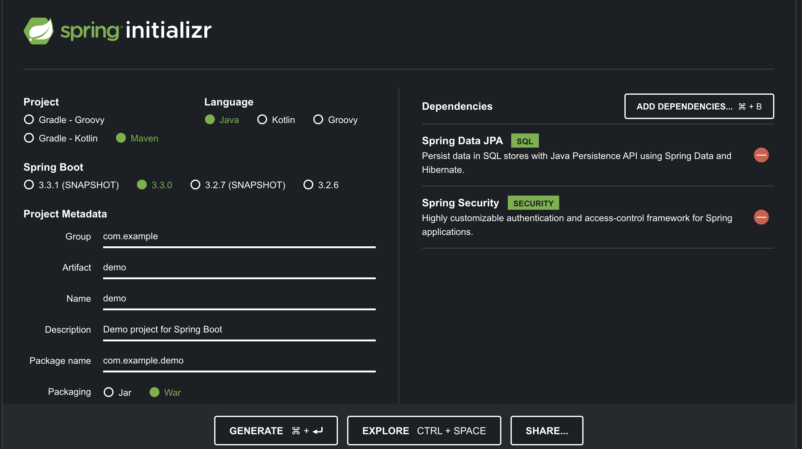

<div align="justify">

## Spring JWT (Seamos seguros)

<div align="center">
    
</div>

## Introducción

En el desarrollo de aplicaciones web y servicios __REST__, es crucial implementar mecanismos de autenticación y autorización robustos para asegurar que solo usuarios autorizados puedan acceder a ciertos recursos. Una de las soluciones más populares para este propósito es el uso de JSON Web Tokens (JWT).

### ¿Qué es un JSON Web Token (JWT)?

Un JSON Web Token (JWT) es un estándar abierto (RFC 7519) que define una forma compacta y autónoma para transmitir información de manera segura entre partes como un objeto JSON. Este token contiene todas las informaciones necesarias para la autenticación, permitiendo que sea utilizado en aplicaciones distribuidas de manera efectiva.

Un JWT está compuesto por tres partes:

- __Header__: Contiene el tipo de token (JWT) y el algoritmo de firma.
- __Payload__: Contiene las afirmaciones (claims). Estas afirmaciones pueden ser sobre una entidad (generalmente el usuario) y datos adicionales.
- __Signature__: Se crea firmando el encabezado y el payload con un algoritmo y una clave secreta. Esto asegura la integridad del token.

### ¿Por qué usar JWT?

- __Autonomía__: Un token JWT contiene toda la información necesaria sobre la identidad del usuario y sus permisos, por lo que no se requiere mantener un estado en el servidor.
- __Escalabilidad__: Debido a su naturaleza autónoma, los JWT son ideales para aplicaciones distribuidas y microservicios.
- __Estandarización__: Al ser un estándar abierto, hay amplia compatibilidad y soporte en diferentes plataformas y lenguajes.

## Integración de JWT con Spring Boot

Spring Boot es un marco basado en Spring que simplifica la creación de aplicaciones basadas en Spring con configuraciones mínimas. Spring Security es un módulo de Spring que proporciona servicios de autenticación y autorización. Al combinar Spring Boot y Spring Security con JWT, podemos crear una solución segura y eficiente para la autenticación de usuarios.

### Inclusión de dependencias

```xml
<dependency>
    <groupId>org.springframework.boot</groupId>
    <artifactId>spring-boot-starter-security</artifactId>
</dependency>
<dependency>
    <groupId>io.jsonwebtoken</groupId>
    <artifactId>jjwt</artifactId>
    <version>0.12.5</version>
</dependency>
```


## Construcción del proyecto

Para la construcción del proyecto inicial, vamos a dirigirnos a [Spring IO Build](https://start.spring.io/), y seleccionar las opciones que se muestran en la imagen.

<div align="center">
    
</div>

Vamos a optener __start-spring-security.zip__ seleccionando __create__.

## Base de datos con la que vamos a trabajar

En este momento debemos de seleccionar la/as base/s de datos con la que trabajar nuestro proyecto, teniendo multitud de combinaciones.
Algunas opciones son: __MariaDb, MySQL, SQLite, MongoDB, etc__.

Tan sólo debemos de seleccionar la dependencia y añadirla.

### Dependencia H2

```xml
<dependency>
    <groupId>com.h2database</groupId>
    <artifactId>h2</artifactId>
</dependency>
```

## Configuración de BBDD e integración de la documentación

En el siguiente [enlace](../Unidad-7-Almacenando-datos/SPRING-DATA.md) puedes encontrar toda la información relacionada con la integración de la __BBDD__ y la documentación de la api.

## Creando los elementos necesarios

### JwtTokenUtil

Crea una clase JwtTokenUtil para manejar la generación y validación de los tokens JWT. Este elemento será un __componenete de Spring__ anotado con __@Component__.

```java
@Component
public class JwtTokenUtil {

    @Value("${jwt.secret}")
    private String secret;

    @Value("${jwt.expiration}")
    private Long expiration;

    public String generateToken(String username) {
        Date now = new Date();
        Date expiryDate = new Date(now.getTime() + expiration);

        return Jwts.builder()
                .setSubject(username)
                .setIssuedAt(now)
                .setExpiration(expiryDate)
                .signWith(SignatureAlgorithm.HS512, secret)
                .compact();
    }

    public String getUsernameFromToken(String token) {
        Claims claims = Jwts.parser()
                .setSigningKey(secret)
                .parseClaimsJws(token)
                .getBody();

        return claims.getSubject();
    }

    public boolean validateToken(String token) {
        try {
            Jwts.parser().setSigningKey(secret).parseClaimsJws(token);
            return true;
        } catch (Exception e) {
            return false;
        }
    }
}
```

### Filtrando las solicudes

Hemos de filtrar las solicitudes creando un filtro.

Crea una clase __JwtAuthenticationFilter__ para interceptar las solicitudes y verificar el token JWT.

```java
@Component
public class JwtAuthenticationFilter extends UsernamePasswordAuthenticationFilter {

    @Autowired
    private JwtTokenUtil jwtTokenUtil;

    @Autowired
    private UserDetailsService userDetailsService;

    @Override
    protected void doFilterInternal(HttpServletRequest request, HttpServletResponse response, FilterChain chain) throws ServletException, IOException {
        String header = request.getHeader("Authorization");
        String token = null;
        String username = null;

        if (header != null && header.startsWith("Bearer ")) {
            token = header.substring(7);
            username = jwtTokenUtil.getUsernameFromToken(token);
        }

        if (username != null && SecurityContextHolder.getContext().getAuthentication() == null) {
            UserDetails userDetails = userDetailsService.loadUserByUsername(username);

            if (jwtTokenUtil.validateToken(token)) {
                UsernamePasswordAuthenticationToken authentication = new UsernamePasswordAuthenticationToken(
                        userDetails, null, userDetails.getAuthorities());
                authentication.setDetails(new WebAuthenticationDetailsSource().buildDetails(request));
                SecurityContextHolder.getContext().setAuthentication(authentication);
            }
        }

        chain.doFilter(request, response);
    }
}
```

### Securizando Spring

Crea una clase WebSecurityConfig para configurar la seguridad de Spring.

```java
@Configuration
@EnableWebSecurity
public class WebSecurityConfig extends WebSecurityConfigurerAdapter {

    @Autowired
    private JwtAuthenticationFilter jwtAuthenticationFilter;

    @Autowired
    private UserDetailsService userDetailsService;

    @Override
    public void configure(AuthenticationManagerBuilder auth) throws Exception {
        auth.userDetailsService(userDetailsService).passwordEncoder(passwordEncoder());
    }

    @Bean
    public PasswordEncoder passwordEncoder() {
        return new BCryptPasswordEncoder();
    }

    @Bean
    @Override
    public AuthenticationManager authenticationManagerBean() throws Exception {
        return super.authenticationManagerBean();
    }

    @Override
    protected void configure(HttpSecurity http) throws Exception {
        http.csrf().disable()
                .authorizeRequests()
                .antMatchers("/auth/**").permitAll()
                .anyRequest().authenticated()
                .and()
                .sessionManagement().sessionCreationPolicy(SessionCreationPolicy.STATELESS);

        http.addFilterBefore(jwtAuthenticationFilter, UsernamePasswordAuthenticationFilter.class);
    }
}
```

### Controler de autenticación

Crea un controlador __AuthController__ para manejar las solicitudes de autenticación.

```java
@RestController
@RequestMapping("/auth")
public class AuthController {

    @Autowired
    private AuthenticationManager authenticationManager;

    @Autowired
    private JwtTokenUtil jwtTokenUtil;

    @Autowired
    private UserDetailsService userDetailsService;

    @PostMapping("/login")
    public String createAuthenticationToken(@RequestBody AuthRequest authRequest) {
        Authentication authentication = authenticationManager.authenticate(
                new UsernamePasswordAuthenticationToken(authRequest.getUsername(), authRequest.getPassword()));

        UserDetails userDetails = (UserDetails) authentication.getPrincipal();
        return jwtTokenUtil.generateToken(userDetails.getUsername());
    }
}
```

### Configurar las propiedades del token JWT

Añade las propiedades del token JWT en tu archivo application.properties.

```java
jwt.secret=mysecretkey
jwt.expiration=86400000
```

## Referencias

- [Securizando Spring](https://www.devglan.com/spring-security/spring-boot-security-jwt-example) 

- [Securizando Spring con BBDD](https://medium.com/spring-boot/spring-boot-3-spring-security-6-jwt-authentication-authorization-98702d6313a5)

</div>