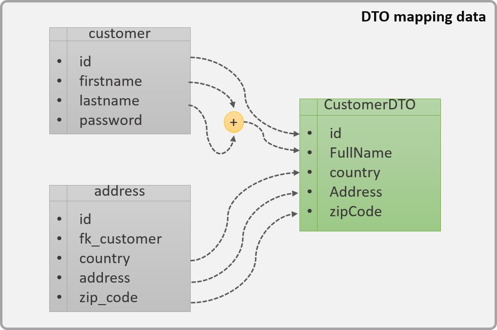

<div align="justify">

# ¿Qué son los dto?

Una de las problemáticas más comunes cuando desarrollamos aplicaciones, es diseñar la forma en que la información debe viajar desde la capa de servicios a las aplicaciones o capa de presentación, ya que muchas veces por desconocimiento o pereza, utilizamos las clases de entidades para retornar los datos, lo que ocasiona que retornemos más datos de los necesarios o incluso, tengamos que ir en más de una ocasión a la capa de servicios para recuperar los datos requeridos.

El patrón DTO tiene como finalidad de crear un objeto plano (POJO) con una serie de atributos que puedan ser enviados o recuperados del servidor en una sola invocación, de tal forma que un DTO puede contener información de múltiples fuentes o tablas y concentrarlas en una única clase simple.

<div align="center">
    
</div>

En la imagen anterior podemos apreciar gráficamente como es que un DTO se conforma de una serie de atributos que puede o no, estar conformados por más de una fuente de datos. Para esto, el servidor obtiene la información de las tablas customer y address (izquierda) y realiza un mapping con el DTO (derecha). Adicional, la información puede ser pasada de un lado intacta como es el caso del id , fullName , country , address  y zipCode  o ser una derivada de más de un campo, como es el caso del fullName , el cual es la unión del firstname  y lastname .

Otra de las ventajas no tan claras en la imagen, es que nos permite omitir información que el usuario no requiere, como es el caso de password. No es solo que no lo requiere, sino que además podría ser una gran falla de seguridad está enviando los passwords, es por ello que en el DTO lo omitimos.

## Características de un DTO

Si bien un DTO ___es simplemente un objeto plano, sí que tiene que cumplir algunas reglas para poder considerar que hemos creado un DTO correctamente implementado___:

- __Sólo lectura__: Dado que el objetivo de un DTO es utilizarlo como un objeto de transferencia entre el cliente y el servidor, es importante evitar tener operaciones de negocio o métodos que realicen cálculos sobre los datos, es por ello que solo deberemos de tener los métodos GET y SET de los respectivos atributos del DTO.
- __Serializable__: Es claro que, si los objetos tendrán que viajar por la red, deberán de poder ser serializables, pero no hablamos solamente de la clase en sí, sino que también todos los atributos que contenga el DTO deberán ser fácilmente serializables. Un error clásico en Java es, por ejemplo, crear atributos de tipo Date o Calendar para transmitir la fecha u hora, ya que estos no tienen una forma estándar para serializarse por ejemplo en Webservices o REST.
Entidades vs DTO

>___Un error muy frecuente entre programadores inexpertos es el hecho de utilizar las clases de Entidad para utilizarlos para la transmisión de datos entre el cliente y el servidor. Solo para entrar en contexto, las entidades son clases que representa al modelo de datos, o mapea directamente contra una tabla de la base de datos. Dicho esto, las entidades son clases que fueron diseñadas para mapear contra la base de datos, no para ser una vista para una pantalla o servicio determinado, lo que provoca que muchos de los campos no puedan ser serializables, no contengan todos los campos necesarios un servicio, ya sea que tengan de más o de menos___.

>___El hecho de que las entidades no contengan todos los atributos necesarios o que no sean serializables trae otros problemas, como la necesidad de agregaras más atributos a las entidades con el único objetivo de poder cubrir los requerimientos de transferencia de datos, dejando de lado el verdadero propósito de la entidad, que es únicamente mapear contra la base de datos, lo que va llevando lentamente a ir creando una mezcla entre Entidad y DTO___.

## El mundo real

Para comprender mejor como es que se utilizan los DTO, vamos a realizar un análisis con un ejemplo de un servicio que recupera los datos todos los datos de los clientes. Para esto, veamos como quedarían las Entidades utilizando el API de JPA de Java.

### Entidad Customer

```java
package dtopattern;

import javax.persistence.Column;
import javax.persistence.Entity;
import javax.persistence.GeneratedValue;
import javax.persistence.GenerationType;
import javax.persistence.Id;
import javax.persistence.Table;

@Entity
@Table(name="customers")
public class Customer {
	@Id
	@GeneratedValue(strategy= GenerationType.IDENTITY)
	private Long id;
	@Column(name="firstname")
	private String firstname;
	@Column(name="lastname")
	private String lastname;
	@Column(name="password")
	private String password;
	
	/** GET and SET */
}
````

### Entidad Address

```java
package dtopattern;

import javax.persistence.Column;
import javax.persistence.Entity;
import javax.persistence.GeneratedValue;
import javax.persistence.GenerationType;
import javax.persistence.Id;
import javax.persistence.JoinColumn;
import javax.persistence.ManyToMany;
import javax.persistence.Table;

@Entity
@Table(name="address")
public class Address {
	@Id
	@GeneratedValue(strategy=GenerationType.IDENTITY)
	private Long id;
	@ManyToMany()
	@JoinColumn(name="fk_customer")
	private Customer customer;
	@Column(name="country")
	private String country;
	@Column(name="address")
	private String address;
	@Column(name="zipcode")
	private String zipCode;
	
	
	/** GET and SET */
	
}
```

Por otro lado, tenemos el DTO que contiene los datos del cliente (Customer) y su dirección (Address).

```java
package dtopattern;

import java.io.Serializable;

public class CustomerDTO implements Serializable{
	
	private Long id;
	private String FullName;
	private String country;
	private String Address;
	private String zipCode;
	
	
	/** GET and SET */
}
```

Finalmente, veamos cómo quedaría un servicio que aproveche las ventajas del patrón DTO para transmitir los datos:

```java
package dtopattern;

import javax.ejb.EJB;
import javax.ejb.Stateless;
import javax.ws.rs.GET;
import javax.ws.rs.Path;
import javax.ws.rs.PathParam;
import javax.ws.rs.core.MediaType;
import javax.ws.rs.core.Response;

@Path("customers")
public class CustomerService {
	
	@GET
	@PathParam("{customerId}")
	private Response findCustomer(@PathParam("customerId") Long customerId) {
		Customer customer = customerDAO.findCustomerById(customerId); //Entity
		Address address = customerDAO.findAddressByCustomer(customerId); //Entity
		
		//Create dto
		CustomerDTO dto = new CustomerDTO();
		dto.setAddress(address.getAddress());
		dto.setCountry(address.getCountry());
		dto.setZipCode(address.getZipCode());
		dto.setFullName(customer.getFirstname() + " " + customer.getLastname());
		dto.setId(customer.getId());
		
		//Return DTO
		return Response.ok(dto, MediaType.APPLICATION_JSON).build();
	}
}
```
El ejemplo que acabamos de ver, corresponde a una implementación de un servicio REST utilizando el API JAX-RS de Java, el cual indica que existe un servicio GET en la url ___/customers/{customerID}___, donde ___{customerId}___ corresponde al ___ID___ del cliente a buscar.

>___En el servicio, realizamos la consulta del cliente y su dirección en dos pasos, para finalmente, mapear los datos de estas dos entidades en un simple DTO que será retornado___.

</div>