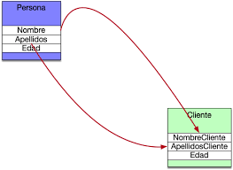

<div align="justify">

## Mapeando clases

<div align="center">
    
</div>

Un __"mapper"__ (_mapeador_) en el contexto del desarrollo de software se refiere a _una clase o conjunto de clases encargadas de realizar la conversión de datos entre diferentes estructuras o formatos_. Su ___función principal___ es _mapear los datos de una representación a otra de manera eficiente y transparente_.

Características clave de un mapper:

- __Conversión de datos__: Un mapper convierte datos de un tipo a otro, lo que puede implicar convertir entre tipos de datos simples (por ejemplo, de String a int) o entre estructuras de datos más complejas (por ejemplo, de un objeto Java a un objeto DTO).
- __Separación de responsabilidades__: Los mappers ayudan a mantener una clara separación de responsabilidades en una aplicación. _Permiten que las capas del sistema (por ejemplo, la capa de modelo y la capa de presentación) trabajen con sus propios tipos de datos sin preocuparse por los detalles de implementación de la otra capa_.
- __Reutilización de código__: Los mappers pueden ser reutilizados en diferentes partes de la aplicación o en diferentes aplicaciones. _Esto promueve la_ __modularidad y reduce la duplicación de código__.
- __Flexibilidad__: Los _mappers pueden adaptarse fácilmente a cambios en los modelos de datos o en los requisitos de la aplicación_. Si la estructura de los datos cambia, solo se necesita actualizar el código del mapper correspondiente sin afectar otras partes del sistema.
- __Optimización de rendimiento__: Los mappers pueden incluir lógica para optimizar el rendimiento de la conversión de datos, como la minimización de la sobrecarga de memoria o la reducción del número de operaciones costosas.

>___En resumen, un mapper es una herramienta poderosa en el desarrollo de software que facilita la conversión de datos entre diferentes representaciones, promoviendo la modularidad, la reutilización de código y la flexibilidad del sistema___.


## Ejemplo

```code
com.example.model
└── Persona.java

com.example.dto
└── PersonaDTO.java

com.example.mapper
└── PersonaMapper.java

com.example.main
└── Main.java
```

```java
package com.example.model;

public class Persona {
    private String nombre;
    private int edad;
    private String direccion;

    // Constructor, getters y setters
}
```

```java

public class PersonaDTO {
    private String nombre;
    private int edad;
    private String direccionCompleta;

    // Constructor, getters y setters
}
```

```java
package com.example.mapper;

import com.example.model.Persona;
import com.example.dto.PersonaDTO;

public class PersonaMapper {
    public static PersonaDTO convertirPersonaADTO(Persona persona) {
        PersonaDTO personaDTO = new PersonaDTO();
        personaDTO.setNombre(persona.getNombre());
        personaDTO.setEdad(persona.getEdad());
        personaDTO.setDireccionCompleta(persona.getDireccion());
        return personaDTO;
    }
}
```

```java
package com.example.main;

import com.example.model.Persona;
import com.example.dto.PersonaDTO;
import com.example.mapper.PersonaMapper;

public class Main {
    public static void main(String[] args) {
        // Crear una persona
        Persona persona = new Persona();
        persona.setNombre("Juan");
        persona.setEdad(30);
        persona.setDireccion("Calle 123, Ciudad A");

        // Convertir la persona a PersonaDTO utilizando PersonaMapper
        PersonaDTO personaDTO = PersonaMapper.convertirPersonaADTO(persona);

        // Imprimir los valores del objeto PersonaDTO resultante
        System.out.println("Nombre: " + personaDTO.getNombre());
        System.out.println("Edad: " + personaDTO.getEdad());
        System.out.println("Dirección completa: " + personaDTO.getDireccionCompleta());
    }
}
```

## Mapeando clases con MapStruct

__MapStruct__ es una biblioteca que ___simplifica el proceso de mapeo entre clases Java mediante la generación automática de código___.

Los pasos son:

- Necesitamos agregar las dependencias de MapStruct a tu proyecto "__pom.xml__":

```xml
<dependency>
    <groupId>org.mapstruct</groupId>
    <artifactId>mapstruct</artifactId>
    <version>1.4.2.Final</version>
</dependency>
<dependency>
    <groupId>org.mapstruct</groupId>
    <artifactId>mapstruct-processor</artifactId>
    <version>1.4.2.Final</version>
    <scope>provided</scope>
</dependency>
```

Teniendo en cuenta las clases ___Persona___ y ___PersonaDTO___, creadas anteriormente, debemos de crear los mappers de forma diferente:

```java
package com.example.mapper;

import com.example.model.Persona;
import com.example.dto.PersonaDTO;
import org.mapstruct.Mapper;
import org.mapstruct.Mapping;

@Mapper
public interface PersonaMapper {
    @Mapping(source = "direccion", target = "direccionCompleta")
    PersonaDTO personaToPersonaDTO(Persona persona);
}
```

```java
package com.example.main;

import com.example.model.Persona;
import com.example.dto.PersonaDTO;
import com.example.mapper.PersonaMapper;

public class Main {
    public static void main(String[] args) {
        // Crear una persona
        Persona persona = new Persona();
        persona.setNombre("Juan");
        persona.setEdad(30);
        persona.setDireccion("Calle 123, Ciudad A");

        // Convertir la persona a PersonaDTO utilizando MapStruct
        PersonaMapper mapper = Mappers.getMapper(PersonaMapper.class);
        PersonaDTO personaDTO = mapper.personaToPersonaDTO(persona);

        // Imprimir los valores del objeto PersonaDTO resultante
        System.out.println("Nombre: " + personaDTO.getNombre());
        System.out.println("Edad: " + personaDTO.getEdad());
        System.out.println("Dirección completa: " + personaDTO.getDireccionCompleta());
    }
}
```

>___Con MapStruct, el proceso de mapeo se simplifica enormemente, ya que no es necesario escribir la implementación del mapper. MapStruct se encarga de generar el código necesario en tiempo de compilación basado en las anotaciones que proporcionas en la interfaz del mapper.___

## Referencias

- [Utilizar Mappers combinados](https://www.baeldung.com/java-mapstruct-nested-mapping)
- [Customizar Mappers](https://www.baeldung.com/mapstruct-custom-mapper).


</div>