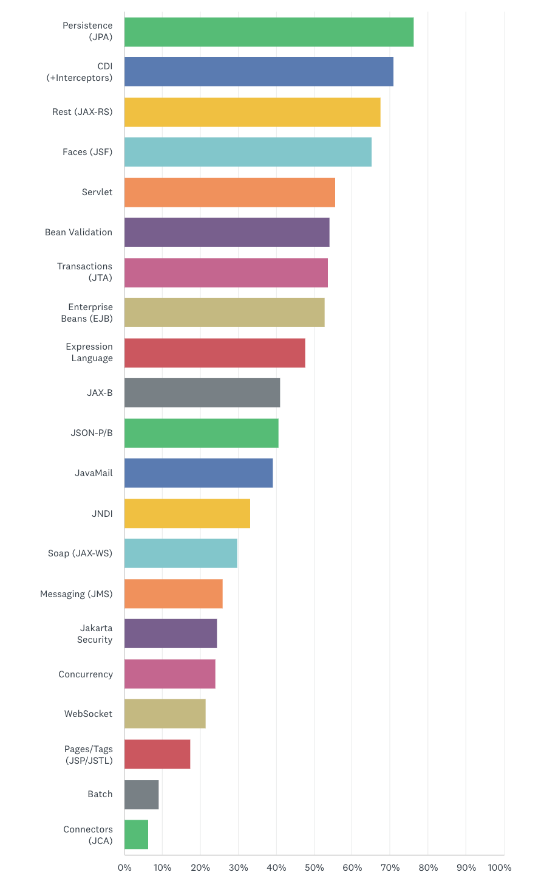
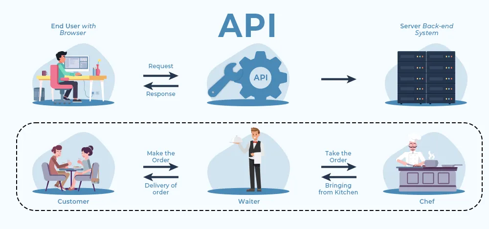

<div align="justify">

# Notaciones básicas para construir servicios

<div align="center">
    
</div>

API es el acrónimo de **interfaz de programación de aplicaciones** (*application programming interface* en inglés). Es un conjunto de reglas bien definidas que se utilizan para especificar formalmente la comunicación entre dos componentes de software. 

## API REST
En la actualidad existen distintas clases de API, y hoy hablaremos un poco más acerca de las **API REST**. 

**¿Qué es una API REST?**
Una API REST es una interfaz de comunicación entre sistemas de información que usa el protocolo de transferencia de hipertexto (*hypertext transfer protocol* o HTTP, por su siglas en inglés) para obtener datos o ejecutar operaciones sobre dichos datos en diversos formatos, como pueden ser XML o JSON.

Se basa en el modelo cliente-servidor donde el cliente es el que solicita obtener los recursos o realizar alguna operación sobre dichos datos, mientras que el servidor es aquel ente que entrega o procesa dichos datos a solicitud del cliente.

**Criterios de API REST**
Existen diversos criterios para identificar si una API es REST o no. Algunos de ellos son que:

- Debe usar una arquitectura cliente-servidor.
- Las ejecuciones de la API no deben considerar el estado del cliente, el estado de peticiones anteriores o algún indicador almacenado que haga variar su comportamiento. La comunicación debe ser sin estado (*stateless*).
- Ha de estar orientada a recursos, usando las operaciones estándar de los verbos HTTP.
- Hace uso de la URL como identificador único de los recursos.
- Debe ser hipermedia: cuando se consulte un recurso, este debe contener links o hipervínculos de acciones o recursos que lo complementen.

**Diferencia entre RESTful y RESTless**
A menudo escuchamos estos términos al momento de diseñar, construir o interactuar con API. La diferencia es sencilla. Llamamos **RESTful** a todas aquellas API que cumplen completamente los criterios REST; mientras que llamamos **RESTless** a aquellas API que no cumplen del todo con los criterios REST.

Por ejemplo, una API que utiliza el verbo POST para todas sus operaciones no es una API RESTful, si no una API RESTless.

**¿Qué es la API Specification?**
La especificación de una API, o API Spec, es aquella documentación donde se describe el comportamiento de una API, también conocido como el contrato de la API. La finalidad de dicha documentación es guiar al desarrollador que va a integrar el uso de la API en su sistema. Es tal la importancia que ha tomado este rubro que existen diversas herramientas y estándares creados específicamente para describir una API REST como son RAML, Swagger y el estándar OpenAPI.

Los componentes primordiales que se describen en un API Spec son los siguientes:

- Verbo HTTP
- URL orientada a recursos
- HTTP Status

A continuación, verás una tabla de ejemplo para ilustrar estos conceptos:

| VERBO HTTP | URL DEL RECURSO | ACCIÓN | HTTP STATUS |
|------------|-----------------|--------|-------------|
| GET        | /libros         | Obtener una lista de libros | 200 - OK |
|            |                 |                               | 204 - Not Content: cuando no hay libros a listar |
| GET        | /libros/{id-libro} | Obtener detalle de un libro | 200 - OK |
|            |                 |                               | 404 - Not Found: cuando no existe el libro buscado |
| POST       | /libros         | Crear un recurso nuevo libro | 201 - Created |
| PUT        | /libros/{id-libro} | Modificar un recurso libro completamente | 200 - OK |
|            |                 |                               | 400 - Bad request: cuando algún parámetro enviado no cumple con las reglas |
| PATCH      | /libros/{id-libro} | Modificar un recurso libro parcialmente | 200 - OK |
|            |                 |                               | 201 - Created: si el recurso a modificar no existe se crea en automático |
|            |                 |                               | 400 - Bad request: cuando algún parámetro enviado no cumple con las reglas |
| DELETE     | /libros/{id-libro} | Eliminar un recurso libro   | 201 - Not Content: es el status standard a regresar en un verbo DELETE |

Las **API REST** han aportado mucho en la forma de comunicación entre sistemas. Al día de hoy, un gran porcentaje de las empresas que usan la tecnología para aportar valor a sus productos tienen **API REST** como forma estándar de comunicación.

Existe una cantidad enorme de API disponibles en Internet para agregar valor a cualquier desarrollo de software, ya sea para tercerizar algún módulo necesario para el sistema en cuestión (como timbrado de facturas, pagos online, etc.) o simplemente para mejorar la experiencia del usuario, como la geolocalización, el acceso con cuentas de redes sociales y demás.

## Apis Java EE

<div align="center">
    
</div>


## Apis Rest en Java

<div align="center">
    
</div>

En Java, hay varias arquitecturas y frameworks populares para la construcción de servicios RESTful.
Los más utilizados en __Java__ son los siguientes:

| Arquitectura/Framework | Descripción | Similitudes | Diferencias | Anotaciones |
|-------------------------|-------------|-------------|-------------|-------------|
| Spring Framework        | Framework ampliamente utilizado que ofrece el módulo Spring MVC para construir servicios RESTful. También se utiliza Spring Boot para simplificar la configuración y el desarrollo. | - Utiliza anotaciones para definir endpoints RESTful. - Proporciona una amplia gama de características y herramientas para el desarrollo empresarial. | - Mayor énfasis en la inyección de dependencias y la configuración basada en anotaciones. | `@RestController`, `@RequestMapping`, `@GetMapping`, `@PostMapping`, `@PutMapping`, `@DeleteMapping` |
| JAX-RS                  | Especificación estándar de Java para el desarrollo de servicios web RESTful. Permite a los desarrolladores crear servicios RESTful utilizando anotaciones Java. | - Basado en anotaciones para definir endpoints. - Facilita la creación de servicios RESTful en Java. | - Es una especificación estándar, no un framework completo. | `@Path`, `@GET`, `@POST`, `@PUT`, `@DELETE`, `@Produces`, `@Consumes` |
| Jersey                  | Implementación de la especificación JAX-RS. Ofrece una forma sencilla y potente de crear servicios web RESTful en Java. | - Basado en la especificación JAX-RS. - Proporciona características adicionales para simplificar el desarrollo. | - Es una implementación específica de JAX-RS, lo que puede limitar la flexibilidad en algunos casos. | Mismas que JAX-RS |
| RESTEasy                | Otra implementación de la especificación JAX-RS. Parte del proyecto JBoss. Ofrece características adicionales para el desarrollo de servicios RESTful. | - Basado en la especificación JAX-RS. - Proporciona características adicionales para simplificar el desarrollo. | - Integración más estrecha con el ecosistema JBoss. | Mismas que JAX-RS |
| Apache CXF              | Framework que puede utilizarse para construir servicios web RESTful y SOAP en Java. Ofrece soporte tanto para JAX-RS como para JAX-WS (servicios web SOAP) y es altamente configurable. | - Ofrece soporte para JAX-RS y JAX-WS. - Altamente configurable. | - Mayor complejidad debido a la flexibilidad y configurabilidad. | Mismas que JAX-RS |

## Dependencias necesarias

Vamos a centrarnos en la creación de servicios bajo __Spring__ y bajo __CXF__.

### Spring Framework

Para un proyecto básico de Spring, las dependencias comunes que necesitarías incluir son:

```xml
<dependencies>
    <!-- Spring Core -->
    <dependency>
        <groupId>org.springframework</groupId>
        <artifactId>spring-core</artifactId>
        <version>{versión de Spring}</version>
    </dependency>
    
    <!-- Spring MVC (para servicios REST) -->
    <dependency>
        <groupId>org.springframework</groupId>
        <artifactId>spring-webmvc</artifactId>
        <version>{versión de Spring}</version>
    </dependency>
    
    <!-- Spring Boot (opcional, para simplificar la configuración) -->
    <dependency>
        <groupId>org.springframework.boot</groupId>
        <artifactId>spring-boot-starter-web</artifactId>
        <version>{versión de Spring Boot}</version>
    </dependency>
</dependencies>
```

Debes reemplazar {versión de Spring} y {versión de Spring Boot} con las versiones específicas que desees utilizar en tu proyecto. Si estás utilizando Spring Boot, el último dependency es opcional, ya que spring-boot-starter-web ya incluye Spring MVC y otras dependencias necesarias.

### Apache CXF

Para un proyecto que utilice Apache CXF para servicios REST, necesitarás las siguientes dependencias:

```xml
<dependencies>
    <!-- Apache CXF Core -->
    <dependency>
        <groupId>org.apache.cxf</groupId>
        <artifactId>cxf-core</artifactId>
        <version>{versión de CXF}</version>
    </dependency>
    
    <!-- Apache CXF JAX-RS (para servicios REST) -->
    <dependency>
        <groupId>org.apache.cxf</groupId>
        <artifactId>cxf-rt-frontend-jaxrs</artifactId>
        <version>{versión de CXF}</version>
    </dependency>
    
    <!-- Opcional: para la integración con Spring -->
    <dependency>
        <groupId>org.apache.cxf</groupId>
        <artifactId>cxf-spring-boot-starter-jaxrs</artifactId>
        <version>{versión de CXF}</version>
    </dependency>
</dependencies>
```

Al igual que con las dependencias de Spring, debes reemplazar {versión de CXF} con la versión específica de Apache CXF que deseas utilizar.

Estas dependencias proporcionan las bibliotecas fundamentales necesarias para desarrollar servicios REST con Spring y Apache CXF en Java. Puedes agregar otras dependencias adicionales según tus requisitos específicos de proyecto.


## Clientes para consumir servicios rest

Algunos de los complementos populares para __Google Chrome y Mozilla Firefox__ que te ayudarán a consumir servicios REST son:

- __Google Chrome__
  - __Postman__: No es un plugin de navegador en sí, sino una aplicación independiente, pero también está disponible como una extensión de Chrome. Postman te permite crear, probar y documentar APIs de forma sencilla. Puedes enviar solicitudes RESTful y ver las respuestas de manera clara.
  - __REST Client - HTTP Client__: Este es otro complemento para Chrome que te permite enviar solicitudes HTTP y HTTPS, incluidas las solicitudes RESTful. Proporciona una interfaz sencilla para escribir y enviar solicitudes, y ver las respuestas.
- __Mozilla Firefox__
  - __RESTClient__: Es una extensión de Firefox que te permite probar tus servicios web o API RESTful. Puedes enviar varios tipos de solicitudes HTTP, como GET, POST, PUT, DELETE, etc., y ver las respuestas de manera clara.

  - __HttpRequester__: Este es otro complemento de Firefox que te permite realizar solicitudes HTTP, incluidas las solicitudes RESTful. Es bastante sencillo de usar y proporciona una interfaz intuitiva para enviar y recibir solicitudes y respuestas HTTP.

## Referencias

- [Ejemplo simple](https://github.com/rashm1n/CXF-JAXRS/).
- [Nociones básicas de Rest-Api](https://blog.hubspot.es/website/que-es-api-rest)
- [JAX-RS-Example](https://medium.com/geekculture/creating-jax-rs-restful-apis-with-apache-cxf-and-tomcat-c3e13f3b65c4)

</div>