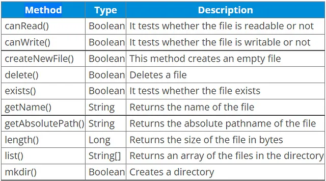

<div align="justify">

# Manipulación y almacenamiento de información en ficheros

- [Manipulación y almacenamiento de información en ficheros](#manipulación-y-almacenamiento-de-información-en-ficheros)
  - [Contenidos](#contenidos)
  - [Ficheros](#ficheros)
    - [Try-Catch con recursos](#try-catch-con-recursos)
  - [Ficheros de texto](#ficheros-de-texto)
    - [Leer ficheros de texto](#leer-ficheros-de-texto)
    - [Escribir ficheros de texto](#escribir-ficheros-de-texto)
  - [Ficheros binarios](#ficheros-binarios)
    - [Leer ficheros binarios](#leer-ficheros-binarios)
    - [Escribir ficheros binarios](#escribir-ficheros-binarios)
  - [Ficheros de acceso aleatorio](#ficheros-de-acceso-aleatorio)
    - [Leer ficheros de acceso aleatorio](#leer-ficheros-de-acceso-aleatorio)
    - [Escribir ficheros de acceso aleatorio](#escribir-ficheros-de-acceso-aleatorio)
  - [Serialización](#serialización)
    - [Leer objetos serializados](#leer-objetos-serializados)
    - [Escribir objetos serializados](#escribir-objetos-serializados)
  - [Ficheros y Directorios. Utilidades](#ficheros-y-directorios-utilidades)
    - [Clase File](#clase-file)
    - [Clase Path](#clase-path)
    - [Clase Files](#clase-files)
    - [Clase Paths](#clase-paths)
    - [Directorio Resources](#directorio-resources)
    - [Fichero properties](#fichero-properties)
  - [DTO](#dto)
  - [CSV](#csv)
  - [JSON](#json)
    - [Lectura de JSON](#lectura-de-json)
      - [Objeto a JSON](#objeto-a-json)
      - [Pretty print](#pretty-print)
      - [JSON a Objeto](#json-a-objeto)
  - [XML](#xml)
    - [Lectura de XML](#lectura-de-xml)
    - [Lectura de XML](#lectura-de-xml-1)
      - [Clase Paciente](#clase-paciente)
    - [Escritura de XML](#escritura-de-xml)

## Contenidos

1. Ficheros
2. Ficheros de texto
3. Ficheros binarios
4. Ficheros de acceso aleatorio
5. Serialización de objetos
6. Ficheros y Directorios. Utilidades
7. CSV
8. JSON
9. XML
10. DTO


## Ficheros

Un fichero es un conjunto de datos almacenados en un dispositivo de almacenamiento secundario. Los ficheros se pueden clasificar en dos grandes grupos: ficheros de texto y ficheros binarios y en función de su acceso: ficheros de acceso secuencial y ficheros de acceso aleatorio.

__XML__ _(Extensible Markup Language)_, __CSV__ _(Comma-Separated Values)_ y __JSON__ _(JavaScript Object Notation)_ son ___formatos de intercambio de datos comúnmente utilizados en programación y en la transferencia de información entre sistemas___, así como ___estructuras de datos formateadas para el almacenamento de información___.


### Try-Catch con recursos

A partir de Java 7 se puede utilizar el try-catch con recursos, que nos permite cerrar los recursos que se abren en el bloque try. Para ello, se debe implementar la interfaz java.lang.AutoCloseable en la clase que queremos cerrar. Por ejemplo, si queremos cerrar un fichero, la clase que implementa la interfaz AutoCloseable es java.io.Closeable.

```java
try (BufferedReader br = new BufferedReader(new FileReader("fichero.txt"))) {
    // Acciones
} catch (IOException e) {
    // Excepciones
}

// Antes 
BufferedReader br = null;
try {
    br = new BufferedReader(new FileReader("fichero.txt"));
    // Acciones
} catch (IOException e) {
    // Excepciones
} finally {
    if (br != null) {
        try {
            br.close();
        } catch (IOException e) {
            // Excepciones
        }
    }
}
```

En el ejemplo anterior, el fichero se cierra automáticamente al salir del bloque try. Si se produce una excepción, el fichero se cierra automáticamente al salir del bloque catch.

## Ficheros de texto

Los ficheros de texto son ficheros que contienen caracteres. Los ficheros de texto se pueden leer y escribir.

### Leer ficheros de texto

Podemos leerlos linea a linea o todo el fichero de golpe. Ademas podemos hacer uso de un buffer para mejorar la lectura.
Debes tener en cuenta cómo se implementan los métodos de lectura, pues mucho de ellos aunque no lo parezca hacen uso del buffer de lectura internamente. como radLines(), forEachLine{ } o readText().

```java

	String filePath = "ruta/al/fichero.txt";
    File fileOrigen = new File(filePath);

    // existe
    if (fileOrigen.exists()) {
        System.out.println("El fichero existe");
    } else {
        System.out.println("El fichero no existe");
    }

    // Si puedo leerlo
    if (fileOrigen.canRead()) {
        System.out.println("El fichero se puede leer");
    } else {
        System.out.println("El fichero no se puede leer");
    }

    // Devuelve una lista de líneas
    try (BufferedReader br = new BufferedReader(new FileReader(fileOrigen))) {
        String line;
        while ((line = br.readLine()) != null) {
            System.out.println(line);
        }
        System.out.println();
    } catch (IOException e) {
        e.printStackTrace();
    }

    // Procesa línea a línea
    try (BufferedReader br = new BufferedReader(new FileReader(fileOrigen))) {
        br.lines().forEach(System.out::println);
        System.out.println();
    } catch (IOException e) {
        e.printStackTrace();
    }

    // Lee el fichero completo en una cadena
    try (BufferedReader br = new BufferedReader(new FileReader(fileOrigen))) {
        StringBuilder sb = new StringBuilder();
        String line;
        while ((line = br.readLine()) != null) {
            sb.append(line).append("\n");
        }
        System.out.println(sb.toString());
    } catch (IOException e) {
        e.printStackTrace();
    }
}

```

### Escribir ficheros de texto

Podemos escribirlos linea a linea o todo el fichero de golpe. Ademas podemos hacer uso de un buffer para mejorar la escritura. Haremos uso de writeText() o appendText() para escribir ficheros de texto. Debes tener en cuenta cómo se implementan los métodos de escritura, pues mucho de ellos aunque no lo parezca hacen uso del buffer de escritura internamente. 

```java

// Escribimos todo el contenido en el archivo, sobreescribe si existe, crea uno nuevo si no existe
	FileWriter fileWriter = new FileWriter(fileDestino);
	fileWriter.write("Hola mundo");
	fileWriter.close();

	// Añadimos contenido al archivo
	BufferedWriter bufferedWriter = new BufferedWriter(new FileWriter(fileDestino, true));
	bufferedWriter.append("Hola de nuevo");
	bufferedWriter.close();

	// Escribimos bytes en el archivo
	FileWriter byteFileWriter = new FileWriter(fileDestino);
	byteFileWriter.write("Hola mundo".getBytes());
	byteFileWriter.close();

	// Usamos PrintWriter
	PrintWriter printWriter = new PrintWriter(fileDestino);
	printWriter.println("Hola mundo");
	printWriter.close();

	// Usamos BufferedWriter
	BufferedWriter bufferedWriter2 = new BufferedWriter(new FileWriter(fileDestino));
	bufferedWriter2.write("Hola mundo");
	bufferedWriter2.close();

	// Usamos BufferedWriter con append
	BufferedWriter bufferedWriter3 = new BufferedWriter(new FileWriter(fileDestino, true));
	bufferedWriter3.append("Hola mundo");
	bufferedWriter3.close();

	// Usamos PrintWriter con append
	PrintWriter printWriter2 = new PrintWriter(new BufferedWriter(new FileWriter(fileDestino, true)));
	printWriter2.append("Hola mundo");
	printWriter2.close();
```

## Ficheros binarios

Los ficheros binarios son ficheros que contienen bytes. Los ficheros binarios se pueden leer y escribir. También poder usar este sistema para leer y escribir ficheros de texto.

### Leer ficheros binarios

Podemos leerlos byte a byte o todo el fichero de golpe. Ademas podemos hacer uso de un buffer para mejorar la lectura. Haremos uso de readBytes(), read()

```java
	// Lee los bytes del archivo y los convierte a una cadena usando UTF-8
	byte[] bytes = java.nio.file.Files.readAllBytes(fileOrigen.toPath());
	String content = new String(bytes, java.nio.charset.StandardCharsets.UTF_8);

	System.out.println(content);

	// Lee el contenido del archivo usando un InputStream
	try (InputStream inputStream = new FileInputStream(fileOrigen)) {
	    byte[] buffer = new byte[(int) fileOrigen.length()];
	    inputStream.read(buffer);
	    System.out.println(new String(buffer, java.nio.charset.StandardCharsets.UTF_8));
	}

	// Lee el contenido del archivo usando un InputStream con buffer
	try (InputStream inputStream = new BufferedInputStream(new FileInputStream(fileOrigen))) {
	    byte[] buffer = new byte[(int) fileOrigen.length()];
	    inputStream.read(buffer);
	    System.out.println(new String(buffer, java.nio.charset.StandardCharsets.UTF_8));
	}
```

### Escribir ficheros binarios

Poder escribirlos byte a byte o todo el fichero de golpe. Ademas podemos hacer uso de un buffer para mejorar la escritura. Haremos uso de writeBytes(), write()

```java
// Escribe bytes en el archivo utilizando el método writeBytes
    byte[] bytes = "Hola mundo!".getBytes();
    java.nio.file.Files.write(fileDestino.toPath(), bytes);

    // Escribe bytes en el archivo utilizando un OutputStream
    try (OutputStream outputStream = new FileOutputStream(fileDestino)) {
        outputStream.write("Hola mundo!".getBytes());
    }

    // Escribe bytes en el archivo utilizando un BufferedOutputStream
    try (OutputStream outputStream = new BufferedOutputStream(new FileOutputStream(fileDestino))) {
        outputStream.write("Hola mundo!".getBytes());
    }

    // Escribe texto en el archivo utilizando un BufferedWriter
    try (BufferedWriter writer = new BufferedWriter(new FileWriter(fileDestino))) {
        writer.write("Hola mundo!");
    }
```

## Ficheros de acceso aleatorio

Los ficheros de acceso aleatorio son ficheros que contienen bytes. No acceden a los datos de forma secuencial, sino que se puede acceder a cualquier parte del fichero. Los ficheros de acceso aleatorio se pueden leer y escribir. También poder usar este sistema para leer y escribir ficheros de texto.

Haremos uso de RandomAccessFile y de las funciones seek(), para mover el puntero de lectura/escritura, y read(), write() para leer y escribir.

¿Cómo saber la longitud de un fichero de acceso aleatorio y del tipo de dato?
|Tipo de Dato|Tamaño en Bytes|
|---|---|
|Char|2 bytes|
|Byte|1 byte|
|Short|2 bytes|
|Int|4 bytes|
|Long|8 bytes|
|Float|4 bytes|
|Double|8 bytes|
|Boolean|1 byte|
|Espacio en blanco (un char)|1 byte|
|Salto de línea (enter)|1 byte|
|String|2 bytes por cada char|


### Leer ficheros de acceso aleatorio

Podemos leerlos byte a byte o todo el fichero de golpe. Ademas podemos hacer uso de un buffer para mejorar la lectura. Haremos uso de los métodos de readInt(), readLong(), readFloat(), readDouble(), readChar(), readBoolean(), readByte(), readShort(), readUTF()

```java
// Creamos un objeto RandomAccessFile para leer el archivo
	    RandomAccessFile aleatorio = new RandomAccessFile(fileOrigen, "rw");

	    // Nos posicionamos al principio del archivo
	    aleatorio.seek(0);

	    // Obtenemos la longitud del archivo y calculamos el número de enteros
	    long longitud = aleatorio.length();
	    int numEnteros = (int) (longitud / 4);

	    // Creamos un array para almacenar los enteros
	    int[] arrayEnteros = new int[numEnteros];

	    // Leemos los enteros del archivo y los almacenamos en el array
	    for (int i = 0; i < numEnteros; i++) {
	        arrayEnteros[i] = aleatorio.readInt();
	    }

	    // Imprimimos el contenido del array
	    for (int entero : arrayEnteros) {
	        System.out.println(entero);
	    }

	    // Cerramos el archivo
	    aleatorio.close();
	} catch (IOException e) {
	    e.printStackTrace();
	}
```
### Escribir ficheros de acceso aleatorio

Poder escribirlos byte a byte o todo el fichero de golpe. Ademas podemos hacer uso de un buffer para mejorar la escritura. Haremos uso de los métodos de writeInt(), writeLong(), writeFloat(), writeDouble(), writeChar(), writeBoolean(), writeByte(), writeShort(), writeUTF()

```java
// Creamos un objeto RandomAccessFile para escribir en el archivo
    RandomAccessFile aleatorio = new RandomAccessFile(fileOrigen, "rw");

    // Nos posicionamos al principio del archivo
    aleatorio.seek(0);

    // Escribimos una secuencia de números enteros en el archivo
    for (int i = 0; i < 10; i++) {
        aleatorio.writeInt(i);
    }

    // Cerramos el archivo
    aleatorio.close();
```

## Serialización

La serialización es el proceso de convertir un objeto en una secuencia de bytes para poder almacenarlo en un fichero, enviarlo a través de una red o guardarlo en una base de datos. La deserialización es el proceso inverso, de convertir una secuencia de bytes en un objeto. Para poder serializar un objeto, este debe implementar la interfaz Serializable y sus atributos deben ser también serializables. 

### Leer objetos serializados

Para leer objetos serializados haremos uso de ObjectInputStream y del readObject() para leer el objeto o colección de objetos haciendo un casting adecuado.

```java
import java.io.File;
import java.io.FileInputStream;
import java.io.ObjectInputStream;
import java.io.IOException;

public class Persona implements java.io.Serializable {
    private String nombre;
    private int edad;

    public Persona(String nombre, int edad) {
        this.nombre = nombre;
        this.edad = edad;
    }

    public String getNombre() {
        return nombre;
    }

    public int getEdad() {
        return edad;
    }

    @Override
    public String toString() {
        return "Persona{" +
                "nombre='" + nombre + '\'' +
                ", edad=" + edad +
                '}';
    }

    public static void main(String[] args) {
        String filePath = "ruta/al/archivo.txt";
        File fileOrigen = new File(filePath);

        try {
            // Creamos un FileInputStream para leer el archivo
            FileInputStream fileInputStream = new FileInputStream(fileOrigen);

            // Creamos un ObjectInputStream para deserializar el objeto
            ObjectInputStream ois = new ObjectInputStream(fileInputStream);

            // Leemos el objeto Persona del archivo y lo convertimos
            // al tipo Persona mediante casting
            Persona persona = (Persona) ois.readObject();

            // Imprimimos la persona
            System.out.println(persona);

            // Cerramos los streams
            ois.close();
            fileInputStream.close();
        } catch (IOException | ClassNotFoundException e) {
            e.printStackTrace();
        }
    }
}
```

### Escribir objetos serializados
Para escribir objetos serializados haremos uso de ObjectOutputStream y del writeObject() para escribir el objeto o colección de objetos.

## Ficheros y Directorios. Utilidades

### Clase File
La clase File representa un fichero o directorio en el sistema de ficheros. La clase File proporciona métodos para crear, eliminar, renombrar, comprobar si existe, obtener información sobre un fichero o directorio, y para obtener una lista de los ficheros y directorios que contiene un directorio.



### Clase Path
La clase Path representa una ruta de acceso a un fichero o directorio y nos ofrece métodos para trabajar con rutas

### Clase Files
La clase Files proporciona métodos estáticos para trabajar con ficheros y directorios usando Nio2, y con ello poder usar api de Streams, Paths, etc de una manera no bloqueante.


### Clase Paths
Nos permite obtener un objeto Path a partir de una cadena de texto que representa una ruta de acceso a un fichero o directorio en el sistema de ficheros usando Nio2.

```java
// Dado un path si es un directorio nos devuelve una lista de los ficheros que contiene
    Path path = Paths.get("...");
    Files.list(path).forEach(file -> {
        try {
            if (Files.isDirectory(file)) {
                System.out.println("Es un directorio");
            } else if (Files.isRegularFile(file)) {
                System.out.println("Es un fichero");
            }
            if (Files.isReadable(file)) {
                System.out.println("Es legible");
            }
        } catch (IOException e) {
            e.printStackTrace();
        }
    });

    // simular el comando ls -l
    Files.list(path).forEach(file -> {
        try {
            BasicFileAttributes attrs = Files.readAttributes(file, BasicFileAttributes.class);
            System.out.println(attrs.lastModifiedTime() + " " + attrs.size() + " " + file.getFileName());
        } catch (IOException e) {
            e.printStackTrace();
        }
    });

    // simular el comando tree
    Files.walk(path).forEach(file -> {
        try {
            BasicFileAttributes attrs = Files.readAttributes(file, BasicFileAttributes.class);
            System.out.println(attrs.lastModifiedTime() + " " + attrs.size() + " " + file.getFileName());
        } catch (IOException e) {
            e.printStackTrace();
        }
    });
}
```

### Directorio Resources

En el directorio resources podemos almacenar ficheros que queramos que estén disponibles en el classpath de nuestro proyecto. Estos ficheros se pueden acceder desde el código de la aplicación usando la clase ClassLoader. Son muy útiles para almacenar ficheros de configuración, ficheros de datos, etc, pero solo de lectura. Estará disponible en el classpath de nuestro proyecto (incluso dentro del jar) y por tanto podremos acceder a él desde cualquier parte de nuestro proyecto.

```java
Path resourcePath = Paths.get(Main.class.getClassLoader().getResource(path).toURI());
return Files.readString(resourcePath);
```

### Fichero properties

Los ficheros properties son ficheros de texto plano que contienen pares clave-valor. Estos 
ficheros son muy útiles para almacenar configuraciones de nuestra aplicación. Para poder leerlos haremos uso de la clase Properties.

```java
// Cargar un archivo properties
Properties properties = new Properties();
try (FileInputStream fis = new FileInputStream("config.properties")) {
    properties.load(fis);
    String nombre = properties.getProperty("nombre");
    int edad = Integer.parseInt(properties.getProperty("edad"));
    System.out.println("Nombre: " + nombre);
    System.out.println("Edad: " + edad);
} catch (IOException e) {
    e.printStackTrace();
}

// Guardar un archivo properties
Properties newProperties = new Properties();
newProperties.setProperty("nombre", "Pepe");
newProperties.setProperty("edad", "20");
try (FileOutputStream fos = new FileOutputStream("config.properties")) {
    newProperties.store(fos, "Fichero de configuración");
} catch (IOException e) {
    e.printStackTrace();
}
```

## DTO

El DTO (Data Transfer Object) es un objeto que se utiliza para transferir datos entre distintas capas de una aplicación. En nuestro caso lo usaremos para transferir datos entre la capa de datos y la capa de negocio. De esta manera podemos prescindir de los adaptadores o incompatibilidades de tipos de datos (UUID, DateTime, LocalDateTime y otros).

Para pasar de uno modelo a su dto y viceversa haremos uso de las funciones de extensión de Kotlin o un objeto mapeador o para empaquetar y desempaquetar los datos (embeberlos en un objeto) y así poder usarlos en la capa de negocio. Muy util con Json y XML.


```java
import java.time.LocalDateTime;
import java.util.UUID;

public class Persona {
    private final UUID id;
    private final String nombre;
    private final int edad;
    private final LocalDateTime createdAt;

    public Persona(UUID id, String nombre, int edad, LocalDateTime createdAt) {
        this.id = id;
        this.nombre = nombre;
        this.edad = edad;
        this.createdAt = createdAt;
    }

    public UUID getId() {
        return id;
    }

    public String getNombre() {
        return nombre;
    }

    public int getEdad() {
        return edad;
    }

    public LocalDateTime getCreatedAt() {
        return createdAt;
    }

    public PersonaDto toDto() {
        return new PersonaDto(id.toString(), nombre, String.valueOf(edad), createdAt.toString());
    }
}

public class PersonaDto {
    private final String id;
    private final String nombre;
    private final String edad;
    private final String createdAt;

    public PersonaDto(String id, String nombre, String edad, String createdAt) {
        this.id = id;
        this.nombre = nombre;
        this.edad = edad;
        this.createdAt = createdAt;
    }

    public String getId() {
        return id;
    }

    public String getNombre() {
        return nombre;
    }

    public String getEdad() {
        return edad;
    }

    public String getCreatedAt() {
        return createdAt;
    }

    public Persona toModel() {
        return new Persona(UUID.fromString(id), nombre, Integer.parseInt(edad), LocalDateTime.parse(createdAt));
    }
}
```

## CSV

Los ficheros CSV (Comma Separated Values) son ficheros de texto plano que contienen datos separados por comas u otro delimitador. Estos ficheros son muy útiles para almacenar datos de forma sencilla y que puedan ser leídos por cualquier aplicación. Para poder leerlos como un fichero de texto y separar los datos por el limitador. Posteriormente podemos convertirlos a objetos.

```java

// Leemos un fichero CSV
import java.io.BufferedReader;
import java.io.BufferedWriter;
import java.io.FileReader;
import java.io.FileWriter;
import java.io.IOException;

public class Main {
    public static void main(String[] args) {
        String filePath = "ruta/al/archivo.csv";

        // Leer un archivo CSV línea por línea
        try (BufferedReader br = new BufferedReader(new FileReader(filePath))) {
            String line;
            while ((line = br.readLine()) != null) {
                String[] datos = line.split(","); // Separar los datos por comas
                for (String dato : datos) {
                    System.out.print(dato + " ");
                }
                System.out.println();
            }
        } catch (IOException e) {
            e.printStackTrace();
        }

        // Escribir en un archivo CSV
        try (BufferedWriter bw = new BufferedWriter(new FileWriter(filePath))) {
            bw.write("Pepe,20\n");
            bw.append("Juan,30\n");
        } catch (IOException e) {
            e.printStackTrace();
        }
    }
}
```

## JSON

Los ficheros JSON (JavaScript Object Notation) son ficheros de texto plano que contienen datos en formato JSON. Estos ficheros son muy útiles para almacenar datos de forma sencilla y que puedan ser leídos por cualquier aplicación. Para poder leerlos como un fichero de texto y convertirlos a objetos.

```json
{
  "nombre": "Pepe",
  "edad": 20
}
```

### Lectura de JSON

Para poder leer un fichero JSON en un proyecto Java con Maven, puedes hacer uso de la librería __Gson__, una popular biblioteca de serialización y deserialización de JSON en Java.

Lo primero que debes hacer es agregar la dependencia de Gson en tu archivo __pom.xml__.

```xml
<dependency>
    <groupId>com.google.code.gson</groupId>
    <artifactId>gson</artifactId>
    <version>2.8.8</version>
</dependency>
```

#### Objeto a JSON

Para convertir un objeto Java a JSON, puedes utilizar la clase Gson de la siguiente manera:

```java
import com.google.gson.Gson;

public class Main {
    public static void main(String[] args) {
        Gson gson = new Gson();
        Data data = new Data(42, "str");
        String json = gson.toJson(data);
        System.out.println(json);
    }
}
```

#### Pretty print

Para imprimir un JSON de manera legible, puedes configurar Gson para que lo imprima en formato "pretty print":

```java
import com.google.gson.Gson;
import com.google.gson.GsonBuilder;

public class Main {
    public static void main(String[] args) {
        Gson gson = new GsonBuilder().setPrettyPrinting().create();
        Data data = new Data(42, "str");
        String json = gson.toJson(data);
        System.out.println(json);
    }
}
```

#### JSON a Objeto

Para convertir una cadena JSON a un objeto Java, puedes usar la clase Gson también:

```java
import com.google.gson.Gson;

public class Main {
    public static void main(String[] args) {
        Gson gson = new Gson();
        String jsonString = "{\"a\":42,\"b\":\"str\"}";
        Data data = gson.fromJson(jsonString, Data.class);
        System.out.println(data);
    }
}
```

## XML

Los ficheros XML (Extensible Markup Language) son ficheros de texto plano que contienen datos en formato XML. Estos ficheros son muy útiles para almacenar datos de forma sencilla y que puedan ser leídos por cualquier aplicación. Para poder leerlos como un fichero de texto y convertirlos a objetos.
```xml
<?xml version="1.0" encoding="UTF-8"?>
<persona>
    <nombre>Pepe</nombre>
    <edad>20</edad>
</persona>
```

### Lectura de XML

### Lectura de XML

Para leer ficheros XML en Java con Maven, podemos utilizar la librería Simple XML. Esta librería nos permite convertir objetos a XML y viceversa, y es óptima para trabajar tanto con Java como con Kotlin. Aunque también podemos considerar Kotlin Serialization, esta última solo es compatible con java.

Lo primero que necesitamos hacer es agregar la dependencia de Simple XML en nuestro archivo pom.xml:

```xml
<dependency>
    <groupId>org.simpleframework</groupId>
    <artifactId>simple-xml</artifactId>
    <version>2.7.1</version>
</dependency>
```

Luego, podemos utilizar las clases de Java para definir nuestros objetos y DTOs.

#### Clase Paciente

```java
import org.simpleframework.xml.Attribute;
import org.simpleframework.xml.Element;
import org.simpleframework.xml.Root;
import java.time.LocalDateTime;
import java.util.UUID;

@Root(name = "paciente")
public class Paciente {
    @Attribute(name = "uuid")
    private String uuid;

    @Element(name = "nombre")
    private String nombre;

    @Element(name = "edad")
    private String edad;

    @Element(name = "created_at")
    private String createdAt;

    public Paciente() {
        // Constructor por defecto necesario para Simple XML
    }

    public Paciente(String nombre, String edad) {
        this.uuid = UUID.randomUUID().toString();
        this.nombre = nombre;
        this.edad = edad;
        this.createdAt = LocalDateTime.now().toString();
    }

    // Getters y Setters
}
```

Aquí un [ejemplo](https://github.com/shevek/simple-xml/blob/master/examples/example1/Example1.java) completo.

```java
      Persister persister = new Persister();
      File file = new File("example1/example1.xml");
      Example example = persister.read(Example.class, file);
```

### Escritura de XML

Para escribir un XML, podemos usar la misma librería Simple XML. Aquí hay un ejemplo de cómo hacerlo:

```java
    List<Paciente> pacientes = ...; // Obtener los pacientes de alguna manera

    PacientesDto pacientesDto = new PacientesDto();
    pacientesDto.setPacientes(pacientes.stream().map(Mapper::toDto).collect(Collectors.toList()));

    Persister serializer = new Persister();
    serializer.write(pacientesDto, new File("pacientes.xml"));
    System.out.println("XML escrito correctamente");

```

Aquí un [ejemplo](https://github.com/shevek/simple-xml/blob/master/examples/example2/Example2.java
) completo.


</div>
