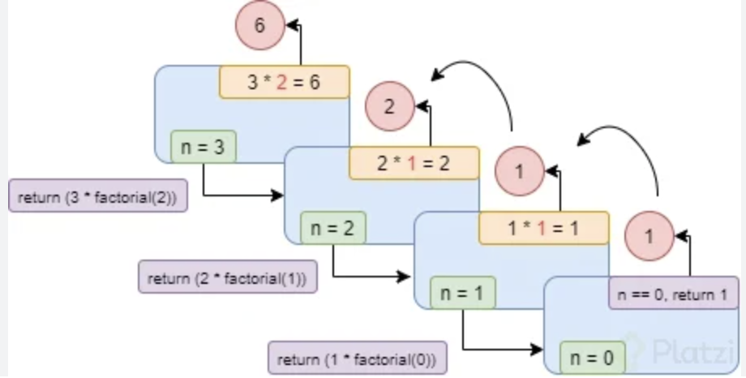

<div align="justify">

# Recursividad

La recursividad en programación Java es un concepto que, normalmente, cuesta entender a los principiantes en este lenguaje. Se trata de algo que ___puede parecer bastante complejo a primera vista___, pero que, en realidad, es relativamente sencillo.

Resumiéndolo mucho, podemos decir que la recursividad en programación Java es la capacidad que existe en este lenguaje de ___crear funciones que llamen a otras funciones___. De esta manera se evita el uso de bucles u otros iteradores.  Se trata de una técnica de programación que permite crear instrucciones que se repitan un número n de veces, por eso se trata de una forma de programación que permite evitar el uso de estructuras de datos repetitivas.

>___En Java los métodos y las funciones pueden llamarse a sí mismos, cuando esto sucede, se denominan métodos recursivos.___

Una de las ventajas de aprender a programar con técnicas recursivas es que esto permite crear códigos complejos con una sintaxis simple y clara. Esto, al final supone un ___ahorro para el trabajo de los programadores___. No obstante, también hay que tener en cuenta que la recursividad en programación Java puede tener el inconveniente de ralentizar el programa que se está desarrollando.

Otro detalle importante sobre la recursividad en programación en Java es que, cada vez que se emplea, por ejemplo, para llamar a una función desde otra función, esto genera una entrada en la pilla de llamadas (estructura dinámica de datos) del programa. Si esto se satura, se produce un error, el stack overflow, ___un fallo en el tiempo de ejecución___ de las aplicaciones.

## Ventajas e inconvenientes

Hemos profundizado un poco en qué es la recursividad en programación Java y hemos visto algunas de las ventajas que el uso de esta técnica puede tener para el trabajo de los programadores. No obstante, se trata de una técnica que también puede ocasionar problemas, por eso, ___hay que saber cuándo es conveniente usarla___.

Para la creación de determinados tipos de programas o elementos dentro del código, la recursividad se convierte en una manera lenta de hacerlo y cuenta con el gran inconveniente de ___ocupar mucho espacio en la memoria___, pudiendo llevar, como decíamos, a errores en el tiempo de ejecución de los programas.

Sin embargo, una de sus grandes ventajas es que permite que los programadores puedan resolver algunos problemas cotidianos de una forma ___elegante y eficiente___.

>___La recursividad en progrmación Java permite crear métodos y funciones capaces de enumerar cualquier tipo de estructura, por compleja que esta pudiera ser.___

Imagina que tienes que crear una ___función que recorra todo un sistema de archivos___, con carpetas y subcarpetas. Usando la __recursividad__, tan solo habría que crear una única función que se fuese llamando a si misma en todo el sistema de archivos.

Esto solo es un ejemplo de cómo la recursividad en Java puede simplificar el trabajo, hay aplicaciones mucho más potentes para esta técnica, aplicaciones que podrás aprender si te formas como programador Java.

## Importante

Otro de los detalles a tener en cuenta cuando hablamos sobre recursividad en programación Java es la condición de parada. Este término hace referencia a la forma de comprobar que una función (por ejemplo) no volverá a llamarse a si misma. Es decir, es la condición que se programa para que los valores retornen al inicio de la llamada.

_Si la condición de parada no se controla adecuadamente, se pueden producir errores con la técnica de la recursividad. Y es que, si no se determina y establece esta condición de detección se produce lo que se conoce como recursividad infinita. Es lo mismo que pasa cuando se programan_ ___bucles infinitos___.

>___Una condición de parada la determina el programador en el momento de crear o usar la recursividad.___

Esto es un problema porque, como decimos, la función nunca deja de llamarse a sí misma, lo que lleva a una sobrecarga en el programa que se está ejecutando y a diversos errores:

- Stackoverflow
- Ocupación de una mayor capacidad de la memoria
- Desbordamientos variables por acumulación de llamadas a una misma función
- Errores en la ejecución y carga del programa.

## Ejemplo Factorial

<div align="center">
    
</div>


```java
public class Factorial {
    public static void main(String[] args) {
        int numero = 5; 
        long factorial = calcular(numero);
        System.out.println("El factorial de " + numero + " es: " + factorial);
    }

    public long calcular(int numero) {
        if (n == 0) {
            return 1;
        }
        return numero * calcular(numero - 1);
    }
}
```

</div>