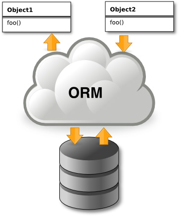

<div align="justify">

# JPA

JPA es la _propuesta estándar_ que ofrece __Java__ para implementar un ___Framework Object Relational Mapping (ORM)___, que permite interactuar con la base de datos por medio de objetos, de esta forma, JPA es el encargado de convertir los objetos Java en instrucciones para el Manejador de Base de Datos (MDB).

Cuando empezamos a trabajamos con bases de datos en Java lo primero que nos enseñan es a utiliza el API de JDBC el cual nos permite realizar consultas directas a la base de datos a través de consultas SQL nativas. JDBC por mucho tiempo fue la única forma de interactuar con las bases de datos, pero representaba un gran problema y es que Java es un lenguaje orientado a objetos y se tenía que convertir los atributos de las clases en una consulta SQL como _SELECT, INSERT, UPDATE, DELTE_, etc. lo que ___ocasionaba un gran esfuerzo de trabajo___ y  _provoca muchos errores en tiempo de ejecución, debido principalmente a que las consultas SQL se tenían que generar frecuentemente al vuelo_.

>__Nota__:_Diferencias entre [JDBC-JPA](JDBC-JPA.md)_.

Una de las cosas más importantes para comprender que es JPA es entender que JPA es una especificación y no un Framework como tal, ¿pero quiere decir esto exactamente?, pues bien, una especificación no es más que un documento en el cual se plasman las reglas que debe de cumplir cualquier proveedor que dese desarrollar una implementación de JPA, de tal forma que cualquier persona puede  tomar la especificación y desarrollar su propia implementación de JPA, ¿Esto quiere decir que pueden existir muchas implementaciones de JPA? la respuesta es sí, de echo en la actualidad existen varios proveedor como lo son los siguientes:

- Hibernate
- ObjectDB
- TopLink
- EclipseLink
- OpenJPA

Dentro de las implementaciones más utilizadas están __Hibernate__, EclipseLink & TopLink, las dos primeras son las más utilizadas en el mundo open source y TopLink es muy utilizada en desarrollos y productos relacionados con Oracle. Antes de preguntarnos cuál es la diferencia entre todas estas implementaciones tenemos que comprender que en teoría todas debería de ofrecer la misma funcionalidad y el mismo comportamiento, lo que nos permitiría migrar entre una implementación a otra sin afectar en nada nuestra aplicación. Desde luego esto es solo teoría, ya que en la actualidad no todas las implementaciones implementan al 100% la especificación de JPA, además en escenario muy concretos puede que se comporten ligeramente diferente, por lo que puede requerir realizar algunos ajustes antes de migrar correctamente de proveedor.

<div align="center">
    
</div>

## Entremos en detalle

<div align="center">
    
</div>

| Unidades               | Descripción                                                                                                    |
|------------------------|----------------------------------------------------------------------------------------------------------------|
| __EntityManagerFactory__  | Esta es una clase de fábrica de EntityManager. Crea y gestiona múltiples instancias EntityManager.            |
| __EntityManager__         | Es una interfaz, que gestiona la persistencia de objetos. Funciona como instancia de consulta.                 |
| Entidad                | Las entidades son los objetos de persistencia, tiendas como registros en la base de datos.                     |
| __EntityTransaction__      | Tiene una relación de uno a uno con EntityManager. Para cada método EntityManager, se mantienen las        |
|                        | operaciones de EntityTransaction clase.                                                                       |
| __Persistencia__           | Esta clase contiene métodos estáticos para obtener EntityManagerFactory.                                       |
| __Consulta__               | Esta interfaz es implementada por cada proveedor JPA relacional para obtener objetos que cumplan los criterios.|

>___Nota___: _Aunque parezca complicado lo iremos viendo más simple con un pequeño ejemplo_.

```java
import javax.persistence.*;
import java.util.List;

// Definición de la entidad Persona
@Entity
@Table(name = "personas")
public class Persona {
    @Id
    @GeneratedValue(strategy = GenerationType.IDENTITY)
    private Long id;

    @Column(name = "nombre")
    private String nombre;

    @Column(name = "edad")
    private int edad;

    // Constructores, getters y setters
}

public class Main {
    public static void main(String[] args) {
        // Configurar la conexión a la base de datos SQLite usando un archivo de base de datos
        String url = "jdbc:sqlite:datos.db";
        EntityManagerFactory entityManagerFactory = Persistence.createEntityManagerFactory("MiUnidadPersistencia", getJpaProperties(url));
        EntityManager entityManager = entityManagerFactory.createEntityManager();

        // Iniciar una transacción
        entityManager.getTransaction().begin();

        // Crear una nueva persona
        Persona persona = new Persona();
        persona.setNombre("Juan");
        persona.setEdad(30);

        // Persistir la persona en la base de datos
        entityManager.persist(persona);

        // Confirmar la transacción
        entityManager.getTransaction().commit();

        // Consultar todas las personas en la base de datos
        Query query = entityManager.createQuery("SELECT p FROM Persona p");
        List<Persona> personas = query.getResultList();

        // Mostrar los resultados de la consulta
        for (Persona p : personas) {
            System.out.println("Persona: " + p.getId() + ", " + p.getNombre() + ", " + p.getEdad());
        }

        // Cerrar el EntityManager
        entityManager.close();
        entityManagerFactory.close();
    }

    // Método para configurar las propiedades JPA con la URL de conexión SQLite
    private static Map<String, String> getJpaProperties(String url) {
        Map<String, String> properties = new HashMap<>();
        properties.put("javax.persistence.jdbc.driver", "org.sqlite.JDBC");
        properties.put("javax.persistence.jdbc.url", url);
        properties.put("javax.persistence.schema-generation.database.action", "create");
        return properties;
    }
}
```

>___Importante___: _utilizamos las anotaciones en las entidades que provee el paquete_ ___javax.persistence.*;___


También podemos definir las propiedades del la conexión de base de datos a través de un fichero de configuración ___.xml___ que se denomina ___persitence.xml___ y que se almacena en el directorio: __src/main/resources/META-INF__.

```xml
<?xml version="1.0" encoding="UTF-8"?>
<persistence xmlns="http://xmlns.jcp.org/xml/ns/persistence"
             xmlns:xsi="http://www.w3.org/2001/XMLSchema-instance"
             xsi:schemaLocation="http://xmlns.jcp.org/xml/ns/persistence http://xmlns.jcp.org/xml/ns/persistence/persistence_2_1.xsd"
             version="2.1">

    <persistence-unit name="MiUnidadPersistencia">
        <provider>org.hibernate.jpa.HibernatePersistenceProvider</provider>
        <class>paquete.de.tu.clase.Persona</class>
        <properties>
            <!-- Propiedades para la configuración de la base de datos -->
            <property name="javax.persistence.jdbc.driver" value="org.sqlite.JDBC"/>
            <property name="javax.persistence.jdbc.url" value="jdbc:sqlite:datos.db"/>
            <property name="javax.persistence.schema-generation.database.action" value="validate"/>
        </properties>
    </persistence-unit>
</persistence>
```

Elementos a tener en cuenta, y __muy importantes__:

- __org.sqlite.JDBC__: Driver de la BBDD.
- __sqlite:datos.db__: Nombre de la BBDD, referenciado en _javax.persistence.jdbc.url_.
- __<class>paquete.de.tu.clase.Persona</class>__. Conjunto de clases anotadas que contienen información de las tablas de la BBDD.
- __javax.persistence.schema-generation.database.action__. Acción que se va a realizar sobre la BBDD:
  - __validate__: Esta opción hace que Hibernate valide el esquema de la base de datos. No realiza cambios en el esquema de la base de datos. Es útil en entornos de producción donde no quieres que Hibernate realice cambios automáticos en la estructura de la base de datos.
  
    ```xml
    <property name="hibernate.hbm2ddl.auto" value="validate"/>
    ```
  
  - __update__: Esta opción hace que Hibernate actualice automáticamente el esquema de la base de datos según los cambios en las entidades de tu aplicación. Por ejemplo, si agregas una nueva entidad o cambias la definición de una entidad existente, Hibernate modificará automáticamente el esquema de la base de datos para reflejar esos cambios.
    
    ```xml
    <property name="hibernate.hbm2ddl.auto" value="update"/>
    ```
  
  - __create__: Esta opción hace que Hibernate elimine y cree el esquema de la base de datos cada vez que se inicia la aplicación. Ten en cuenta que esto borrará todos los datos de la base de datos y creará un esquema nuevo desde cero. Es útil en entornos de desarrollo donde deseas tener un esquema de base de datos fresco cada vez que reinicias la aplicación.

    ```xml
    <property name="hibernate.hbm2ddl.auto" value="create"/>
    ```

## Anotaciones JPA

Las anotaciones JPA (Java Persistence API) son metadatos que se utilizan para mapear clases Java a entidades de bases de datos relacionales. Estas anotaciones proporcionan información sobre cómo se deben almacenar y recuperar los objetos Java en una base de datos relacional.

Las anotaciones JPA son parte de la especificación de Java Persistence API y se utilizan comúnmente con frameworks de persistencia de datos como Hibernate, EclipseLink, y otros. Algunas de las anotaciones más comunes en JPA incluyen:

- __@Entity__: _Marca una clase Java como una entidad que se puede persistir en la base de datos_.
- __@Table__: Se utiliza para _especificar el nombre de la tabla en la base de datos a la que está mapeada la entidad_.
- __@Id__: Indica que un atributo de la clase es la ___clave primaria de la entidad___.
- __@GeneratedValue__: Se utiliza junto con @Id para especificar cómo se genera el valor de la clave primaria (por ejemplo, _GenerationType.IDENTITY, GenerationType.AUTO, etc_.).
- __@Column__: Se utiliza para especificar el mapeo entre un atributo de la clase y una columna de la tabla en la base de datos.
- __@ManyToOne__: Indica una relación muchos a uno entre dos entidades.
- __@OneToMany__: Indica una relación uno a muchos entre dos entidades.
- __@OneToOne__: Indica una relación uno a uno entre dos entidades.
- __@ManyToMany__: Indica una relación muchos a muchos entre dos entidades.

## Ejemplo

Un __Alumno__ _pertenece_ a __una(1)__ __Clase__ y una __Clase__ puede tener un __conjunto de alumnos(N)__.

### Definición de la Entity Alumno

```java
import javax.persistence.Entity;
import javax.persistence.Table;
import javax.persistence.Id;
import javax.persistence.GeneratedValue;
import javax.persistence.GenerationType;
import javax.persistence.Column;
import javax.persistence.ManyToOne;

@Entity
@Table(name = "alumno")
public class Alumno implements Serializable {

    private static final long serialVersionUID = -7250234396452258822L;

    @Id
    @GeneratedValue(strategy = GenerationType.IDENTITY)
    @Column(name = "id_alumno")
    private Integer id;
    private String nombre;
    private Integer edad;

    @ManyToOne
    private Clase clase;

    // Constructor, getters y setters
}
```

>___Nota___:_En esta versión, el_ ___Alumno___ _representa un alumno individual con un nombre, una edad y una referencia a la_ ___clase___ _a la que pertenece._

### Definición de la Entity Clase

```java
import javax.persistence.Entity;
import javax.persistence.Table;
import javax.persistence.Id;
import javax.persistence.GeneratedValue;
import javax.persistence.GenerationType;
import javax.persistence.Column;
import javax.persistence.OneToMany;
import java.util.Set;

@Entity
@Table(name = "clase")
public class Clase {

    @Id
    @GeneratedValue(strategy = GenerationType.IDENTITY)
    @Column(name = "id_clase")
    private Integer id;
    private String nombre;

    @OneToMany(mappedBy = "clase")
    private Set<Alumno> alumnos;

    // Constructor, getters y setters
}
```

>___Nota___: _La clase_ ___Clase___ _representa una clase escolar con un nombre y una_ ___colección de alumnos___ _que pertenecen a ella_.

>___Importante___:_En este diseño, cada alumno puede pertenecer a una sola clase (@ManyToOne en la clase Alumno), mientras que una clase puede tener varios alumnos (@OneToMany en la clase Clase). La relación entre las clases Alumno y Clase es bidireccional, lo que significa que cada una tiene una referencia a la otra_.

</div>