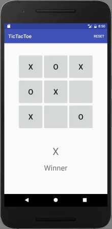
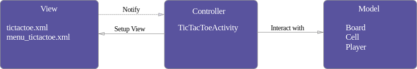

# Modelo Vista Controlador

    

>__Nota__:_indicar que la implementación varia y cambia según el contexto para el que sea desarrollado_.

Para la explicación del concepto vamos a suponer que tenemos como proyecto la creación de la aplicación __TicTacToe__.

    

>__Nota__: Si quieres ver el código para __Android__ lo tienes en el siguiente [enlace](https://github.com/ericmaxwell2003/ticTacToe/), y el documento original se encuentra [aquí](https://academy.realm.io/posts/eric-maxwell-mvc-mvp-and-mvvm-on-android/).

## MVC

El enfoque model, view, controller separa nuestra aplicación, a nivel general, en un conjunto de __3 responsabilidades__.

## Model

El modelo se constituye por los datos, el estado y la lógica de negocio, de nuestra aplicación __Tic-Tac-Toe__.

## View

La vista es la __representación del modelo__.

La vista tiene la responsabilidad de presentar la __interfaz de usuario (UI)__ y __comunicarse con el controlador__ a medida que el usuario __interactúa__ con la aplicación.

En la arquitectura MVC, se dice que __las vistas__ _son_ generalmente __"tontas"__ ya que _no tienen conocimiento_ del __modelo__. No comprenden el estado o qué hacer cuando un usuario interactúa (haciendo clic en un botón, escribiendo un valor, etc).

>_Cuanto menos sepan las vistas, menos acopladas estarán (respecto al modelo y controlador), y por lo tanto, serán más flexibles ante cambios_.

>___No está vinculado a la vista ni al controlador, y gracias a esto, es reutilizable en muchos contextos___.

## Controller

El controlador es el __pegamento que une la aplicación__.

Los controladores determinan lo que sucede en la aplicación.

_Cuando la_ ___Vista___ _le dice al_ ___Controlador___ _que un usuario hizo clic en un botón, el controlador decide cómo interactuar con el_ ___Modelo___ _correspondiente_.

_Según el cambio de datos en el modelo, el controlador decide si actualizar el estado de la vista o no, según considere apropiado_.

    

>__Nota__: Representa código de una __app__ de __Android__.

