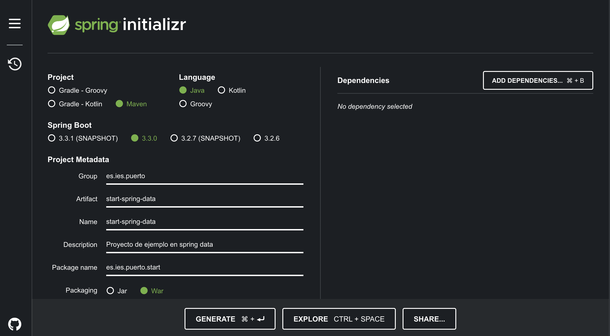

<div align="justify">

## Spring Data (El ORM de Spring que lo cambia todo)

<div align="center">
    
</div>

## Introducción

Spring Data es un proyecto dentro del _ecosistema_ Spring que facilita el acceso y manipulación de datos en diversas bases de datos. Spring Data proporciona una abstracción sobre los detalles específicos de la base de datos, permitiendo que los desarrolladores trabajen con datos de manera más sencilla y consistente.

## Construcción del proyecto

Para la construcción del proyecto inicial, vamos a dirigirnos a [Spring IO Build](https://start.spring.io/), y seleccionar las opciones que se muestran en la imagen.

<div align="center">
    
</div>

Vamos a optener __start-spring-data.zip__ seleccionando __create__.

## Base de datos con la que vamos a trabajar

En este momento debemos de seleccionar la/as base/s de datos con la que trabajar nuestro proyecto, teniendo multitud de combinaciones.
Algunas opciones son: __MariaDb, MySQL, SQLite, MongoDB, etc__.

Tan sólo debemos de seleccionar la dependencia y añadirla.

### Dependencia H2

```xml
<dependency>
    <groupId>com.h2database</groupId>
    <artifactId>h2</artifactId>
</dependency>
```

### Dependencia SQLite3

```xml
<dependency>
    <groupId>org.xerial</groupId>
    <artifactId>sqlite-jdbc</artifactId>
    <version>3.XXX</version>
</dependency>

<!-- Hibernate 6, SQLite dialect is supported -->
<dependency>
    <groupId>org.hibernate.orm</groupId>
    <artifactId>hibernate-community-dialects</artifactId>
</dependency>
```

## Fichero de configuración (aplication.properties)

El archivo `application.properties` en Spring Boot se usa para configurar diversos aspectos de tu aplicación, desde la configuración del servidor y la seguridad hasta las propiedades específicas del framework y las propiedades de la base de datos.

### Propiedades Comunes en `application.properties`

### Configuración del Servidor

- `server.port`: Define el puerto en el que el servidor embebido escucha. Por defecto es 8080.

```properties
  server.port=8080
```

- server.servlet.context-path: Define el contexto de la aplicación.

```properties
server.servlet.context-path=/miapp
```

- spring.datasource.url: URL de la base de datos.

```properties
spring.datasource.url=jdbc:mysql://localhost:3306/mydb
```

- spring.datasource.username: Nombre de usuario de la base de datos.

```properties
spring.datasource.username=root
```

- spring.datasource.password: Contraseña de la base de datos.

```properties
spring.datasource.password=password
```

- spring.datasource.password=password

```properties
spring.datasource.driver-class-name=com.mysql.cj.jdbc.Driver
```

- spring.jpa.database-platform: Dialecto de la base de datos.

```properties
spring.jpa.database-platform=org.hibernate.dialect.MySQL5Dialect
```

- spring.jpa.hibernate.ddl-auto: Configura la estrategia de creación de esquema.

```properties
spring.jpa.hibernate.ddl-auto=update
```

- spring.jpa.show-sql: Muestra las sentencias SQL ejecutadas en la consola.

```properties
spring.jpa.show-sql=true
```

- spring.jpa.properties.hibernate.format_sql: Formatea las sentencias SQL.

```properties
spring.jpa.properties.hibernate.format_sql=true
```

- logging.level.org.springframework: Nivel de logging para paquetes específicos.


```properties
logging.level.org.springframework=INFO
```

- logging.file.name: Archivo de log.

```properties
logging.file.name=app.log
```

...

### Ejemplo de fichero de configuración

```code
# Configuración del servidor
server.port=8080
server.servlet.context-path=/miapp

# Configuración de la base de datos
spring.datasource.url=jdbc:mysql://localhost:3306/mydb
spring.datasource.username=root
spring.datasource.password=password
spring.datasource.driver-class-name=com.mysql.cj.jdbc.Driver

# Configuración de JPA/Hibernate
spring.jpa.database-platform=org.hibernate.dialect.MySQL5Dialect
spring.jpa.hibernate.ddl-auto=update
spring.jpa.show-sql=true
spring.jpa.properties.hibernate.format_sql=true

# Configuración de logging
logging.level.org.springframework=INFO
logging.file.name=app.log

# Configuración de mensajes
spring.messages.basename=messages

# Configuración de seguridad
spring.security.user.name=user
spring.security.user.password=password

# Configuración de actuadores
management.endpoints.web.exposure.include=health,info
management.endpoint.health.show-details=always

# Configuración de correo electrónico
spring.mail.host=smtp.example.com
spring.mail.port=587
spring.mail.username=user@example.com
spring.mail.password=password
```

## Referencias

- [Comenzando a construir proyectos spring](https://spring.io/guides/gs/accessing-data-jpa)
- [Spring IO Build](https://start.spring.io/)
- [Ejemplo Spring Data](https://mkyong.com/spring-boot/spring-boot-spring-data-jpa/)


</div>