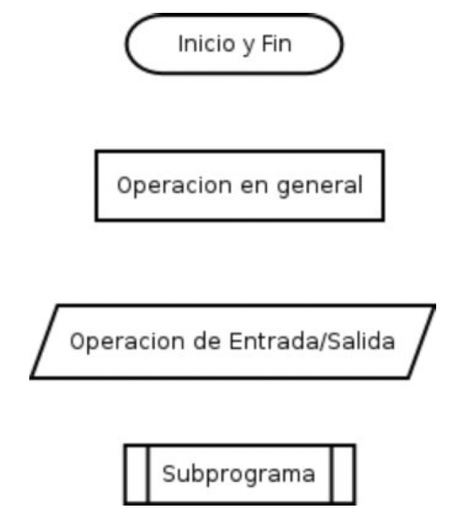
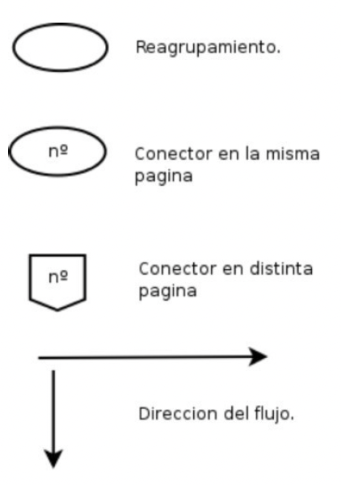
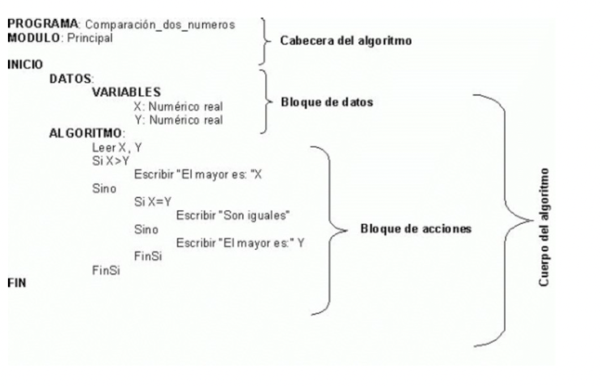

<div align="justify">

# Fundamentos de Programación

## Índice de Contenido
1. [Introducción](#introduccion)
2. [Algoritmo](#algoritmo)
3. [Ciclo de vida de un programa](#ciclo)
4. [Documentación](#documentacion) 
5. [Objetos de un programa](#objetos)
6. [Representación](#representacion)

## Introducción <a name="introduccion"></a>

La razón principal por la que una persona utiliza un ordenador es para __resolver problemas__ (en el sentido más general de la palabra), o en otras palabras, _procesar una información para obtener un resultado a partir de unos datos de entrada_.
Los ordenadores resuelven los problemas mediante la __utilización de programas escritos por los programadores__. Los programas de ordenador no son entonces más que métodos para resolver problemas. Por ello, para escribir un programa, _lo primero es que el programador sepa resolver el problema que estamos tratando_.
__El programador__ _debe identificar cuáles son los datos de entrada y a partir de ellos obtener los datos de salida_, es decir, __la solución__, a la que se llegará por medio del procesamiento de la información que se realizará mediante __la utilización de un método__ para __resolver el problema__ que denominaremos __algoritmo__.

## Algoritmo <a name="algoritmo"></a>

Por algoritmo entendemos un conjunto ordenado y finito de operaciones que permiten resolver un problema que además cumplen las siguientes características:
 - Tiene un número finito de pasos
 - Acaba en un tiempo finito. Si no acabase nunca, no se resolvería el problema.
 - Todas las operaciones deben estar definidas de forma precisa y sin ambigüedad.
 - Puede tener varios datos de entrada y como mínimo un dato de salida.
Un claro ejemplo de algoritmo es una receta de cocina, donde tenemos unos pasos que hay que seguir en un orden y deben de estar bien definidos, tiene un tiempo finito y tiene unos datos de
entrada (ingredientes) y una salida (el plato).

Por __ejemplo__, el ___algoritmo para freír un huevo___ podría ser el siguiente:
- Datos de entrada: Huevo, aceite, sartén, fuego.
- Datos de salida: huevo frito.

Procedimiento:
 - Poner el aceite en la sartén.
 - Poner la sartén al fuego.
 - Cuando el aceite esté caliente, cascar el huevo e introducirlo.
 - Cubrir el huevo de aceite.
 - Cuando el huevo esté hecho, retirarlo.

```
La codificación de un algoritmo en un ordenador se denomina programa.
```

## Ciclo de vida de un programa <a name="ciclo"></a>

La creación de cualquier programa (software o sw) implica la realización de ___tres pasos genéricos___:
- __Definición ¿Qué hay que desarrollar?__.
- __Desarrollo__.
- __Mantenimiento__.

### Fase de definición

Se intenta ___caracterizar el sistema que se ha de construir___. Se debe determinar la información que ha de usar el sistema, qué funciones debe realizar, qué condiciones existen, cuáles son las interfaces del sistema y qué criterios de validación se utilizarán.
El estudio y definición del problema dan lugar al planteamiento del problema que se escribirá en la documentación del programa. Si no se sabe lo que se busca, no se lo reconoce si se lo encuentra. Es decir que, si no sabemos con claridad qué es lo que tenemos que resolver, no podremos encontrar una solución. Aquí se declara cuál es la situación de partida y el entorno de datos de entrada, los resultados deseados, dónde deben registrarse y cuál será la situación final a la que debe conducir el problema después de ser implementado.

### Fase de desarrollo

En esta fase se ___diseñan estructuras de datos___ y de los programas, se ___escriben y documentan___ éstos, y se prueba el software.

En esta etapa del ciclo de vida de desarrollo de programas, los analistas trabajan con los
requerimientos del software desarrollados en la etapa de análisis. Se determinan todas las tareas que cada programa realiza, como así también, la forma en que se organizarán estas tareas cuando se codifique el programa. Los ___problemas___ cuando son ___complejos___, se pueden resolver más eficientemente con el ordenador cuando ___se descomponen en subproblemas que sean más fáciles___ de solucionar que el original. La descomposición del problema original en subproblemas más simples y a continuación dividir estos subproblemas en otros más simples que pueden ser implementados para su solución en el ordenador se denomina diseño descendente (top-downdesign). 

Las ventajas más importantes del diseño descendente son:
 - El _problema se comprende más fácilmente al dividirse en partes más_ ___simples___ denominadas ___módulos___.
 - Las ___modificaciones___ en los ___módulos___ son más ___fáciles___.
 - La ___comprobación___ del problema se puede verificar fácilmente (___test unitarios___).

En esta etapa además, se utilizan herramientas auxiliares de diseño, que ____son diagramas y tablas____ que facilitan la delineación de las tareas o pasos que seguirá el programa, por ejemplo: ___diagramas de flujo, pseudocódigo, etc___.
En esta fase, __se convierte el algoritmo en programa__, escrito en un lenguaje de programación de alto nivel como ___C, Java, etc___. La codificación del programa suele ser una tarea pesada que requiere un conocimiento completo de las características del lenguaje elegido para conseguir un programa eficaz. Sin embargo, si el diseño del algoritmo se ha realizado en detalle con acciones simples y con buena legibilidad, el proceso de codificación puede reducirse a una simple tarea mecánica. Las reglas de sintaxis que regulan la codificación variarán de un lenguaje a otro y el programador deberá conocer en profundidad dichas reglas para poder diseñar buenos programas.
Para aumentar la productividad, es necesario adoptar una serie de normas, como ser:
 - __Estructuras aceptables__ (programación estructurada).
 - __Convenciones de nominación__: maneras uniformes de designación de archivos y variables.
 - __Convenciones de comentarios__.

### Fase de mantenimiento

Una vez obtenido el programa fuente, es necesaria su traducción al código máquina, ya que los programas escritos en un lenguaje de alto nivel no son directamente ejecutables por el ordenador.
Según el tipo de traductor que se utilice, los lenguajes de alto nivel se clasifican en lenguajes interpretados y lenguajes compilados.
Son ___lenguajes interpretados___ aquellos en los que el sistema traduce una instrucción y la ejecuta, y así sucesivamente con las restantes (__HTML/CSS__).
Son ___lenguajes compilados___ aquellos en los que, primero se traduce el programa fuente completo,  intermedio o módulo objeto (programa objeto); después, se fusiona éste con rutinas o librerías necesarias para su ejecución en un proceso llamado linkado y que obtiene como resultado un módulo ejecutable (programa ejecutable). ___La ventaja de los lenguajes compilados, frente a los interpretados, son su rápida ejecución y, en caso de necesitar posteriores ejecuciones del mismo programa, se hará del ejecutable almacenado__ (__JAVA__).
La puesta a punto consta de las siguientes etapas:
 - __Detección de errores__.
 - __Depuración de errores__.
 - __Prueba del programa__(__junit test__).

En cada una de estas fases se pueden detectar problemas que nos hacen replantearnos conceptos de la fase anterior y rehacer el software creado con las oportunas correcciones. 
___Esto repercute en el mantenimiento y costes del proyecto, así como en la rentabilidad del proyecto ($)___.

## Documentación <a name="documentacion"></a>

___La mayor parte de los proyectos exigen la realización de una planificación previa___. Esta planificación debe determinar el modelo de ciclo de vida a seguir, los plazos para completar cada fase y los recursos necesarios en cada momento. Todo esto se debe plasmar en una documentación completa y detallada de toda la aplicación.
La ___documentación___ asociada al software puede clasificarse en interna y externa. La ____documentación____ interna corresponde a la que se incluye dentro del ___código fuente___ de los programas. Nos aclaran aspectos de las propias instrucciones del programa. La ___documentación externa___ es la que corresponde a todos los documentos relativos al diseño de la aplicación, a la descripción de la misma y sus módulos correspondientes, a los manuales de usuario y los manuales de mantenimiento.

```code
En el módulo que nos ocupa tendremos que documentar el código fuente que desarrollemos durante la elaboración de los distintos programas.
```

## Objetos de un programa <a name="objetos"></a>

Entendemos por objeto de un programa todo aquello que pueda ser manipulado por las instrucciones. En ellos se almacenarán tanto los datos de entrada como los de salida (resultados).

Sus atributos son:
 - __Nombre__: el identificador del objeto.
 - __Tipo__: conjunto de valores que puede tomar.
 - Valor__: elemento del tipo que se le asigna.

### Constantes
Son objetos cuyo valor permanece invariable a lo largo de la ejecución de un programa. Una
constante es la denominación de un valor concreto, de tal forma que se utiliza su nombre cada vez que se necesita referenciarlo.

```
Por ejemplo: pi = 3.14.1592 e = 2.718281
```

También son utilizadas las constantes para facilitar la modificabilidad de los programas, es decir ___para hacer más independientes ciertos datos del programa___. _Por ejemplo, supongamos un programa en el que cada vez que se calcula un importe al que se debe sumar el IVA utilizáramos siempre el valor_ ___0.16___, _en caso de variar este índice tendríamos que ir buscando a lo largo del programa y
modificando dicho valor, mientras que si le damos nombre y le asignamos un valor, podremos modificar dicho valor con mucha más facilidad_.

### Variables

Son objetos cuyo valor puede ser modificado a lo largo de la ejecución de un programa.
Por ejemplo: una variable para calcular el área de una circunferencia determinada, una variable para calcular una factura, etc.

### Expresiones
Las expresiones según el resultado que produzcan se clasifican en:
 - Numéricas: Son las que producen resultados de tipo numérico. Se construyen mediante los operadores aritméticos.
 Por ejemplo:
    ```
    pi * sqr(x)
    (2*x)/3
    ```

 - Alfanuméricas: Son las que producen resultados de tipo alfanumérico. Se construyen mediante operadores alfanuméricos.
 Por ejemplo:
    ```
    "Don " + "José"
    ```
 
 - Booleanas o lógicas: Son las que producen resultados de tipo Verdadero o Falso. Se construyen mediante los operadores relacionales y lógicos.
 Por ejemplo:
    ```
    a < 0
    (a > 1) and (b < 5)
    ```

### Operadores

Son símbolos que hacen de enlace entre los argumentos de una expresión.

#### Operadores aritmeticos

| Operador | Significado | Ejemplo |
| --- | --- | --- |
| + | Suma | a+b |
| - | Resta | a-b |
| * | Multiplicación | a*b |
| / | División | a/b |
| % | Módulo / Resto | a%b |

#### Operadores de asignación

| Operador | Significado | Ejemplo |
| --- | --- | --- |
| = | Asignación | a=b |
| += | Suma y asignación | a+=b → a=a+b |
| -= | Resta y asignación | a-=b → a=a-b |
| *= | Multiplicación y asignación | a*=b → a=a*b |
| /= | División y asignación | a/=b → a=a/b |
| %= | Módulo y asignación | a%=b → a=a%b |

#### Operadores relacionales

| Operador | Significado | Ejemplo |
| --- | --- | --- |
| == | Igualdad | a==b |
| != | Distinto | a!=b |
| < | Menor que | a<b |
| > | Mayor que | a>b |
| <= | Menor o igual que | a<=b |
| >= | Mayor o igual que | b>=b |

#### Operadores lógicos

| Operador | Significado | Ejemplo | Descripción |
| --- | --- | --- | --- |
| && | y (AND) | (7>2) && (2<4) | Las dos condiciones son verdaderas |
|| o (OR) | (7>2) || (2<4) | Al menos una de las condiciones es verdadera |
| ! | no (NOT) | !(7>2) | La condición es falsa |

| Valor A | Valor B | AND && |
| --- | --- | --- |
| F | F | F |
| F | V | F |
| V | F | F |
| V | V | V |
| F | F | F |
| F | V | V |
| V | F | V |
| V | V | V |

| Valor A | Not A |
| --- | --- |
| F | V |
| V | F |

#### Operadores especiales

| Operador | Significado | Ejemplo |
| --- | --- | --- |
| ++ | Incremento | a++ (posincremento)
++a (preincremento) |
| -- | Decremento | a-- (posdecremento)
--a (predecremento) |
| (tipo)expr | Cast | a=(int)b |
| + | Concatenación de cadenas | a=“cad1”+“cad2” → cad1cad2 |
| . | Acceso a variables y métodos | a=obj.var1 |
| ( ) | Agrupación de expresiones | a=(a+b)*c |


## Representación <a name="representacion"></a>

Existen diversas formas de representación de algoritmos. Las más importantes son los diagramas de flujo (también llamados ‘ordinogramas’) y el pseudocódigo.

### Diagramas de flujo (ordinogramas)

Durante el diseño de un programa y en sus fases de análisis y programación, surge la necesidad de representar de una manera gráfica los flujos que van a seguir los datos manipulados por el mismo, así como la secuencia lógica de las operaciones para la resolución del problema.
Esta representación gráfica debe tener las siguientes cualidades:
 - Sencillez en su construcción.
 - Claridad en su compresión.
 - Normalización en su diseño.
 - Flexibilidad en sus modificaciones.

___En la práctica se suelen utilizar indistintamente los términos diagrama de flujo,
organigrama y ordinograma para referenciar cualquier representación gráfica de los
flujos de datos o de las operaciones de un programa__.
Es importante diferenciarlos porque no corresponden a las mismas fases de diseño de los programas. Aunque utilicen algunos símbolos comunes, el significado de éstos no es el mismo.
En la representación de ordinogramas es conveniente seguir las siguientes reglas:
 - El comienzo del programa figurará en la parte superior del ordinograma.
 - El símbolo de comienzo deberá aparecer una sola vez en el ordinograma.
 - El flujo de las operaciones será, siempre que sea posible de arriba a abajo y de izquierda a derecha.
 - Se evitarán siempre los cruces de líneas utilizando conectores.
Esta será la representación que utilizaremos durante el curso.

##### Símbolos de operación



##### Símbolos de decisión


##### Símbolos de conexión



#### Un ejemplo

Algoritmo que lee dos números __“X”__ e __“Y”__, determina si son iguales, y en caso de no serlo, indica cuál de ellos es el mayor.
Su representación gráfica mediante ordinograma podemos verla en el gráfico:


### Pseudocódigo

Además de las representacionesgráficas, un programa puede describirse mediante un lenguaje intermedio entree llenguaje natural y el lenguaje de programación, de tal manera que permita flexibilidad para expresar las acciones que se van a realizar y,también imponga  algunas limitaciones, que tienen importancia cuando se quiere codificar el programa a un lenguaje de programación determinado.
La notación en pseudocódigo se caracteriza por:
 - Facilitarla obtención de la solución mediante la utilización del diseño descendente o Topdown.
 - Ser una forma de codificar los programas o algoritmos fácil de aprender y utilizar.
 - Posibilitar el diseño y desarrollar los algoritmos de una manera independiente del lenguaje de programación que se vaya a utilizar cuando se implemente el programa.
 - Facilitar la traducción del algoritmo a un lenguaje de programación específico.
 - Permitir una gran flexibilidad en el diseño del algoritmo que soluciona el problema, y a que se pueden representar las acciones de una manera mas abstracta, no estando sometidas a las reglas tan rígidas que impone un lenguaje de programación.
 - Posibilitar futuras correcciones y actualizaciones en el diseño del algoritmo por la utilización una serie de normas, que acotan el trabajo del desarrollador.

```
Cuando se escribe un algoritmo mediante la utilización de pseudocódigo, se debe "sangrar" el texto con respecto al margen izquierdo,con la finalidad de que se comprenda más fácilmente el diseño que se está realizando.
```

#### Un ejemplo



</div>