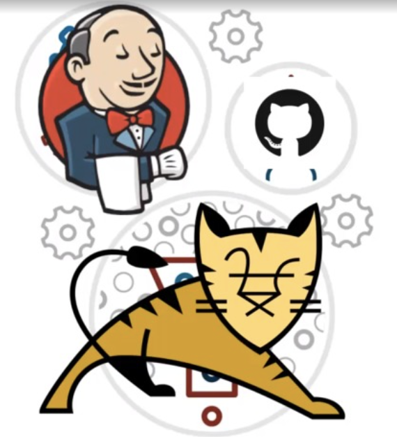

<div align="justify">

# Creación de los Pipeline en Java

<div align="center">
  
</div>

## Requisitos

- Tener instalado Jenkins.
- Haber realizado el ejercicio del siguiente [enlace](https://github.com/jpexposito/docencia/blob/master/DPL/ARQUITECTURAS/tareas/despliegue-jsp-apache-tomcat.md).

## Instroducción

  El presente ejercicio tiene como objetivo familiarizarse con la construcción de __Pipeline__ en __Jenkins__ y el despliegue en __apache tomcat y java__.

## Desarrollo

  Se debe de realizar la construcción de un __Pipeline__ (_hello-word-java-apache-tomcat_). Vamos a realizar el despliegue de un pequeño ejemplo en java.

  El código para la creación de un _Pipeline hello-word_ en los distintos lenguajes, se encuentra en el siguiente [enlace](../PIPELINE-JENKINS.md).

  Esta tarea de clase consisten en realizar el siguiente ejemplo.

  1. Clona el proyecto que se encuentra en el siguiente [enlace](https://github.com/jpexposito/docencia/tree/master/COMUN/ejemplos/java/app-web-demo).
  Renombra el directorio padre a __hello-word-java-apache-tomcat__.
  2. En primer se debe de realizar la modificación el fichero __Dockerfile__. Para ello verifica inicialmente como funciona la imagen de __apache-tomcat__ en el siguiente [enlace](https://hub.docker.com/_/tomcat).
  3. Como pequeña guia de lo que debes de realizar. El fichero __Dockerfile__ debe de contener algo similar a:

  ```
    FROM tomcat:version-seleccionada
    LABEL maintainer="emailalumno@iespuerto.es"

    ARG WAR_FILE=target/*.war

    ADD ${WAR_FILE} /usr/local/tomcat/webapps/

    EXPOSE 8082
    CMD ["catalina.sh", "run"]
  ```
__Nota__: El puerto __8082__ o el que seleccione el alumno.    
  4. Vuelve a la _raiz del proyecto_.
  5. Crea el fichero __Jenkinsfile__. Incluye el siguiente contenido:

  ```
  pipeline {
      agent any

      stages {
          stage('Test Junit') {
              steps {
                  echo 'Testing Junit..'
              }
          }
          stage('Build') {
              steps {
                  echo 'Building application..'
              }
          }
          stage('Deploy') {
              steps {
                  echo 'Deploying application....'
              }
          }
          stage('Test Integration') {
              steps {
                  echo 'Testing integration..'
              }
          }
      }
  }
  ```
  - __State Test Junit__. Debe de ejecutar el comando:

    ```java
      mvn clean test
    ```

  - __State Build__. Debe de ejecutar el comando:

    ```java
      mvn clean package
    ```

  - __State Deploy__. Debe de ejecutar el comando:

    ```
     Sentencias Docker
    ```

  - __Test Integration__. Debe de ejecutar el comando:

    ```
     Verificar que la aplicación esta desplegada a través de un  (wget -m http://www.example.com).
     Verificar que el fichero descargado contiene el nombre del alumno.
     https://ubunlog.com/buscar-cadenas-o-patrones-texto-sin-formato/
    ```

  6. Sube el proyecto a tu repositorio de github _(www.github.com/alumno/hello-word-php-apache.git)_ o _similar_.
  7. Crea el __Pipeline__ dentro de tu instalación de __Jenkins.alumno__, sincronizando desde tu cuenta de __github__ _(www.github.com/alumno/hello-word-java-apache-tomcat.git)_ o _similar_.
  8. Ejecuta el __Pipeline__, y verificar que se ha realizado de forma correcta

## Evaluación. Realiza el Informe

  Realiza un informe indicando los pasos que has seguido para la instalación, y configuración  ___hello-word-java-apache-tomcat___. Se debe de incluir los ficheros __Dockerfile__ y __Jenkinfile__, en el informe.

  Además el informe debe de contener:
   - Titulo de la tarea.
   - Nombre y Apellidos.
   - Indice
   - Pasos descritos.
   - Capturas de pantalla.

### A tener en cuenta:

  - Se pasará el programa antí copia para verificar autenticidad.
  - __5 faltas de ortografía se baja dos puntos__.
  - Al menos (1 folio indice, al menos 3 desarrollo de la práctica).
  - Carecer faltas de ortografía.
  - Capturas de pantalla con los resultados obtenidos.

## Referencias
  - [Creación de un Jenkinsfile](https://www.jenkins.io/doc/book/pipeline/jenkinsfile/).


</div>
